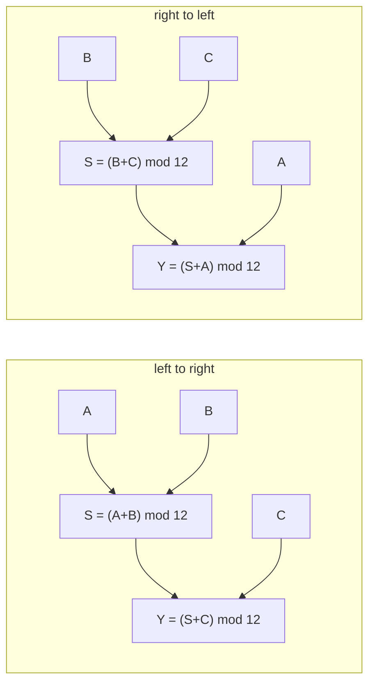

# Can an intervention tell two algorithms apart when their outputs never differ?

| Overview | |
|---|---|
| **Question** | Does an interchange intervention distinguish [two causal models](../causal_models/arithmetic_demos.py) of `(A + B + C) mod 12` that compute the same output on every input? |
| **Method** | **Interchange interventions on the causal models**: run both models on a random base triple, install the value that each model computes for its intermediate `S` (or its output `Y`) on a counterfactual triple, and read whether the two outputs differ. |

## Research question

A **causal model** is a graph of variables, each computed from its parents, and
the reason interpretability starts there is that a graph says more than the
function it computes. Let's take two graphs for `(A + B + C) mod 12`: one sums
left to right, the other right to left.



The two differ in one edge set and nothing else. `S` is the partial sum, and
the disagreement is about *which* partial sum a system computes on the way to
the answer — the smallest possible difference between two algorithms for one
function.

Both graphs compute `(A + B + C) mod 12`, since addition mod 12 is associative.
So they are **extensionally equal** and **structurally different**, which is
exactly the situation interpretability is in: a network's behaviour is
observable and its algorithm is not. No amount of input/output testing
separates the two graphs.

This demo uses no neural network and no dataset. The input space is the
12³ = 1728 triples `(A, B, C)`, and it is small enough to enumerate.

**Q1 — do the two graphs ever disagree on an output?** The count over all 12³
inputs.

**Q2 — does interchanging the intermediate `S` distinguish them?** The
proportion of 1000 random pairs on which the two post-interchange outputs
differ.

**Q3 — how much of the 1/12 = 0.083 residue is a no-op?** The proportion of
pairs on which the interchange changes nothing in *either* graph, because the
two inputs happen to produce the same partial sum.

**Q4 — does interchanging the output `Y` distinguish them?** Same measurement,
one variable later.

## Method

We build both graphs, run each on a base input with one variable fixed to the
value it takes on a counterfactual input, and compare the two outputs. This
demo touches no network, so it has no intervention specification and no
dataset. The artifact that fully determines the experiment is the **pair of
causal graphs**, built in the snippet under Execution, and building them is
the whole setup.

An **intervention** fixes a variable to a value and recomputes its descendants.
An **interchange intervention** does not name the value: it takes the value the
*same model* computes on a second input, and installs that. The difference
matters here because "4" is a number a reader has to invent, while "whatever
`S` is on `A=3, B=1`" is a number the graph supplies — and on a network, where
no reader can invent a plausible activation, only the second form is available
at all.

### Building the causal models

A causal model is a Python function marked `@mechanism`. Each `V`
assignment is a variable, its expression is the variable's equation, and the
compiler reads the parents from what the expression reads.

Every causal model here declares two reserved variables: `raw_input`, the value
a network would be fed, and `raw_output`, the value its output would be
compared against. They are what lets the same graph later stand as a hypothesis
about a network ([04](../onboarding_tutorial/04_define.md)); nothing in this
demo needs a network for them to mean something. No network is fed and no
output is compared here, so both are declared and never used. They are here
because the *next* demo needs them.

| piece | says | why this and not that |
|---|---|---|
| `A: Dom(DIGITS)` | `A`, `B`, `C` are explicit inputs | a parameter's domain makes it a root; a graph with no roots has nothing to intervene *from* |
| `S = V(expression)` | one variable and its equation | the name comes from the assignment and the parents from what the expression reads, so the graph cannot list a parent its equation never uses |
| `Dom(...)` and inferred domains | each variable's permitted values, interventions included | `model.values` exposes the enumerable domains, which is what makes `enumerate_inputs` and the exhaustive check in Q1 possible at all |
| `trace["S"] = …` | the intervention | assignment into a copied trace *is* the do-operator; the copy is what keeps the base trace readable afterwards |

### Reading the measurements

For Q1 the null is 0, and here the null is the *prediction* — a non-zero count
would mean one of the two graphs is not an addition and the comparison is void.

For Q2, **the chance level is 11/12 = 0.917, exactly**, and it is derivable
rather than estimated — see the box below. A result near 0.9 means the
intervention is decisive; a result near 0.0 would mean the two graphs are
indistinguishable even from the inside.

For Q3 we expect 1/144 = 0.007: two independent congruences mod 12.

For Q4 we expect 0.000, and not as a disappointment.

> **Why is Q2's chance level exactly 11/12?** Interchanging `S` from the counterfactual
> makes the left-to-right graph answer `(A_cf + B_cf + C_base) mod 12` and the
> right-to-left graph answer `(B_cf + C_cf + A_base) mod 12`. Those agree
> precisely when `A_cf − A_base ≡ C_cf − C_base (mod 12)` — two independent
> uniform differences, which coincide with probability 1/12. So the two graphs
> are *guaranteed* to look alike on a twelfth of any random pair set, and no
> experimental care removes it. A measured 0.913 is that identity, measured.

> **Why intervene on `S` and not on `A`, `B` or `C`?** An input variable has no
> parents, so fixing it is the same as feeding a different input — and Q1 has
> already established that feeding different inputs tells the two graphs
> nothing. The intermediate is the only place where the two disagree, so it is
> the only place an intervention can find them out. That sentence, transposed
> to a network, is the whole of activation patching.

## Execution

Run from the repository root:

```bash
uv run python - <<'PY'
import itertools, random
from demos.causal_models.arithmetic_demos import make_addition

DIGITS = range(12)
ltr = make_addition("left", modulus=12)
rtl = make_addition("right", modulus=12)

def interchange(model, base, cf, variable):
    """Fix `variable` to the value this model computes on `cf`; read the output."""
    t = model.new_trace(base).copy()
    t[variable] = model.new_trace(cf)[variable]
    return t["raw_output"]

# Q1 -- do the two graphs compute the same function?
n_all = 12 ** 3
disagree = sum(ltr.new_trace(i)["raw_output"] != rtl.new_trace(i)["raw_output"]
               for i in ({"A": a, "B": b, "C": c} for a, b, c in itertools.product(DIGITS, repeat=3)))
print(f"Q1  inputs enumerated                       {n_all}")
print(f"Q1  inputs on which the outputs differ      {disagree}")

random.seed(0)
draw = lambda: {"A": random.choice(DIGITS), "B": random.choice(DIGITS), "C": random.choice(DIGITS)}
pairs = [(draw(), draw()) for _ in range(1000)]

# Q2 -- does an interchange on the intermediate tell them apart?
d_S = sum(interchange(ltr, b, c, "S") != interchange(rtl, b, c, "S") for b, c in pairs)
print(f"Q2  pairs                                   {len(pairs)}")
print(f"Q2  pairs distinguished by interchanging S  {d_S}  ({d_S / len(pairs):.3f})")

# Q3 -- the floor: pairs on which both interchanges are no-ops
noop = sum(ltr.new_trace(b)["S"] == ltr.new_trace(c)["S"]
           and rtl.new_trace(b)["S"] == rtl.new_trace(c)["S"] for b, c in pairs)
print(f"Q3  pairs where both interchanges are no-ops {noop}  ({noop / len(pairs):.3f})")
print(f"Q3  pairs where the two agree anyway         {len(pairs) - d_S}  ({(len(pairs) - d_S) / len(pairs):.3f})")

# Q4 -- interchanging the OUTPUT instead
d_Y = sum(interchange(ltr, b, c, "Y") != interchange(rtl, b, c, "Y") for b, c in pairs)
print(f"Q4  pairs distinguished by interchanging Y   {d_Y}  ({d_Y / len(pairs):.3f})")
PY
# Q1  inputs enumerated                       1728
# Q1  inputs on which the outputs differ      0
# Q2  pairs                                   1000
# Q2  pairs distinguished by interchanging S  913  (0.913)
# Q3  pairs where both interchanges are no-ops 6  (0.006)
# Q3  pairs where the two agree anyway         87  (0.087)
# Q4  pairs distinguished by interchanging Y   0  (0.000)
```

The two models are defined in
[arithmetic_demos.py](../causal_models/arithmetic_demos.py). The snippet imports
them from that file because `@mechanism` reads its function's source, and a
script piped to `python -` has no source file.

**Hardware.** None. **Measured: 0.28 s** of wall clock on one Apple-silicon
laptop (best of three, interpreter start-up included), for the 1728-input
enumeration and all three 1000-pair sweeps. Everything in this
demo is arithmetic over integers, which is the reason to do it before booking
anything: the questions it answers are the ones a GPU cannot answer any better.

The demo writes no files. The output printed above was produced on 2026-09-24
on CPU, with the causal models built by `causalab.causal.model`.

## Results

Every number below is from the snippet above, at `random.seed(0)`.

### Q1: The two graphs never disagree, on any of the 1728 inputs

✓ **0 of 1728** inputs produce different outputs. Addition mod 12 is
associative, so this is arithmetic passing, not a finding: any other number
would mean one of the two graphs is not the function it claims.

What it establishes is the demo's premise. The two graphs are
**behaviourally identical**, so every input/output test — every benchmark,
every accuracy number, every held-out split — is blind to the difference
between them, by construction rather than by bad luck.

Everything is exact because every variable is a digit. A causal model over
continuous values has no enumerable input space, so Q1's exhaustive check
becomes a sample and the premise becomes a claim.

**Verdict.** Never. Behaviour cannot separate these two hypotheses.

### Q2: Interchanging `S` separates the two graphs on 913 of 1000 pairs

**Finding.** Interchanging `S` separates the two graphs on **0.913** of random
pairs, against the exact chance level of **0.917** derived above. With 1000
draws the standard error is 0.009, so 0.913 is 0.4 standard errors from the
identity — the measurement *is* the identity, which is the strongest form this
result can take.

The point is not the third decimal. It is that a quantity which is identically
0.000 under behavioural testing is 0.9 under an intervention on the inside, and
the whole difference is *where the experiment reaches*.

The test covers two hypotheses, one intermediate variable and one arithmetic
task. A real hypothesis space is larger and its members rarely differ in one
edge. The 0.917 chance level is a property of *this* pair of graphs. Two
hypotheses that differ less would have a chance level closer to 1.0 — the same
measurement, less evidence per pair — and nothing here computes that chance
level automatically.

The demo shows that an intervention *can* separate two hypotheses. It says
nothing about whether a network implements either — that needs an alignment
between the graph's variables and the network's activations, which is what
every other demo here is about.

**Verdict.** Yes. A variable neither graph exposes at its interface is the one
that tells them apart.

### Q3: The arithmetic accounts for the whole residue, and 6 of its 87 pairs are no-ops

The 87 pairs on which the two agree are 0.087 of the set, against the 0.083 the
congruence above predicts. Of those, **6** — 0.006, against a predicted 0.007 —
are pairs where the interchange is a no-op in *both* graphs, because the two
inputs happened to produce the same partial sum.

✓ Both numbers land on their predicted values, so the residue is fully
accounted for: it is the arithmetic, not a shortfall in the design. A reader
who saw 0.913 without the chance level would be entitled to ask what the other
8.7% was doing; this is the answer, and it is the reason the chance level
belongs in the sentence with the number.

**Verdict.** All of it. 0.087 measured against 0.083 predicted, of which 0.006
against 0.007 predicted is the interchange doing nothing at all.

### Q4: Interchanging `Y` never separates the two graphs, by identity

✓ **0 of 1000** pairs. Interchanging `Y` makes both graphs answer `Y_cf`, and Q1 has
already established that `Y_cf` is the same value in both. So the zero is not a
weak result, a bug, or a sign that the sweep was too small: it is `0 = 0`,
and it would stay 0 for any number of pairs and any seed.

This is the sharpest thing the demo has to say. **The output is the one variable
an intervention learns nothing from**, because it is the variable the two
hypotheses were assumed to share. An experiment that patches only at the last
layer has made exactly this mistake, and its null result means nothing.

**Verdict.** No, by identity. Intervene upstream of where the hypotheses agree,
or do not intervene.

## Next steps

- **[04 — Define the task](../onboarding_tutorial/04_define.md)** asks the same
  question of a *dataset* rather than a pair of graphs: given one causal model
  with two candidate variables, which counterfactual designs separate them, and
  by how much.
- **[05 — Trace one pair](../onboarding_tutorial/05_trace.md)** does to a
  network what Q2 does here — installs a value harvested from a second input
  and reads what changes — with the residual stream in the role of `S`.
