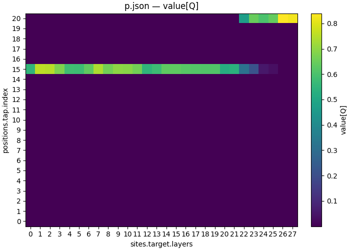

# Trace one pair through the residual stream

| Overview | |
|---|---|
| **Question** | At which layer(s) does [Qwen2.5-1.5B-Instruct](https://huggingface.co/Qwen/Qwen2.5-1.5B-Instruct) compute the answer of a [multiple choice question](artifacts/data/mcqa/pair_n1_s0.json)? |
| **Method** | **Counterfactual interchange interventions across all residual stream layers**: patch activations from a counterfactual prompt with a different answer into each residual stream layer and token position, and read where the probability of the counterfactual answer rises |

## Research question

Let's continue our investigation on how [Qwen2.5-1.5B-Instruct](https://huggingface.co/Qwen/Qwen2.5-1.5B-Instruct) solves the multiple choice question:

```
The cup is red. What color is the cup?
M. orange
Z. red
Answer:
```

The task is the multiple-choice question answering task of [Wiegreffe et al. (2024)](https://arxiv.org/abs/2407.15018) that [tutorial 02](02_ablation_attention.md) introduced. Without any intervention, the instruction-tuned model answers `" Z"` with probability 0.669.

A transformer keeps a **residual stream** for every token position. Each layer reads the stream, computes an update, and adds the update back. So the stream at layer L and position p holds everything the model has written about token p up to layer L. Locating the answer symbol means finding the layers and positions whose stream carries it.

Let's consider the latter tokens of the task in detail:

| index | 10 | 11 | 12 | 13 | 14 | 15 | 16 | 17 | 18 | 19 | 20 |
|---|---|---|---|---|---|---|---|---|---|---|---|
| token | `?\n` | `M` | `.` | ` orange` | `\n` | `Z` | `.` | ` red` | `\n` | `Answer` | `:` |
| role | | symbols[0] | | choices[0] | | **symbols[1]** | | choices[1] | | | **answer** |

When predicting the answer after the `:` token, the model needs to reference the letter `Z` corresponding to the correct answer. This tutorial generally asks: **At which layer is the answer symbol transferred from the choice tokens to the answer?** More specifically:

**Q1 — At which layer does the information arrive at the final token position?** In an early layer, or only in a late one?

**Q2 — Direct copy or sequential move across intermediate token positions?** Is the information about the correct symbol copied directly from the `symbols[1]` token at position 15 to the `answer` at position 20, or does it move across the token positions in between?

## Method

[Tutorial 02](02_ablation_attention.md) found that four attention heads in layers 21 and 22 matter for this task. Zeroing the output of the four heads at the last token dropped the probability of the correct symbol from 0.522 to 0.016.

Zero ablation, as in the previous tutorials, is a very coarse intervention that destroys model capability beyond the targeted behavior. Instead we replace the activations with activations from a **counterfactual prompt** that has another answer. The counterfactual is a valid input, so the intervention stays on the data the model was trained on. If the answer changes on that prompt, the intervened model component carried it.

Let's consider this counterfactual pair. The base prompt:

```
[Base]              The cup is red. What color is the cup?  M. orange  Z. red  Answer:
[Counterfactual]    The cup is red. What color is the cup?  J. orange  Q. red  Answer:
```

The two differ in the two answer symbols. This is the `different_symbol` design of [04](04_define.md). The dataset entry [artifacts/data/mcqa/pair_n1_s0.json](artifacts/data/mcqa/pair_n1_s0.json) contains base and counterfactual prompts, as well as values of the causal variables and the correct label according to the causal model. The individual causal variable entries are important for automatically identifying the correct token positions. The row is the first draw of the task generator at seed 0, which the file name `pair_n1_s0` records; [04](04_define.md) builds it. `label` is the answer the causal model predicts after the interchange: the answer variable takes the counterfactual's symbol, so it equals `cf_answer`.

```json
{
    "input": "The cup is red. What color is the cup?\nM. orange\nZ. red\nAnswer:",
                                                // The base prompt, the one from tutorial 02
    "counterfactual_inputs": [                  // A list; a document addresses one entry as counterfactual_inputs[0]
        "The cup is red. What color is the cup?\nJ. orange\nQ. red\nAnswer:"
    ],                                          // Same question, same options, new symbols
    "base_answer": " Z",                        // What the base prompt answers
    "cf_answer": " Q",                          // What the counterfactual prompt answers
    "label": " Q",                              // What the causal model answers after the interchange; equals cf_answer here
    "symbols[0]": "M", "symbols[1]": "Z",             // The base symbols, one per option line
    "counterfactual_inputs_variables": [
        {"symbols[0]": "J", "symbols[1]": "Q", "answer": "Q", "answer_position": "1"}
    ]                                           // The counterfactual's variables, elided to the ones that changed
}
```

### Counterfactual interchange intervention

Counterfactual patching, also called an interchange intervention, takes two forward passes. The first pass runs the counterfactual prompt and reads the residual stream at one layer and one token position. The second pass runs the base prompt. At the same layer and position, the write replaces the base stream with the value read in the first pass. Every later layer now computes on base activations everywhere except that one layer and position.

The read-out is the probability the patched model gives each answer symbol at the last position. Without a patch the model says `" Z"` with probability 0.669 and `" Q"` with 0.000. If a patch raises the probability of `" Q"`, the counterfactual's answer, the residual stream at that layer and position carried the answer symbol. If `" Q"` stays near 0, it did not. One layer and position is one point of the experiment; we sweep the point over all 28 layers and all 21 token positions. We write it out as an intervention specification to execute the experiment in causalab.

```json
{
    "header": {
        "protocol_version": "4",
        "description": "Trace one MCQA pair: interchange the residual stream at every (layer, token position) of a single row, and read back the probability it gives each answer symbol. Two axes -- sites.target.layers over all 28 blocks, positions.tap.index over all 21 tokens of the row -- expand to 588 points. Without a patch the model gives P(Z) = 0.669 and P(Q) = 0.000. One row is what makes a dense index sweep well defined: token indices are a property of a tokenization, so a many-row document addresses positions by name instead (see mcqa_locate_scan.json)."
    },
    "model": {
        "key": "Qwen/Qwen2.5-1.5B-Instruct", // The instruction-tuned variant
        "revision": "main",             // Pin the weights to a git revision of the Hugging Face repo
        "dtype": "bf16"                 // The dtype the weights are loaded in; part of the document, so part of its digest
    },
    "data": {
        "base": {                       // The prompt the write lands in
            "dataset": "mcqa/pair_n1_s0", // The one-row table above
            "field": "input"            // "The cup is red. What color is the cup?\nM. orange\nZ. red\nAnswer:"
        },
        "counterfactual": {             // The prompt the patched activations come from; a second input role
            "dataset": "mcqa/pair_n1_s0", // The same row
            "field": "counterfactual_inputs[0]" // "The cup is red. What color is the cup?\nJ. orange\nQ. red\nAnswer:"
        }
    },
    "method": {
        "intervened_models": {
            "original_counterfactual": { // Read from the model without any write
                "input": "counterfactual", // On the counterfactual prompt: this is the first forward pass
                "reads": ["v_cf"]
            },
            "patched": {                // The base prompt with one layer and position taken from the counterfactual
                "input": "base",
                "reads": ["logits"],
                "writes": ["patch"]
            }
        },
        "positions": {                  // Named token positions, so a read and a write can share one
            "tap": {
                "index": {              // A token index into the tokenized prompt
                    "sweep": {"range": [0, 21]} // One point per index 0..20: all 21 tokens of the row
                }
            }
        },
        "sites": {
            "target": {
                "component": "block_output", // The residual stream after a transformer block, the MLP output added
                "layers": {
                    "sweep": {"range": [0, 28]} // One point per layer 0..27: all 28 blocks. Two sweeps expand to 21 x 28 = 588 points
                }
            },
            "lm_head": {"component": "lm_head"}
        },
        "reads": {
            "v_cf": {                   // Custom name; the value the write below swaps in
                "site": "target",
                "pos": "tap"            // The named position above, so the read moves with the sweep
            },
            "logits": {"site": "lm_head", "pos": -1} // The read-out on the intervened model, second forward pass
        },
        "writes": {
            "patch": {
                "site": "target",       // Same site as v_cf
                "pos": "tap",           // Same position as v_cf; the two move together through the sweep
                "do": {"swap": "v_cf"}  // Replace the activation with a read instead of a scalar
            }
        },
        "save": [
            {                           // One row per point: {"Q": ..., "Z": ...}
                "read": "logits",
                "model": "patched",
                "aggregation": {
                    "kind": "class_probs", // Softmax mass of each named group of tokens, as in tutorial 02
                    "groups": {"Q": [" Q"], "Z": [" Z"]} // The counterfactual's answer and the base answer, one token each
                },
                "file_path": "p.json"
            }
        ]
    }
}
```

[protocols/mcqa_trace_scan.json](protocols/mcqa_trace_scan.json) is a copy of the intervention specification above.

**Interchange intervention specification.** The core intervention transplants one activation from the counterfactual forward pass into the base forward pass at one layer and token position, and reads the answer probabilities at the last position. The experiment varies along the layer, the token position, the residual stream tap, and the pair of prompts. Sections 2.2, 2.3, 2.7 and 3 of [the intervention reference](../../docs/intervention_protocol.md) define them.

<details>
<summary>Parameters and the values they accept</summary>

| field | accepts | meaning |
|---|---|---|
| `data.counterfactual` | `{"dataset": "<ref>", "field": "<column>"}`; the field can index a list, `counterfactual_inputs[0]` | the second input role. `base` is the prompt the write lands in; `counterfactual` is the prompt the value comes from. The two roles pair row by row |
| `intervened_models.original_counterfactual` | `{"input": "counterfactual", "reads": ["<read name>"]}` | the model without writes on the counterfactual prompt. The read it lists is the value to transplant, taken from the counterfactual forward pass before any write |
| `do` | `{"swap": "<read name>"}` | the write's value is the read's tensor at the same site and position. The read and the write have to select the same number of tokens |
| `positions.<name>` | `{"index": n}`; `{"span": [a, b]}`; `{"variable": "x"}`; `{"column": "c"}`; `{"all": true}`; `{"indices": [n, ...]}` | a named position that a read and a write share by name, so one edit moves both. `variable` and `column` locate tokens by the dataset's text, which is what tutorial 06 uses across 64 rows with different tokenizations |
| `sweep` | `{"range": [start, stop, step?]}` or `{"values": [v, ...]}` on `layers`, `index`, `head`, or a write's `alpha` | one point per value. Two sweeps multiply, 21 × 28 = 588 here. Each swept field becomes a column of the output table, named after its path: `sites.target.layers`, `positions.tap.index` |
| `component` for the residual stream | `block_input`, `block_mid`, `block_output`, `attention_output` | four taps on the same stream: before the block, after attention, after the MLP, and the attention sublayer's own contribution |

</details>

## Execution

An intervention specification produces tables. Data processing and plotting live outside it. CausaLab also has a **workflow spec** that executes a chain of intervention specifications, data processing steps, and plotting scripts end to end.

### CausaLab's Workflow Spec

Here we'll use the workflow spec to make a plot right after the experiment. In [workflows/mcqa_trace.json](workflows/mcqa_trace.json), the `scan` step runs the specification above, and the `heatmap` step calls `causalab.io.plots.workflow_figures` on the scan's `p.json` with layers on the x axis and token index on the y axis. A `class_probs` row holds one number per group, so `key` picks the `Q` entry to draw. The script needs the sweep axes of the table, and a workflow step records them where a bare specification run does not. `plotted` saves the drawn rows as `05_trace_p_q_grid.json` beside the png, so the picture has a record.

```json
{
  "version": "1",
  "description": "The 05_trace demo's scan with a figure after it. One specification step and one script step is the smallest workflow that is not a protocol: nothing here fans out, and the reason to write it is that a table and the picture of that table are two products of one experiment. It is also the only way a dense index sweep gets a figure -- causalab.io.plots.workflow_figures reads a table's sweep axes from the step record a workflow writes, so the same specification run on its own produces a table no shipped renderer can draw.",
  "output_dir": "05_trace",
  "steps": {
    "scan": {"type": "intervention_protocol", "document": "../protocols/mcqa_trace_scan.json"},
    "heatmap": {
      "type": "script",
      "script": {"module": "causalab.io.plots.workflow_figures"},
      "inputs": {
        "table": {"step": "scan", "file": "p.json"},
        "plot": "heatmap",
        "key": "Q",
        "x": "sites.target.layers",
        "y": "positions.tap.index"
      },
      "outputs": {"figure": "05_trace_p_q_grid.png", "plotted": {"file": "05_trace_p_q_grid.json"}}
    }
  }
}
```

Before executing a workflow, make a quick validation run via `causalab explain` to check whether all scripts are parsed correctly, without loading any weights.

```bash
uv run causalab explain demos/onboarding_tutorial/workflows/mcqa_trace.json \
    --engine pytorch_hooks \
    --data-root demos/onboarding_tutorial/artifacts/data
# schedule  2 levels
#   level 0: scan
#   level 1: heatmap
#   scan: intervention_protocol ../protocols/mcqa_trace_scan.json — 588 point(s), campaign digest 7e577d4ebc5d03f6…
#   heatmap: script causalab.io.plots.workflow_figures -> 05_trace_p_q_grid.json, 05_trace_p_q_grid.png
```

Finally, run the workflow with:

```bash
uv run causalab run demos/onboarding_tutorial/workflows/mcqa_trace.json \
    --engine pytorch_hooks \
    --data-root demos/onboarding_tutorial/artifacts/data \
    --out demos/onboarding_tutorial/artifacts/output \
    --device mps
```

`--device` takes `cuda`, `mps` or `cpu`. Alternatively, you could run the intervention specification [protocols/mcqa_trace_scan.json](protocols/mcqa_trace_scan.json) on its own and run the plotting separately.

### Required resources and reproducibility

The run is 1176 forwards of one 21-token row through a 1.5 B model, so any GPU with 8 GB of memory is enough. The run tree under `artifacts/output/05_trace/` was produced on 2026-09-22 on a MacBook Pro (Apple M5 Pro, `--device mps`) in 13 s, model load included. The same run on one H100 80GB took 26 s on 2026-09-21. The CPU also works and takes longer. The per-example table `scan/p.json` is not committed; the command above writes it.

## Results

The heatmap shows all 588 points of `p.json`, drawn by the workflow's `heatmap` step. Each row is one token position of the prompt, each column one layer, and the color is the probability the patched model gives `" Q"`, the counterfactual's answer. Without a patch that probability is 0.000, and 526 of the 588 points stay there. Two rows light up: index 15, the answer symbol `Z`, and index 20, the answer slot `:`.



*P(`" Q"`) for one pair. Layers on the x axis, token index on the y axis. The drawn rows are in [artifacts/output/05_trace/heatmap/05_trace_p_q_grid.json](artifacts/output/05_trace/heatmap/05_trace_p_q_grid.json).*

### Q1: The answer arrives at the final position in layer 22

Patching the answer slot at any layer up to 21 leaves P(`" Q"`) at 0.00. At layer 22 it jumps to 0.47, and from there it climbs to 0.82 at layer 27. So the model writes the answer symbol into the final position late: after 22 of its 28 layers. This is where the four heads of [tutorial 02](02_ablation_attention.md) sit.

### Q2: A direct copy from the symbol to the answer slot

The symbol row carries the answer from the embedding up. Patching index 15 at layer 0 gives P(`" Q"`) 0.55, and the value stays between 0.52 and 0.76 through layer 21. It then falls to 0.32 at layer 22, 0.21 at layer 23 and 0.05 at layer 24. The answer slot rises over the same layers. The two rows overlap at layers 22 and 23, where the answer is readable in both places.

No other position carries it. The nineteen remaining rows, including the positions 16 to 19 between the symbol and the answer slot, stay at 0.00 at every layer. The symbol is not moved along the sequence step by step. It is copied from index 15 to index 20 across two layers, which is what an attention head does.

The `symbols[0]` at token position 11 also changes from clean to counterfactual, `M` to `J`, but has no logical relevance for the final answer. So we can view it as a distractor symbol. In the resulting heatmap, the distractor is one of the dark rows. Patching it never raises P(`" Q"`), which is the null the causal model predicts.

## Next steps

- See what zero ablation does to a whole residual stream. Copy the spec, replace `"do": {"swap": "v_cf"}` with `"do": {"swap": 0}`, and drop the `v_cf` read, the `original_counterfactual` model and the `counterfactual` data role. Read `p` at a few points where the interchange moved the answer, such as (L22, 20). Does the probability mass go to `" Z"`, to `" Q"`, or elsewhere? A `top_k` aggregation on the same read shows what the model says instead.

- Try the other taps on the same stream. Change `component` to `attention_output` or `block_mid` and rerun. Does the answer symbol appear at the answer slot in the same layers?

- One limitation is that we are just analyzing one pair. We cannot determine how well this mechanism generalizes to other multiple choice questions. Follow along [06_localize.md](06_localize.md), which runs this intervention over all 64 pairs and turns one pair's probabilities into an accuracy over the population. That is what makes the copy at layers 22 and 23 a claim rather than an anecdote.
