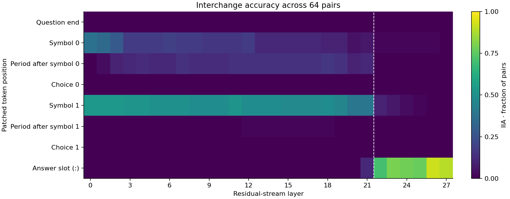

# Does the symbol-to-answer handoff generalize?

| Overview | |
|---|---|
| **Question** | Does the residual-stream handoff from the correct choice symbol to the answer position found in [05](05_trace.md) generalize across [64 pairs](artifacts/data/mcqa/pairs_n64_s0.json) for [Qwen2.5-1.5B-Instruct](https://huggingface.co/Qwen/Qwen2.5-1.5B-Instruct)? |
| **Method** | **Counterfactual interchange interventions**: for each pair, replace the original prompt's residual stream at one layer and token position with the counterfactual activation, then measure whether the answer changes to the counterfactual symbol. |

## Research question

In [05](05_trace.md), we found a handoff in the residual stream from the correct choice symbol's position to the final answer position around layers 22–23, for one pair. Does that pattern hold across other pairs, and how much does it vary?

We use 64 pairs from the `different_symbol` design built in [04](04_define.md). Each pair keeps the question and colors fixed while changing the answer symbols. Here are the first three pairs, with each prompt on one line; the [dataset](artifacts/data/mcqa/pairs_n64_s0.json) retains the original line breaks.

```text
[Base]              The cup is red. What color is the cup?  M. orange  Z. red  Answer:
[Counterfactual]    The cup is red. What color is the cup?  J. orange  Q. red  Answer:

[Base]              The shoe is yellow. What color is the shoe?  J. yellow  E. white  Answer:
[Counterfactual]    The shoe is yellow. What color is the shoe?  D. yellow  V. white  Answer:

[Base]              The bag is white. What color is the bag?  D. green  X. white  Answer:
[Counterfactual]    The bag is white. What color is the bag?  C. green  W. white  Answer:
```

Without intervention, the model answers **53/64 original prompts correctly (0.828)** and **57/64 counterfactual prompts correctly (0.891)**. It never gives the counterfactual answer to an unpatched original prompt (0/64). These are next-token argmax measurements over the whole dataset, recorded in the [run summary](artifacts/output/06_localize/heatmap/06_localize_summary.json).

**Q1 — Does the population show the same symbol-to-answer handoff as the single pair?** We compare the layer profiles at the choice symbols, the answer slot, and nearby positions.

**Q2 — How much does the first successful answer-slot layer vary between pairs?** We summarize its variance across pairs that respond somewhere in the scan.

## Method

For each pair, we patch one residual-stream layer and position from the counterfactual prompt into the original prompt, then check whether the next token is `cf_answer`. We repeat this at all 28 layers and eight positions: 224 interventions per pair.

**Interchange intervention accuracy (IIA)** is the fraction of pairs whose patched answer matches the causal model's prediction. In this design, that prediction is the counterfactual symbol. A score of zero means this intervention never produces that symbol; it does not establish that the position contains no information about it. We also save `logit_diff`, the counterfactual answer logit minus the original answer logit, to retain changes that do not win the argmax.

All prompts have 21 tokens and the same layout. Negative indices therefore select the same role in every pair:

| Position | Token or role | Index |
|---|---|---|
| Question end | `?\n` | −11 |
| Symbol 0 | First choice's letter | −10 |
| Period after symbol 0 | `.` | −9 |
| Choice 0 | First color | −8 |
| Symbol 1 | Second choice's letter | −6 |
| Period after symbol 1 | `.` | −5 |
| Choice 1 | Second color | −4 |
| Answer slot | Final `:` | −1 |

The correct color is in slot 0 for 30 pairs and slot 1 for 34. We use indices because a letter can occur elsewhere in the prompt: `W`, for example, can match both a choice symbol and the start of `What`.

The scan extends 05's specification to 64 pairs, narrows the position sweep to these eight roles, and scores each pair against its own counterfactual answer. The heatmap averages those scores; the saved per-pair outcomes let us measure variation in when answer-slot patches first succeed.

```json
{
    "header": {
        "protocol_version": "4",
        "description": "Interchange residual-stream activations across 64 MCQA pairs at 28 layers and eight token positions. Save per-pair answer matches and logit differences to compare the population pattern with variation between pairs."
    },
    "model": {
        "key": "Qwen/Qwen2.5-1.5B-Instruct",
        "revision": "main",
        "dtype": "bf16"
    },
    "data": {                           // 64 pairs instead of one
        "base": {"dataset": "mcqa/pairs_n64_s0", "field": "input"},
        "counterfactual": {
            "dataset": "mcqa/pairs_n64_s0",
            "field": "counterfactual_inputs[0]"
        }
    },
    "method": {
        "intervened_models": {
            "original_counterfactual": {
                "input": "counterfactual",
                "reads": ["v_cf"]
            },
            "patched": {
                "input": "base",
                "reads": ["logits"],
                "writes": ["patch"]
            }
        },
        "positions": {
            "tap": {
                "sweep": [              // Eight positions with the same roles across pairs
                    {"index": -11},
                    {"index": -10},
                    {"index": -9},
                    {"index": -8},
                    {"index": -6},
                    {"index": -5},
                    {"index": -4},
                    {"index": -1}
                ]
            }
        },
        "sites": {
            "target": {
                "component": "block_output",
                "layers": {"sweep": {"range": [0, 28]}}
            },
            "lm_head": {"component": "lm_head"}
        },
        "reads": {
            "v_cf": {"site": "target", "pos": "tap"},
            "logits": {"site": "lm_head", "pos": -1}
        },
        "writes": {
            "patch": {
                "site": "target",
                "pos": "tap",
                "do": {"swap": "v_cf"}
            }
        },
        "save": [
            {
                "read": "logits",
                "model": "patched",
                "aggregation": {        // Average counterfactual-answer matches over pairs for IIA
                    "kind": "match",
                    "expected": "cf_answer"
                },
                "file_path": "iia.json"
            },
            {
                "read": "logits",
                "model": "patched",
                "aggregation": {
                    "kind": "logit_diff",
                    "a": "cf_answer",
                    "b": "base_answer"
                },
                "file_path": "logit_diff.json"
            }
        ]
    }
}
```

[protocols/mcqa_locate_scan.json](protocols/mcqa_locate_scan.json) is a copy of the intervention specification above. The [intervention reference](../../docs/intervention_protocol.md) defines position sweeps (§2.3), aggregations (§2.10), and sweep expansion (§3).

The [clean specification](protocols/mcqa_clean.json) measures the unpatched baselines on the same pairs. It also saves the unpatched logit difference, which later tutorials compare their margins with:

<details>
<summary>Clean accuracy specification</summary>

```json
{
  "header": {
    "protocol_version": "4",
    "description": "Measure clean next-token accuracy on all 64 original and counterfactual MCQA prompts, plus the unpatched rate of counterfactual answers and the unpatched logit difference between the counterfactual and original answers."
  },
  "model": {"key": "Qwen/Qwen2.5-1.5B-Instruct", "revision": "main", "dtype": "bf16"},
  "data": {
    "base": {"dataset": "mcqa/pairs_n64_s0", "field": "input"},
    "counterfactual": {"dataset": "mcqa/pairs_n64_s0", "field": "counterfactual_inputs[0]"}
  },
  "method": {
    "intervened_models": {
      "original_base": {"input": "base", "reads": ["base_logits"]},
      "original_counterfactual": {"input": "counterfactual", "reads": ["cf_logits"]}
    },
    "sites": {"lm_head": {"component": "lm_head"}},
    "reads": {
      "base_logits": {"site": "lm_head", "pos": -1},
      "cf_logits": {"site": "lm_head", "pos": -1}
    },
    "save": [
      {
        "read": "base_logits",
        "model": "original_base",
        "aggregation": {"kind": "match", "expected": "base_answer"},
        "file_path": "clean_base.json"
      },
      {
        "read": "cf_logits",
        "model": "original_counterfactual",
        "aggregation": {"kind": "match", "expected": "cf_answer"},
        "file_path": "clean_cf.json"
      },
      {
        "read": "base_logits",
        "model": "original_base",
        "aggregation": {"kind": "match", "expected": "cf_answer"},
        "file_path": "unpatched_cf.json"
      },
      {
        "read": "base_logits",
        "model": "original_base",
        "aggregation": {"kind": "logit_diff", "a": "cf_answer", "b": "base_answer"},
        "file_path": "unpatched_logit_diff.json"
      }
    ]
  }
}
```

</details>

## Execution

The [workflow](workflows/mcqa_locate.json) measures clean accuracy, runs the scan, and produces the population heatmap and a variance statistic. Its [plotting script](workflows/scripts/plot_localize.py) labels positions by role and saves the plotted values and a numerical summary.

```json
{
  "version": "1",
  "description": "Measure clean accuracy, scan the layer-position grid, and plot the population pattern, and summarize variance in the first successful answer-slot layer.",
  "output_dir": "06_localize",
  "steps": {
    "clean": {"type": "intervention_protocol", "document": "../protocols/mcqa_clean.json"},
    "scan": {"type": "intervention_protocol", "document": "../protocols/mcqa_locate_scan.json"},
    "heatmap": {
      "type": "script",
      "script": {"path": "scripts/plot_localize.py"},
      "inputs": {
        "table": {"step": "scan", "file": "iia.json"},
        "pairs": {"path": "../artifacts/data/mcqa/pairs_n64_s0.json"},
        "clean_base": {"step": "clean", "file": "clean_base.json"},
        "clean_cf": {"step": "clean", "file": "clean_cf.json"},
        "unpatched_cf": {"step": "clean", "file": "unpatched_cf.json"}
      },
      "outputs": {
        "figure": "06_localize_iia_heatmap.png",
        "plotted": {"file": "06_localize_plotted.json"},
        "summary": {"file": "06_localize_summary.json"}
      }
    }
  }
}
```

Run from the repository root:

```bash
uv run causalab run demos/onboarding_tutorial/workflows/mcqa_locate.json \
    --engine pytorch_hooks \
    --data-root demos/onboarding_tutorial/artifacts/data \
    --out demos/onboarding_tutorial/artifacts/output \
    --device mps
```

To check the documents without loading weights, replace `run` with `validate` and omit `--out` and `--device`.

The saved run used bf16 on a MacBook Pro with an Apple M5 Pro on 2026-09-28 and took 35 seconds, including model loading and plotting. The scan covers 224 points × 64 pairs. Its run receipt reports 225 forward groups, sharing the counterfactual pass; the clean baseline adds two. A GPU with 8 GB is sufficient for this model and dataset. Use `--device cuda` on an NVIDIA GPU. The per-example tables `scan/iia.json` and `scan/logit_diff.json` are not committed; the command above writes them.

## Results

The scan records 14,336 binary outcomes. The unpatched rate of counterfactual answers is 0.000, so the heatmap shows how often each intervention changes the answer to that symbol. This differs from clean task accuracy, which compares each unpatched prompt with its own correct answer.

### Q1: The population repeats the late handoff, with an additional effect at the first period



*Mean IIA across 64 pairs. Columns are residual-stream layers; rows are the patched token roles. The dashed line marks the start of layer 22. Values are saved in the `population` entries of [06_localize_plotted.json](artifacts/output/06_localize/heatmap/06_localize_plotted.json).*

The answer-slot row is zero through layer 20, rises to 0.109 at layer 21 and 0.703 at layer 22, and remains between 0.766 and 0.922 through layers 23–27. The symbol rows weaken over the same layers. This repeats the broad pattern from 05: early interventions work at the choice symbols, while late interventions work at the answer position.

The population also reveals an effect that the first pair did not show. Patching the period after symbol 0 changes some answers through the middle layers, reaching 0.156 at layer 18. The question end and both color words stay at zero across the scan. These are useful comparisons because the paired prompts have identical questions and colors. The period result suggests that relevant information can reach a neighboring token; this scan alone does not identify the path that carried it there.

### Q2: The first successful answer-slot layer has variance 2.246 layers²

For each pair, we find the first layer whose answer-slot patch produces the counterfactual answer. The variance of these layers is **2.246 layers²** across the 60 pairs with at least one success. We use the mean squared deviation from their mean layer, dividing by 60. The four pairs with no successful patch are excluded because they have no observed onset layer. The [run summary](artifacts/output/06_localize/heatmap/06_localize_summary.json) records the calculation and exclusions.

This measures variation in first success, not in the full trajectory: some pairs stop responding and then respond again at later layers. It also describes these responding pairs only; it does not establish that all inputs use an identical mechanism.

## Next steps

In [07](07_subspace.md), we ask how many directions within the residual stream at the answer position are sufficient to carry the symbol, then evaluate the learned subspace on held-out pairs.
