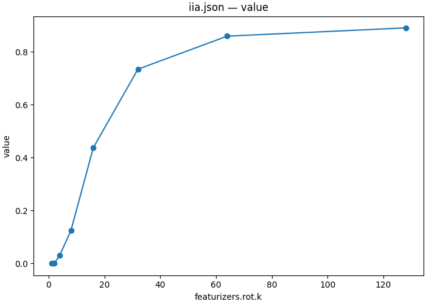

# How few directions carry the answer symbol?

| Overview | |
|---|---|
| **Question** | How many of the 1536 residual stream dimensions of [Qwen2.5-1.5B-Instruct](https://huggingface.co/Qwen/Qwen2.5-1.5B-Instruct) at the answer slot of block 26 does an interchange need to move the answer symbol of [held-out pairs](artifacts/data/mcqa/test_n64_s2.json)? |
| **Method** | **Distributed alignment search (DAS)**: train a rotation on [128 training pairs](artifacts/data/mcqa/train_n128_s1.json) so that swapping its first k coordinates from the counterfactual input gives the counterfactual answer, apply the swap to held-out pairs, and read whether the model gives the counterfactual answer. |

## Research question

In [06](06_localize.md), patching the whole residual stream at block 26's output at the answer slot gave the counterfactual answer on 0.922 of 64 pairs, the highest value in the scan. That patch replaced all 1536 dimensions of the stream. It does not tell us how many of them the answer symbol needs.

This tutorial trains on one set of pairs and scores on another. Both are `different_symbol` tables from [04](04_define.md), drawn at seeds 1 and 2, and no original prompt appears in both. The first pair of each:

```text
[Train, original]         The shoe is blue. What color is the shoe?  P. blue  Y. orange  Answer:
[Train, counterfactual]   The shoe is blue. What color is the shoe?  O. blue  Q. orange  Answer:

[Test, original]          The car is blue. What color is the car?  X. blue  Z. pink  Answer:
[Test, counterfactual]    The car is blue. What color is the car?  V. blue  J. pink  Answer:
```

Without intervention, the model answers 117 of 128 original training prompts correctly (0.914) and 120 of 128 counterfactual ones (0.938). On the test split it answers 59 of 64 original prompts (0.922) and 58 of 64 counterfactual prompts (0.906). It gives the counterfactual answer to no unpatched original prompt on either split. The [training](artifacts/output/07_subspace/clean_train/) and [test](artifacts/output/07_subspace/clean_test/) tables record these values.

A **subspace** of the residual stream is the span of a few directions in it. Swapping only the component of the stream that lies in a k-dimensional subspace, and keeping the rest from the original input, is a narrower intervention than the full patch of 06. If a small subspace moves the answer as well as the full stream, the answer symbol has a compact representation at this component.

**Q1 — How many directions does the interchange need on held-out pairs?** We compare subspaces of 1 to 128 directions with the full 1536-dimensional patch on the same pairs.

**Q2 — How much does the training score overstate the held-out score?** A rotation with 1536 × k free parameters fits 128 pairs, so its training score can be optimistic.

## Method

For each width k, we train an orthogonal rotation R of the residual stream at block 26's answer slot. The interchange rotates the activations of both inputs, replaces the first k coordinates of the original input's activation with those of the counterfactual input, and rotates back. The other 1536 − k coordinates keep their values from the original input. After training, we apply each rotation to the test pairs and measure interchange intervention accuracy (IIA), as in [06](06_localize.md).

Gradient descent chooses the rotation. IIA counts an argmax match, which has no gradient, so the fit minimizes the cross-entropy of the patched model's output against `label` instead. The causal model sets `label` to the counterfactual answer in this design ([05](05_trace.md) shows one row). The fit and the score use the same target, but only IIA is reported.

The experiment has two intervention specifications. The **fit** document trains a rotation for each k on the training split and saves it. The **apply** document loads each saved rotation and scores it on the test split. A training score is the rotation measured on the pairs that chose it, and Q2 compares it with the held-out one.

The comments mark what is new since [06](06_localize.md). Lines without a comment work as they did there.

```json
{
    "header": {
        "protocol_version": "4",
        "description": "Fit an orthogonal rotation of the residual stream at block 26's answer slot for each subspace width k, training an interchange of its first k coordinates to produce the counterfactual answer. Save each rotation and its training-split scores."
    },
    "model": {"key": "Qwen/Qwen2.5-1.5B-Instruct", "revision": "main", "dtype": "bf16"},
    "data": {
        "base": {"dataset": "mcqa/train_n128_s1", "field": "input"}, // The training split: 128 pairs
        "counterfactual": {"dataset": "mcqa/train_n128_s1", "field": "counterfactual_inputs[0]"}
    },
    "method": {
        "intervened_models": {
            "original_counterfactual": {"input": "counterfactual", "reads": ["v_cf"]},
            "patched": {"input": "base", "reads": ["logits"], "writes": ["patch"]}
        },
        "positions": {"best": {"index": -1}}, // The answer slot
        "sites": {
            "target": {"component": "block_output", "layers": [26]}, // The component where 06 measured the highest IIA
            "lm_head": {"component": "lm_head"}
        },
        "featurizers": {                // Maps an activation to new coordinates before a read or write
            "rot": {
                "kind": "subspace",     // An orthogonal rotation whose first k coordinates are the subspace
                "k": {"sweep": [1, 2, 4, 8, 16, 32, 64, 128]}, // One fit per width
                "parametrization": "cayley" // Keeps the matrix orthogonal while it trains
            }
        },
        "reads": {
            "v_cf": {"site": "target", "pos": "best", "featurizer": "rot"}, // Reads the first k rotated coordinates
            "logits": {"site": "lm_head", "pos": -1}
        },
        "writes": {
            "patch": {"site": "target", "pos": "best", "featurizer": "rot", "do": {"swap": "v_cf"}}
                                        // Swaps those k coordinates and rotates back; the rest stays from the original input
        },
        "train": {                      // Optimizes the parameters named in params
            "objective": {              // Named terms, each with its weight
                "ce": {
                    "weight": 1.0,
                    "read": "logits",
                    "model": "patched",
                    "aggregation": {"kind": "cross_entropy", "target": "label"}
                                        // Cross-entropy against the causal model's answer
                }
            },
            "params": ["rot"],          // Only the rotation trains; the model weights stay fixed
            "optimizer": {"name": "adamw", "lr": 0.001, "weight_decay": 0.0},
            "steps": {"epochs": 20},
            "batch": {"pairs": 32},
            "precision": {"feature": "fp32", "loss": "fp32"}, // The rotation and the loss in fp32 on a bf16 model
            "eval": {                   // Scores the test split after every epoch, written to train_eval.json
                "every": {"epochs": 1},
                "split": "mcqa/test_n64_s2",
                "aggregations": {
                    "iia": {
                        "read": "logits",
                        "model": "patched",
                        "aggregation": {"kind": "match", "expected": "cf_answer"}
                    }
                }
            },
            "seed": 0
        },
        "save": [
            {"train": "iia", "file_path": "iia.json"}, // The eval aggregation iia, scored on the training split after the last epoch
            {"train": "ce", "file_path": "ce.json"}, // The objective term ce, on the same pairs
            {"value": "rot", "site": "target", "file_path": "rot.safetensors"} // The fitted rotations, one per k
        ]
    }
}
```

[protocols/mcqa_das_fit.json](protocols/mcqa_das_fit.json) is a copy of the fit specification above.

The eval split is the test split, and the fit keeps the rotation of its last epoch. The test scores therefore do not choose the rotation. The apply document is the held-out measurement: it differs from the fit in its data, in having no `train` section, and in one field of the featurizer.

```diff
     "data": {
-        "base": {"dataset": "mcqa/train_n128_s1", "field": "input"},
-        "counterfactual": {"dataset": "mcqa/train_n128_s1", "field": "counterfactual_inputs[0]"}
+        "base": {"dataset": "mcqa/test_n64_s2", "field": "input"},
+        "counterfactual": {"dataset": "mcqa/test_n64_s2", "field": "counterfactual_inputs[0]"}
     },
     ...
         "parametrization": "cayley",
+        "file_path": "fit/rot.safetensors"
```

`file_path` names the fit step's output inside the workflow run tree. On load, the runner checks that the saved rotation matches the document's model, site, k, parametrization and dtype, and refuses a mismatch. Both documents sweep the axis `featurizers.rot.k`, so each apply point loads the rotation fitted at its own k: eight points, not 64.

<details>
<summary>Apply specification</summary>

```json
{
  "header": {
    "protocol_version": "4",
    "description": "Load each fitted rotation and measure interchange accuracy and logit difference on held-out pairs when only its first k coordinates are swapped."
  },
  "model": {"key": "Qwen/Qwen2.5-1.5B-Instruct", "revision": "main", "dtype": "bf16"},
  "data": {
    "base": {"dataset": "mcqa/test_n64_s2", "field": "input"},
    "counterfactual": {"dataset": "mcqa/test_n64_s2", "field": "counterfactual_inputs[0]"}
  },
  "method": {
    "intervened_models": {
      "original_counterfactual": {"input": "counterfactual", "reads": ["v_cf"]},
      "patched": {"input": "base", "reads": ["logits"], "writes": ["patch"]}
    },
    "positions": {"best": {"index": -1}},
    "sites": {
      "target": {"component": "block_output", "layers": [26]},
      "lm_head": {"component": "lm_head"}
    },
    "featurizers": {
      "rot": {
        "kind": "subspace",
        "k": {"sweep": [1, 2, 4, 8, 16, 32, 64, 128]},
        "parametrization": "cayley",
        "file_path": "fit/rot.safetensors"
      }
    },
    "reads": {
      "v_cf": {"site": "target", "pos": "best", "featurizer": "rot"},
      "logits": {"site": "lm_head", "pos": -1}
    },
    "writes": {
      "patch": {"site": "target", "pos": "best", "featurizer": "rot", "do": {"swap": "v_cf"}}
    },
    "save": [
      {
        "read": "logits",
        "model": "patched",
        "aggregation": {"kind": "match", "expected": "cf_answer"},
        "file_path": "iia.json"
      },
      {
        "read": "logits",
        "model": "patched",
        "aggregation": {"kind": "logit_diff", "a": "cf_answer", "b": "base_answer"},
        "file_path": "logit_diff.json"
      }
    ]
  }
}
```

</details>

[protocols/mcqa_das_apply.json](protocols/mcqa_das_apply.json) is the apply specification.

**Subspace interchange specification.** The core intervention is the interchange of 06 through a featurizer that both the read and the write name, so the swap moves only the featurized coordinates. The experiment varies along the width k, the featurizer kind, the training objective and schedule, and the split the fit and the score use. Sections 2.5 and 2.11 of [the intervention reference](../../docs/intervention_protocol.md) define featurizers and training.

<details>
<summary>Parameters and the values they accept</summary>

| field | accepts | meaning |
|---|---|---|
| `featurizers.<name>.kind` | `subspace`, `pca`, `gate`, `sae`, `standardize`, `identity` | how the activation maps to new coordinates. `subspace` is a trainable rotation; [08](08_variance_vs_cause.md) uses `pca` and [09](09_components.md) uses `gate` |
| `k` | an integer, or a sweep | the number of coordinates the swap moves. The width of the stream, 1536, comes from the model and site |
| `featurizer` on a read or write | a featurizer name | the read returns the featurized coordinates, and the write maps its value back. Coordinates outside the k keep the pre-write value |
| `train.objective` | `{name: {"weight": w, …term}}` | the loss the fit minimizes. A term is a read on an intervened model with a differentiable aggregation, such as `cross_entropy`, or a penalty on a featurizer, such as `{"l1": "gate"}`. A workflow `set` or a sweep can address a weight as `train.objective.<name>.weight` |
| `{"train": name}` in `save` | an objective term or an `eval.aggregations` label | saves that term's read, model and aggregation as a table over the document's own data, the training split here |
| `train.params` | featurizer names | the parameters the optimizer changes. Model weights cannot be listed |
| `train.eval` | `{every, split, aggregations}` | scores the split at each interval and saves the scores to `train_eval.json`. The fit keeps its last epoch |
| `file_path` on a featurizer | a path, or `<step>/<file>` in a workflow | loads a fitted featurizer instead of training one. The saved identity must match the document |

</details>

## Execution

The workflow [workflows/mcqa_subspace.json](workflows/mcqa_subspace.json) measures clean accuracy on both splits, runs the fit and the apply documents, and plots the held-out IIA against k. Its `full` step reruns 06's scan specification on the test split at block 26's answer slot only, which gives the full-vector interchange on the same 64 pairs.

```json
{
  "version": "1",
  "description": "Measure clean accuracy on both splits, fit a rotation per k on the train split, apply each one to the test split, and plot test IIA against k. The full step interchanges the whole residual stream at the same component on the test split, which is the ceiling a subspace is read against.",
  "output_dir": "07_subspace",
  "steps": {
    "clean_train": {
      "type": "intervention_protocol",
      "document": "../protocols/mcqa_clean.json",
      "set": {
        "data.base.dataset": "mcqa/train_n128_s1",
        "data.counterfactual.dataset": "mcqa/train_n128_s1"
      }
    },
    "clean_test": {
      "type": "intervention_protocol",
      "document": "../protocols/mcqa_clean.json",
      "set": {
        "data.base.dataset": "mcqa/test_n64_s2",
        "data.counterfactual.dataset": "mcqa/test_n64_s2"
      }
    },
    "full": {
      "type": "intervention_protocol",
      "document": "../protocols/mcqa_locate_scan.json",
      "set": {
        "data.base.dataset": "mcqa/test_n64_s2",
        "data.counterfactual.dataset": "mcqa/test_n64_s2",
        "sites.target.layers": [26],
        "positions.tap": {"index": -1}
      }
    },
    "fit": {
      "type": "intervention_protocol",
      "document": "../protocols/mcqa_das_fit.json"
    },
    "apply": {
      "type": "intervention_protocol",
      "document": "../protocols/mcqa_das_apply.json"
    },
    "test_curve": {
      "type": "script",
      "script": {"module": "causalab.io.plots.workflow_figures"},
      "inputs": {
        "table": {"step": "apply", "file": "iia.json"},
        "plot": "lines",
        "x": "featurizers.rot.k"
      },
      "outputs": {"figure": "07_subspace_iia_by_k.png", "plotted": {"file": "07_subspace_iia_by_k.json"}}
    }
  }
}
```

A step's `set` block replaces fields of its document before the run. The two clean steps reuse [06](06_localize.md)'s clean specification on the other splits.

Run from the repository root:

```bash
uv run causalab run demos/onboarding_tutorial/workflows/mcqa_subspace.json \
    --engine pytorch_hooks \
    --data-root demos/onboarding_tutorial/artifacts/data \
    --out demos/onboarding_tutorial/artifacts/output \
    --device mps
```

To check the documents without loading weights, replace `run` with `validate` and omit `--out` and `--device`.

The fit trains eight rotations for 20 epochs on 128 pairs, with gradients through the 1.5 B model. The run tree under `artifacts/output/07_subspace/` was produced on 2026-09-28 on a MacBook Pro (Apple M5 Pro, `--device mps`) in 95 s, model loading included. A GPU with 16 GB is enough. The fitted rotations `fit/rot.safetensors` are not committed; the command above writes them.

## Results

The unpatched margin on the test split, the counterfactual answer's logit minus the original answer's, is −9.70 ([clean_test/unpatched_logit_diff.json](artifacts/output/07_subspace/clean_test/unpatched_logit_diff.json)). The full-vector interchange gives 0.922 IIA and a margin of +8.95 on the same 64 pairs ([full/](artifacts/output/07_subspace/full/)).

| k | 1 | 2 | 4 | 8 | 16 | 32 | 64 | 128 | 1536 (full) |
|---|---|---|---|---|---|---|---|---|---|
| test IIA | 0.000 | 0.000 | 0.031 | 0.125 | 0.438 | 0.734 | 0.859 | 0.891 | 0.922 |
| test `logit_diff` | −9.10 | −7.79 | −6.09 | −2.34 | +1.52 | +4.88 | +6.71 | +7.87 | +8.95 |
| training IIA | 0.016 | 0.031 | 0.062 | 0.352 | 0.875 | 1.000 | 1.000 | 1.000 | not measured |

Test values come from [apply/iia.json](artifacts/output/07_subspace/apply/iia.json) and [apply/logit_diff.json](artifacts/output/07_subspace/apply/logit_diff.json), training values from [fit/iia.json](artifacts/output/07_subspace/fit/iia.json). Each IIA is over 64 test pairs or 128 training pairs. The fit's last-epoch eval scores in [fit/train_eval.json](artifacts/output/07_subspace/fit/train_eval.json) equal the test IIA at every k, which checks that the apply document loads the rotations the fit saved.

### Q1: The interchange needs 32 to 64 of the 1536 directions



*Held-out IIA over 64 test pairs against the subspace width k (`featurizers.rot.k`), one point per fitted rotation. The drawn values are in [07_subspace_iia_by_k.json](artifacts/output/07_subspace/test_curve/07_subspace_iia_by_k.json).*

One or two trained directions move no answer, and the margin at k = 1 stays within 0.6 of the unpatched −9.70. IIA leaves zero at k = 4, reaches 0.438 at k = 16 and 0.734 at k = 32. At k = 64 it is 0.859, four pairs short of the full-vector 0.922, and at k = 128 it is 0.891, two pairs short. The curve rises over five doublings of k, from k = 4 to k = 64, with no single step that takes it from the floor to the ceiling.

A 64-dimensional subspace, 64 of the 1536 dimensions, carries most of what the full patch moves. The result holds for this component, these splits and one training seed. It does not show that the answer symbol spans 64 directions in any basis the model uses: a narrower subspace could exist that this objective and schedule did not find.

### Q2: The training score overstates the held-out score by up to 0.438

| k | 1 | 2 | 4 | 8 | 16 | 32 | 64 | 128 |
|---|---|---|---|---|---|---|---|---|
| training − test IIA | 0.016 | 0.031 | 0.031 | 0.227 | **0.438** | 0.266 | 0.141 | 0.109 |

The gap is largest at k = 16, where the rotation reaches 0.875 on its training pairs and 0.438 on held-out ones. From k = 32 on, the training score is 1.000 and the gap shrinks as the test score rises. A tutorial that reported training scores would put the k = 16 subspace at twice its held-out value.

## Next steps

- The curve comes from one training seed. Sweep `train.seed` in [protocols/mcqa_das_fit.json](protocols/mcqa_das_fit.json) together with `k`, and apply each fit, to see how much the k = 16 and k = 32 values move between seeds.

- Follow along [08_variance_vs_cause.md](08_variance_vs_cause.md), which swaps a subspace chosen by variance instead of by training at the same component, and compares it with the k = 32 rotation above.
