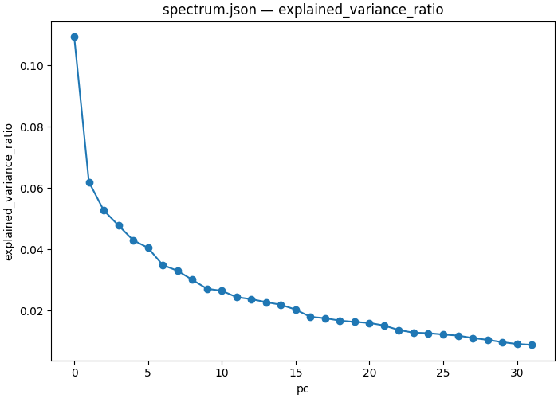

# Variance against cause

| Overview | |
|---|---|
| **Question** | Do the directions along which the residual stream of [Qwen2.5-1.5B-Instruct](https://huggingface.co/Qwen/Qwen2.5-1.5B-Instruct) varies most at block 26's answer slot carry the answer symbol of [held-out pairs](artifacts/data/mcqa/test_n64_s2.json)? |
| **Method** | **Interchange through a principal basis**: fit principal components to the stream on [128 original training prompts](artifacts/data/mcqa/train_n128_s1.json), swap the stream's component in the top k components from the counterfactual input on held-out pairs, and read whether the model gives the counterfactual answer. |

## Research question

In [07](07_subspace.md), a rotation trained on the interchange needed 32 to 64 of the 1536 directions at block 26's answer slot. At k = 32 it gave the counterfactual answer on 0.734 of 64 held-out pairs, against 0.922 for the full stream. The training used the counterfactual labels. We do not know whether directions chosen without labels do as well.

**Principal component analysis (PCA)** finds the directions along which a set of activations varies most. The first principal component explains the largest share of the variance, the second the largest share of what remains, and so on. Variance is easy to compute, and a common assumption is that high-variance directions carry the variables a model computes. This tutorial tests that assumption at one component.

We use the splits of 07: the basis is fitted on the training split, and the interchange is scored on the test split. The unpatched model answers 0.922 of the original test prompts and 0.906 of the counterfactual ones correctly, and its margin between the counterfactual and the original answer is −9.70 ([07's clean baseline](artifacts/output/07_subspace/clean_test/)).

**Q1 — Does the top principal direction carry the answer symbol?** PC0 holds the largest share of the variance at this component.

**Q2 — How does a 32-direction principal subspace compare with the trained one?** 07's rotation at k = 32 is the comparison: same component, same test pairs, same metric.

## Method

We read the residual stream at block 26's answer slot on the 128 original training prompts, with no intervention, and save it. A script centers the 128 activations and takes their singular value decomposition. The top k right singular vectors are the principal basis. The interchange then swaps the component of the stream in that basis from the counterfactual input, on the test pairs, and keeps the orthogonal remainder from the original input. We fit bases of width 1 and 32.

The basis sees only original prompts and no answers. The harvest has no counterfactual input and no write, so its document has one intervened model that only reads:

```json
{
  "header": {
    "protocol_version": "4",
    "description": "Save the residual stream at block 26's answer slot on the 128 original training prompts, for fitting a principal basis."
  },
  "model": {"key": "Qwen/Qwen2.5-1.5B-Instruct", "revision": "main", "dtype": "bf16"},
  "data": {"base": {"dataset": "mcqa/train_n128_s1", "field": "input"}},
  "method": {
    "intervened_models": {
      "original": {"input": "base", "reads": ["acts"]}
    },
    "positions": {"best": {"index": -1}},
    "sites": {
      "target": {"component": "block_output", "layers": [26]}
    },
    "reads": {"acts": {"site": "target", "pos": "best"}},
    "save": [{"read": "acts", "model": "original", "file_path": "acts.safetensors"}]
  }
}
```

[protocols/mcqa_harvest.json](protocols/mcqa_harvest.json) is the harvest specification. A `save` entry without an aggregation writes the read's tensor as `.safetensors`.

The apply document is 07's apply document with a `pca` featurizer in place of the trained rotation. The comments mark what changes:

```json
{
    "header": {
        "protocol_version": "4",
        "description": "Swap the component of block 26's answer-slot residual stream in the top-k principal directions, and measure interchange accuracy and logit difference on held-out pairs."
    },
    "model": {"key": "Qwen/Qwen2.5-1.5B-Instruct", "revision": "main", "dtype": "bf16"},
    "data": {
        "base": {"dataset": "mcqa/test_n64_s2", "field": "input"},
        "counterfactual": {"dataset": "mcqa/test_n64_s2", "field": "counterfactual_inputs[0]"}
    },
    "method": {
        "intervened_models": {
            "original_counterfactual": {"input": "counterfactual", "reads": ["v_cf"]},
            "patched": {"input": "base", "reads": ["logits"], "writes": ["patch"]}
        },
        "positions": {"best": {"index": -1}},
        "sites": {
            "target": {"component": "block_output", "layers": [26]},
            "lm_head": {"component": "lm_head"}
        },
        "featurizers": {"pcs": {"kind": "pca", "k": 1, "file_path": "pca1/basis.safetensors"}},
                                        // A fixed basis loaded from the pca1 step; k must match its width
        "reads": {
            "v_cf": {"site": "target", "pos": "best", "featurizer": "pcs"},
            "logits": {"site": "lm_head", "pos": -1}
        },
        "writes": {
            "patch": {"site": "target", "pos": "best", "featurizer": "pcs", "do": {"swap": "v_cf"}}
        },
        "save": [
            {
                "read": "logits",
                "model": "patched",
                "aggregation": {"kind": "match", "expected": "cf_answer"},
                "file_path": "iia.json"
            },
            {
                "read": "logits",
                "model": "patched",
                "aggregation": {"kind": "logit_diff", "a": "cf_answer", "b": "base_answer"},
                "file_path": "logit_diff.json"
            }
        ]
    }
}
```

[protocols/mcqa_pca_apply.json](protocols/mcqa_pca_apply.json) is a copy of the apply specification above. The 32-direction arm runs the same document with `k` set to 32 and `file_path` set to the `pca32` step's basis, so the two arms differ only in the basis.

A zero IIA at k = 1 means that swapping PC0 alone never moves the argmax to the counterfactual answer. The `logit_diff` read shows whether the margin moves at all. Neither shows that PC0 holds no information about the symbol.

## Execution

The workflow [workflows/mcqa_pca.json](workflows/mcqa_pca.json) runs the harvest, fits both bases with the script `causalab.analysis.fit_pca`, runs both apply arms, and plots the explained-variance ratios of the 32-component fit.

```json
{
  "version": "1",
  "description": "Harvest block 26's answer slot, fit principal bases of width 1 and 32, apply each as an interchange on held-out pairs, and plot the explained-variance spectrum.",
  "output_dir": "08_variance_vs_cause",
  "steps": {
    "harvest": {
      "type": "intervention_protocol",
      "document": "../protocols/mcqa_harvest.json"
    },
    "pca1": {
      "type": "script",
      "script": {"module": "causalab.analysis.fit_pca"},
      "inputs": {"acts": {"step": "harvest", "file": "acts.safetensors"}, "k": 1},
      "outputs": {
        "weight": "basis.safetensors",
        "spectrum": {"file": "spectrum.json",
                     "columns": {"pc": "int64",
                                 "explained_variance": "float64",
                                 "explained_variance_ratio": "float64"}}
      }
    },
    "pca32": {
      "type": "script",
      "script": {"module": "causalab.analysis.fit_pca"},
      "inputs": {"acts": {"step": "harvest", "file": "acts.safetensors"}, "k": 32},
      "outputs": {
        "weight": "basis.safetensors",
        "spectrum": {"file": "spectrum.json",
                     "columns": {"pc": "int64",
                                 "explained_variance": "float64",
                                 "explained_variance_ratio": "float64"}}
      }
    },
    "apply1": {
      "type": "intervention_protocol",
      "document": "../protocols/mcqa_pca_apply.json"
    },
    "apply32": {
      "type": "intervention_protocol",
      "document": "../protocols/mcqa_pca_apply.json",
      "set": {
        "featurizers.pcs.k": 32,
        "featurizers.pcs.file_path": "pca32/basis.safetensors"
      }
    },
    "spectrum_curve": {
      "type": "script",
      "script": {"module": "causalab.io.plots.workflow_figures"},
      "inputs": {
        "table": {"step": "pca32", "file": "spectrum.json"},
        "plot": "lines",
        "x": "pc",
        "value": "explained_variance_ratio"
      },
      "outputs": {"figure": "08_variance_vs_cause_pca_spectrum.png", "plotted": {"file": "08_variance_vs_cause_pca_spectrum.json"}}
    }
  }
}
```

A script step declares its outputs, with the column types of each table, so the runner can check what the script wrote. Run from the repository root:

```bash
uv run causalab run demos/onboarding_tutorial/workflows/mcqa_pca.json \
    --engine pytorch_hooks \
    --data-root demos/onboarding_tutorial/artifacts/data \
    --out demos/onboarding_tutorial/artifacts/output \
    --device mps
```

To check the documents without loading weights, replace `run` with `validate` and omit `--out` and `--device`.

The run is one harvest forward over 128 prompts, an SVD of a 128 × 1536 matrix, and two interchange runs over 64 pairs. The run tree under `artifacts/output/08_variance_vs_cause/` was produced on 2026-09-28 on a MacBook Pro (Apple M5 Pro, `--device mps`) in 10 s, model loading included. A GPU with 8 GB is enough. The harvest and the two bases are `.safetensors` files and are not committed; the command above writes them.

## Results



*The share of the harvest's variance that each of the top 32 principal components explains, against the component index (`pc`, 0 to 31). The drawn values are in [08_variance_vs_cause_pca_spectrum.json](artifacts/output/08_variance_vs_cause/spectrum_curve/08_variance_vs_cause_pca_spectrum.json).*

PC0 explains 0.109 of the variance, PC1 0.062 and PC31 0.009. The top 32 components together explain 0.833 ([pca32/spectrum.json](artifacts/output/08_variance_vs_cause/pca32/spectrum.json)). The ratios are shares of the variance of 128 centered activations, whose covariance has rank at most 127.

| basis | k | share of variance | test IIA | test `logit_diff` |
|---|---|---|---|---|
| none (unpatched) | 0 | 0 | 0.000 | −9.70 |
| principal | 1 | 0.109 | 0.000 | −9.59 |
| trained rotation ([07](07_subspace.md)) | 1 | not measured | 0.000 | −9.10 |
| principal | 32 | 0.833 | 0.719 | +5.45 |
| trained rotation ([07](07_subspace.md)) | 32 | not measured | 0.734 | +4.88 |
| full stream ([07](07_subspace.md)) | 1536 | 1 | 0.922 | +8.95 |

Every row is over the same 64 test pairs. The principal rows come from [apply1/](artifacts/output/08_variance_vs_cause/apply1/) and [apply32/](artifacts/output/08_variance_vs_cause/apply32/); the other rows come from [07's run tree](artifacts/output/07_subspace/).

### Q1: The top principal direction moves no answer

Swapping PC0 gives the counterfactual answer on none of the 64 pairs. The mean margin moves from −9.70 to −9.59, by 0.11. PC0 is the direction of largest variance at this component, and swapping it has almost no effect on the answer. The trained single direction of 07 also gives 0.000 IIA, with a margin of −9.10.

So one direction is too few, whether it is chosen by variance or by training. This result is about one direction at one component. It does not show that PC0 is unrelated to the answer symbol.

### Q2: 32 principal directions match the trained 32-direction subspace to within one pair

The top 32 principal components give 0.719 IIA, 46 of 64 pairs. The trained rotation at k = 32 gives 0.734, 47 of 64 pairs. The principal basis has the larger mean margin, +5.45 against +4.88. Both stay below the full stream's 0.922.

At this width, 20 epochs of training on 128 labelled pairs buy one pair in 64 over a basis chosen without labels. Variance rank did not predict the effect of one direction in Q1, but the top 32 components hold 0.833 of the variance and most of what the interchange needs. The comparison has two widths only. Where between k = 1 and k = 32 the two bases separate, if they do, is not measured here.

## Next steps

- Add a `pca8` step and an `apply8` step with `featurizers.pcs.k` set to 8, and compare it with 07's rotation at k = 8, which gives 0.125. This tests whether training helps more at small widths.

- Follow along [09_components.md](09_components.md), which asks which block component writes the answer symbol into the answer slot, and whether a learned mask of the stream's own dimensions can be smaller than the full stream.
