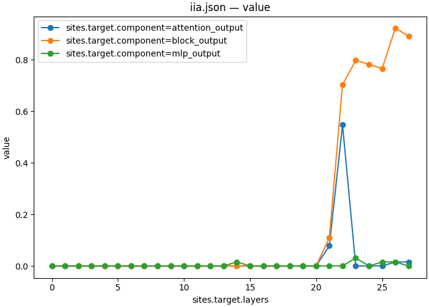

# Which component writes the answer symbol?

| Overview | |
|---|---|
| **Question** | Does the attention sublayer or the MLP sublayer of [Qwen2.5-1.5B-Instruct](https://huggingface.co/Qwen/Qwen2.5-1.5B-Instruct) write the answer symbol of a [multiple choice question](artifacts/data/mcqa/pairs_n64_s0.json) into the answer slot, and how many stream dimensions does the interchange need? |
| **Method** | **Component scan and Desiderata-Based Masking (DBM)**: patch the attention output, MLP output or block output at the answer slot from the counterfactual input at each of 28 layers, then train a mask over the 1536 dimensions of the best component, and read whether the model gives the counterfactual answer. |

## Research question

In [06](06_localize.md), patching the residual stream at the answer slot first moved the answer at layer 21 (0.109 IIA) and layer 22 (0.703), and reached 0.922 at layer 26. 06 patched the block output, the stream after the whole block. A transformer block adds two things to the stream: the output of its attention sublayer, and then the output of its MLP sublayer.

```text
block_output(L) = block_input(L) + attention_output(L) + mlp_output(L)
```

Patching `block_output` replaces everything the stream carries at that point. Patching one summand replaces only what that sublayer added at that layer, and keeps `block_input`, everything the original input computed before it. A summand that moves the answer on its own is a sublayer that writes the answer symbol.

The scan uses the 64 pairs of 06, where the unpatched model answers 0.828 of the original prompts and 0.891 of the counterfactual prompts correctly ([06's clean baseline](artifacts/output/06_localize/clean/)). The masks train and score on the splits of [07](07_subspace.md).

**Q1 — Which sublayer writes the answer symbol into the answer slot, and at which layer?** We compare the attention output and the MLP output at each layer with the block output.

**Q2 — How many of the 1536 dimensions does the interchange at the best component need, when a learned mask selects them?** 07 answered this for a trained rotation. A mask selects among the stream's own dimensions instead.

## Method

The scan is 06's interchange at the answer slot, with the component as a second sweep axis. At each of the 28 layers, we patch one of three components from the counterfactual input and measure IIA. The comments mark what changes from 06:

```json
{
    "header": {
        "protocol_version": "4",
        "description": "Interchange the attention output, MLP output and block output at the answer slot across 28 layers on 64 MCQA pairs. Save per-pair answer matches and logit differences."
    },
    "model": {"key": "Qwen/Qwen2.5-1.5B-Instruct", "revision": "main", "dtype": "bf16"},
    "data": {
        "base": {"dataset": "mcqa/pairs_n64_s0", "field": "input"},
        "counterfactual": {"dataset": "mcqa/pairs_n64_s0", "field": "counterfactual_inputs[0]"}
    },
    "method": {
        "intervened_models": {
            "original_counterfactual": {"input": "counterfactual", "reads": ["v_cf"]},
            "patched": {"input": "base", "reads": ["logits"], "writes": ["patch"]}
        },
        "positions": {"slot": {"index": -1}}, // The answer slot only
        "sites": {
            "target": {
                "component": {"sweep": ["attention_output", "mlp_output", "block_output"]},
                                        // The component is a sweep axis like the layer: 3 x 28 = 84 points
                "layers": {
                    "sweep": {"range": [0, 28]}
                }
            },
            "lm_head": {"component": "lm_head"}
        },
        "reads": {
            "v_cf": {"site": "target", "pos": "slot"},
            "logits": {"site": "lm_head", "pos": -1}
        },
        "writes": {
            "patch": {"site": "target", "pos": "slot", "do": {"swap": "v_cf"}}
        },
        "save": [
            {
                "read": "logits",
                "model": "patched",
                "aggregation": {"kind": "match", "expected": "cf_answer"},
                "file_path": "iia.json"
            },
            {
                "read": "logits",
                "model": "patched",
                "aggregation": {"kind": "logit_diff", "a": "cf_answer", "b": "base_answer"},
                "file_path": "logit_diff.json"
            }
        ]
    }
}
```

[protocols/mcqa_component_scan.json](protocols/mcqa_component_scan.json) is a copy of the scan specification above.

For Q2, the workflow picks the component and layer with the highest IIA from the scan and trains a mask there. **Desiderata-Based Masking** learns one gate value per dimension. During training, the mask is m = σ(θ / T), and the write gives m ⊙ x_counterfactual + (1 − m) ⊙ x_original. The objective is the cross-entropy against the counterfactual answer, as in 07, plus an L1 penalty on the mask that pushes gates to 0. The temperature T falls from 1.0 to 0.01 over the first half of training, which pushes each gate toward 0 or 1. At evaluation the mask is hard: a dimension is swapped if θ > 0 and kept from the original input otherwise.

Two diagnostics describe a fitted mask. `hard_mask_size` counts the dimensions the hard mask swaps. `decisive_fraction` is the share of dimensions whose soft mask value ended below 0.1 or above 0.9 ([`causalab/neural/engines/pytorch_hooks/train.py:2457`](../../causalab/neural/engines/pytorch_hooks/train.py)). A low decisive fraction means that many dimensions sit near the threshold, and the hard mask decides them by a small margin.

The comments mark what is new since 07's fit:

```json
{
    "header": {
        "protocol_version": "4",
        "description": "Train a per-dimension gate on the answer-slot interchange under an L1 penalty. Save the gate and its training-split scores."
    },
    "model": {"key": "Qwen/Qwen2.5-1.5B-Instruct", "revision": "main", "dtype": "bf16"},
    "data": {
        "base": {"dataset": "mcqa/train_n128_s1", "field": "input"},
        "counterfactual": {"dataset": "mcqa/train_n128_s1", "field": "counterfactual_inputs[0]"}
    },
    "method": {
        "intervened_models": {
            "original_counterfactual": {"input": "counterfactual", "reads": ["v_cf"]},
            "masked": {"input": "base", "reads": ["logits"], "writes": ["mask"]}
        },
        "positions": {"slot": {"index": -1}},
        "sites": {
            "target": {"component": "block_output", "layers": [26]}, // The workflow sets both fields from the scan's best component and layer
            "lm_head": {"component": "lm_head"}
        },
        "featurizers": {"gate": {"kind": "gate"}}, // One trainable gate per dimension, sigmoid by default
        "reads": {
            "v_cf": {"site": "target", "pos": "slot", "featurizer": "gate"},
            "logits": {"site": "lm_head", "pos": -1}
        },
        "writes": {
            "mask": {"site": "target", "pos": "slot", "featurizer": "gate", "do": {"swap": "v_cf"}}
        },
        "train": {
            "objective": {
                "ce": {
                    "weight": 1.0,
                    "read": "logits",
                    "model": "masked",
                    "aggregation": {"kind": "cross_entropy", "target": "label"}
                },
                "l1": {"weight": 0.01, "l1": "gate"} // The L1 penalty on the mask; the workflow sets 0.01, 0.3 and 3.0
            },
            "params": ["gate"],
            "optimizer": {"name": "adamw", "lr": 0.001, "weight_decay": 0.0},
            "steps": {"epochs": 20},
            "batch": {"pairs": 32},
            "anneal": {"gate.theta.temperature": [1.0, 0.01, 0.5]}, // T from 1.0 to 0.01 over the first half of training
            "precision": {"feature": "fp32", "loss": "fp32"},
            "eval": {
                "every": {"epochs": 1},
                "split": "mcqa/test_n64_s2",
                "aggregations": {
                    "iia": {
                        "read": "logits",
                        "model": "masked",
                        "aggregation": {"kind": "match", "expected": "cf_answer"}
                    }
                }
            },
            "seed": 0
        },
        "save": [
            {"train": "iia", "file_path": "iia.json"}, // The training score, as in 07
            {"train": "ce", "file_path": "ce.json"},
            {"value": "gate", "site": "target", "file_path": "gate.safetensors"}
        ]
    }
}
```

[protocols/mcqa_gate_fit.json](protocols/mcqa_gate_fit.json) is a copy of the fit specification above. The apply document loads the fitted gate with `file_path` and scores it on the test split, as 07's apply document does for the rotation.

<details>
<summary>Gate apply specification</summary>

```json
{
  "header": {
    "protocol_version": "4",
    "description": "Load a fitted gate and measure interchange accuracy and logit difference on held-out pairs when only the gated dimensions are swapped."
  },
  "model": {"key": "Qwen/Qwen2.5-1.5B-Instruct", "revision": "main", "dtype": "bf16"},
  "data": {
    "base": {"dataset": "mcqa/test_n64_s2", "field": "input"},
    "counterfactual": {"dataset": "mcqa/test_n64_s2", "field": "counterfactual_inputs[0]"}
  },
  "method": {
    "intervened_models": {
      "original_counterfactual": {"input": "counterfactual", "reads": ["v_cf"]},
      "masked": {"input": "base", "reads": ["logits"], "writes": ["mask"]}
    },
    "positions": {"slot": {"index": -1}},
    "sites": {
      "target": {"component": "block_output", "layers": [26]},
      "lm_head": {"component": "lm_head"}
    },
    "featurizers": {"gate": {"kind": "gate", "file_path": "gate_fit/gate.safetensors"}},
    "reads": {
      "v_cf": {"site": "target", "pos": "slot", "featurizer": "gate"},
      "logits": {"site": "lm_head", "pos": -1}
    },
    "writes": {
      "mask": {"site": "target", "pos": "slot", "featurizer": "gate", "do": {"swap": "v_cf"}}
    },
    "save": [
      {
        "read": "logits",
        "model": "masked",
        "aggregation": {"kind": "match", "expected": "cf_answer"},
        "file_path": "iia.json"
      },
      {
        "read": "logits",
        "model": "masked",
        "aggregation": {"kind": "logit_diff", "a": "cf_answer", "b": "base_answer"},
        "file_path": "logit_diff.json"
      }
    ]
  }
}
```

</details>

[protocols/mcqa_gate_apply.json](protocols/mcqa_gate_apply.json) is the gate apply specification. The [DBM method guide](../../docs/methods/dbm.md) describes the other gate parametrizations.

## Execution

The workflow [workflows/mcqa_components.json](workflows/mcqa_components.json) runs the scan and plots it, and its `best` step selects the component and layer with the highest mean IIA. Each of three fit steps reads that choice through `set` and trains a gate under one L1 weight, which it sets as `train.objective.l1.weight`. Each fit has an apply step that loads its gate and scores it on the test split.

<details>
<summary>The workflow</summary>

```json
{
  "version": "1",
  "description": "Scan three components across 28 layers and plot the scan. Select its best component and layer, fit a gate there under three L1 weights, and score each gate on held-out pairs.",
  "output_dir": "09_components",
  "steps": {
    "scan": {
      "type": "intervention_protocol",
      "document": "../protocols/mcqa_component_scan.json"
    },
    "grid": {
      "type": "script",
      "script": {"module": "causalab.io.plots.workflow_figures"},
      "inputs": {
        "table": {"step": "scan", "file": "iia.json"},
        "plot": "lines",
        "x": "sites.target.layers",
        "series": "sites.target.component"
      },
      "outputs": {"figure": "09_components_component_iia.png", "plotted": {"file": "09_components_component_iia.json"}}
    },
    "best": {
      "type": "script",
      "script": {"module": "causalab.workflow.scripts.select"},
      "inputs": {
        "table": {"step": "scan", "file": "iia.json"},
        "choose": "max",
        "emit": {
          "best_layer": "sites.target.layers",
          "best_component": "sites.target.component"
        }
      },
      "outputs": {
        "values": {
          "file": "values.json",
          "keys": {"best_layer": 26, "best_component": "block_output"}
        }
      }
    },
    "gate_fit_lo": {
      "type": "intervention_protocol",
      "document": "../protocols/mcqa_gate_fit.json",
      "set": {
        "sites.target.layers": {"artifact": "best", "key": "best_layer"},
        "sites.target.component": {"artifact": "best", "key": "best_component"},
        "train.objective.l1.weight": 0.01
      }
    },
    "gate_apply_lo": {
      "type": "intervention_protocol",
      "document": "../protocols/mcqa_gate_apply.json",
      "set": {
        "sites.target.layers": {"artifact": "best", "key": "best_layer"},
        "sites.target.component": {"artifact": "best", "key": "best_component"},
        "featurizers.gate.file_path": "gate_fit_lo/gate.safetensors"
      }
    },
    "gate_fit_mid": {
      "type": "intervention_protocol",
      "document": "../protocols/mcqa_gate_fit.json",
      "set": {
        "sites.target.layers": {"artifact": "best", "key": "best_layer"},
        "sites.target.component": {"artifact": "best", "key": "best_component"},
        "train.objective.l1.weight": 0.3
      }
    },
    "gate_apply_mid": {
      "type": "intervention_protocol",
      "document": "../protocols/mcqa_gate_apply.json",
      "set": {
        "sites.target.layers": {"artifact": "best", "key": "best_layer"},
        "sites.target.component": {"artifact": "best", "key": "best_component"},
        "featurizers.gate.file_path": "gate_fit_mid/gate.safetensors"
      }
    },
    "gate_fit_hi": {
      "type": "intervention_protocol",
      "document": "../protocols/mcqa_gate_fit.json",
      "set": {
        "sites.target.layers": {"artifact": "best", "key": "best_layer"},
        "sites.target.component": {"artifact": "best", "key": "best_component"},
        "train.objective.l1.weight": 3.0
      }
    },
    "gate_apply_hi": {
      "type": "intervention_protocol",
      "document": "../protocols/mcqa_gate_apply.json",
      "set": {
        "sites.target.layers": {"artifact": "best", "key": "best_layer"},
        "sites.target.component": {"artifact": "best", "key": "best_component"},
        "featurizers.gate.file_path": "gate_fit_hi/gate.safetensors"
      }
    }
  }
}
```

</details>

`causalab.workflow.scripts.select` groups the scan table by its sweep coordinates, averages each group, and writes the best group's coordinates to `values.json`. A `set` value `{"artifact": "best", "key": "best_layer"}` reads one of them.

Run from the repository root:

```bash
uv run causalab run demos/onboarding_tutorial/workflows/mcqa_components.json \
    --engine pytorch_hooks \
    --data-root demos/onboarding_tutorial/artifacts/data \
    --out demos/onboarding_tutorial/artifacts/output \
    --device mps
```

To check the documents without loading weights, replace `run` with `validate` and omit `--out` and `--device`.

The scan is 84 points over 64 pairs, and each of the three fits trains for 20 epochs on 128 pairs. The run tree under `artifacts/output/09_components/` was produced on 2026-09-28 on a MacBook Pro (Apple M5 Pro, `--device mps`) in 46 s, model loading included. A GPU with 16 GB is enough. The per-example tables `scan/iia.json` and `scan/logit_diff.json` and the fitted gates are not committed; the command above writes them.

## Results

The unpatched margin on these 64 pairs is −8.23 ([06's clean baseline](artifacts/output/06_localize/clean/unpatched_logit_diff.json)).

### Q1: Attention writes the answer symbol at layer 22



*Mean IIA over 64 pairs against the patched layer (`sites.target.layers`), one line per component patched at the answer slot. The drawn values are in [09_components_component_iia.json](artifacts/output/09_components/grid/09_components_component_iia.json).*

| component | layer 21 | layer 22 | layer 23 | layer 26 | largest value at any other layer |
|---|---|---|---|---|---|
| `attention_output` | 0.078 | **0.547** | 0.000 | 0.016 | 0.016 (layer 27) |
| `mlp_output` | 0.000 | 0.000 | 0.031 | 0.016 | 0.016 (layers 14, 25) |
| `block_output` | 0.109 | 0.703 | 0.797 | **0.922** | 0.891 (layer 27) |

Patching layer 22's attention output gives the counterfactual answer on 35 of 64 pairs, and moves the mean margin from −8.23 to +0.27. It is the only summand at any layer above 0.078. No MLP output moves more than two pairs, and the best one, at layer 23, leaves the margin at −6.01. At the answer slot, the attention sublayer of layer 22 writes the answer symbol, and a smaller share arrives at layer 21. The `block_output` column reproduces the answer-slot row of 06 at every layer.

The attention output at layer 22 scores below the block output at the same layer, 0.547 against 0.703. The two patches differ in `block_input(22)`, which the summand patch keeps from the original input, and the block output patch moves 10 more pairs. After layer 22 the block output keeps rising, to 0.922 at layer 26, while no summand at layers 23 to 26 moves more than two pairs. The scan does not explain this rise. A patch at layer 22 leaves four more blocks that can read the original prompt's symbol tokens, and a patch at layer 26 leaves one, which is one possible cause and is not tested here.

### Q2: A mask of the stream's own dimensions keeps most of them

`best` selected `block_output` at layer 26 ([values.json](artifacts/output/09_components/best/values.json)), so the masks train at the component 07 and 08 used. The full-vector interchange there gives 0.922 on the test pairs ([07](07_subspace.md)).

| L1 weight | 0.01 | 0.3 | 3.0 |
|---|---|---|---|
| `hard_mask_size` (of 1536) | 1463 | 1408 | 964 |
| `decisive_fraction` | 0.954 | 0.933 | 0.804 |
| training IIA (128 pairs) | 0.914 | 0.914 | 0.867 |
| test IIA (64 pairs) | 0.922 | 0.922 | 0.766 |
| test `logit_diff` | +8.71 | +8.60 | +5.47 |

Diagnostics come from each fit's `fit_diagnostics.json`, for example [gate_fit_hi/fit_diagnostics.json](artifacts/output/09_components/gate_fit_hi/fit_diagnostics.json). Test scores come from the apply steps, for example [gate_apply_hi/](artifacts/output/09_components/gate_apply_hi/).

The two weaker penalties drop 73 and 128 dimensions and lose nothing: both masks give 0.922, the full-vector score. The strongest penalty keeps 964 dimensions and loses 10 pairs, 0.766 against 0.922. Its decisive fraction is 0.804, so a fifth of its gates ended between 0.1 and 0.9 and the hard threshold decided them. None of the three penalties found a small mask that keeps the score.

07's rotation reaches 0.859 with 64 directions at the same component. A mask chooses among the stream's own coordinates and cannot rotate them, so it needs far more dimensions for a comparable score. The contrast is about the basis the method can use. It does not show that the answer symbol spans 964 dimensions.

## Next steps

- Train the gate at the sublayer that writes the answer symbol. Replace the two `set` values that read from `best` with `"sites.target.component": "attention_output"` and `"sites.target.layers": [22]`, and compare the mask sizes. This asks how much of layer 22's attention output the interchange needs.

- Follow along [11_attention.md](11_attention.md), which asks which of layer 22's attention heads writes the answer symbol. [10_cross_model.md](10_cross_model.md) comes first in the numbering and asks a separate question about moving activations between checkpoints.
