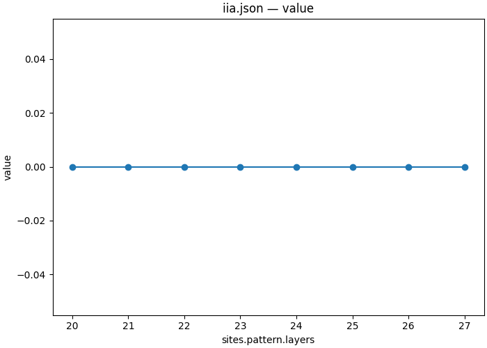
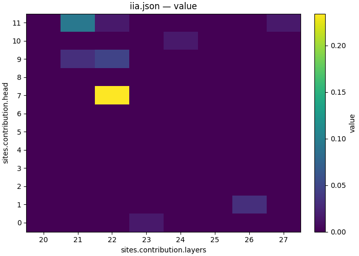

# Which head writes the answer symbol?

| Overview | |
|---|---|
| **Question** | Which attention heads of [Qwen2.5-1.5B-Instruct](https://huggingface.co/Qwen/Qwen2.5-1.5B-Instruct) at layers 20 to 27 write the answer symbol of a [multiple choice question](artifacts/data/mcqa/pairs_n64_s0.json) into the answer slot, and does the attention pattern or the moved value carry it? |
| **Method** | **Per-head interchange**: patch either a whole layer's attention pattern or one head's slice of the attention output projection's input from the counterfactual input, and read whether the model gives the counterfactual answer at the answer slot. |

## Research question

In [09](09_components.md), patching layer 22's attention output at the answer slot gave the counterfactual answer on 0.547 of 64 pairs, and layer 21's on 0.078. No other attention or MLP output moved more than two pairs. The attention output is the sum over 12 heads, so 09 does not say which heads write the symbol. [02](02_ablation_attention.md) zeroed four heads, heads 9 and 11 of layer 21 and heads 7 and 9 of layer 22, and removed the answer of one question. 02 ran the pretrained Qwen2.5-1.5B; this tutorial runs the instruction-tuned model of 05 to 10.

An attention head does two things at a position. Its **pattern** is a distribution over earlier positions, and says where the head reads. The **value** it moves is a weighted sum of what it reads from those positions. The two can be patched separately. We use the pairs and clean baselines of [06](06_localize.md).

**Q1 — Does the attention pattern carry the answer symbol?** We patch each layer's whole pattern from the counterfactual input.

**Q2 — Which heads move it into the answer slot?** We patch one head's output at a time.

## Method

Both scans cover layers 20 to 27. This band holds layer 22, where 09 found the writer, layer 26, where 06 measured the highest IIA, and layers around them where 09 measured no effect as controls.

The pattern scan patches the full attention probabilities of one layer, `attention_probs`, for every head, query and key position. A pattern is a whole matrix, so its read and write use `pos: "all"`, and the write must be a `swap` ([the intervention reference, section 2.4](../../docs/intervention_protocol.md#24-sites)). The original and counterfactual prompts of a pair have the same template and length, and differ only in the two symbol letters. A zero for this scan means that the counterfactual input's routing alone does not change the answer.

The scan has no head axis. On the `pytorch_hooks` engine, a `head` field on an `attention_probs` write is accepted but does not select a head: at layer 22, sweeping `head` over 0 and 7 gave identical per-pair results, equal to the whole-layer patch (checked on 2026-09-23).

<details>
<summary>Pattern scan specification</summary>

```json
{
  "header": {
    "protocol_version": "4",
    "description": "Interchange each layer's whole attention pattern at layers 20 to 27 on 64 MCQA pairs. Save per-pair answer matches and logit differences."
  },
  "model": {"key": "Qwen/Qwen2.5-1.5B-Instruct", "revision": "main", "dtype": "bf16"},
  "data": {
    "base": {"dataset": "mcqa/pairs_n64_s0", "field": "input"},
    "counterfactual": {"dataset": "mcqa/pairs_n64_s0", "field": "counterfactual_inputs[0]"}
  },
  "method": {
    "intervened_models": {
      "original_counterfactual": {"input": "counterfactual", "reads": ["p_cf"]},
      "patched": {"input": "base", "reads": ["logits"], "writes": ["patch"]}
    },
    "sites": {
      "pattern": {
        "component": "attention_probs",
        "layers": {
          "sweep": {"range": [20, 28]}
        }
      },
      "lm_head": {"component": "lm_head"}
    },
    "reads": {
      "p_cf": {"site": "pattern", "pos": "all"},
      "logits": {"site": "lm_head", "pos": -1}
    },
    "writes": {
      "patch": {"site": "pattern", "pos": "all", "do": {"swap": "p_cf"}}
    },
    "save": [
      {
        "read": "logits",
        "model": "patched",
        "aggregation": {"kind": "match", "expected": "cf_answer"},
        "file_path": "iia.json"
      },
      {
        "read": "logits",
        "model": "patched",
        "aggregation": {"kind": "logit_diff", "a": "cf_answer", "b": "base_answer"},
        "file_path": "logit_diff.json"
      }
    ]
  }
}
```

</details>

[protocols/mcqa_head_scan.json](protocols/mcqa_head_scan.json) is the pattern scan specification.

The head scan patches one head's output at the answer slot. `attention_premix` is the input of the attention output projection, and it has one 128-wide slice per query head. The projection is linear, so swapping one head's slice changes the attention output by exactly that head's projected contribution. `attention_result`, the per-head contribution itself, is read-only, because the model never computes it on its own. The comments mark what is new since [02](02_ablation_attention.md), which zeroed the same component:

```json
{
    "header": {
        "protocol_version": "4",
        "description": "Interchange one head's slice of the attention output projection's input at the answer slot, for 12 heads at layers 20 to 27 on 64 MCQA pairs. Save per-pair answer matches and logit differences."
    },
    "model": {"key": "Qwen/Qwen2.5-1.5B-Instruct", "revision": "main", "dtype": "bf16"},
    "data": {
        "base": {"dataset": "mcqa/pairs_n64_s0", "field": "input"},
        "counterfactual": {"dataset": "mcqa/pairs_n64_s0", "field": "counterfactual_inputs[0]"}
    },
    "method": {
        "intervened_models": {
            "original_counterfactual": {"input": "counterfactual", "reads": ["v_cf"]},
            "patched": {"input": "base", "reads": ["logits"], "writes": ["patch"]}
        },
        "positions": {"slot": {"index": -1}},
        "sites": {
            "contribution": {
                "component": "attention_premix",
                "layers": {
                    "sweep": {"range": [20, 28]}
                },
                "head": {
                    "sweep": {"range": [0, 12]} // One point per (layer, head) pair: 8 x 12 = 96
                }
            },
            "lm_head": {"component": "lm_head"}
        },
        "reads": {
            "v_cf": {"site": "contribution", "pos": "slot"}, // The head's slice on the counterfactual input
            "logits": {"site": "lm_head", "pos": -1}
        },
        "writes": {
            "patch": {"site": "contribution", "pos": "slot", "do": {"swap": "v_cf"}} // An interchange instead of 02's zero
        },
        "save": [
            {
                "read": "logits",
                "model": "patched",
                "aggregation": {"kind": "match", "expected": "cf_answer"},
                "file_path": "iia.json"
            },
            {
                "read": "logits",
                "model": "patched",
                "aggregation": {"kind": "logit_diff", "a": "cf_answer", "b": "base_answer"},
                "file_path": "logit_diff.json"
            }
        ]
    }
}
```

[protocols/mcqa_head_premix_scan.json](protocols/mcqa_head_premix_scan.json) is a copy of the head scan specification above. The model has 12 query heads over 2 key-value heads, and the head index is the query head.

## Execution

The workflow [workflows/mcqa_heads.json](workflows/mcqa_heads.json) runs both scans, plots each, and selects the head with the highest mean IIA with the `select` script that [09](09_components.md) uses.

```json
{
  "version": "1",
  "description": "Interchange each layer's attention pattern and each head's contribution at layers 20 to 27, plot both scans, and select the head with the highest interchange accuracy.",
  "output_dir": "11_attention",
  "steps": {
    "pattern_scan": {"type": "intervention_protocol", "document": "../protocols/mcqa_head_scan.json"},
    "pattern_curve": {
      "type": "script",
      "script": {"module": "causalab.io.plots.workflow_figures"},
      "inputs": {
        "table": {"step": "pattern_scan", "file": "iia.json"},
        "plot": "lines",
        "x": "sites.pattern.layers"
      },
      "outputs": {"figure": "11_attention_pattern_iia.png", "plotted": {"file": "11_attention_pattern_iia.json"}}
    },
    "result_scan": {
      "type": "intervention_protocol",
      "document": "../protocols/mcqa_head_premix_scan.json"
    },
    "grid": {
      "type": "script",
      "script": {"module": "causalab.io.plots.workflow_figures"},
      "inputs": {
        "table": {"step": "result_scan", "file": "iia.json"},
        "plot": "heatmap",
        "x": "sites.contribution.layers",
        "y": "sites.contribution.head"
      },
      "outputs": {"figure": "11_attention_head_iia.png", "plotted": {"file": "11_attention_head_iia.json"}}
    },
    "best": {
      "type": "script",
      "script": {"module": "causalab.workflow.scripts.select"},
      "inputs": {
        "table": {"step": "result_scan", "file": "iia.json"},
        "choose": "max",
        "emit": {
          "best_layer": "sites.contribution.layers",
          "best_head": "sites.contribution.head"
        }
      },
      "outputs": {
        "values": {"file": "values.json", "keys": {"best_layer": 26, "best_head": 0}}
      }
    }
  }
}
```

Run from the repository root:

```bash
uv run causalab run demos/onboarding_tutorial/workflows/mcqa_heads.json \
    --engine pytorch_hooks \
    --data-root demos/onboarding_tutorial/artifacts/data \
    --out demos/onboarding_tutorial/artifacts/output \
    --device mps
```

To check the documents without loading weights, replace `run` with `validate` and omit `--out` and `--device`.

The two scans have 8 and 96 points over 64 pairs. Writing `attention_probs` requires the eager attention path, which materializes the full (batch, head, query, key) tensor; with 12 heads and 21 tokens it is small. The run tree under `artifacts/output/11_attention/` was produced on 2026-09-28 on a MacBook Pro (Apple M5 Pro, `--device mps`) in 10 s, model loading included. A GPU with 8 GB is enough. The per-example tables of both scans are not committed; the command above writes them.

## Results

The unpatched margin on these 64 pairs is −8.23 ([06's clean baseline](artifacts/output/06_localize/clean/unpatched_logit_diff.json)). The whole attention output of layer 22 gives 0.547 IIA and a margin of +0.27 ([09](09_components.md)).

### Q1: Patching the attention pattern moves no answer



*Mean IIA over 64 pairs against the layer whose whole attention pattern is patched (`sites.pattern.layers`). The drawn values are in [11_attention_pattern_iia.json](artifacts/output/11_attention/pattern_curve/11_attention_pattern_iia.json).*

IIA is 0.000 at all eight layers. The mean margin stays between −8.25 and −7.97, within 0.26 of the unpatched −8.23; at layer 22 it is −8.23. The pairs differ only in their symbol letters, and patching where every head of a layer reads does not change the answer. On these pairs, the answer symbol reaches the answer slot through the values the heads read, which Q2 patches.

### Q2: Head 7 of layer 22 moves the most, together with the heads 02 zeroed



*Mean IIA over 64 pairs for each patched head (`sites.contribution.head`, y axis) and layer (`sites.contribution.layers`, x axis). The drawn values are in [11_attention_head_iia.json](artifacts/output/11_attention/grid/11_attention_head_iia.json).*

87 of the 96 heads give 0.000. The other nine:

| layer | head | IIA | pairs of 64 | `logit_diff` |
|---|---|---|---|---|
| 22 | 7 | **0.234** | 15 | −2.05 |
| 21 | 11 | 0.094 | 6 | −6.96 |
| 22 | 9 | 0.047 | 3 | −5.31 |
| 21 | 9 | 0.031 | 2 | −7.36 |
| 26 | 1 | 0.031 | 2 | −2.30 |
| 22 | 11 | 0.016 | 1 | −7.32 |
| 23 | 0 | 0.016 | 1 | −7.96 |
| 24 | 10 | 0.016 | 1 | −6.08 |
| 27 | 11 | 0.016 | 1 | −6.39 |

`best` selected layer 22, head 7 ([values.json](artifacts/output/11_attention/best/values.json)). That head alone gives 15 of the 35 pairs that layer 22's whole attention output moves, and moves the mean margin from −8.23 to −2.05. No single head brings the mean margin above zero.

The four heads with the highest IIA at layers 21 and 22 are head 7 of layer 22, head 11 of layer 21, head 9 of layer 22 and head 9 of layer 21. These are the four heads that [02](02_ablation_attention.md) zeroed on one question in the pretrained checkpoint, chosen there by a single-head zero-ablation sweep on another question. Here an interchange over 64 pairs in the instruction-tuned checkpoint ranks the same four first at layers 21 and 22. Head 1 of layer 26 moves only two pairs, but moves the mean margin to −2.30. In 02, the zero-ablation sweep on the pretrained checkpoint ranks this head first.

The answer is a small group of heads at layers 21 and 22, with one head that carries the largest share. The single-head scan does not show how the heads combine. Their separate IIAs add to less than 0.547, which could come from heads that only move the answer together, or from effects below one pair each.

## Next steps

- Patch the four heads of 02 together. Give the patched model four writes, one per head as in [02](02_ablation_attention.md), each a `swap` from its own counterfactual read, and compare the result with layer 22's whole attention output, 0.547. This tests whether the four heads account for the layer's effect.

- Follow along [12_steering.md](12_steering.md), which asks which layers the answer slot needs at all, and whether an averaged direction can replace the pair-specific activation.
