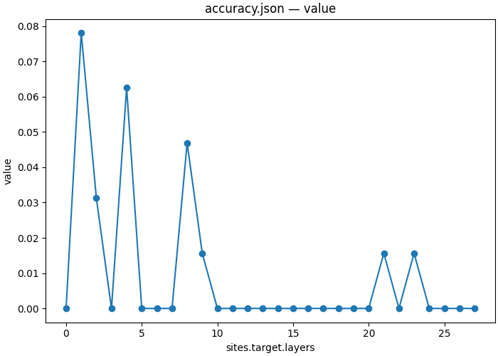
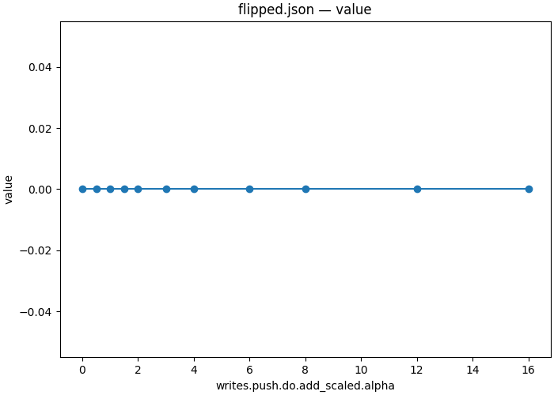

# Necessity and sufficiency

| Overview | |
|---|---|
| **Question** | At which layers does [Qwen2.5-1.5B-Instruct](https://huggingface.co/Qwen/Qwen2.5-1.5B-Instruct) need the answer slot's residual stream to answer a [multiple choice question](artifacts/data/mcqa/pairs_n64_s0.json), and does one averaged direction at block 26 give the counterfactual answer on [held-out prompts](artifacts/data/mcqa/test_n64_s2.json)? |
| **Method** | **Zero ablation and mean-difference steering**: zero the answer slot's stream at one layer, or add the mean difference between counterfactual and original activations at block 26 at eleven strengths, and read whether the model gives the original or the counterfactual answer. |

## Research question

Tutorials 05 to 11 used interchanges, where each pair supplies its own counterfactual activation. At block 26's answer slot, that gave the counterfactual answer on 0.922 of 64 pairs ([06](06_localize.md)). An interchange asks whether a component can carry the answer symbol. Two other questions remain.

Necessity asks what happens when the stream at the answer slot is removed. [01](01_ablation_MLP.md) and [02](02_ablation_attention.md) zeroed components of one prompt; here we zero the answer slot's stream at each layer, over 64 prompts.

Sufficiency with a fixed direction asks whether one vector, added to every prompt, can do what the pair-specific activation does. A **steering vector** is such a vector. We build it as the mean activation on counterfactual prompts minus the mean on original prompts, over the 128 training pairs of [07](07_subspace.md).

The ablation runs on the 64 pairs of 06, where the unpatched model answers 0.828 of the original prompts correctly. The steering runs on the test split of 07, where it answers 0.922.

**Q1 — At which layers does the model need the answer slot's stream?** We zero it at one layer at a time.

**Q2 — Does the mean-difference direction give the counterfactual answer?** We add it at block 26 with strengths from 0 to 16.

## Method

The ablation replaces the stream at the answer slot with 0 at one layer and reads whether the model still gives its original answer. The document also reads the model without writes on the same prompts, so the run measures its own clean baseline. The comments mark what is new since [06](06_localize.md):

```json
{
    "header": {
        "protocol_version": "4",
        "description": "Zero the residual stream at the answer slot one layer at a time on 64 original MCQA prompts, and measure how often the model still gives its original answer."
    },
    "model": {"key": "Qwen/Qwen2.5-1.5B-Instruct", "revision": "main", "dtype": "bf16"},
    "data": {"base": {"dataset": "mcqa/pairs_n64_s0", "field": "input"}}, // Original prompts only
    "method": {
        "intervened_models": {
            "original": {"input": "base", "reads": ["logits_clean"]}, // The clean baseline in the same run
            "ablated": {"input": "base", "reads": ["logits"], "writes": ["zero"]}
        },
        "positions": {"slot": {"index": -1}},
        "sites": {
            "target": {
                "component": "block_output",
                "layers": {
                    "sweep": {"range": [0, 28]}
                }
            },
            "lm_head": {"component": "lm_head"}
        },
        "reads": {
            "logits": {"site": "lm_head", "pos": -1},
            "logits_clean": {"site": "lm_head", "pos": -1}
        },
        "writes": {
            "zero": {"site": "target", "pos": "slot", "do": {"swap": 0.0}} // Zero ablation, as in 01 and 02
        },
        "save": [
            {
                "read": "logits",
                "model": "ablated",
                "aggregation": {"kind": "match", "expected": "base_answer"}, // Scored against the original answer
                "file_path": "accuracy.json"
            },
            {
                "read": "logits_clean",
                "model": "original",
                "aggregation": {"kind": "match", "expected": "base_answer"},
                "file_path": "accuracy_clean.json"
            }
        ]
    }
}
```

[protocols/mcqa_ablate.json](protocols/mcqa_ablate.json) is a copy of the ablation specification above.

For the direction, a harvest reads block 26's answer slot on both prompts of each training pair and saves both tensors. The script `causalab.analysis.harvest_difference` subtracts the mean over original prompts from the mean over counterfactual prompts. The direction is not normalized, so a strength α adds α times the raw mean difference.

<details>
<summary>Contrast harvest specification</summary>

```json
{
  "header": {
    "protocol_version": "4",
    "description": "Save block 26's answer-slot residual stream on both prompts of 128 training pairs, for a mean-difference direction."
  },
  "model": {"key": "Qwen/Qwen2.5-1.5B-Instruct", "revision": "main", "dtype": "bf16"},
  "data": {
    "base": {"dataset": "mcqa/train_n128_s1", "field": "input"},
    "counterfactual": {"dataset": "mcqa/train_n128_s1", "field": "counterfactual_inputs[0]"}
  },
  "method": {
    "intervened_models": {
      "original_base": {"input": "base", "reads": ["acts_base"]},
      "original_counterfactual": {"input": "counterfactual", "reads": ["acts_cf"]}
    },
    "positions": {"slot": {"index": -1}},
    "sites": {
      "target": {"component": "block_output", "layers": [26]}
    },
    "reads": {
      "acts_base": {"site": "target", "pos": "slot"},
      "acts_cf": {"site": "target", "pos": "slot"}
    },
    "save": [
      {
        "read": "acts_base",
        "model": "original_base",
        "file_path": "acts_base.safetensors"
      },
      {
        "read": "acts_cf",
        "model": "original_counterfactual",
        "file_path": "acts_cf.safetensors"
      }
    ]
  }
}
```

</details>

[protocols/mcqa_contrast_harvest.json](protocols/mcqa_contrast_harvest.json) is the contrast harvest specification.

The steering document adds the direction at block 26's answer slot on each held-out original prompt. It scores two answers: the original one, and the counterfactual one from the same row of the pair table. The comments mark what is new:

```json
{
    "header": {
        "protocol_version": "4",
        "description": "Add the mean-difference direction to block 26's answer slot at eleven strengths on 64 held-out original prompts. Measure how often the model gives its original answer and the counterfactual answer."
    },
    "model": {"key": "Qwen/Qwen2.5-1.5B-Instruct", "revision": "main", "dtype": "bf16"},
    "data": {"base": {"dataset": "mcqa/test_n64_s2", "field": "input"}},
    "method": {
        "intervened_models": {
            "steered": {"input": "base", "reads": ["logits"], "writes": ["push"]}
        },
        "positions": {"slot": {"index": -1}},
        "sites": {
            "target": {"component": "block_output", "layers": [26]},
            "lm_head": {"component": "lm_head"}
        },
        "params": {
            "steer": {"file_path": "direction/direction.safetensors", "entry": {"slot": "weight"}}
                                        // The direction step's output, loaded as in 10
        },
        "reads": {"logits": {"site": "lm_head", "pos": -1}},
        "writes": {
            "push": {
                "site": "target",
                "pos": "slot",
                "do": {
                    "add_scaled": {     // Adds alpha times the operand to the activation
                        "op": "steer",
                        "alpha": {"sweep": [0.0, 0.5, 1.0, 1.5, 2.0, 3.0, 4.0, 6.0, 8.0, 12.0, 16.0]}
                                        // alpha = 0 is the model without steering
                    }
                }
            }
        },
        "save": [
            {
                "read": "logits",
                "model": "steered",
                "aggregation": {"kind": "match", "expected": "base_answer"},
                "file_path": "accuracy.json"
            },
            {
                "read": "logits",
                "model": "steered",
                "aggregation": {"kind": "match", "expected": "cf_answer"},
                "file_path": "flipped.json" // Each row's own counterfactual answer
            }
        ]
    }
}
```

[protocols/mcqa_steer.json](protocols/mcqa_steer.json) is a copy of the steering specification above.

The `different_symbol` design draws new symbols for each pair, so each pair's difference points from its own original symbol to its own counterfactual symbol. A mean over 128 such differences holds what the pairs share, not a specific letter. A held-out row's counterfactual answer is a letter the direction was never built for. So the design predicts that the direction does not give the counterfactual answer, and the steering arm tests that prediction. A zero ablation, in turn, removes everything the stream carries at that position, not only the answer symbol, and puts the model in a state it does not reach on real inputs.

## Execution

The workflow [workflows/mcqa_steering.json](workflows/mcqa_steering.json) runs the ablation and plots it, and runs the harvest, the direction script and the steering sweep and plots the counterfactual-answer rate. The two arms share no file, so the runner can run them in either order.

<details>
<summary>The workflow</summary>

```json
{
  "version": "1",
  "description": "Zero the answer slot layer by layer and plot accuracy. Build a mean-difference direction at block 26, add it at eleven strengths, and plot how often the counterfactual answer appears.",
  "output_dir": "12_steering",
  "steps": {
    "ablate": {"type": "intervention_protocol", "document": "../protocols/mcqa_ablate.json"},
    "ablation_curve": {
      "type": "script",
      "script": {"module": "causalab.io.plots.workflow_figures"},
      "inputs": {
        "table": {"step": "ablate", "file": "accuracy.json"},
        "plot": "lines",
        "x": "sites.target.layers"
      },
      "outputs": {"figure": "12_steering_ablation.png", "plotted": {"file": "12_steering_ablation.json"}}
    },
    "harvest": {
      "type": "intervention_protocol",
      "document": "../protocols/mcqa_contrast_harvest.json"
    },
    "direction": {
      "type": "script",
      "script": {"module": "causalab.analysis.harvest_difference"},
      "inputs": {
        "positive": {"step": "harvest", "file": "acts_cf.safetensors"},
        "negative": {"step": "harvest", "file": "acts_base.safetensors"},
        "normalize": false
      },
      "outputs": {
        "weight": "direction.safetensors",
        "stats": {"file": "stats.json", "columns": {"dim": "int64", "value": "float64"}}
      }
    },
    "steer": {"type": "intervention_protocol", "document": "../protocols/mcqa_steer.json"},
    "steer_curve": {
      "type": "script",
      "script": {"module": "causalab.io.plots.workflow_figures"},
      "inputs": {
        "table": {"step": "steer", "file": "flipped.json"},
        "plot": "lines",
        "x": "writes.push.do.add_scaled.alpha"
      },
      "outputs": {"figure": "12_steering_steer.png", "plotted": {"file": "12_steering_steer.json"}}
    }
  }
}
```

</details>

Run from the repository root:

```bash
uv run causalab run demos/onboarding_tutorial/workflows/mcqa_steering.json \
    --engine pytorch_hooks \
    --data-root demos/onboarding_tutorial/artifacts/data \
    --out demos/onboarding_tutorial/artifacts/output \
    --device mps
```

To check the documents without loading weights, replace `run` with `validate` and omit `--out` and `--device`.

The ablation is 28 points over 64 prompts, the harvest one forward pass over each half of 128 pairs, and the steering sweep 11 points over 64 prompts. The run tree under `artifacts/output/12_steering/` was produced on 2026-09-28 on a MacBook Pro (Apple M5 Pro, `--device mps`) in 8 s, model loading included. A GPU with 8 GB is enough. The harvested tensors and the direction are not committed; the command above writes them.

## Results

### Q1: The model needs the answer slot's stream at every layer



*Fraction of 64 prompts on which the model still gives its original answer, against the layer (`sites.target.layers`) at which the answer slot's stream is zeroed. The clean value is 0.828 at every layer. The drawn values are in [12_steering_ablation.json](artifacts/output/12_steering/ablation_curve/12_steering_ablation.json).*

The clean accuracy the document measures is 0.828, 53 of 64, the same value 06 measured ([ablate/accuracy_clean.json](artifacts/output/12_steering/ablate/accuracy_clean.json)). Zeroing the stream at any single layer brings accuracy to 0.078 or below:

| layers | 0 | 1 | 2 | 3 | 4 | 5–7 | 8 | 9 | 10–20 | 21 | 22 | 23 | 24–27 |
|---|---|---|---|---|---|---|---|---|---|---|---|---|---|
| accuracy | 0.000 | 0.078 | 0.031 | 0.000 | 0.062 | 0.000 | 0.047 | 0.016 | 0.000 | 0.016 | 0.000 | 0.016 | 0.000 |

At 21 of the 28 layers, the model gives its original answer on none of the 64 prompts, and no layer keeps more than 5. The layers after 22 matter as much as the earlier ones, although 09 found no component writing the answer symbol there. This result is about the whole stream at one position. It does not separate the answer symbol from everything else the answer slot carries.

### Q2: The mean-difference direction never gives the counterfactual answer



*Fraction of 64 held-out prompts on which the model gives the row's counterfactual answer, against the steering strength α (`writes.push.do.add_scaled.alpha`). The drawn values are in [12_steering_steer.json](artifacts/output/12_steering/steer_curve/12_steering_steer.json).*

| α | 0 | 0.5 | 1 | 1.5 | 2 | 3 | 4 | 6 | 8 | 12 | 16 |
|---|---|---|---|---|---|---|---|---|---|---|---|
| counterfactual answer | 0.000 | 0.000 | 0.000 | 0.000 | 0.000 | 0.000 | 0.000 | 0.000 | 0.000 | 0.000 | 0.000 |
| original answer | 0.922 | 0.922 | 0.906 | 0.906 | 0.906 | 0.906 | 0.906 | 0.859 | 0.828 | 0.766 | 0.641 |

The values come from [steer/flipped.json](artifacts/output/12_steering/steer/flipped.json) and [steer/accuracy.json](artifacts/output/12_steering/steer/accuracy.json). At α = 0, the original-answer rate is 0.922, the clean value 07 measured on the same prompts, which checks the sweep's control.

The direction gives the counterfactual answer on none of the 64 prompts at any strength, as the design predicts. From α = 6 on, it lowers the original-answer rate, to 0.641 at α = 16, and the prompts it changes give neither the original nor the counterfactual answer. The direction's norm is 4.56 ([direction/stats.json](artifacts/output/12_steering/direction/stats.json)). The standard deviation of the stream along its first principal component at the same component is 17.6 ([08](08_variance_vs_cause.md)), so α = 16 adds a vector about four times that spread.

The interchange at the same component moves the answer on 0.922 of pairs because each pair supplies its own counterfactual symbol. An average over pairs with different symbols does not. This is one way of building a direction. A contrast whose two classes are fixed across pairs, such as `answer_position`, could give a direction that steers, and this tutorial does not test it.

## Next steps

- Build the direction from a contrast with fixed classes. Split the training prompts by `answer_position`, harvest each group, and steer toward the other position. This tests whether a mean difference can steer a variable whose values repeat across pairs.
