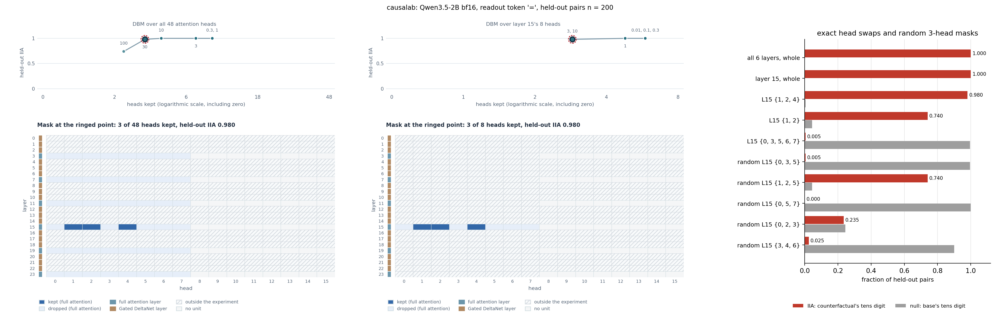
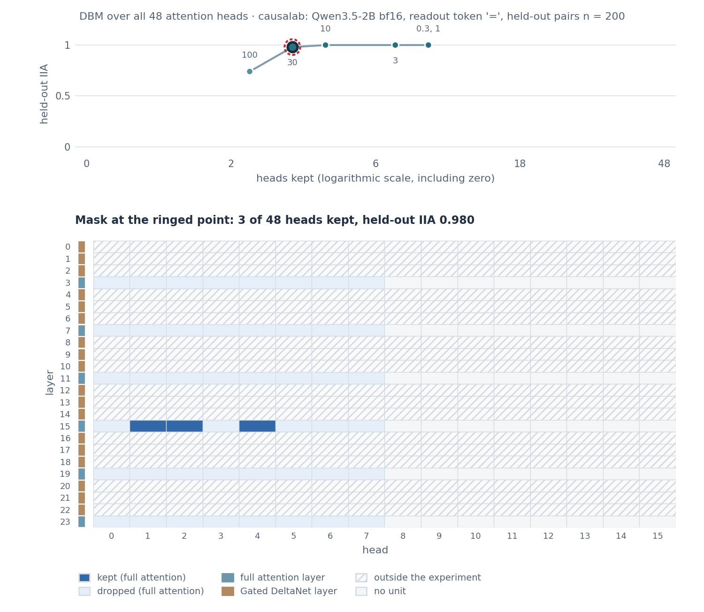
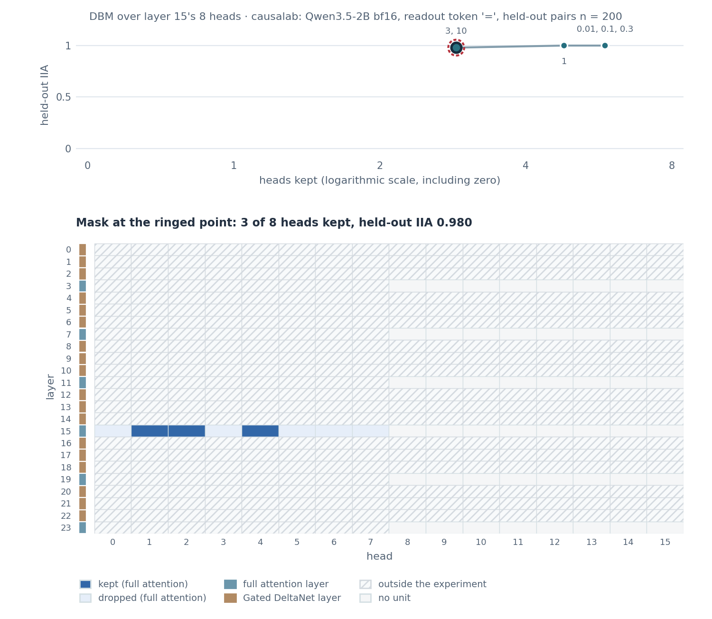
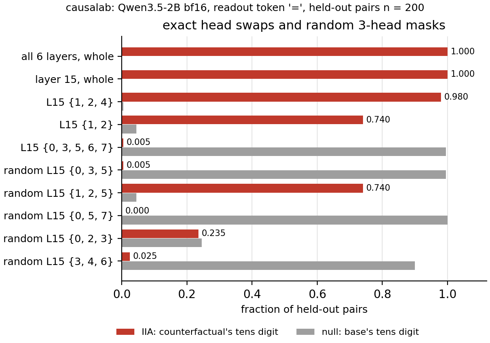

# Desiderata-based masking over attention heads

> Davies et al. **Discovering Variable Binding Circuitry with Desiderata.**
> [[arXiv]](https://arxiv.org/abs/2307.03637)

**Figure context:**

- Qwen3.5-2B completes two-digit additions such as `43+35=` and reads the
  answer out at the `=` token.
- Which attention heads bring the answer's first digit, its tens digit, to `=`?
- Desiderata-based masking (DBM) learns one weight per head. The weight
  decides whether that head's output at `=` comes from a second problem
  with a different tens digit. Training asks the model to answer with the
  second problem's tens digit, and an L1 penalty makes the mask keep few heads.
- We give the mask all 48 heads of the six full-attention layers and do not
  tell it which layer to use. A second fit searches layer 15 alone, and
  exact swaps check the heads the masks keep.



*Figure 1: Attention heads that carry the tens digit of `NN+MM=` in
Qwen3.5-2B. Left and centre: the held-out interchange intervention accuracy
(IIA) of each fitted mask, how often the answer becomes the second problem's
tens digit, over the number of heads it keeps, and below it the heads that
the ringed mask keeps (dark blue). Right: exact swaps of fixed head sets and
of five random 3-head sets, with the null rate, how often the base answer
survives. All scores are on 200 held-out pairs.*

## CausaLab implementation

Let's walk through the specification for the mask over all 48 heads (Figure 1,
left) in CausaLab. Expand the dropdown to see the full implementation.

<details>
<summary><b>Full JSON</b></summary>

```json
{
  "header": {
    "protocol_version": "4",
    "description": "Desiderata-based masking (Davies et al. 2023, arXiv:2307.03637) over all 48 attention heads of Qwen/Qwen3.5-2B at the readout token '=' of NN+MM=: one head-grouped sigmoid gate per full-attention layer (3, 7, 11, 15, 19, 23) on attention_premix, trained so that swapping the kept heads from the counterfactual problem makes the model answer the counterfactual's tens digit, with one L1 over all six gates swept over six weights; addition_heads_dbm_apply_all.json scores each saved mask on the held-out split and workflows/scripts/addition_heads_dbm/heads_figure.py draws the kept heads."
  },
  "model": {"key": "Qwen/Qwen3.5-2B", "revision": "main", "dtype": "bf16"},
  "data": {
    "base": {"dataset": "addition_heads_dbm/data#train", "field": "input"},
    "counterfactual": {"dataset": "addition_heads_dbm/data#train", "field": "counterfactual_inputs[0]"}
  },
  "method": {
    "intervened_models": {
      "original_counterfactual": {
        "input": "counterfactual",
        "reads": ["v_cf_3", "v_cf_7", "v_cf_11", "v_cf_15", "v_cf_19", "v_cf_23"]
      },
      "masked": {
        "input": "base",
        "reads": ["logits"],
        "writes": ["mask_3", "mask_7", "mask_11", "mask_15", "mask_19", "mask_23"]
      }
    },
    "sites": {
      "l3": {"component": "attention_premix", "layers": [3]},
      "l7": {"component": "attention_premix", "layers": [7]},
      "l11": {"component": "attention_premix", "layers": [11]},
      "l15": {"component": "attention_premix", "layers": [15]},
      "l19": {"component": "attention_premix", "layers": [19]},
      "l23": {"component": "attention_premix", "layers": [23]},
      "lm_head": {"component": "lm_head"}
    },
    "featurizers": {
      "gate_3": {"kind": "gate", "group": "head"},
      "gate_7": {"kind": "gate", "group": "head"},
      "gate_11": {"kind": "gate", "group": "head"},
      "gate_15": {"kind": "gate", "group": "head"},
      "gate_19": {"kind": "gate", "group": "head"},
      "gate_23": {"kind": "gate", "group": "head"}
    },
    "reads": {
      "v_cf_3": {"site": "l3", "pos": -1, "featurizer": "gate_3"},
      "v_cf_7": {"site": "l7", "pos": -1, "featurizer": "gate_7"},
      "v_cf_11": {"site": "l11", "pos": -1, "featurizer": "gate_11"},
      "v_cf_15": {"site": "l15", "pos": -1, "featurizer": "gate_15"},
      "v_cf_19": {"site": "l19", "pos": -1, "featurizer": "gate_19"},
      "v_cf_23": {"site": "l23", "pos": -1, "featurizer": "gate_23"},
      "logits": {"site": "lm_head", "pos": -1}
    },
    "writes": {
      "mask_3": {"site": "l3", "pos": -1, "featurizer": "gate_3", "do": {"swap": "v_cf_3"}},
      "mask_7": {"site": "l7", "pos": -1, "featurizer": "gate_7", "do": {"swap": "v_cf_7"}},
      "mask_11": {"site": "l11", "pos": -1, "featurizer": "gate_11", "do": {"swap": "v_cf_11"}},
      "mask_15": {"site": "l15", "pos": -1, "featurizer": "gate_15", "do": {"swap": "v_cf_15"}},
      "mask_19": {"site": "l19", "pos": -1, "featurizer": "gate_19", "do": {"swap": "v_cf_19"}},
      "mask_23": {"site": "l23", "pos": -1, "featurizer": "gate_23", "do": {"swap": "v_cf_23"}}
    },
    "train": {
      "objective": {
        "ce": {
          "weight": 1.0,
          "read": "logits",
          "model": "masked",
          "aggregation": {"kind": "cross_entropy", "target": "label"}
        },
        "sparsity": {
          "weight": {"sweep": [0.3, 1.0, 3.0, 10.0, 30.0, 100.0]},
          "l1": ["gate_3", "gate_7", "gate_11", "gate_15", "gate_19", "gate_23"]
        }
      },
      "params": ["gate_3", "gate_7", "gate_11", "gate_15", "gate_19", "gate_23"],
      "optimizer": {"name": "adamw", "lr": 0.01, "weight_decay": 0.0},
      "steps": {"epochs": 20},
      "batch": {"pairs": 16},
      "anneal": {
        "gate_3.theta.temperature": [1.0, 0.01, 0.5],
        "gate_7.theta.temperature": [1.0, 0.01, 0.5],
        "gate_11.theta.temperature": [1.0, 0.01, 0.5],
        "gate_15.theta.temperature": [1.0, 0.01, 0.5],
        "gate_19.theta.temperature": [1.0, 0.01, 0.5],
        "gate_23.theta.temperature": [1.0, 0.01, 0.5]
      },
      "precision": {"feature": "fp32", "loss": "fp32"},
      "seed": 0
    },
    "save": [
      {"value": "gate_3", "site": "l3", "file_path": "gate_3.safetensors"},
      {"value": "gate_7", "site": "l7", "file_path": "gate_7.safetensors"},
      {"value": "gate_11", "site": "l11", "file_path": "gate_11.safetensors"},
      {"value": "gate_15", "site": "l15", "file_path": "gate_15.safetensors"},
      {"value": "gate_19", "site": "l19", "file_path": "gate_19.safetensors"},
      {"value": "gate_23", "site": "l23", "file_path": "gate_23.safetensors"}
    ]
  }
}
```

</details>

### Load the model and the training pairs

```json
"model": {"key": "Qwen/Qwen3.5-2B", "revision": "main", "dtype": "bf16"},
"data": {
    "base": {"dataset": "addition_heads_dbm/data#train", "field": "input"},  // 160 pairs such as 43+35= with 26+39=
    "counterfactual": {"dataset": "addition_heads_dbm/data#train", "field": "counterfactual_inputs[0]"}
}
```

### Define the counterfactual run and the masked run

```json
"intervened_models": {
    "original_counterfactual": {
        "input": "counterfactual",
        "reads": ["v_cf_3", "v_cf_7", "v_cf_11", "v_cf_15", "v_cf_19", "v_cf_23"]
    },
    "masked": {
        "input": "base",
        "reads": ["logits"],
        "writes": ["mask_3", "mask_7", "mask_11", "mask_15", "mask_19", "mask_23"]
    }
}
```

### Select the head outputs of the six full-attention layers

```json
"sites": {
    "l3": {"component": "attention_premix", "layers": [3]},  // the o-projection's input: 8 heads x 256, head by head
    "l7": {"component": "attention_premix", "layers": [7]},
    "l11": {"component": "attention_premix", "layers": [11]},
    "l15": {"component": "attention_premix", "layers": [15]},
    "l19": {"component": "attention_premix", "layers": [19]},
    "l23": {"component": "attention_premix", "layers": [23]},  // the other 18 layers are Gated DeltaNet layers, with no heads here
    "lm_head": {"component": "lm_head"}
}
```

### Define reads: the counterfactual's head outputs at `=` and the masked run's logits

```json
"reads": {
    "v_cf_3": {"site": "l3", "pos": -1, "featurizer": "gate_3"},  // pos -1 is the "=" token
    "v_cf_7": {"site": "l7", "pos": -1, "featurizer": "gate_7"},
    "v_cf_11": {"site": "l11", "pos": -1, "featurizer": "gate_11"},
    "v_cf_15": {"site": "l15", "pos": -1, "featurizer": "gate_15"},
    "v_cf_19": {"site": "l19", "pos": -1, "featurizer": "gate_19"},
    "v_cf_23": {"site": "l23", "pos": -1, "featurizer": "gate_23"},
    "logits": {"site": "lm_head", "pos": -1}
}
```

### Define writes: swap in the heads each gate keeps

```json
"writes": {
    "mask_3": {"site": "l3", "pos": -1, "featurizer": "gate_3", "do": {"swap": "v_cf_3"}},
    "mask_7": {"site": "l7", "pos": -1, "featurizer": "gate_7", "do": {"swap": "v_cf_7"}},
    "mask_11": {"site": "l11", "pos": -1, "featurizer": "gate_11", "do": {"swap": "v_cf_11"}},
    "mask_15": {"site": "l15", "pos": -1, "featurizer": "gate_15", "do": {"swap": "v_cf_15"}},
    "mask_19": {"site": "l19", "pos": -1, "featurizer": "gate_19", "do": {"swap": "v_cf_19"}},
    "mask_23": {"site": "l23", "pos": -1, "featurizer": "gate_23", "do": {"swap": "v_cf_23"}}
}
```

### Define one gate per layer with one weight per head, and train all 48 weights together

```json
"featurizers": {
    "gate_3": {"kind": "gate", "group": "head"},  // group head: one theta per head, shared by its 256 coordinates
    "gate_7": {"kind": "gate", "group": "head"},
    "gate_11": {"kind": "gate", "group": "head"},
    "gate_15": {"kind": "gate", "group": "head"},
    "gate_19": {"kind": "gate", "group": "head"},
    "gate_23": {"kind": "gate", "group": "head"}
},
"train": {
    "objective": {
        "ce": {
            "weight": 1.0,
            "read": "logits",
            "model": "masked",
            "aggregation": {"kind": "cross_entropy", "target": "label"}  // label: the counterfactual's tens digit
        },
        "sparsity": {
            "weight": {"sweep": [0.3, 1.0, 3.0, 10.0, 30.0, 100.0]},  // sweep: a separate fit per L1 weight
            "l1": ["gate_3", "gate_7", "gate_11", "gate_15", "gate_19", "gate_23"]  // one penalty: the mean mask over all 48 heads
        }
    },
    "params": ["gate_3", "gate_7", "gate_11", "gate_15", "gate_19", "gate_23"],
    "optimizer": {"name": "adamw", "lr": 0.01, "weight_decay": 0.0},
    "steps": {"epochs": 20},
    "batch": {"pairs": 16},
    "anneal": {
        "gate_3.theta.temperature": [1.0, 0.01, 0.5],  // the sigmoid sharpens over the first half of training
        "gate_7.theta.temperature": [1.0, 0.01, 0.5],
        "gate_11.theta.temperature": [1.0, 0.01, 0.5],
        "gate_15.theta.temperature": [1.0, 0.01, 0.5],
        "gate_19.theta.temperature": [1.0, 0.01, 0.5],
        "gate_23.theta.temperature": [1.0, 0.01, 0.5]
    },
    "precision": {"feature": "fp32", "loss": "fp32"},
    "seed": 0
}
```

### Save the fitted gates

```json
"save": [
    {"value": "gate_3", "site": "l3", "file_path": "gate_3.safetensors"},  // one theta entry per L1 weight
    {"value": "gate_7", "site": "l7", "file_path": "gate_7.safetensors"},
    {"value": "gate_11", "site": "l11", "file_path": "gate_11.safetensors"},
    {"value": "gate_15", "site": "l15", "file_path": "gate_15.safetensors"},
    {"value": "gate_19", "site": "l19", "file_path": "gate_19.safetensors"},
    {"value": "gate_23", "site": "l23", "file_path": "gate_23.safetensors"}
]
```

Given the specification, CausaLab produces:



*The mask finds layer 15 without being told the layer. At weight 3 it keeps
six layer-15 heads and head 6 of layer 23, and from weight 10 only layer-15
heads: {1, 2, 3, 4} at IIA 1.000, {1, 2, 4} at 0.980 at weight 30, and
{1, 2} at 0.740 at weight 100. The matrix shows the ringed mask of weight 30.
Each point is one fit with seed 0.*

## Layer 15 alone and the checks: change these lines

The layer-15 fit is the sibling document
[`addition_heads_dbm_fit_l15.json`](protocols/addition_heads_dbm_fit_l15.json):
one site and one gate in place of six, and a lighter L1 grid, because the
penalty is a mean over 8 heads in place of 48. The checks come from
[`addition_heads_dbm_swaps.json`](protocols/addition_heads_dbm_swaps.json),
which swaps fixed head sets with no gate, and from the layer-15 apply document
loaded with random masks.

### Layer 15 alone

```diff
-    "l3": {"component": "attention_premix", "layers": [3]},
-    "l7": {"component": "attention_premix", "layers": [7]},
-    "l11": {"component": "attention_premix", "layers": [11]},
-    "l15": {"component": "attention_premix", "layers": [15]},
-    "l19": {"component": "attention_premix", "layers": [19]},
-    "l23": {"component": "attention_premix", "layers": [23]},
+    "target": {"component": "attention_premix", "layers": [15]},
-    "gate_3": {"kind": "gate", "group": "head"},
-    "gate_7": {"kind": "gate", "group": "head"},
-    "gate_11": {"kind": "gate", "group": "head"},
-    "gate_15": {"kind": "gate", "group": "head"},
-    "gate_19": {"kind": "gate", "group": "head"},
-    "gate_23": {"kind": "gate", "group": "head"}
+    "gate": {"kind": "gate", "group": "head"}
-    "weight": {"sweep": [0.3, 1.0, 3.0, 10.0, 30.0, 100.0]},
+    "weight": {"sweep": [0.01, 0.1, 0.3, 1.0, 3.0, 10.0]},
```



*Over layer 15's eight heads the mask keeps {0, 1, 2, 3, 4, 7} up to weight
0.3, {0, 1, 2, 3, 4} at weight 1, and {1, 2, 4} at weights 3 and 10, with IIA
0.980. The largest set and {1, 2, 4} match the 48-head fit's layer-15 sets.
{0, 1, 2, 3, 4} appears only in this fit, and {1, 2, 3, 4} and {1, 2} appear
only in the 48-head fit. The matrix shows the ringed mask of weight 3.*

### Exact swaps and random masks

```diff
-    "l15": {"component": "attention_premix", "layers": [15]},
+    "h1": {"component": "attention_premix", "layers": [15], "head": 1},
+    "h2": {"component": "attention_premix", "layers": [15], "head": 2},
+    "h4": {"component": "attention_premix", "layers": [15], "head": 4},
-    "mask_15": {"site": "l15", "pos": -1, "featurizer": "gate_15", "do": {"swap": "v_cf_15"}},
+    "patch_h1": {"site": "h1", "pos": -1, "do": {"swap": "v_cf_h1"}},
+    "s124": {"input": "base", "reads": ["logits_s124"], "writes": ["patch_h1", "patch_h2", "patch_h4"]},
```



*Swapping the whole attention output of layer 15, or of all six layers, gives
IIA 1.000. The exact swap of {1, 2, 4} gives 0.980 and its complement
{0, 3, 5, 6, 7} gives 0.005. None of the five random 3-head sets reaches
{1, 2, 4}. These five draws cover 5 of the 56 three-head sets of layer 15. The
best draw, {1, 2, 5}, contains heads 1 and 2 and scores 0.740, the score of
{1, 2} alone.*

## Further Details

<details>
<summary><b>Method</b></summary>

**The mask.** Each head *h* of a gate has a weight θ. During training the
masked run takes σ(θ/T)·x_cf + (1 − σ(θ/T))·x_base on every coordinate of that
head, where the temperature T falls from 1 to 0.01. The loss is the
cross-entropy of the counterfactual's tens digit plus the L1 weight times the
mean mask. After training a head is kept when θ > 0, and the apply documents
swap exactly the kept heads. `fit_diagnostics.json` beside each fit reports
a decisive fraction of 1.000 at every point: no θ ends near 0.

**Data.** Each pair has two problems whose tens digits differ, with tens
digits 1 to 4 in the operands. The 1600 problems are split 80/20 before
pairing, so no training prompt appears in a held-out pair. There are 160
training pairs and 200 held-out pairs.

**Held-out size.** An earlier version of this experiment scored 40 held-out
pairs. Those 40 pairs are the first 40 of the 200 here, and on them this run
gives the same numbers as the earlier one: {1, 2, 4} 0.975, {1, 2} 0.625 (null
0.050), the complement 0.000. On all 200 pairs the numbers are 0.980, 0.740
(null 0.045) and 0.005. The earlier random 3-head draws are the same five sets.
On 40 pairs they scored at most 0.625, and on 200 pairs at most 0.740.

</details>

<details>
<summary><b>Execution</b>: environment, run command, flags, resources, workflow</summary>

**Environment.** `Qwen/Qwen3.5-2B` is an open checkpoint under the Apache 2.0
license and needs no token. The first run downloads 4.3 GB of bf16 weights or
reads them from a cache:

```bash
export HF_HUB_CACHE=/path/to/cache  # optional: a cache that already holds Qwen/Qwen3.5-2B
```

**Run.** From `demos/papers/`, run the workflow, then draw the figure, which
needs no accelerator:

```bash
causalab run workflows/addition_heads_dbm.json \
    --engine auto \
    --data-root artifacts/data \
    --out artifacts/output \
    --device cuda
python workflows/scripts/addition_heads_dbm/heads_figure.py
```

**Flags.** `--data-root` is the folder that dataset references resolve
against, so `addition_heads_dbm/data` reads
`artifacts/data/addition_heads_dbm/data.json`. `--out artifacts/output` puts
the run tree under `artifacts/output/addition_heads_dbm/`, the workflow's
`output_dir`. The figure script reads the fits, the apply steps and `swaps/`
there and writes `heads_all.png`, one image per panel and
`heads_plotted.json` to `artifacts/figures/addition_heads_dbm/`. Every
document pins `bf16`, and a workflow refuses `--dtype`. `--resume` makes a
resubmission reuse every step whose recorded digests still match. On an
Apple-silicon laptop pass `--device mps`. Replace `run` with `validate` and
drop the run-only flags to check the documents without loading weights.

**Resources and reproducibility.** The run needs an accelerator that holds
Qwen3.5-2B in bf16, 4.3 GB of weights, and gradients for at most 48 gate weights. The
committed figures come from one run on one H100 on 2026-09-28, in bf16 with
the `pytorch_hooks` engine. The whole
workflow took 75 s. A laptop run with `--device mps` is not measured here.

**Workflow.** [`workflows/addition_heads_dbm.json`](workflows/addition_heads_dbm.json)
runs, in order: `swaps`
([`protocols/addition_heads_dbm_swaps.json`](protocols/addition_heads_dbm_swaps.json)),
the exact swaps; `fit_all`, the document above, and six `apply_all_<w>` steps
([`protocols/addition_heads_dbm_apply_all.json`](protocols/addition_heads_dbm_apply_all.json)),
which load the six gates at one L1 weight each and score them on the held-out
pairs; `fit_l15`
([`protocols/addition_heads_dbm_fit_l15.json`](protocols/addition_heads_dbm_fit_l15.json))
and six `apply_l15_<w>` steps
([`protocols/addition_heads_dbm_apply_l15.json`](protocols/addition_heads_dbm_apply_l15.json));
then five `random_<s>` steps (`causalab.analysis.random_mask`, seeds 0 to 4),
which draw three of layer 15's heads uniformly, and five `apply_random_<s>`
steps, which score each draw through the layer-15 apply document. Davies et
al. use the method on a variable-binding task. This package uses it on
another model and task, so there is no figure of theirs to compare with.

</details>

<details>
<summary><b>Intervention protocol parameters</b>: what to change for a different task, model or grid</summary>

| field | here | to change |
|---|---|---|
| `model.key` | `Qwen/Qwen3.5-2B` | any registered causal LM; the sites follow its full-attention layers |
| `data.base.dataset` | `addition_heads_dbm/data#train` | another table with `input`, `counterfactual_inputs` and `label` columns and a held-out split |
| `sites.l<n>.layers` | one full-attention layer per site | the layers to search; one site, read, write and gate per layer |
| `sites.l<n>.component` | `attention_premix` | `delta_premix` to mask the value heads of a Gated DeltaNet layer |
| `featurizers.gate_<n>.group` | `head` | omit for one weight per coordinate |
| `train.objective.sparsity.weight` | `sweep` of six weights | the grid; each kept head costs weight / 48 |
| `train.objective.ce.aggregation.target` | `label` | the column that holds the answer the swap should produce |

[The intervention reference](../../docs/intervention_protocol.md) defines
every field.

</details>
