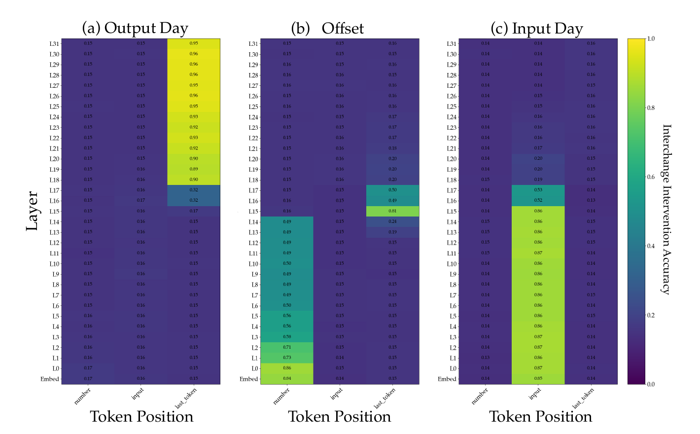
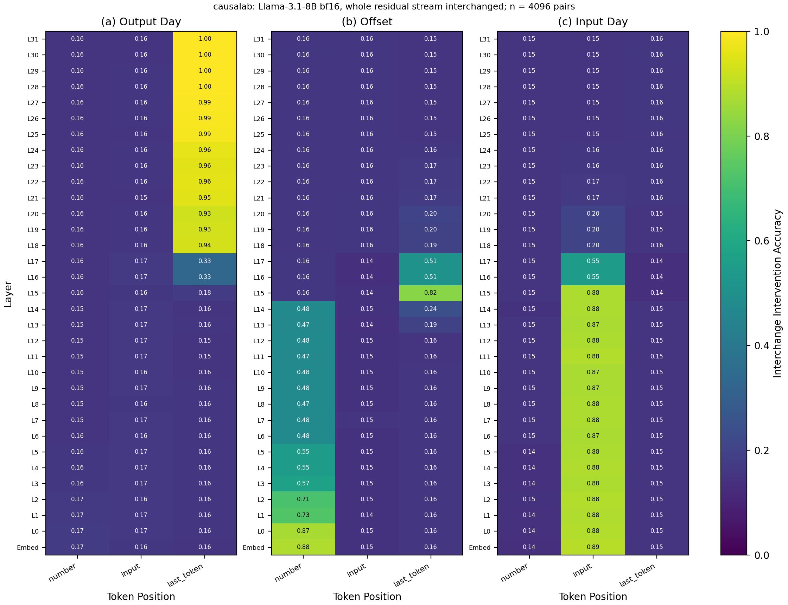

# Residual stream patching over depth and position

> Feucht et al. **Arithmetic in the Wild: Llama uses Base-10 Addition to
> Reason About Cyclic Concepts.** [[arXiv]](https://arxiv.org/abs/2605.01148)

**Figure context:**

- Llama-3.1-8B answers `Q: What day is eight days after Thursday?` with
  ` Friday`.
- Where in the model do the input day, the offset and the output day live?
- We copy the whole hidden state of a second prompt into the first at one
  depth of the residual stream and one token. Then we check whether the
  answer changes as if one variable alone had changed, the interchange
  intervention accuracy (IIA).
- One patched forward per depth and token is scored three times, once
  against the answer each variable predicts. That gives one heatmap per
  variable.
- [The Figure 2a replication](arithmetic_fig2a.md) learns a subspace for the
  first operand of `a+b=` with the same model.

### Original



### Replication



*Figure 1: Localization of three task variables in Llama-3.1-8B:
`Q: What day is eight days after Thursday?` --> ` Friday`. IIA over depth
(rows) and token position (columns) after the whole residual stream is
copied in from the counterfactual prompt, over the paper's 4096 pairs
([values](artifacts/figures/arithmetic_fig15/fig15_plotted.json)). Each
transition sits at the paper's layer, such as the output day at the last
token from L18 (0.937, paper 0.90). Of the 297 values, 135 differ from the
paper's by more than 0.007, up to 0.050, and four features of the paper's
figure do not appear here (Method).*

## CausaLab implementation

Let's walk through the specification for running the residual-stream
patching experiment (Figure 1, all three panels) in CausaLab. Expand the
dropdown to see the full implementation.

<details>
<summary><b>Full JSON</b></summary>

```json
{
  "header": {
    "protocol_version": "4",
    "description": "Figure 15 of Feucht et al. 2026 (arXiv:2605.01148): at one depth of the residual stream and one token position of the weekdays task, the whole hidden state of the counterfactual prompt replaces the base prompt's, and the one patched forward is scored against the three variables' labels, one IIA table per panel; workflows/scripts/arithmetic_fig15/fig15_figure.py draws them."
  },
  "model": {"key": "meta-llama/Llama-3.1-8B", "revision": "d04e592bb4f6aa9cfee91e2e20afa771667e1d4b", "dtype": "bf16"},
  "data": {
    "base": {"dataset": "arithmetic_fig15/data", "field": "input"},
    "counterfactual": {"dataset": "arithmetic_fig15/data", "field": "counterfactual_inputs[0]"}
  },
  "axes": {
    "depth": {
      "rows": [
        {"depth": 0, "layers": 0, "component": "block_input"},
        {"depth": 1, "layers": 0, "component": "block_output"},
        {"depth": 2, "layers": 1, "component": "block_output"},
        {"depth": 3, "layers": 2, "component": "block_output"},
        {"depth": 4, "layers": 3, "component": "block_output"},
        {"depth": 5, "layers": 4, "component": "block_output"},
        {"depth": 6, "layers": 5, "component": "block_output"},
        {"depth": 7, "layers": 6, "component": "block_output"},
        {"depth": 8, "layers": 7, "component": "block_output"},
        {"depth": 9, "layers": 8, "component": "block_output"},
        {"depth": 10, "layers": 9, "component": "block_output"},
        {"depth": 11, "layers": 10, "component": "block_output"},
        {"depth": 12, "layers": 11, "component": "block_output"},
        {"depth": 13, "layers": 12, "component": "block_output"},
        {"depth": 14, "layers": 13, "component": "block_output"},
        {"depth": 15, "layers": 14, "component": "block_output"},
        {"depth": 16, "layers": 15, "component": "block_output"},
        {"depth": 17, "layers": 16, "component": "block_output"},
        {"depth": 18, "layers": 17, "component": "block_output"},
        {"depth": 19, "layers": 18, "component": "block_output"},
        {"depth": 20, "layers": 19, "component": "block_output"},
        {"depth": 21, "layers": 20, "component": "block_output"},
        {"depth": 22, "layers": 21, "component": "block_output"},
        {"depth": 23, "layers": 22, "component": "block_output"},
        {"depth": 24, "layers": 23, "component": "block_output"},
        {"depth": 25, "layers": 24, "component": "block_output"},
        {"depth": 26, "layers": 25, "component": "block_output"},
        {"depth": 27, "layers": 26, "component": "block_output"},
        {"depth": 28, "layers": 27, "component": "block_output"},
        {"depth": 29, "layers": 28, "component": "block_output"},
        {"depth": 30, "layers": 29, "component": "block_output"},
        {"depth": 31, "layers": 30, "component": "block_output"},
        {"depth": 32, "layers": 31, "component": "block_output"}
      ],
      "key": "depth"
    }
  },
  "method": {
    "intervened_models": {
      "original_counterfactual": {"input": "counterfactual", "reads": ["v_cf"]},
      "patched": {"input": "base", "reads": ["logits"], "writes": ["patch"]}
    },
    "positions": {
      "tap": {
        "sweep": [{"variable": "offset"}, {"variable": "input_day"}, {"index": -1}]
      }
    },
    "sites": {
      "target": {"component": {"axis": "depth.component"}, "layers": {"axis": "depth.layers"}},
      "lm_head": {"component": "lm_head"}
    },
    "reads": {"v_cf": {"site": "target", "pos": "tap"}, "logits": {"site": "lm_head", "pos": -1}},
    "writes": {
      "patch": {"site": "target", "pos": "tap", "do": {"swap": "v_cf"}}
    },
    "save": [
      {
        "read": "logits",
        "model": "patched",
        "aggregation": {"kind": "match", "expected": "label_forms"},
        "file_path": "iia_output_day.json"
      },
      {
        "read": "logits",
        "model": "patched",
        "aggregation": {"kind": "match", "expected": "label_offset_forms"},
        "file_path": "iia_offset.json"
      },
      {
        "read": "logits",
        "model": "patched",
        "aggregation": {"kind": "match", "expected": "label_input_day_forms"},
        "file_path": "iia_input_day.json"
      }
    ]
  }
}
```

</details>


### Load the model and the prompt pairs

```json
"model": {"key": "meta-llama/Llama-3.1-8B", "revision": "d04e592bb4f6aa9cfee91e2e20afa771667e1d4b", "dtype": "bf16"},
"data": {
    "base": {"dataset": "arithmetic_fig15/data", "field": "input"},  // base sample: Q: What day is eight days after Thursday?
    "counterfactual": {"dataset": "arithmetic_fig15/data", "field": "counterfactual_inputs[0]"}  // counterfactual sample: Q: What day is fourteen days after Sunday?
}
```

### Define the counterfactual and patched models, with reads and writes as placeholders

```json
"intervened_models": {
    "original_counterfactual": {"input": "counterfactual", "reads": ["v_cf"]},
    "patched": {"input": "base", "reads": ["logits"], "writes": ["patch"]}
}
```

### Select three tokens and the residual stream at every depth

```json
"positions": {
    "tap": {"sweep": [{"variable": "offset"}, {"variable": "input_day"}, {"index": -1}]}  // sweep: the offset word, the day word, the last token
},
"sites": {
    "target": {"component": {"axis": "depth.component"}, "layers": {"axis": "depth.layers"}},  // bound to the depth axis below
    "lm_head": {"component": "lm_head"}
}
```

### Define the depth axis: the embeddings, then each block's output

```json
"axes": {
    "depth": {
        "rows": [  // Embed, then L0 to L31; a layer range cannot name two components
            {"depth": 0, "layers": 0, "component": "block_input"},
            {"depth": 1, "layers": 0, "component": "block_output"},
            {"depth": 2, "layers": 1, "component": "block_output"},
            {"depth": 3, "layers": 2, "component": "block_output"},
            {"depth": 4, "layers": 3, "component": "block_output"},
            {"depth": 5, "layers": 4, "component": "block_output"},
            {"depth": 6, "layers": 5, "component": "block_output"},
            {"depth": 7, "layers": 6, "component": "block_output"},
            {"depth": 8, "layers": 7, "component": "block_output"},
            {"depth": 9, "layers": 8, "component": "block_output"},
            {"depth": 10, "layers": 9, "component": "block_output"},
            {"depth": 11, "layers": 10, "component": "block_output"},
            {"depth": 12, "layers": 11, "component": "block_output"},
            {"depth": 13, "layers": 12, "component": "block_output"},
            {"depth": 14, "layers": 13, "component": "block_output"},
            {"depth": 15, "layers": 14, "component": "block_output"},
            {"depth": 16, "layers": 15, "component": "block_output"},
            {"depth": 17, "layers": 16, "component": "block_output"},
            {"depth": 18, "layers": 17, "component": "block_output"},
            {"depth": 19, "layers": 18, "component": "block_output"},
            {"depth": 20, "layers": 19, "component": "block_output"},
            {"depth": 21, "layers": 20, "component": "block_output"},
            {"depth": 22, "layers": 21, "component": "block_output"},
            {"depth": 23, "layers": 22, "component": "block_output"},
            {"depth": 24, "layers": 23, "component": "block_output"},
            {"depth": 25, "layers": 24, "component": "block_output"},
            {"depth": 26, "layers": 25, "component": "block_output"},
            {"depth": 27, "layers": 26, "component": "block_output"},
            {"depth": 28, "layers": 27, "component": "block_output"},
            {"depth": 29, "layers": 28, "component": "block_output"},
            {"depth": 30, "layers": 29, "component": "block_output"},
            {"depth": 31, "layers": 30, "component": "block_output"},
            {"depth": 32, "layers": 31, "component": "block_output"}
        ],
        "key": "depth"
    }
}
```

### Define reads: the counterfactual hidden state and the final logits

```json
"reads": {"v_cf": {"site": "target", "pos": "tap"}, "logits": {"site": "lm_head", "pos": -1}}
```

### Define writes: copy the counterfactual hidden state into the base run

```json
"writes": {"patch": {"site": "target", "pos": "tap", "do": {"swap": "v_cf"}}}
```

### Save the IIA against each variable's label

```json
"save": [
    {
        "read": "logits",
        "model": "patched",
        "aggregation": {"kind": "match", "expected": "label_forms"},  // output day: the counterfactual's own answer
        "file_path": "iia_output_day.json"
    },
    {
        "read": "logits",
        "model": "patched",
        "aggregation": {"kind": "match", "expected": "label_offset_forms"},  // offset: input_day_base + offset_cf
        "file_path": "iia_offset.json"
    },
    {
        "read": "logits",
        "model": "patched",
        "aggregation": {"kind": "match", "expected": "label_input_day_forms"},  // input day: input_day_cf + offset_base
        "file_path": "iia_input_day.json"
    }
]
```

## Further Details

<details>
<summary><b>Method</b></summary>

**Pairs.** The table holds the paper's own 4096 pairs in file order. They
are the records of
[`datasets/Llama-3.1-8B/weekdays/filtered_dataset.json`](https://github.com/goodfire-ai/arithmetic-wild/blob/d03024a9243e3cd6902b166244700d8aed20505e/datasets/Llama-3.1-8B/weekdays/filtered_dataset.json)
in goodfire-ai/arithmetic-wild at commit `d03024a9`, wrapped in
[`filtered_dataset.json`](artifacts/data/arithmetic_fig15/filtered_dataset.json)
with the sha256 of the original bytes.
[`build_dataset.py`](workflows/scripts/arithmetic_fig15/build_dataset.py)
adds one label per variable from the task's causal model. Section D.1 says
the pairs are sampled from prompts the model answers correctly (Table 1).
The authors' code draws random pairs and keeps a pair when the 5-token
greedy continuations of both prompts pass a substring test, in bf16 at batch
32
([`filter_metadata.json`](https://github.com/goodfire-ai/arithmetic-wild/blob/d03024a9243e3cd6902b166244700d8aed20505e/datasets/Llama-3.1-8B/weekdays/filter_metadata.json)),
and we use the pairs it kept. They hold 68 of the 98 prompts, and 71 pairs
repeat one prompt.

**Scoring.** A patched forward matches a label when its top token is the
label's day, with or without the leading space. The authors' code scores
with a substring test on generated text
([`src/utils.py`](https://github.com/goodfire-ai/arithmetic-wild/blob/d03024a9243e3cd6902b166244700d8aed20505e/src/utils.py#L27-L36)),
and no script for Figure 15 is public. Applied to the top token of each
patched forward, decoded from a `top_k` save of the patched logits, that
test gives the same 297 values as our match.

**Floors and ceiling.** The model answers every prompt of the pairs: its
top token is the answer. Three sites change nothing: the embeddings at the
last token, which is the same token in both prompts, and L31 at the other
two tokens, which the answer does not read. There each panel scores the base
forward, and the value is the share of pairs whose label is already the base
answer: 0.156 for the output day (the same answer), 0.159 for the offset
(offsets equal mod 7) and 0.151 for the input day (the same day). These
shares depend only on the pairs. The paper prints 0.15, 0.15 and 0.14 at
these sites, so its values lie below 0.155, 0.155 and 0.145, and ours
exceed those bounds by 0.001 to 0.006. If the paper's figure used exactly
this committed pair file, the run behind it did not score every base prompt
of its own pairs as answered, although the authors' filter kept only pairs
whose two prompts it scored as answered. Another draw of 4096 pairs through
the same filter would move each floor by about 0.006, the size of the gap,
and could explain it as well. The binomial standard error of a share near
0.155 over 4096 pairs is 0.0057. At L31 at the last token the patched forward is the counterfactual
forward, so the output day's 1.000 there is the clean counterfactual
accuracy. The paper's value there is 0.95.

**Where the values differ.** The paper prints its values to two decimals,
so each carries a reading error of 0.005. We allow 0.002 more, 8 of the
4096 pairs, for argmax flips from hardware precision, which makes the
tolerance 0.007. For scale, a rerun with `--batch-rows 32` moves our values
by 0.0008 on average and by at most 0.018. Of our 297 values, 162 lie
within 0.007 of the paper's. The mean gap is 0.0087 and the largest 0.050.
The largest gaps are in the output day at the last token from L18, 0.027 to
0.050 above the paper's, in the Embed rows at the own token, 0.039 and
0.041 above, in the input day at its own token at L16 and L17, 0.032 and
0.024 above, and in the offset at its own token from L6 to L14, 0.010 to
0.021 below. Four features of the paper's figure do not appear here:

- The paper's output day at the last token levels off at 0.95-0.96 from
  L25, with L31 (0.95) below L30 (0.96). Ours rises to 0.997 at L30 and
  1.000 at L31.
- The paper's Embed row lies below L0 at the own token, 0.84 against 0.86
  for the offset and 0.85 against 0.87 for the input day. Ours lies above,
  0.879 against 0.868 and 0.891 against 0.884.
- At L16 and L17 the offset at the last token and the input day at its own
  token sum to 1.01 and 1.03 in the paper. Here they sum to 1.060 and 1.068.
- At L31 at the last token, exact scoring makes the offset value equal the
  input day's floor and the input day's value equal the offset's floor,
  since the patched answer is the counterfactual's. Ours do (0.151 and
  0.159). The paper's 0.16 and 0.16 lie above its 0.14 and 0.15.

The cause is not known, and the floors above point at the paper's run. Each
of three settings, one change to the committed documents on the same
hardware, brings back part of these features:

- `--batch-rows 32`, the batch size of the authors' filter: Embed lies
  below L0 in both panels (0.862 against 0.866 for the offset, 0.8833
  against 0.8835 for the input day, one pair apart).
- `model.dtype` set to `fp32` in a copy of the protocol, since a workflow
  refuses `--dtype`: Embed lies below L0 in both panels (0.844 against
  0.848, 0.871 against 0.881), and at the last token L31 (0.985) lies below
  L30 (0.996).
- a `generated` position of 5 tokens and a `decode` save of the patched
  forward, scored with the authors' substring test: the L31 values at the
  last token lie above the floors they equal here, as in the paper (0.155
  against 0.151 for the offset, 0.163 against 0.159 for the input day).

None of them brings the late output day down to 0.95-0.96 or the sums near
1, and each leaves 128 or more of the 297 values more than 0.007 from the
paper's. Left padding to 64 tokens, as the authors' pipeline pads, changes
no clean answer in a plain transformers forward.

</details>

<details>
<summary><b>Execution</b>: environment, run command, flags, resources, workflow</summary>

**Environment.** `meta-llama/Llama-3.1-8B` is a gated checkpoint. Accept its
license on the Hub, then give the run a token or a cache that holds the
weights:

```bash
export HF_TOKEN=hf_...              # a token for the account that accepted the license
export HF_HUB_CACHE=/path/to/cache  # optional: a cache that already holds the checkpoint
```

**Run.** From `demos/papers/`, run the workflow, then draw the figure, which
needs no accelerator:

```bash
causalab run workflows/arithmetic_fig15.json \
    --engine auto \
    --data-root artifacts/data \
    --out artifacts/output \
    --device cuda \
    --batch-rows 1024
python workflows/scripts/arithmetic_fig15/fig15_figure.py
```

**Flags.** `--batch-rows 1024` bounds the rows of one forward, and nothing
is fitted. The values depend on it through bf16 rounding: batch 32 moves
them by 0.0008 on average and by at most 0.018. The document pins `bf16`,
and a workflow refuses `--dtype`. `--resume` makes a resubmission reuse
every child whose recorded digests still match. Replace `run` with
`validate` and drop the run-only flags to check the documents without
loading weights.

**Resources and reproducibility.** The workflow makes 132 forwards of 4096
rows, one counterfactual and three patched forwards per depth, and computes
no gradients. On one H100 80GB the 33 children took 9 min 30 s and the
join 15 s, and the whole command with the model load 10 min 27 s. The
GPU held at most 23.0 GiB (nvidia-smi, sampled every 2 s), and the host
process at most 3.3 GiB (Slurm MaxRSS). On an Apple-silicon laptop pass
`--device mps`; we have not timed it. The committed figures come from a run
on 2026-09-28: one H100 80GB, bf16, the
`pytorch_hooks` engine with eager attention, torch 2.9.0 and transformers
5.16.1, on the table that `build_dataset.py --check` reproduces (digest
`851d1463eff6`). Earlier runs of the same documents on other H100 nodes
gave the same per-example values.

**Workflow.** [`workflows/arithmetic_fig15.json`](workflows/arithmetic_fig15.json)
runs [`protocols/arithmetic_fig15_scan.json`](protocols/arithmetic_fig15_scan.json)
as 33 children, one per row of the `depth` axis, and joins their three IIA
tables into `artifacts/output/arithmetic_fig15/scan/`, which the figure
script reads. The pairs are the ones the authors' code kept, where the text
of Section D.1 describes a draw from correctly answered prompts (Method). A
match is the top token, where the authors' code applies a substring test to
generated text. The checkpoint is the Hub snapshot `d04e592b`, and the paper
does not record its revision. The authors'
[`uv.lock`](https://github.com/goodfire-ai/arithmetic-wild/blob/d03024a9243e3cd6902b166244700d8aed20505e/uv.lock)
pins transformers 5.6.2, torch 2.11.0, causalab `264dfb3` and pyvene `9e33390`,
where this run used transformers 5.16.1, torch 2.9.0 and the current
causalab. The authors' filter ran at batch 32, where this run puts 1024
rows in one forward.

</details>

<details>
<summary><b>Intervention protocol parameters</b>: what to change for another task, model or grid</summary>

| field | here | to change |
|---|---|---|
| `model.key` | `meta-llama/Llama-3.1-8B` | any registered causal LM; `axes.depth.rows` follows its layer count |
| `data.*.dataset` | `arithmetic_fig15/data` | another table with `input`, `counterfactual_inputs` and one `*_forms` label column per variable |
| `positions.tap` | the offset word, the day word, the last token | the task's variable columns, or indices |
| `axes.depth.rows` | 33 depths | fewer depths for a coarser scan; the workflow fans out one child per row |
| `save[].aggregation.expected` | `label_forms`, `label_offset_forms`, `label_input_day_forms` | the label each variable predicts under its own interchange |

[The intervention reference](../../docs/intervention_protocol.md) defines
every field.

</details>
