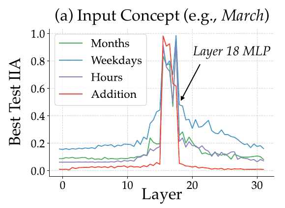
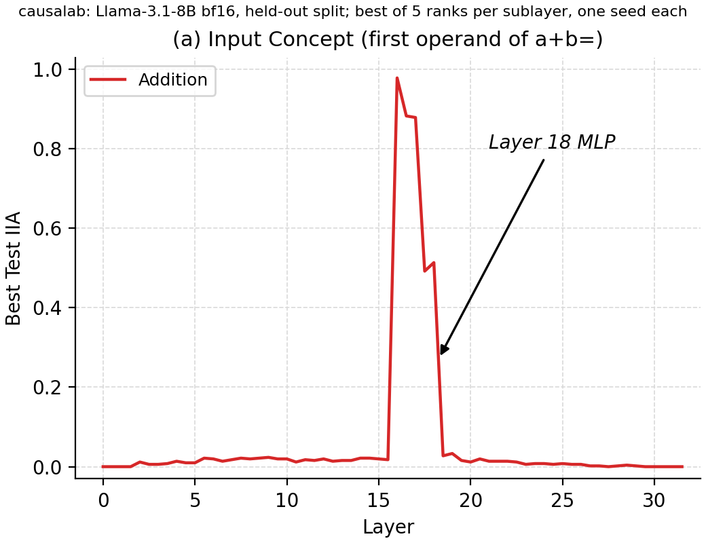
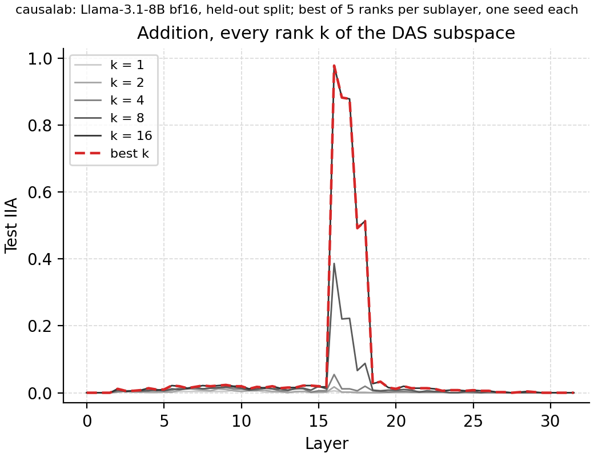

# Distributed alignment search at every sublayer

> Feucht et al. **Arithmetic in the Wild: Llama uses Base-10 Addition to
> Reason About Cyclic Concepts.** [[arXiv]](https://arxiv.org/abs/2605.01148)

**Figure context:**

- Llama-3.1-8B answers `25+58=` with `83`.
- At which layer can we move the first operand on its own?
- At each sublayer we learn a low-rank subspace of the last-token residual
  stream with distributed alignment search (DAS). We swap that subspace in
  from a second prompt and check whether the answer changes as if only the
  first operand had changed. The share of pairs where it does is the
  interchange intervention accuracy (IIA).
- The paper draws the same curve for months, weekdays and 24-hour time, and
  takes this as evidence for one shared addition mechanism. This package
  replicates the addition curve.
- [The Figure 15 replication](arithmetic_fig15.md) patches the whole
  residual stream on the weekdays task of the same paper.

### Original



### Replication



*Figure 1: Localization of the first operand in Llama-3.1-8B: `25+58=` -->
`83`. Held-out IIA for the first operand of `a+b=` at each sublayer, the
best of five DAS ranks per sublayer with one seed each, on 512 test pairs.
This is the paper's red addition series. As there, IIA peaks at layer 16
(0.98) and collapses after the layer-18 MLP (0.51 to 0.027). The two points
before that MLP sit at 0.49 and 0.51, against about 0.6 in the paper; one
check with learning rate 1e-3 gives 0.617 at the second.*

## CausaLab implementation

Let's walk through the specification for fitting the DAS rotations behind
Figure 1 in CausaLab. Expand the dropdown to see the full implementation.

<details>
<summary><b>Full JSON</b></summary>

```json
{
  "header": {
    "protocol_version": "4",
    "description": "DAS fit for Figure 2a of Feucht et al. 2026 (arXiv:2605.01148): one rotation per (sublayer, k) for the first operand a of a+b= at the last token of Llama-3.1-8B, trained so that swapping the k-dimensional subspace from the counterfactual prompt makes the model answer a_cf + b_base; arithmetic_fig2a_apply.json scores the saved rotations."
  },
  "model": {"key": "meta-llama/Llama-3.1-8B", "revision": "main", "dtype": "bf16"},
  "data": {
    "base": {"dataset": "arithmetic_fig2a/data#train", "field": "input"},
    "counterfactual": {"dataset": "arithmetic_fig2a/data#train", "field": "counterfactual_inputs[0]"}
  },
  "method": {
    "intervened_models": {
      "original_counterfactual": {"input": "counterfactual", "reads": ["v_cf"]},
      "patched": {"input": "base", "reads": ["logits"], "writes": ["patch"]}
    },
    "sites": {
      "target": {
        "component": {"sweep": ["block_mid", "block_output"]},
        "layers": {"sweep": {"range": [0, 32]}}
      },
      "lm_head": {"component": "lm_head"}
    },
    "featurizers": {
      "rot": {"kind": "subspace", "k": {"sweep": [1, 2, 4, 8, 16]}, "parametrization": "cayley"}
    },
    "reads": {
      "v_cf": {"site": "target", "pos": -1, "featurizer": "rot"},
      "logits": {"site": "lm_head", "pos": -1}
    },
    "writes": {
      "patch": {"site": "target", "pos": -1, "featurizer": "rot", "do": {"swap": "v_cf"}}
    },
    "train": {
      "objective": {
        "ce": {
          "weight": 1.0,
          "read": "logits",
          "model": "patched",
          "aggregation": {"kind": "cross_entropy", "target": "label"}
        }
      },
      "params": ["rot"],
      "optimizer": {"name": "adamw", "lr": 0.0001, "weight_decay": 0.0},
      "steps": {"epochs": 8},
      "batch": {"pairs": 16},
      "precision": {"feature": "fp32", "loss": "fp32"},
      "seed": 0
    },
    "save": [
      {"train": "ce", "file_path": "ce.json"},
      {"value": "rot", "site": "target", "file_path": "rot.safetensors"}
    ]
  }
}
```

</details>


### Load the model and the prompt pairs

```json
"model": {"key": "meta-llama/Llama-3.1-8B", "revision": "main", "dtype": "bf16"},
"data": {
    "base": {"dataset": "arithmetic_fig2a/data#train", "field": "input"},  // base sample: 25+58=
    "counterfactual": {"dataset": "arithmetic_fig2a/data#train", "field": "counterfactual_inputs[0]"}  // counterfactual sample: 37+43=
}
```

### Define the counterfactual and patched models, with reads and writes as placeholders

```json
"intervened_models": {
    "original_counterfactual": {"input": "counterfactual", "reads": ["v_cf"]},
    "patched": {"input": "base", "reads": ["logits"], "writes": ["patch"]}
}
```

### Select the residual stream before and after each MLP

```json
"sites": {
    "target": {
        "component": {"sweep": ["block_mid", "block_output"]},
        "layers": {"sweep": {"range": [0, 32]}}  // sweep: a separate intervention per layer
    },
    "lm_head": {"component": "lm_head"}
}
```

### Define reads: the rotated counterfactual residual and the final logits

```json
"reads": {
    "v_cf": {"site": "target", "pos": -1, "featurizer": "rot"},
    "logits": {"site": "lm_head", "pos": -1}
}
```

### Define writes: swap the subspace into the base run

```json
"writes": {
    "patch": {"site": "target", "pos": -1, "featurizer": "rot", "do": {"swap": "v_cf"}}
}
```

### Define the rotation and train it

```json
"featurizers": {
    "rot": {"kind": "subspace", "k": {"sweep": [1, 2, 4, 8, 16]}, "parametrization": "cayley"}  // the figure takes the best rank per sublayer
},
"train": {
    "objective": {
        "ce": {
            "weight": 1.0,
            "read": "logits",
            "model": "patched",
            "aggregation": {"kind": "cross_entropy", "target": "label"}  // label = a_cf + b_base, 95 for the pair above
        }
    },
    "params": ["rot"],
    "optimizer": {"name": "adamw", "lr": 0.0001, "weight_decay": 0.0},  // Appendix D.1: lr 1e-4, 8 epochs, batch 16
    "steps": {"epochs": 8},
    "batch": {"pairs": 16},
    "precision": {"feature": "fp32", "loss": "fp32"},
    "seed": 0
}
```

### Save the loss and the rotations

```json
"save": [
    {"train": "ce", "file_path": "ce.json"},
    {"value": "rot", "site": "target", "file_path": "rot.safetensors"}  // 320 rotations, one bundle keyed by sublayer and rank
]
```

## Further Details

<details>
<summary><b>Method</b></summary>

**Fit and selection.** Each point fits one rotation for one sublayer and one
rank with the settings of the paper's Appendix D.1 and one seed. The apply
document scores every rotation on the 512 test pairs, and the figure keeps
the best rank per sublayer, as the paper reports the best dimension
(Section 2).

**Data.** The table has 4096 rows, 3584 train and 512 test, written by
[`workflows/scripts/arithmetic_fig2a/build_dataset.py`](workflows/scripts/arithmetic_fig2a/build_dataset.py).
It departs from Appendix D.1 in three ways. The train and test splits share
no prompt, because causalab refuses a fit whose training and test rows share
one. No filter keeps only the pairs the model answers correctly. No pair has
two equal first operands, because its label would equal the base answer.


The fit sweeps five ranks per sublayer, and the figure draws the best:



*Test IIA of each rank k of the subspace (grey, darker for larger k), once
the apply document scores the fitted rotations on the test split, and their
best (red, dashed), the curve of Figure 1. Rank 16, the largest in the
sweep, is the best at every sublayer from layer 16 to layer 26. Rank 8
reaches only 0.39 at layer 16, and ranks 1 to 4 stay at or below 0.055. The
operand needs about 16 dimensions here, and the sweep tests no larger rank.*

</details>

<details>
<summary><b>Execution</b>: environment, run command, flags, resources, workflow</summary>

**Environment.** `meta-llama/Llama-3.1-8B` is a gated checkpoint. Accept its
license on the Hub, then give the run a token or a cache that holds the
weights:

```bash
export HF_TOKEN=hf_...              # a token for the account that accepted the license
export HF_HUB_CACHE=/path/to/cache  # optional: a cache that already holds the checkpoint
```

**Run.** From `demos/papers/`, run the workflow, whose last step draws the
figures into the run tree, then draw them into `artifacts/figures/`, which
needs no accelerator:

```bash
causalab run workflows/arithmetic_fig2a.json \
    --engine auto \
    --data-root artifacts/data \
    --out artifacts/output \
    --device cuda \
    --fit-rows 512 \
    --batch-rows 1024
python workflows/scripts/arithmetic_fig2a/fig2a_figure.py
```

**Flags.** `--data-root` is the folder that dataset references resolve
against, so `arithmetic_fig2a/data#train` reads
`artifacts/data/arithmetic_fig2a/data.json`. `--out artifacts/output` puts
the run tree under `artifacts/output/arithmetic_fig2a/`, the workflow's
`output_dir`; the figure script reads `apply_0/` to `apply_3/` there and
writes `fig2a_replication.png`, `fig2a_ranks.png` and `fig2a_plotted.json`
to `artifacts/figures/arithmetic_fig2a/`. `--fit-rows` pins the grad-row
budget: the automatic bound resolves to 3232 rows on this model, about
150 GB of activations, and 512 rows fit an 80 GB card. Every document pins
`bf16`, and a workflow refuses `--dtype`. `--resume` makes a resubmission
reuse every step whose recorded digests still match. Replace `run` with
`validate` and drop the run-only flags to check the documents without
loading weights.

**Resources and reproducibility.** The command needs one 80 GB CUDA GPU.
On an Apple-silicon laptop with 48 GB of unified memory, pass
`--device mps --fit-rows 384 --batch-rows 128`; the run then takes about
1.5 days. The committed figures come from one H100 rerun of the shipped
workflow in bf16 with the `pytorch_hooks` engine on 2026-09-24. Its event
log spans 1 h 15 min from the first fit's start to the figure step's end,
and its curve equals the 2026-09-23 H100 run at every sublayer.

**Workflow.** [`workflows/arithmetic_fig2a.json`](workflows/arithmetic_fig2a.json)
runs [`protocols/arithmetic_fig2a_fit.json`](protocols/arithmetic_fig2a_fit.json)
as four steps of eight layers each, the same document under a
`sites.target.layers` override, so that `--resume` after an interruption
keeps every finished quarter. A declared `fan_out` cannot make this split
because the fit saves a bundle. The four
[`protocols/arithmetic_fig2a_apply.json`](protocols/arithmetic_fig2a_apply.json)
steps each load their cohort's `rot.safetensors` and score it on the test
split with one `match` save, the IIA against `label_forms`. The last step,
[`workflows/scripts/arithmetic_fig2a/fig2a_figure.py`](workflows/scripts/arithmetic_fig2a/fig2a_figure.py),
takes the best rank per sublayer and draws both figures. The setup follows
the paper's Appendix D.1 except for the table departures under
Method.

</details>

<details>
<summary><b>Intervention protocol parameters</b>: what to change for another concept, model or grid</summary>

| field | here | to change |
|---|---|---|
| `model.key` | `meta-llama/Llama-3.1-8B` | any registered causal LM; `sites.target.layers` follows its layer count |
| `data.*.dataset` | `data#train`, `data#test` | another table with `input`, `counterfactual_inputs` and a `label` for the concept under test |
| `sites.target.component`, `sites.target.layers` | `block_mid`, `block_output`; `range [0, 32]` | the sublayers to scan |
| `featurizers.rot.k` | `[1, 2, 4, 8, 16]` | the ranks to try; the figure takes the best |
| `train.optimizer.lr`, `train.steps.epochs` | `1e-4`, `8` | Appendix D.1; `1e-3` closes the L18 gap on one check |
| `save[].aggregation.expected` (apply) | `label_forms` | the answer the causal model predicts when the concept alone is interchanged |

[The intervention reference](../../docs/intervention_protocol.md) defines
every field.

</details>
