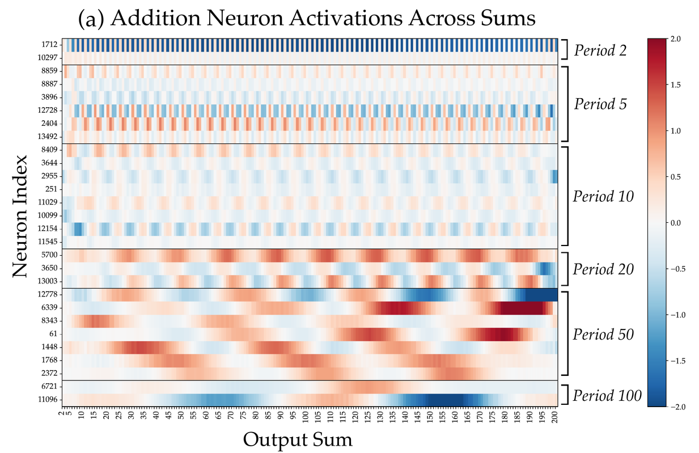
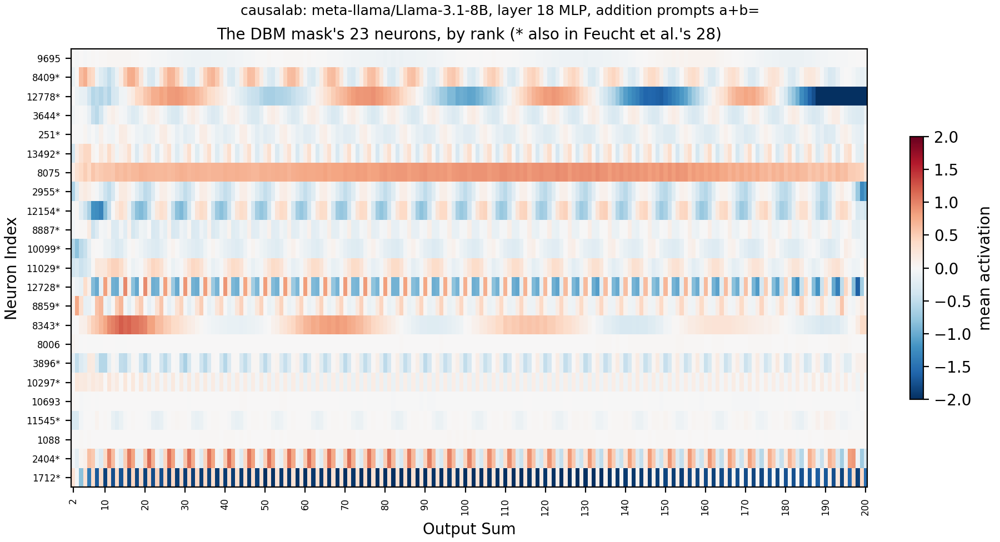
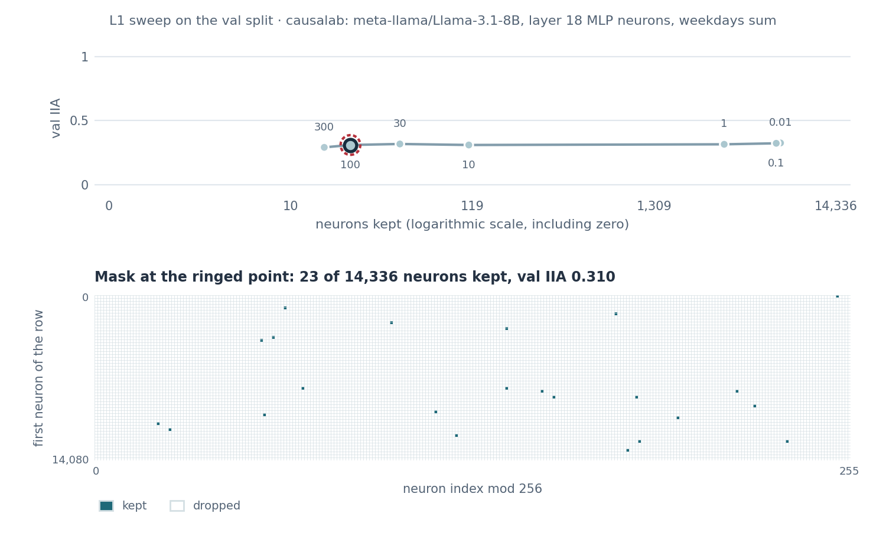
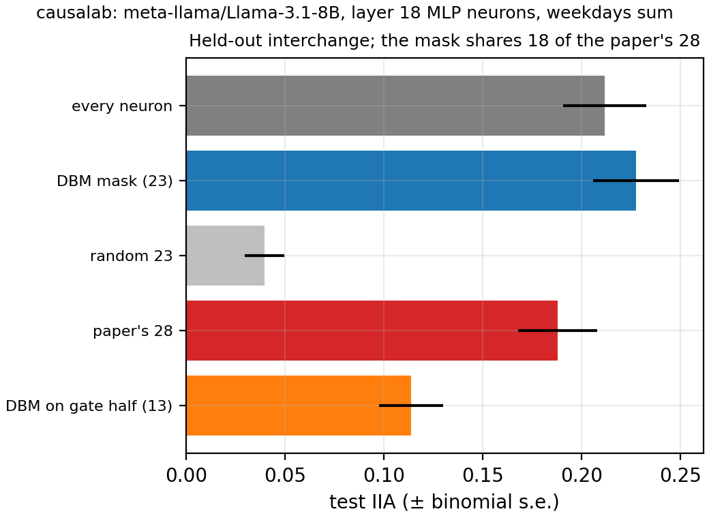

# Desiderata-based masking over MLP neurons

> Feucht et al. **Arithmetic in the Wild: Llama uses Base-10 Addition to
> Reason About Cyclic Concepts.** [[arXiv]](https://arxiv.org/abs/2605.01148)

**Figure context:**

- Llama-3.1-8B answers `Q: What day is eight days after Thursday?` with
  ` Friday`, and it adds numbers, months and hours with the same parts.
- Which neurons of layer 18's MLP carry the sum, and does a learned mask
  find the paper's addition neurons?
- We learn a sparse mask over the layer's neurons at the last token.
  Swapping the kept neurons in from a second prompt must give that prompt's
  day.
- We then read the kept neurons on the addition prompts `a+b=`, as Figure 8a
  does for the paper's neurons.
- [The Figure 15 replication](arithmetic_fig15.md) patches the residual
  stream on the same task.

### Original



### Replication



*Figure 1: Addition neurons of Llama-3.1-8B at layer 18, on `a+b=`. The rows
are the DBM mask's neurons by rank. A cell is the mean activation (gate
times up) over the prompts with one output sum. A star marks the 18 also in
the paper's 28, among them all 16 of its period 2, 5 and 10 neurons. The
paper calls n1712 always negative (footnote 3, p. 10); here it averages
−1.85 at even sums and +0.22 at odd ones.*

## CausaLab implementation

Let's walk through the specification for fitting the neuron mask, which
picks the neurons of Figure 8a's DBM rows, in CausaLab. Expand the dropdown
to see the full implementation.

<details>
<summary><b>Full JSON</b></summary>

```json
{
  "header": {
    "protocol_version": "4",
    "description": "DBM fit over the 14336 neurons of layer 18's MLP of Llama-3.1-8B (Feucht et al. 2026, arXiv:2605.01148, Section 5): a per-neuron gate at the last token of the weekdays prompt, trained so that swapping the gated neurons' activations from the counterfactual prompt makes the model answer the counterfactual's output day, under an L1 penalty on the mask; arithmetic_neurons_apply.json scores the saved gate on the held-out split, and workflows/scripts/arithmetic_neurons/figures.py draws the val IIA of the sweep step, which runs this document at seven L1 weights."
  },
  "model": {"key": "meta-llama/Llama-3.1-8B", "revision": "main", "dtype": "bf16"},
  "data": {
    "base": {"dataset": "arithmetic_neurons/weekdays#train", "field": "input"},
    "counterfactual": {"dataset": "arithmetic_neurons/weekdays#train", "field": "counterfactual_inputs[0]"}
  },
  "method": {
    "intervened_models": {
      "original_counterfactual": {"input": "counterfactual", "reads": ["v_cf"]},
      "masked": {"input": "base", "reads": ["logits"], "writes": ["mask"]}
    },
    "sites": {
      "neurons": {"component": "mlp_neuron_output", "layers": [18]},
      "lm_head": {"component": "lm_head"}
    },
    "featurizers": {"gate": {"kind": "gate"}},
    "reads": {
      "v_cf": {"site": "neurons", "pos": -1, "featurizer": "gate"},
      "logits": {"site": "lm_head", "pos": -1}
    },
    "writes": {
      "mask": {"site": "neurons", "pos": -1, "featurizer": "gate", "do": {"swap": "v_cf"}}
    },
    "train": {
      "objective": {
        "ce": {
          "weight": 1.0,
          "read": "logits",
          "model": "masked",
          "aggregation": {"kind": "cross_entropy", "target": "label"}
        },
        "l1": {"weight": 100.0, "l1": "gate"}
      },
      "params": ["gate"],
      "optimizer": {"name": "adamw", "lr": 0.001, "weight_decay": 0.0},
      "steps": {"epochs": 20},
      "batch": {"pairs": 16},
      "anneal": {"gate.theta.temperature": [1.0, 0.01, 0.5]},
      "precision": {"feature": "fp32", "loss": "fp32"},
      "eval": {
        "every": {"epochs": 1},
        "split": "arithmetic_neurons/weekdays#val",
        "aggregations": {
          "iia": {
            "read": "logits",
            "model": "masked",
            "aggregation": {"kind": "match", "expected": "label_forms"}
          }
        }
      },
      "seed": 0
    },
    "save": [
      {"value": "gate", "site": "neurons", "file_path": "gate.safetensors"}
    ]
  }
}
```

</details>

### Load the model and the training pairs

```json
"model": {"key": "meta-llama/Llama-3.1-8B", "revision": "main", "dtype": "bf16"},
"data": {
    "base": {"dataset": "arithmetic_neurons/weekdays#train", "field": "input"},  // base sample: Q: What day is thirteen days after Tuesday?
    "counterfactual": {"dataset": "arithmetic_neurons/weekdays#train", "field": "counterfactual_inputs[0]"}  // counterfactual sample: Q: What day is five days after Friday?
}
```

### Define the counterfactual and masked models, with reads and writes as placeholders

```json
"intervened_models": {
    "original_counterfactual": {"input": "counterfactual", "reads": ["v_cf"]},
    "masked": {"input": "base", "reads": ["logits"], "writes": ["mask"]}
}
```

### Select the 14336 neurons of layer 18's MLP

```json
"sites": {
    "neurons": {"component": "mlp_neuron_output", "layers": [18]},  // the down projection's input, silu(gate)·up
    "lm_head": {"component": "lm_head"}
}
```

### Define reads: the counterfactual neurons through the gate, and the final logits

```json
"reads": {
    "v_cf": {"site": "neurons", "pos": -1, "featurizer": "gate"},
    "logits": {"site": "lm_head", "pos": -1}
}
```

### Define writes: swap in the neurons the gate keeps

```json
"writes": {
    "mask": {"site": "neurons", "pos": -1, "featurizer": "gate", "do": {"swap": "v_cf"}}
}
```

### Define one gate per neuron, and train it under an L1 penalty

```json
"featurizers": {"gate": {"kind": "gate"}},
"train": {
    "objective": {
        "ce": {
            "weight": 1.0,
            "read": "logits",
            "model": "masked",
            "aggregation": {"kind": "cross_entropy", "target": "label"}  // label: the counterfactual's day
        },
        "l1": {"weight": 100.0, "l1": "gate"}  // chosen on the val split by the sweep step
    },
    "params": ["gate"],
    "optimizer": {"name": "adamw", "lr": 0.001, "weight_decay": 0.0},  // the shipped dbm template
    "steps": {"epochs": 20},
    "batch": {"pairs": 16},
    "anneal": {"gate.theta.temperature": [1.0, 0.01, 0.5]},
    "precision": {"feature": "fp32", "loss": "fp32"},
    "eval": {
        "every": {"epochs": 1},
        "split": "arithmetic_neurons/weekdays#val",
        "aggregations": {
            "iia": {
                "read": "logits",
                "model": "masked",
                "aggregation": {"kind": "match", "expected": "label_forms"}
            }
        }
    },
    "seed": 0
}
```

### Save the fitted gate

```json
"save": [
    {"value": "gate", "site": "neurons", "file_path": "gate.safetensors"}
]
```

Given the specification, CausaLab produces:



*The `sweep` step runs this document at seven L1 weights. Val IIA stays
between 0.29 and 0.33 from 16 to 6904 neurons. The one-standard-error rule
picks weight 100: 23 neurons at 0.310. The grid shows the neurons of this
ringed mask. The `fit` step refits weight 100 and keeps the same 23.*

## Held-out scores and activations: change these lines

The held-out scores come from
[`apply`](protocols/arithmetic_neurons_apply.json) with the fitted gate
loaded, and from [`all_neurons`](protocols/arithmetic_neurons_all_neurons.json)
and [`paper_neurons`](protocols/arithmetic_neurons_paper_neurons.json),
which swap every neuron or the paper's 28. The Figure 8a replication comes
from [`harvest`](protocols/arithmetic_neurons_harvest.json).

### Held-out IIA: load the fitted gate and score the test split

```diff
 "data": {
-    "base": {"dataset": "arithmetic_neurons/weekdays#train", "field": "input"},
-    "counterfactual": {"dataset": "arithmetic_neurons/weekdays#train", "field": "counterfactual_inputs[0]"}
+    "base": {"dataset": "arithmetic_neurons/weekdays#test", "field": "input"},
+    "counterfactual": {"dataset": "arithmetic_neurons/weekdays#test", "field": "counterfactual_inputs[0]"}
 },
-"featurizers": {"gate": {"kind": "gate"}},
+"featurizers": {"gate": {"kind": "gate", "file_path": "fit/gate.safetensors"}},  // the fit step's output
-"train": {...},  // the whole block
 "save": [
-    {"value": "gate", "site": "neurons", "file_path": "gate.safetensors"}
+    {
+        "read": "logits",
+        "model": "masked",
+        "aggregation": {"kind": "match", "expected": "label_forms"},
+        "file_path": "iia.json"
+    },
+    {"kind": "rank", "file_path": "rank.json"}
 ]
```



*On 378 held-out pairs the 23-neuron mask scores 0.228, every neuron 0.212,
the paper's 28 0.188 and one random draw of 23 neurons (seed 0) 0.040. The
binomial error bars of the three real scores overlap. The 378 pairs reuse
the same 21 prompts, so the true error is larger than the bars show, and
this test set does not rank the three. Swapping the whole MLP moves about a
fifth of the answers.*

### Figure 8a: read the neurons on the addition prompts

The figure script draws this document's reads for the mask's neurons as the
replication figure above.

```diff
-"data": {
-    "base": {"dataset": "arithmetic_neurons/weekdays#train", "field": "input"},
-    "counterfactual": {"dataset": "arithmetic_neurons/weekdays#train", "field": "counterfactual_inputs[0]"}
-},
+"data": {"base": {"dataset": "arithmetic_neurons/addition_prompts", "field": "input"}},
 "intervened_models": {
-    "original_counterfactual": {"input": "counterfactual", "reads": ["v_cf"]},
-    "masked": {"input": "base", "reads": ["logits"], "writes": ["mask"]}
+    "original": {"input": "base", "reads": ["full", "gate"]}
 },
 "sites": {
     "neurons": {"component": "mlp_neuron_output", "layers": [18]},
-    "lm_head": {"component": "lm_head"}
+    "gate_half": {"component": "mlp_activation", "layers": [18]}  // silu(gate) alone
 },
-"featurizers": {"gate": {"kind": "gate"}},
 "reads": {
-    "v_cf": {"site": "neurons", "pos": -1, "featurizer": "gate"},
-    "logits": {"site": "lm_head", "pos": -1}
+    "full": {"site": "neurons", "pos": -1},
+    "gate": {"site": "gate_half", "pos": -1}
 },
-"writes": {
-    "mask": {"site": "neurons", "pos": -1, "featurizer": "gate", "do": {"swap": "v_cf"}}
-},
-"train": {...},  // the whole block
 "save": [
-    {"value": "gate", "site": "neurons", "file_path": "gate.safetensors"}
+    {"read": "full", "model": "original", "file_path": "full.safetensors"},
+    {"read": "gate", "model": "original", "file_path": "gate.safetensors"}
 ]
```

## Further Details

<details>
<summary><b>Method</b></summary>

**The paper's neurons.** The 28 indices in
[`neurons_feucht2026.json`](artifacts/data/arithmetic_neurons/neurons_feucht2026.json)
are read by eye from the labels of Figure 8, checked against Figure 45. The
paper releases no list. The Figure 8a replication supports the transcription
and the 0-based indexing: each of the 18 neurons it shares with the list
repeats with the period the paper gives it.

**Splits.** The 98 weekdays prompts are split before pairing: 56 for
training, 21 for `val` and 21 for `test`. Each held-out split has three
prompts per answer day. A pair has two prompts with different answers.
Unlike the paper (Appendix D.1), no prompt is filtered on the model's
answer.

**The L1 weight.** The `sweep` step fits seven weights from 0.01 to 300.
The one-standard-error rule
([Hastie et al., *Elements of Statistical Learning*, §7.10](https://hastie.su.domains/ElemStatLearn/))
takes the largest weight whose val IIA is within one binomial standard error
(0.024) of the best (0.325): 100, with 23 neurons at 0.310. The test split is
read only by the apply steps. The other training settings are those of
[the shipped DBM template](../methods/protocols/dbm.json), without its early
stop.

**Which activation.** On the Llama tree `mlp_activation` is `silu(gate)`
alone, and `mlp_neuron_output` is `silu(gate)·up`
([`families.py`](../../causalab/protocol/registry/families.py)). A swap of
the first mixes the counterfactual gate with the base up value. The
`fit_gate_half` step fits the mask there: 13 neurons, 10 in the paper's set,
held-out IIA 0.114.

</details>

<details>
<summary><b>Execution</b>: environment, run command, flags, resources, workflow</summary>

**Environment.** `meta-llama/Llama-3.1-8B` is a gated checkpoint. Accept its
license on the Hub, then give the run a token or a cache that holds the
weights:

```bash
export HF_TOKEN=hf_...              # a token for the account that accepted the license
export HF_HUB_CACHE=/path/to/cache  # optional: a cache that already holds the checkpoint
```

**Run.** From `demos/papers/`, run the workflow, then draw the figures, which
need no accelerator:

```bash
causalab run workflows/arithmetic_neurons.json \
    --engine auto \
    --data-root artifacts/data \
    --out artifacts/output \
    --device cuda
python workflows/scripts/arithmetic_neurons/figures.py
```

**Flags.** `--data-root` is the folder that dataset references resolve
against, so `arithmetic_neurons/weekdays#train` reads the `train` rows of
`artifacts/data/arithmetic_neurons/weekdays.json`. `--out artifacts/output`
puts the run tree under `artifacts/output/arithmetic_neurons/`. The figure
script reads it and the package's tables, and writes three images and two
`*_plotted.json` files to `artifacts/figures/arithmetic_neurons/`. Every document pins `bf16`.
`--resume` reuses every step whose recorded digests still match. Replace
`run` with `validate` and drop the run-only flags to check the documents
without loading weights.

**Resources and reproducibility.** The run needs one GPU that holds the 16 GB
of bf16 weights and the gradients through the last 14 layers. The harvest
saves 14336 values per prompt, 547 MB for the addition prompts. The committed
figures come from one H100 run of the shipped workflow in bf16 with the
`pytorch_hooks` engine on 2026-09-28, 6 min 2 s from start to end. That run also had three steps the workflow no
longer holds, which took less than a second. A laptop run is not recorded.

**Workflow.** [`workflows/arithmetic_neurons.json`](workflows/arithmetic_neurons.json)
runs `sweep` and `fit`
([`protocols/arithmetic_neurons_fit.json`](protocols/arithmetic_neurons_fit.json));
`apply`
([`protocols/arithmetic_neurons_apply.json`](protocols/arithmetic_neurons_apply.json)),
which scores the fitted gate on `test` and saves each neuron's rank;
`random`, a size-matched random mask from `causalab.analysis.random_mask`,
and `apply_random`; `all_neurons` and `paper_neurons`
([`all_neurons`](protocols/arithmetic_neurons_all_neurons.json),
[`paper_neurons`](protocols/arithmetic_neurons_paper_neurons.json)), plain
swaps of every neuron and of the 28; `fit_gate_half` and `apply_gate_half`;
and `harvest_addition`
([`protocols/arithmetic_neurons_harvest.json`](protocols/arithmetic_neurons_harvest.json)),
which saves the neurons' activations on the addition prompts. The paper
finds its neurons by projecting down rows onto DAS subspaces (Eq. 6). The
mask here comes from a different method, so its rows in the Figure 8a
replication have no counterpart in the paper.

</details>

<details>
<summary><b>Intervention protocol parameters</b>: what to change for another task, layer or model</summary>

| field | here | to change |
|---|---|---|
| `model.key` | `meta-llama/Llama-3.1-8B` | any registered causal LM with a gated MLP; the neuron indices are this model's |
| `data.*.dataset` | `arithmetic_neurons/weekdays#train` | another pair table with `input`, `counterfactual_inputs`, `label` and `label_forms` |
| `sites.neurons.component` | `mlp_neuron_output` | `mlp_activation` for the gate half, as `fit_gate_half` does |
| `sites.neurons.layers` | `[18]` | another MLP layer |
| `train.objective.l1.weight` | `100.0` | a larger weight for a smaller mask; the `sweep` step lists seven |

[The intervention reference](../../docs/intervention_protocol.md) defines
every field.

</details>
