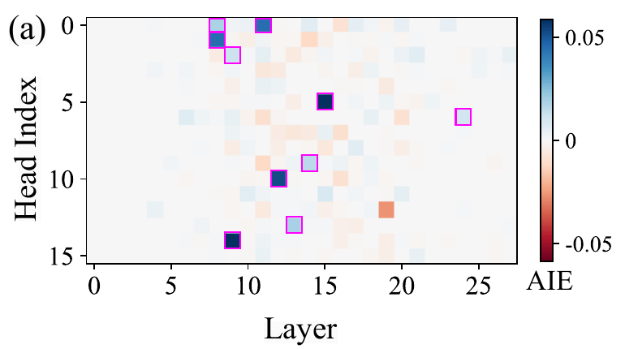
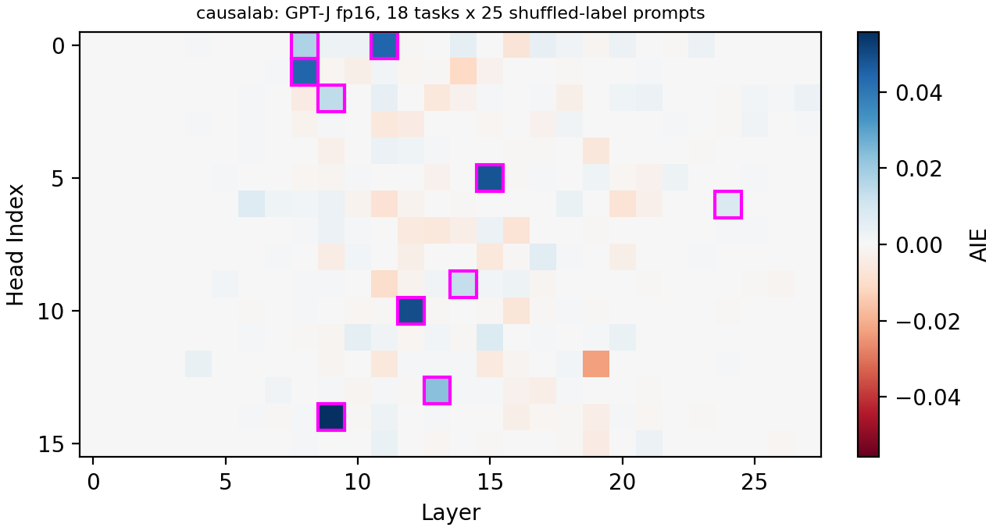

# Average indirect effect per attention head

> Todd et al. **Function Vectors in Large Language Models.**
> [[arXiv]](https://arxiv.org/abs/2310.15213)

**Figure context:**

- GPT-J 6B infers a task, such as antonyms or English to French, from ten
  demonstrations and applies it to a new query.
- Which attention heads carry the task from the demonstrations to the last
  token?
- Todd et al. average each head's output over clean prompts of one task and
  put that mean into prompts whose labels are shuffled. The gain in the
  probability of the answer, averaged over 18 tasks, is the head's average
  indirect effect (AIE).
- [Desiderata-based masking for function vectors](function_vectors_fig3a_dbm.md)
  checks the paper's heads with a mask fitted on the same workflow.

### Original



### Replication



*Figure 1: Heads that carry an in-context task in GPT-J 6B. Each cell is a
head's average indirect effect: the gain in the probability of the answer's
first token when the head's output at the last token is set to its task
mean, averaged over 18 tasks. The outlined heads are this run's top ten,
which are the paper's ten. The authors release the AIE of 40 heads, and ours agree within
0.011. The largest is 0.056 at layer 9, head 14 (paper 0.058). One prompt
draw, fp16.*

## CausaLab implementation

Let's walk through the specification for the head scan of Figure 3a in
CausaLab. Expand the dropdown to see the full implementation.

<details>
<summary><b>Full JSON</b></summary>

```json
{
  "header": {
    "protocol_version": "4",
    "description": "Figure 3a of Todd et al. 2024 (arXiv:2310.15213): put one GPT-J head's task mean into 25 shuffled-label 10-shot prompts per task at the last token, one point per task, layer (0 to 13; the scan_late step sets 14 to 27) and head, and save the answer's cross-entropy with and without the swap, which workflows/scripts/function_vectors_fig3a/fig3a_figure.py turns into the average indirect effect."
  },
  "model": {"key": "EleutherAI/gpt-j-6b", "revision": "float16", "dtype": "fp16"},
  "data": {"base": {"dataset": {"axis": "task.scan"}, "field": "input"}},
  "axes": {
    "task": {
      "rows": [
        {"task": "antonym", "scan": "function_vectors_fig3a/scan#antonym"},
        {"task": "capitalize", "scan": "function_vectors_fig3a/scan#capitalize"},
        {"task": "capitalize_first_letter", "scan": "function_vectors_fig3a/scan#capitalize_first_letter"},
        {"task": "country-capital", "scan": "function_vectors_fig3a/scan#country-capital"},
        {"task": "country-currency", "scan": "function_vectors_fig3a/scan#country-currency"},
        {"task": "english-french", "scan": "function_vectors_fig3a/scan#english-french"},
        {"task": "english-german", "scan": "function_vectors_fig3a/scan#english-german"},
        {"task": "english-spanish", "scan": "function_vectors_fig3a/scan#english-spanish"},
        {"task": "landmark-country", "scan": "function_vectors_fig3a/scan#landmark-country"},
        {"task": "lowercase_first_letter", "scan": "function_vectors_fig3a/scan#lowercase_first_letter"},
        {"task": "national_parks", "scan": "function_vectors_fig3a/scan#national_parks"},
        {"task": "park-country", "scan": "function_vectors_fig3a/scan#park-country"},
        {"task": "person-sport", "scan": "function_vectors_fig3a/scan#person-sport"},
        {"task": "present-past", "scan": "function_vectors_fig3a/scan#present-past"},
        {"task": "product-company", "scan": "function_vectors_fig3a/scan#product-company"},
        {"task": "sentiment", "scan": "function_vectors_fig3a/scan#sentiment"},
        {"task": "singular-plural", "scan": "function_vectors_fig3a/scan#singular-plural"},
        {"task": "synonym", "scan": "function_vectors_fig3a/scan#synonym"}
      ],
      "key": "task"
    }
  },
  "method": {
    "intervened_models": {
      "corrupted": {"input": "base", "reads": ["logits"]},
      "patched": {"input": "base", "reads": ["logits"], "writes": ["put_mean"]}
    },
    "sites": {
      "target": {"component": "attention_premix", "layers": {"sweep": {"range": [0, 14]}}, "head": {"sweep": {"range": [0, 16]}}},
      "lm_head": {"component": "lm_head"}
    },
    "params": {
      "mu": {"file_path": "mean_heads_early/mean.safetensors"}
    },
    "reads": {
      "logits": {"site": "lm_head", "pos": -1}
    },
    "writes": {
      "put_mean": {"site": "target", "pos": -1, "do": {"swap": "mu"}}
    },
    "save": [
      {"read": "logits", "model": "patched", "aggregation": {"kind": "cross_entropy", "target": "label"}, "file_path": "ce_patched.json"},
      {"read": "logits", "model": "corrupted", "aggregation": {"kind": "cross_entropy", "target": "label"}, "file_path": "ce_corrupted.json"}
    ]
  }
}
```

</details>

### Load GPT-J and the shuffled-label prompts

```json
"model": {"key": "EleutherAI/gpt-j-6b", "revision": "float16", "dtype": "fp16"},
"data": {"base": {"dataset": {"axis": "task.scan"}, "field": "input"}}  // one task's 25 shuffled-label prompts per point
```

### Define the corrupted and patched models, with reads and writes as placeholders

```json
"intervened_models": {
    "corrupted": {"input": "base", "reads": ["logits"]},  // the shuffled-label prompt with no swap
    "patched": {"input": "base", "reads": ["logits"], "writes": ["put_mean"]}
}
```

### Select one head's input to the attention output projection, and the unembedding

```json
"sites": {
    "target": {"component": "attention_premix", "layers": {"sweep": {"range": [0, 14]}}, "head": {"sweep": {"range": [0, 16]}}},  // sweep: one point per layer and head; the scan_late step sets layers 14 to 27
    "lm_head": {"component": "lm_head"}
}
```

### Define the task axis: one set of points per task

```json
"axes": {
    "task": {
        "rows": [  // the paper's 18 tasks, each with its shuffled-label prompts
            {"task": "antonym", "scan": "function_vectors_fig3a/scan#antonym"},
            {"task": "capitalize", "scan": "function_vectors_fig3a/scan#capitalize"},
            {"task": "capitalize_first_letter", "scan": "function_vectors_fig3a/scan#capitalize_first_letter"},
            {"task": "country-capital", "scan": "function_vectors_fig3a/scan#country-capital"},
            {"task": "country-currency", "scan": "function_vectors_fig3a/scan#country-currency"},
            {"task": "english-french", "scan": "function_vectors_fig3a/scan#english-french"},
            {"task": "english-german", "scan": "function_vectors_fig3a/scan#english-german"},
            {"task": "english-spanish", "scan": "function_vectors_fig3a/scan#english-spanish"},
            {"task": "landmark-country", "scan": "function_vectors_fig3a/scan#landmark-country"},
            {"task": "lowercase_first_letter", "scan": "function_vectors_fig3a/scan#lowercase_first_letter"},
            {"task": "national_parks", "scan": "function_vectors_fig3a/scan#national_parks"},
            {"task": "park-country", "scan": "function_vectors_fig3a/scan#park-country"},
            {"task": "person-sport", "scan": "function_vectors_fig3a/scan#person-sport"},
            {"task": "present-past", "scan": "function_vectors_fig3a/scan#present-past"},
            {"task": "product-company", "scan": "function_vectors_fig3a/scan#product-company"},
            {"task": "sentiment", "scan": "function_vectors_fig3a/scan#sentiment"},
            {"task": "singular-plural", "scan": "function_vectors_fig3a/scan#singular-plural"},
            {"task": "synonym", "scan": "function_vectors_fig3a/scan#synonym"}
        ],
        "key": "task"
    }
}
```

### Load each head's task mean

```json
"params": {
    "mu": {"file_path": "mean_heads_early/mean.safetensors"}  // over 100 clean prompts per task; scan_late loads mean_heads_late
}
```

### Define reads: the final logits at the last token

```json
"reads": {
    "logits": {"site": "lm_head", "pos": -1}
}
```

### Define writes: the head's task mean at the last token

```json
"writes": {
    "put_mean": {"site": "target", "pos": -1, "do": {"swap": "mu"}}
}
```

### Save the answer's cross-entropy with and without the swap

```json
"save": [
    {"read": "logits", "model": "patched", "aggregation": {"kind": "cross_entropy", "target": "label"}, "file_path": "ce_patched.json"},
    {"read": "logits", "model": "corrupted", "aggregation": {"kind": "cross_entropy", "target": "label"}, "file_path": "ce_corrupted.json"}  // the figure script takes exp(-ce) of both and subtracts
]
```

## Further Details

<details>
<summary><b>Method</b></summary>

**The indirect effect.** The figure script follows Todd et al., Eq. 3 and 4.
Per prompt, the indirect effect is the probability of the answer's first
token with the head at its task mean minus the probability without the swap.
The saves hold the cross-entropy of that token, and `exp(-ce)` is its
probability. The AIE is the mean over each task's 25 prompts, then over the
18 tasks.

**Paper values.** The authors' code lists GPT-J's top 40 heads with their AIE
([`extract_utils.py`](https://github.com/ericwtodd/function_vectors/blob/fb9eac7b6dc707ea1475a717379916007fe448d5/src/utils/extract_utils.py),
lines 388 to 391). The first ten are the heads outlined in the paper's
figure.
[`top_heads_todd2024.json`](artifacts/data/function_vectors_fig3a/top_heads_todd2024.json)
wraps that list with the file's URL and sha256, and the caption compares
with it.

**Departures from the paper.** The weights are fp16, where the authors'
code loads fp32. The prompts are drawn with our own seeds from the authors'
pools, and no prompt is filtered on the model's clean answer (the authors'
code does not filter either). Sixty queries whose answer starts with a bare
space token under GPT-J's tokenizer are not drawn, because a metric here
refuses a blank answer. Todd et al. score that space token.

</details>

<details>
<summary><b>Execution</b>: environment, run command, flags, resources, workflow</summary>

**Environment.** `EleutherAI/gpt-j-6b` is an open checkpoint (Apache 2.0)
and needs no token. The runs load the `float16` revision, 12 GB of weights:

```bash
export HF_HUB_CACHE=/path/to/cache  # optional: a cache that already holds EleutherAI/gpt-j-6b
```

**Run.** From `demos/papers/`, run the workflow, then draw the figures, which
need no accelerator:

```bash
causalab run workflows/function_vectors_fig3a.json \
    --engine auto \
    --data-root artifacts/data \
    --out artifacts/output \
    --device cuda \
    --resume
python workflows/scripts/function_vectors_fig3a/fig3a_figure.py
```

**Flags.** `--data-root` is the folder that dataset references resolve
against, so `function_vectors_fig3a/scan#antonym` reads the antonym rows of
`artifacts/data/function_vectors_fig3a/scan.json`. `--out artifacts/output`
puts the run tree under `artifacts/output/function_vectors_fig3a/`. The
figure script reads `scan_early/` and `scan_late/` there for this page, and
the DBM steps for [the DBM page](function_vectors_fig3a_dbm.md). It writes
`fig3a_replication.png`, `fig3a_dbm.png` and `fig3a_plotted.json` to
`artifacts/figures/function_vectors_fig3a/`. `--resume` makes a resubmission
reuse every step whose recorded digests still match. Replace `run` with
`validate` and drop the run-only flags to check the documents without
loading weights.

**Resources and reproducibility.** The run needs one GPU that holds the 12 GB
of fp16 weights. The DBM steps also hold the gates' gradients, and a six-task
DBM step peaked at 61 GB on an H100 (nvidia-smi). The committed figures come
from two runs on one H100 80 GB on 2026-09-28, fp16, `pytorch_hooks`
engine: the first ran the harvests, and the second, on later code, ran the
scan and the DBM steps in 39 minutes. Summed
over the steps, one run from scratch takes about 50 minutes, 24 of them in
the scan. A rerun of the scan gave the same 403,200 values bit for bit. We
did not measure a laptop run.

**Workflow.** [`workflows/function_vectors_fig3a.json`](workflows/function_vectors_fig3a.json)
runs, in order: `mean_heads_early` and `mean_heads_late`
([`protocols/function_vectors_fig3a_mean_heads.json`](protocols/function_vectors_fig3a_mean_heads.json)),
which average each head's output at the last token over 100 clean prompts
per task, for layers 0 to 13 and 14 to 27; `scan_early` and `scan_late`,
the document above, which put each head's mean into 25 shuffled-label
prompts per task; then `mean_L0` to `mean_L27`, `dbm_fit_1` to `dbm_fit_3`
and `dbm_apply_1` to `dbm_apply_3`, the steps of
[the DBM page](function_vectors_fig3a_dbm.md). The scan and the head
harvest are split in two halves because a step holds at most 4096 points.

</details>

<details>
<summary><b>Intervention protocol parameters</b>: what to change for another task set or model</summary>

| field | here | to change |
|---|---|---|
| `model.key` | `EleutherAI/gpt-j-6b`, revision `float16` | any registered causal LM; the layer and head ranges follow its depth and head count |
| `axes.task.rows` | 18 tasks with their `scan` splits | other task tables with an `input` and a one-token `label` column; the `mean_heads` document needs the same tasks' `clean` splits |
| `sites.target.layers` | layers 0 to 13; `scan_late` sets 14 to 27 | the model's layers, at most 4096 points per step |
| `sites.target.head` | heads 0 to 15 | the model's head count |
| `params.mu.file_path` | `mean_heads_early/mean.safetensors` | the head means of the harvest step whose layers match `sites.target.layers` |

[The intervention reference](../../docs/intervention_protocol.md) defines
every field.

</details>
