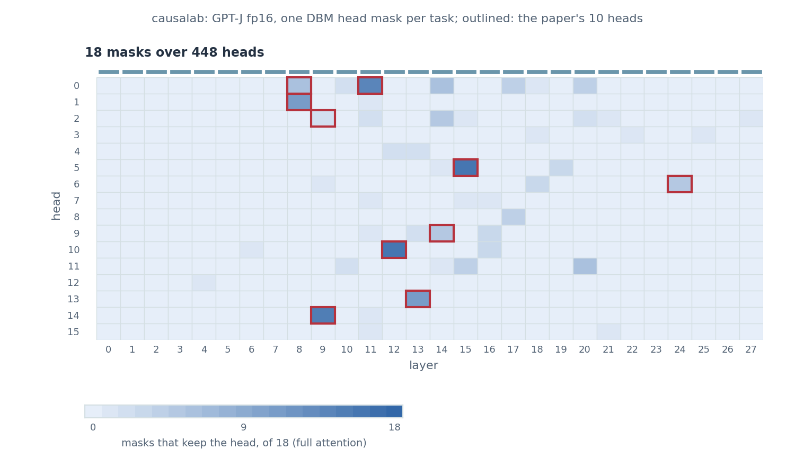

# Desiderata-based masking for function vectors

> Todd et al. **Function Vectors in Large Language Models.**
> [[arXiv]](https://arxiv.org/abs/2310.15213)

**Figure context:**

- GPT-J 6B infers a task, such as antonyms or English to French, from ten
  demonstrations and applies it to a new query.
- Does a head mask that is fitted to restore the answer keep the heads that
  Todd et al. rank highest?
- Todd et al. rank the heads one at a time by their average indirect effect
  (AIE). This page checks their ten heads with a method the paper does not
  use.
- Desiderata-based masking (DBM, [Davies et al. 2023](https://arxiv.org/abs/2307.03637))
  sets many heads to their task means at once. One gate per head is trained
  so that the masked prompt predicts the answer, with a penalty on the
  number of heads kept.
- [Average indirect effect per attention head](function_vectors_fig3a.md)
  replicates the Original on the same workflow.

### Original


### Verification with DBM



*Figure 1: DBM head masks for in-context tasks in GPT-J 6B. Each cell counts
the tasks, of 18, whose mask keeps the head, and the paper's ten heads are
outlined. A mask keeps 0 to 23 heads, 10 on average. The six heads that nine
tasks or more keep are all in the paper's ten. On 50 held-out prompts per
task, mean top-1 accuracy is 0.78 with the masked means, 0.51 without them
and 0.07 with every head at its mean.*

## CausaLab implementation

Let's walk through the specification for fitting one DBM head mask per task
in CausaLab. Expand the dropdown to see the full implementation.

<details>
<summary><b>Full JSON</b></summary>

```json
{
  "header": {
    "protocol_version": "4",
    "description": "Desiderata-based masking (Davies et al. 2023, arXiv:2307.03637) over GPT-J's 448 heads for the function-vector task of Todd et al. 2024 (arXiv:2310.15213): one head-grouped gate per layer mixes each head's task mean into its output at the last token of shuffled-label 10-shot prompts, fitted per task to the answer's cross-entropy plus an l1 penalty on the mask; the workflow runs it six tasks per step, dbm_apply replays the gates on held-out prompts and fig3a_figure.py draws them."
  },
  "model": {"key": "EleutherAI/gpt-j-6b", "revision": "float16", "dtype": "fp16"},
  "data": {"base": {"dataset": {"axis": "task.fit"}, "field": "input"}},
  "axes": {
    "task": {
      "rows": [
        {"task": "antonym", "fit": "function_vectors_fig3a/fit#antonym", "heldout": "function_vectors_fig3a/heldout#antonym"},
        {"task": "capitalize", "fit": "function_vectors_fig3a/fit#capitalize", "heldout": "function_vectors_fig3a/heldout#capitalize"},
        {"task": "capitalize_first_letter", "fit": "function_vectors_fig3a/fit#capitalize_first_letter", "heldout": "function_vectors_fig3a/heldout#capitalize_first_letter"},
        {"task": "country-capital", "fit": "function_vectors_fig3a/fit#country-capital", "heldout": "function_vectors_fig3a/heldout#country-capital"},
        {"task": "country-currency", "fit": "function_vectors_fig3a/fit#country-currency", "heldout": "function_vectors_fig3a/heldout#country-currency"},
        {"task": "english-french", "fit": "function_vectors_fig3a/fit#english-french", "heldout": "function_vectors_fig3a/heldout#english-french"},
        {"task": "english-german", "fit": "function_vectors_fig3a/fit#english-german", "heldout": "function_vectors_fig3a/heldout#english-german"},
        {"task": "english-spanish", "fit": "function_vectors_fig3a/fit#english-spanish", "heldout": "function_vectors_fig3a/heldout#english-spanish"},
        {"task": "landmark-country", "fit": "function_vectors_fig3a/fit#landmark-country", "heldout": "function_vectors_fig3a/heldout#landmark-country"},
        {"task": "lowercase_first_letter", "fit": "function_vectors_fig3a/fit#lowercase_first_letter", "heldout": "function_vectors_fig3a/heldout#lowercase_first_letter"},
        {"task": "national_parks", "fit": "function_vectors_fig3a/fit#national_parks", "heldout": "function_vectors_fig3a/heldout#national_parks"},
        {"task": "park-country", "fit": "function_vectors_fig3a/fit#park-country", "heldout": "function_vectors_fig3a/heldout#park-country"},
        {"task": "person-sport", "fit": "function_vectors_fig3a/fit#person-sport", "heldout": "function_vectors_fig3a/heldout#person-sport"},
        {"task": "present-past", "fit": "function_vectors_fig3a/fit#present-past", "heldout": "function_vectors_fig3a/heldout#present-past"},
        {"task": "product-company", "fit": "function_vectors_fig3a/fit#product-company", "heldout": "function_vectors_fig3a/heldout#product-company"},
        {"task": "sentiment", "fit": "function_vectors_fig3a/fit#sentiment", "heldout": "function_vectors_fig3a/heldout#sentiment"},
        {"task": "singular-plural", "fit": "function_vectors_fig3a/fit#singular-plural", "heldout": "function_vectors_fig3a/heldout#singular-plural"},
        {"task": "synonym", "fit": "function_vectors_fig3a/fit#synonym", "heldout": "function_vectors_fig3a/heldout#synonym"}
      ],
      "key": "task"
    }
  },
  "method": {
    "intervened_models": {
      "mean_source": {"input": "base", "reads": ["v_mean_L0", "v_mean_L1", "v_mean_L2", "v_mean_L3", "v_mean_L4", "v_mean_L5", "v_mean_L6", "v_mean_L7", "v_mean_L8", "v_mean_L9", "v_mean_L10", "v_mean_L11", "v_mean_L12", "v_mean_L13", "v_mean_L14", "v_mean_L15", "v_mean_L16", "v_mean_L17", "v_mean_L18", "v_mean_L19", "v_mean_L20", "v_mean_L21", "v_mean_L22", "v_mean_L23", "v_mean_L24", "v_mean_L25", "v_mean_L26", "v_mean_L27"], "writes": ["put_L0", "put_L1", "put_L2", "put_L3", "put_L4", "put_L5", "put_L6", "put_L7", "put_L8", "put_L9", "put_L10", "put_L11", "put_L12", "put_L13", "put_L14", "put_L15", "put_L16", "put_L17", "put_L18", "put_L19", "put_L20", "put_L21", "put_L22", "put_L23", "put_L24", "put_L25", "put_L26", "put_L27"]},
      "masked": {"input": "base", "reads": ["logits"], "writes": ["mask_L0", "mask_L1", "mask_L2", "mask_L3", "mask_L4", "mask_L5", "mask_L6", "mask_L7", "mask_L8", "mask_L9", "mask_L10", "mask_L11", "mask_L12", "mask_L13", "mask_L14", "mask_L15", "mask_L16", "mask_L17", "mask_L18", "mask_L19", "mask_L20", "mask_L21", "mask_L22", "mask_L23", "mask_L24", "mask_L25", "mask_L26", "mask_L27"]}
    },
    "sites": {
      "L0": {"component": "attention_premix", "layers": [0]},
      "L1": {"component": "attention_premix", "layers": [1]},
      "L2": {"component": "attention_premix", "layers": [2]},
      "L3": {"component": "attention_premix", "layers": [3]},
      "L4": {"component": "attention_premix", "layers": [4]},
      "L5": {"component": "attention_premix", "layers": [5]},
      "L6": {"component": "attention_premix", "layers": [6]},
      "L7": {"component": "attention_premix", "layers": [7]},
      "L8": {"component": "attention_premix", "layers": [8]},
      "L9": {"component": "attention_premix", "layers": [9]},
      "L10": {"component": "attention_premix", "layers": [10]},
      "L11": {"component": "attention_premix", "layers": [11]},
      "L12": {"component": "attention_premix", "layers": [12]},
      "L13": {"component": "attention_premix", "layers": [13]},
      "L14": {"component": "attention_premix", "layers": [14]},
      "L15": {"component": "attention_premix", "layers": [15]},
      "L16": {"component": "attention_premix", "layers": [16]},
      "L17": {"component": "attention_premix", "layers": [17]},
      "L18": {"component": "attention_premix", "layers": [18]},
      "L19": {"component": "attention_premix", "layers": [19]},
      "L20": {"component": "attention_premix", "layers": [20]},
      "L21": {"component": "attention_premix", "layers": [21]},
      "L22": {"component": "attention_premix", "layers": [22]},
      "L23": {"component": "attention_premix", "layers": [23]},
      "L24": {"component": "attention_premix", "layers": [24]},
      "L25": {"component": "attention_premix", "layers": [25]},
      "L26": {"component": "attention_premix", "layers": [26]},
      "L27": {"component": "attention_premix", "layers": [27]},
      "lm_head": {"component": "lm_head"}
    },
    "featurizers": {
      "gate_L0": {"kind": "gate", "group": "head"},
      "gate_L1": {"kind": "gate", "group": "head"},
      "gate_L2": {"kind": "gate", "group": "head"},
      "gate_L3": {"kind": "gate", "group": "head"},
      "gate_L4": {"kind": "gate", "group": "head"},
      "gate_L5": {"kind": "gate", "group": "head"},
      "gate_L6": {"kind": "gate", "group": "head"},
      "gate_L7": {"kind": "gate", "group": "head"},
      "gate_L8": {"kind": "gate", "group": "head"},
      "gate_L9": {"kind": "gate", "group": "head"},
      "gate_L10": {"kind": "gate", "group": "head"},
      "gate_L11": {"kind": "gate", "group": "head"},
      "gate_L12": {"kind": "gate", "group": "head"},
      "gate_L13": {"kind": "gate", "group": "head"},
      "gate_L14": {"kind": "gate", "group": "head"},
      "gate_L15": {"kind": "gate", "group": "head"},
      "gate_L16": {"kind": "gate", "group": "head"},
      "gate_L17": {"kind": "gate", "group": "head"},
      "gate_L18": {"kind": "gate", "group": "head"},
      "gate_L19": {"kind": "gate", "group": "head"},
      "gate_L20": {"kind": "gate", "group": "head"},
      "gate_L21": {"kind": "gate", "group": "head"},
      "gate_L22": {"kind": "gate", "group": "head"},
      "gate_L23": {"kind": "gate", "group": "head"},
      "gate_L24": {"kind": "gate", "group": "head"},
      "gate_L25": {"kind": "gate", "group": "head"},
      "gate_L26": {"kind": "gate", "group": "head"},
      "gate_L27": {"kind": "gate", "group": "head"}
    },
    "params": {
      "mu_L0": {"file_path": "mean_L0/mean.safetensors"},
      "mu_L1": {"file_path": "mean_L1/mean.safetensors"},
      "mu_L2": {"file_path": "mean_L2/mean.safetensors"},
      "mu_L3": {"file_path": "mean_L3/mean.safetensors"},
      "mu_L4": {"file_path": "mean_L4/mean.safetensors"},
      "mu_L5": {"file_path": "mean_L5/mean.safetensors"},
      "mu_L6": {"file_path": "mean_L6/mean.safetensors"},
      "mu_L7": {"file_path": "mean_L7/mean.safetensors"},
      "mu_L8": {"file_path": "mean_L8/mean.safetensors"},
      "mu_L9": {"file_path": "mean_L9/mean.safetensors"},
      "mu_L10": {"file_path": "mean_L10/mean.safetensors"},
      "mu_L11": {"file_path": "mean_L11/mean.safetensors"},
      "mu_L12": {"file_path": "mean_L12/mean.safetensors"},
      "mu_L13": {"file_path": "mean_L13/mean.safetensors"},
      "mu_L14": {"file_path": "mean_L14/mean.safetensors"},
      "mu_L15": {"file_path": "mean_L15/mean.safetensors"},
      "mu_L16": {"file_path": "mean_L16/mean.safetensors"},
      "mu_L17": {"file_path": "mean_L17/mean.safetensors"},
      "mu_L18": {"file_path": "mean_L18/mean.safetensors"},
      "mu_L19": {"file_path": "mean_L19/mean.safetensors"},
      "mu_L20": {"file_path": "mean_L20/mean.safetensors"},
      "mu_L21": {"file_path": "mean_L21/mean.safetensors"},
      "mu_L22": {"file_path": "mean_L22/mean.safetensors"},
      "mu_L23": {"file_path": "mean_L23/mean.safetensors"},
      "mu_L24": {"file_path": "mean_L24/mean.safetensors"},
      "mu_L25": {"file_path": "mean_L25/mean.safetensors"},
      "mu_L26": {"file_path": "mean_L26/mean.safetensors"},
      "mu_L27": {"file_path": "mean_L27/mean.safetensors"}
    },
    "reads": {
      "v_mean_L0": {"site": "L0", "pos": -1, "featurizer": "gate_L0"},
      "v_mean_L1": {"site": "L1", "pos": -1, "featurizer": "gate_L1"},
      "v_mean_L2": {"site": "L2", "pos": -1, "featurizer": "gate_L2"},
      "v_mean_L3": {"site": "L3", "pos": -1, "featurizer": "gate_L3"},
      "v_mean_L4": {"site": "L4", "pos": -1, "featurizer": "gate_L4"},
      "v_mean_L5": {"site": "L5", "pos": -1, "featurizer": "gate_L5"},
      "v_mean_L6": {"site": "L6", "pos": -1, "featurizer": "gate_L6"},
      "v_mean_L7": {"site": "L7", "pos": -1, "featurizer": "gate_L7"},
      "v_mean_L8": {"site": "L8", "pos": -1, "featurizer": "gate_L8"},
      "v_mean_L9": {"site": "L9", "pos": -1, "featurizer": "gate_L9"},
      "v_mean_L10": {"site": "L10", "pos": -1, "featurizer": "gate_L10"},
      "v_mean_L11": {"site": "L11", "pos": -1, "featurizer": "gate_L11"},
      "v_mean_L12": {"site": "L12", "pos": -1, "featurizer": "gate_L12"},
      "v_mean_L13": {"site": "L13", "pos": -1, "featurizer": "gate_L13"},
      "v_mean_L14": {"site": "L14", "pos": -1, "featurizer": "gate_L14"},
      "v_mean_L15": {"site": "L15", "pos": -1, "featurizer": "gate_L15"},
      "v_mean_L16": {"site": "L16", "pos": -1, "featurizer": "gate_L16"},
      "v_mean_L17": {"site": "L17", "pos": -1, "featurizer": "gate_L17"},
      "v_mean_L18": {"site": "L18", "pos": -1, "featurizer": "gate_L18"},
      "v_mean_L19": {"site": "L19", "pos": -1, "featurizer": "gate_L19"},
      "v_mean_L20": {"site": "L20", "pos": -1, "featurizer": "gate_L20"},
      "v_mean_L21": {"site": "L21", "pos": -1, "featurizer": "gate_L21"},
      "v_mean_L22": {"site": "L22", "pos": -1, "featurizer": "gate_L22"},
      "v_mean_L23": {"site": "L23", "pos": -1, "featurizer": "gate_L23"},
      "v_mean_L24": {"site": "L24", "pos": -1, "featurizer": "gate_L24"},
      "v_mean_L25": {"site": "L25", "pos": -1, "featurizer": "gate_L25"},
      "v_mean_L26": {"site": "L26", "pos": -1, "featurizer": "gate_L26"},
      "v_mean_L27": {"site": "L27", "pos": -1, "featurizer": "gate_L27"},
      "logits": {"site": "lm_head", "pos": -1}
    },
    "writes": {
      "put_L0": {"site": "L0", "pos": -1, "do": {"swap": "mu_L0"}},
      "put_L1": {"site": "L1", "pos": -1, "do": {"swap": "mu_L1"}},
      "put_L2": {"site": "L2", "pos": -1, "do": {"swap": "mu_L2"}},
      "put_L3": {"site": "L3", "pos": -1, "do": {"swap": "mu_L3"}},
      "put_L4": {"site": "L4", "pos": -1, "do": {"swap": "mu_L4"}},
      "put_L5": {"site": "L5", "pos": -1, "do": {"swap": "mu_L5"}},
      "put_L6": {"site": "L6", "pos": -1, "do": {"swap": "mu_L6"}},
      "put_L7": {"site": "L7", "pos": -1, "do": {"swap": "mu_L7"}},
      "put_L8": {"site": "L8", "pos": -1, "do": {"swap": "mu_L8"}},
      "put_L9": {"site": "L9", "pos": -1, "do": {"swap": "mu_L9"}},
      "put_L10": {"site": "L10", "pos": -1, "do": {"swap": "mu_L10"}},
      "put_L11": {"site": "L11", "pos": -1, "do": {"swap": "mu_L11"}},
      "put_L12": {"site": "L12", "pos": -1, "do": {"swap": "mu_L12"}},
      "put_L13": {"site": "L13", "pos": -1, "do": {"swap": "mu_L13"}},
      "put_L14": {"site": "L14", "pos": -1, "do": {"swap": "mu_L14"}},
      "put_L15": {"site": "L15", "pos": -1, "do": {"swap": "mu_L15"}},
      "put_L16": {"site": "L16", "pos": -1, "do": {"swap": "mu_L16"}},
      "put_L17": {"site": "L17", "pos": -1, "do": {"swap": "mu_L17"}},
      "put_L18": {"site": "L18", "pos": -1, "do": {"swap": "mu_L18"}},
      "put_L19": {"site": "L19", "pos": -1, "do": {"swap": "mu_L19"}},
      "put_L20": {"site": "L20", "pos": -1, "do": {"swap": "mu_L20"}},
      "put_L21": {"site": "L21", "pos": -1, "do": {"swap": "mu_L21"}},
      "put_L22": {"site": "L22", "pos": -1, "do": {"swap": "mu_L22"}},
      "put_L23": {"site": "L23", "pos": -1, "do": {"swap": "mu_L23"}},
      "put_L24": {"site": "L24", "pos": -1, "do": {"swap": "mu_L24"}},
      "put_L25": {"site": "L25", "pos": -1, "do": {"swap": "mu_L25"}},
      "put_L26": {"site": "L26", "pos": -1, "do": {"swap": "mu_L26"}},
      "put_L27": {"site": "L27", "pos": -1, "do": {"swap": "mu_L27"}},
      "mask_L0": {"site": "L0", "pos": -1, "featurizer": "gate_L0", "do": {"swap": "v_mean_L0"}},
      "mask_L1": {"site": "L1", "pos": -1, "featurizer": "gate_L1", "do": {"swap": "v_mean_L1"}},
      "mask_L2": {"site": "L2", "pos": -1, "featurizer": "gate_L2", "do": {"swap": "v_mean_L2"}},
      "mask_L3": {"site": "L3", "pos": -1, "featurizer": "gate_L3", "do": {"swap": "v_mean_L3"}},
      "mask_L4": {"site": "L4", "pos": -1, "featurizer": "gate_L4", "do": {"swap": "v_mean_L4"}},
      "mask_L5": {"site": "L5", "pos": -1, "featurizer": "gate_L5", "do": {"swap": "v_mean_L5"}},
      "mask_L6": {"site": "L6", "pos": -1, "featurizer": "gate_L6", "do": {"swap": "v_mean_L6"}},
      "mask_L7": {"site": "L7", "pos": -1, "featurizer": "gate_L7", "do": {"swap": "v_mean_L7"}},
      "mask_L8": {"site": "L8", "pos": -1, "featurizer": "gate_L8", "do": {"swap": "v_mean_L8"}},
      "mask_L9": {"site": "L9", "pos": -1, "featurizer": "gate_L9", "do": {"swap": "v_mean_L9"}},
      "mask_L10": {"site": "L10", "pos": -1, "featurizer": "gate_L10", "do": {"swap": "v_mean_L10"}},
      "mask_L11": {"site": "L11", "pos": -1, "featurizer": "gate_L11", "do": {"swap": "v_mean_L11"}},
      "mask_L12": {"site": "L12", "pos": -1, "featurizer": "gate_L12", "do": {"swap": "v_mean_L12"}},
      "mask_L13": {"site": "L13", "pos": -1, "featurizer": "gate_L13", "do": {"swap": "v_mean_L13"}},
      "mask_L14": {"site": "L14", "pos": -1, "featurizer": "gate_L14", "do": {"swap": "v_mean_L14"}},
      "mask_L15": {"site": "L15", "pos": -1, "featurizer": "gate_L15", "do": {"swap": "v_mean_L15"}},
      "mask_L16": {"site": "L16", "pos": -1, "featurizer": "gate_L16", "do": {"swap": "v_mean_L16"}},
      "mask_L17": {"site": "L17", "pos": -1, "featurizer": "gate_L17", "do": {"swap": "v_mean_L17"}},
      "mask_L18": {"site": "L18", "pos": -1, "featurizer": "gate_L18", "do": {"swap": "v_mean_L18"}},
      "mask_L19": {"site": "L19", "pos": -1, "featurizer": "gate_L19", "do": {"swap": "v_mean_L19"}},
      "mask_L20": {"site": "L20", "pos": -1, "featurizer": "gate_L20", "do": {"swap": "v_mean_L20"}},
      "mask_L21": {"site": "L21", "pos": -1, "featurizer": "gate_L21", "do": {"swap": "v_mean_L21"}},
      "mask_L22": {"site": "L22", "pos": -1, "featurizer": "gate_L22", "do": {"swap": "v_mean_L22"}},
      "mask_L23": {"site": "L23", "pos": -1, "featurizer": "gate_L23", "do": {"swap": "v_mean_L23"}},
      "mask_L24": {"site": "L24", "pos": -1, "featurizer": "gate_L24", "do": {"swap": "v_mean_L24"}},
      "mask_L25": {"site": "L25", "pos": -1, "featurizer": "gate_L25", "do": {"swap": "v_mean_L25"}},
      "mask_L26": {"site": "L26", "pos": -1, "featurizer": "gate_L26", "do": {"swap": "v_mean_L26"}},
      "mask_L27": {"site": "L27", "pos": -1, "featurizer": "gate_L27", "do": {"swap": "v_mean_L27"}}
    },
    "train": {
      "objective": {
        "ce": {"weight": 1.0, "read": "logits", "model": "masked", "aggregation": {"kind": "cross_entropy", "target": "label"}},
        "l1": {"weight": 10.0, "l1": ["gate_L0", "gate_L1", "gate_L2", "gate_L3", "gate_L4", "gate_L5", "gate_L6", "gate_L7", "gate_L8", "gate_L9", "gate_L10", "gate_L11", "gate_L12", "gate_L13", "gate_L14", "gate_L15", "gate_L16", "gate_L17", "gate_L18", "gate_L19", "gate_L20", "gate_L21", "gate_L22", "gate_L23", "gate_L24", "gate_L25", "gate_L26", "gate_L27"]}
      },
      "params": ["gate_L0", "gate_L1", "gate_L2", "gate_L3", "gate_L4", "gate_L5", "gate_L6", "gate_L7", "gate_L8", "gate_L9", "gate_L10", "gate_L11", "gate_L12", "gate_L13", "gate_L14", "gate_L15", "gate_L16", "gate_L17", "gate_L18", "gate_L19", "gate_L20", "gate_L21", "gate_L22", "gate_L23", "gate_L24", "gate_L25", "gate_L26", "gate_L27"],
      "optimizer": {"name": "adamw", "lr": 0.01, "weight_decay": 0.0},
      "steps": {"epochs": 20},
      "batch": {"pairs": 16},
      "anneal": {
        "gate_L0.theta.temperature": [1.0, 0.01, 0.5],
        "gate_L1.theta.temperature": [1.0, 0.01, 0.5],
        "gate_L2.theta.temperature": [1.0, 0.01, 0.5],
        "gate_L3.theta.temperature": [1.0, 0.01, 0.5],
        "gate_L4.theta.temperature": [1.0, 0.01, 0.5],
        "gate_L5.theta.temperature": [1.0, 0.01, 0.5],
        "gate_L6.theta.temperature": [1.0, 0.01, 0.5],
        "gate_L7.theta.temperature": [1.0, 0.01, 0.5],
        "gate_L8.theta.temperature": [1.0, 0.01, 0.5],
        "gate_L9.theta.temperature": [1.0, 0.01, 0.5],
        "gate_L10.theta.temperature": [1.0, 0.01, 0.5],
        "gate_L11.theta.temperature": [1.0, 0.01, 0.5],
        "gate_L12.theta.temperature": [1.0, 0.01, 0.5],
        "gate_L13.theta.temperature": [1.0, 0.01, 0.5],
        "gate_L14.theta.temperature": [1.0, 0.01, 0.5],
        "gate_L15.theta.temperature": [1.0, 0.01, 0.5],
        "gate_L16.theta.temperature": [1.0, 0.01, 0.5],
        "gate_L17.theta.temperature": [1.0, 0.01, 0.5],
        "gate_L18.theta.temperature": [1.0, 0.01, 0.5],
        "gate_L19.theta.temperature": [1.0, 0.01, 0.5],
        "gate_L20.theta.temperature": [1.0, 0.01, 0.5],
        "gate_L21.theta.temperature": [1.0, 0.01, 0.5],
        "gate_L22.theta.temperature": [1.0, 0.01, 0.5],
        "gate_L23.theta.temperature": [1.0, 0.01, 0.5],
        "gate_L24.theta.temperature": [1.0, 0.01, 0.5],
        "gate_L25.theta.temperature": [1.0, 0.01, 0.5],
        "gate_L26.theta.temperature": [1.0, 0.01, 0.5],
        "gate_L27.theta.temperature": [1.0, 0.01, 0.5]
      },
      "precision": {"feature": "fp32", "loss": "fp32"},
      "eval": {"every": {"epochs": 1}, "split": {"axis": "task.heldout"}, "aggregations": {"accuracy": {"read": "logits", "model": "masked", "aggregation": {"kind": "match", "expected": "label"}}}},
      "seed": 0
    },
    "save": [
      {"train": "accuracy", "file_path": "accuracy.json"},
      {"value": "gate_L0", "site": "L0", "file_path": "gate_L0.safetensors"},
      {"value": "gate_L1", "site": "L1", "file_path": "gate_L1.safetensors"},
      {"value": "gate_L2", "site": "L2", "file_path": "gate_L2.safetensors"},
      {"value": "gate_L3", "site": "L3", "file_path": "gate_L3.safetensors"},
      {"value": "gate_L4", "site": "L4", "file_path": "gate_L4.safetensors"},
      {"value": "gate_L5", "site": "L5", "file_path": "gate_L5.safetensors"},
      {"value": "gate_L6", "site": "L6", "file_path": "gate_L6.safetensors"},
      {"value": "gate_L7", "site": "L7", "file_path": "gate_L7.safetensors"},
      {"value": "gate_L8", "site": "L8", "file_path": "gate_L8.safetensors"},
      {"value": "gate_L9", "site": "L9", "file_path": "gate_L9.safetensors"},
      {"value": "gate_L10", "site": "L10", "file_path": "gate_L10.safetensors"},
      {"value": "gate_L11", "site": "L11", "file_path": "gate_L11.safetensors"},
      {"value": "gate_L12", "site": "L12", "file_path": "gate_L12.safetensors"},
      {"value": "gate_L13", "site": "L13", "file_path": "gate_L13.safetensors"},
      {"value": "gate_L14", "site": "L14", "file_path": "gate_L14.safetensors"},
      {"value": "gate_L15", "site": "L15", "file_path": "gate_L15.safetensors"},
      {"value": "gate_L16", "site": "L16", "file_path": "gate_L16.safetensors"},
      {"value": "gate_L17", "site": "L17", "file_path": "gate_L17.safetensors"},
      {"value": "gate_L18", "site": "L18", "file_path": "gate_L18.safetensors"},
      {"value": "gate_L19", "site": "L19", "file_path": "gate_L19.safetensors"},
      {"value": "gate_L20", "site": "L20", "file_path": "gate_L20.safetensors"},
      {"value": "gate_L21", "site": "L21", "file_path": "gate_L21.safetensors"},
      {"value": "gate_L22", "site": "L22", "file_path": "gate_L22.safetensors"},
      {"value": "gate_L23", "site": "L23", "file_path": "gate_L23.safetensors"},
      {"value": "gate_L24", "site": "L24", "file_path": "gate_L24.safetensors"},
      {"value": "gate_L25", "site": "L25", "file_path": "gate_L25.safetensors"},
      {"value": "gate_L26", "site": "L26", "file_path": "gate_L26.safetensors"},
      {"value": "gate_L27", "site": "L27", "file_path": "gate_L27.safetensors"}
    ]
  }
}
```

</details>

### Load GPT-J and the shuffled-label prompts

```json
"model": {
    "key": "EleutherAI/gpt-j-6b",
    "revision": "float16",
    "dtype": "fp16"
},
"data": {  // one task's shuffled-label prompts per point
    "base": {"dataset": {"axis": "task.fit"}, "field": "input"}
}
```

### Define the task axis: one fit per task

```json
"axes": {
    "task": {
        "rows": [  // 18 tasks, one fit each; the workflow runs six per step
            {"task": "antonym", "fit": "function_vectors_fig3a/fit#antonym", "heldout": "function_vectors_fig3a/heldout#antonym"},
            {"task": "capitalize", "fit": "function_vectors_fig3a/fit#capitalize", "heldout": "function_vectors_fig3a/heldout#capitalize"},
            {"task": "capitalize_first_letter", "fit": "function_vectors_fig3a/fit#capitalize_first_letter", "heldout": "function_vectors_fig3a/heldout#capitalize_first_letter"},
            {"task": "country-capital", "fit": "function_vectors_fig3a/fit#country-capital", "heldout": "function_vectors_fig3a/heldout#country-capital"},
            {"task": "country-currency", "fit": "function_vectors_fig3a/fit#country-currency", "heldout": "function_vectors_fig3a/heldout#country-currency"},
            {"task": "english-french", "fit": "function_vectors_fig3a/fit#english-french", "heldout": "function_vectors_fig3a/heldout#english-french"},
            {"task": "english-german", "fit": "function_vectors_fig3a/fit#english-german", "heldout": "function_vectors_fig3a/heldout#english-german"},
            {"task": "english-spanish", "fit": "function_vectors_fig3a/fit#english-spanish", "heldout": "function_vectors_fig3a/heldout#english-spanish"},
            {"task": "landmark-country", "fit": "function_vectors_fig3a/fit#landmark-country", "heldout": "function_vectors_fig3a/heldout#landmark-country"},
            {"task": "lowercase_first_letter", "fit": "function_vectors_fig3a/fit#lowercase_first_letter", "heldout": "function_vectors_fig3a/heldout#lowercase_first_letter"},
            {"task": "national_parks", "fit": "function_vectors_fig3a/fit#national_parks", "heldout": "function_vectors_fig3a/heldout#national_parks"},
            {"task": "park-country", "fit": "function_vectors_fig3a/fit#park-country", "heldout": "function_vectors_fig3a/heldout#park-country"},
            {"task": "person-sport", "fit": "function_vectors_fig3a/fit#person-sport", "heldout": "function_vectors_fig3a/heldout#person-sport"},
            {"task": "present-past", "fit": "function_vectors_fig3a/fit#present-past", "heldout": "function_vectors_fig3a/heldout#present-past"},
            {"task": "product-company", "fit": "function_vectors_fig3a/fit#product-company", "heldout": "function_vectors_fig3a/heldout#product-company"},
            {"task": "sentiment", "fit": "function_vectors_fig3a/fit#sentiment", "heldout": "function_vectors_fig3a/heldout#sentiment"},
            {"task": "singular-plural", "fit": "function_vectors_fig3a/fit#singular-plural", "heldout": "function_vectors_fig3a/heldout#singular-plural"},
            {"task": "synonym", "fit": "function_vectors_fig3a/fit#synonym", "heldout": "function_vectors_fig3a/heldout#synonym"}
        ],
        "key": "task"
    }
}
```

### Define the mean source and the masked model, with reads and writes as placeholders

```json
"intervened_models": {
    "mean_source": {"input": "base", "reads": ["v_mean_L0", "v_mean_L1", "v_mean_L2", "v_mean_L3", "v_mean_L4", "v_mean_L5", "v_mean_L6", "v_mean_L7", "v_mean_L8", "v_mean_L9", "v_mean_L10", "v_mean_L11", "v_mean_L12", "v_mean_L13", "v_mean_L14", "v_mean_L15", "v_mean_L16", "v_mean_L17", "v_mean_L18", "v_mean_L19", "v_mean_L20", "v_mean_L21", "v_mean_L22", "v_mean_L23", "v_mean_L24", "v_mean_L25", "v_mean_L26", "v_mean_L27"], "writes": ["put_L0", "put_L1", "put_L2", "put_L3", "put_L4", "put_L5", "put_L6", "put_L7", "put_L8", "put_L9", "put_L10", "put_L11", "put_L12", "put_L13", "put_L14", "put_L15", "put_L16", "put_L17", "put_L18", "put_L19", "put_L20", "put_L21", "put_L22", "put_L23", "put_L24", "put_L25", "put_L26", "put_L27"]},  // writes each layer's task mean, so the gate can read it
    "masked": {"input": "base", "reads": ["logits"], "writes": ["mask_L0", "mask_L1", "mask_L2", "mask_L3", "mask_L4", "mask_L5", "mask_L6", "mask_L7", "mask_L8", "mask_L9", "mask_L10", "mask_L11", "mask_L12", "mask_L13", "mask_L14", "mask_L15", "mask_L16", "mask_L17", "mask_L18", "mask_L19", "mask_L20", "mask_L21", "mask_L22", "mask_L23", "mask_L24", "mask_L25", "mask_L26", "mask_L27"]}  // each layer's gate mixes that mean into its heads
}
```

### Select the input of every attention output projection

```json
"sites": {
    "L0": {"component": "attention_premix", "layers": [0]},
    "L1": {"component": "attention_premix", "layers": [1]},
    "L2": {"component": "attention_premix", "layers": [2]},
    "L3": {"component": "attention_premix", "layers": [3]},
    "L4": {"component": "attention_premix", "layers": [4]},
    "L5": {"component": "attention_premix", "layers": [5]},
    "L6": {"component": "attention_premix", "layers": [6]},
    "L7": {"component": "attention_premix", "layers": [7]},
    "L8": {"component": "attention_premix", "layers": [8]},
    "L9": {"component": "attention_premix", "layers": [9]},
    "L10": {"component": "attention_premix", "layers": [10]},
    "L11": {"component": "attention_premix", "layers": [11]},
    "L12": {"component": "attention_premix", "layers": [12]},
    "L13": {"component": "attention_premix", "layers": [13]},
    "L14": {"component": "attention_premix", "layers": [14]},
    "L15": {"component": "attention_premix", "layers": [15]},
    "L16": {"component": "attention_premix", "layers": [16]},
    "L17": {"component": "attention_premix", "layers": [17]},
    "L18": {"component": "attention_premix", "layers": [18]},
    "L19": {"component": "attention_premix", "layers": [19]},
    "L20": {"component": "attention_premix", "layers": [20]},
    "L21": {"component": "attention_premix", "layers": [21]},
    "L22": {"component": "attention_premix", "layers": [22]},
    "L23": {"component": "attention_premix", "layers": [23]},
    "L24": {"component": "attention_premix", "layers": [24]},
    "L25": {"component": "attention_premix", "layers": [25]},
    "L26": {"component": "attention_premix", "layers": [26]},
    "L27": {"component": "attention_premix", "layers": [27]},
    "lm_head": {"component": "lm_head"}
}
```

### Define one head-grouped gate per layer

```json
"featurizers": {
    "gate_L0": {"kind": "gate", "group": "head"},  // one theta per head: 16 per layer, 448 in all
    "gate_L1": {"kind": "gate", "group": "head"},
    "gate_L2": {"kind": "gate", "group": "head"},
    "gate_L3": {"kind": "gate", "group": "head"},
    "gate_L4": {"kind": "gate", "group": "head"},
    "gate_L5": {"kind": "gate", "group": "head"},
    "gate_L6": {"kind": "gate", "group": "head"},
    "gate_L7": {"kind": "gate", "group": "head"},
    "gate_L8": {"kind": "gate", "group": "head"},
    "gate_L9": {"kind": "gate", "group": "head"},
    "gate_L10": {"kind": "gate", "group": "head"},
    "gate_L11": {"kind": "gate", "group": "head"},
    "gate_L12": {"kind": "gate", "group": "head"},
    "gate_L13": {"kind": "gate", "group": "head"},
    "gate_L14": {"kind": "gate", "group": "head"},
    "gate_L15": {"kind": "gate", "group": "head"},
    "gate_L16": {"kind": "gate", "group": "head"},
    "gate_L17": {"kind": "gate", "group": "head"},
    "gate_L18": {"kind": "gate", "group": "head"},
    "gate_L19": {"kind": "gate", "group": "head"},
    "gate_L20": {"kind": "gate", "group": "head"},
    "gate_L21": {"kind": "gate", "group": "head"},
    "gate_L22": {"kind": "gate", "group": "head"},
    "gate_L23": {"kind": "gate", "group": "head"},
    "gate_L24": {"kind": "gate", "group": "head"},
    "gate_L25": {"kind": "gate", "group": "head"},
    "gate_L26": {"kind": "gate", "group": "head"},
    "gate_L27": {"kind": "gate", "group": "head"}
}
```

### Load each layer's task mean

```json
"params": {
    "mu_L0": {"file_path": "mean_L0/mean.safetensors"},  // the mean_L0 step's per-task means; the point's task picks the entry
    "mu_L1": {"file_path": "mean_L1/mean.safetensors"},
    "mu_L2": {"file_path": "mean_L2/mean.safetensors"},
    "mu_L3": {"file_path": "mean_L3/mean.safetensors"},
    "mu_L4": {"file_path": "mean_L4/mean.safetensors"},
    "mu_L5": {"file_path": "mean_L5/mean.safetensors"},
    "mu_L6": {"file_path": "mean_L6/mean.safetensors"},
    "mu_L7": {"file_path": "mean_L7/mean.safetensors"},
    "mu_L8": {"file_path": "mean_L8/mean.safetensors"},
    "mu_L9": {"file_path": "mean_L9/mean.safetensors"},
    "mu_L10": {"file_path": "mean_L10/mean.safetensors"},
    "mu_L11": {"file_path": "mean_L11/mean.safetensors"},
    "mu_L12": {"file_path": "mean_L12/mean.safetensors"},
    "mu_L13": {"file_path": "mean_L13/mean.safetensors"},
    "mu_L14": {"file_path": "mean_L14/mean.safetensors"},
    "mu_L15": {"file_path": "mean_L15/mean.safetensors"},
    "mu_L16": {"file_path": "mean_L16/mean.safetensors"},
    "mu_L17": {"file_path": "mean_L17/mean.safetensors"},
    "mu_L18": {"file_path": "mean_L18/mean.safetensors"},
    "mu_L19": {"file_path": "mean_L19/mean.safetensors"},
    "mu_L20": {"file_path": "mean_L20/mean.safetensors"},
    "mu_L21": {"file_path": "mean_L21/mean.safetensors"},
    "mu_L22": {"file_path": "mean_L22/mean.safetensors"},
    "mu_L23": {"file_path": "mean_L23/mean.safetensors"},
    "mu_L24": {"file_path": "mean_L24/mean.safetensors"},
    "mu_L25": {"file_path": "mean_L25/mean.safetensors"},
    "mu_L26": {"file_path": "mean_L26/mean.safetensors"},
    "mu_L27": {"file_path": "mean_L27/mean.safetensors"}
}
```

### Define reads: each layer's mean through its gate, and the final logits

```json
"reads": {
    "v_mean_L0": {"site": "L0", "pos": -1, "featurizer": "gate_L0"},  // m * mean: the mean seen through the layer's gate
    "v_mean_L1": {"site": "L1", "pos": -1, "featurizer": "gate_L1"},
    "v_mean_L2": {"site": "L2", "pos": -1, "featurizer": "gate_L2"},
    "v_mean_L3": {"site": "L3", "pos": -1, "featurizer": "gate_L3"},
    "v_mean_L4": {"site": "L4", "pos": -1, "featurizer": "gate_L4"},
    "v_mean_L5": {"site": "L5", "pos": -1, "featurizer": "gate_L5"},
    "v_mean_L6": {"site": "L6", "pos": -1, "featurizer": "gate_L6"},
    "v_mean_L7": {"site": "L7", "pos": -1, "featurizer": "gate_L7"},
    "v_mean_L8": {"site": "L8", "pos": -1, "featurizer": "gate_L8"},
    "v_mean_L9": {"site": "L9", "pos": -1, "featurizer": "gate_L9"},
    "v_mean_L10": {"site": "L10", "pos": -1, "featurizer": "gate_L10"},
    "v_mean_L11": {"site": "L11", "pos": -1, "featurizer": "gate_L11"},
    "v_mean_L12": {"site": "L12", "pos": -1, "featurizer": "gate_L12"},
    "v_mean_L13": {"site": "L13", "pos": -1, "featurizer": "gate_L13"},
    "v_mean_L14": {"site": "L14", "pos": -1, "featurizer": "gate_L14"},
    "v_mean_L15": {"site": "L15", "pos": -1, "featurizer": "gate_L15"},
    "v_mean_L16": {"site": "L16", "pos": -1, "featurizer": "gate_L16"},
    "v_mean_L17": {"site": "L17", "pos": -1, "featurizer": "gate_L17"},
    "v_mean_L18": {"site": "L18", "pos": -1, "featurizer": "gate_L18"},
    "v_mean_L19": {"site": "L19", "pos": -1, "featurizer": "gate_L19"},
    "v_mean_L20": {"site": "L20", "pos": -1, "featurizer": "gate_L20"},
    "v_mean_L21": {"site": "L21", "pos": -1, "featurizer": "gate_L21"},
    "v_mean_L22": {"site": "L22", "pos": -1, "featurizer": "gate_L22"},
    "v_mean_L23": {"site": "L23", "pos": -1, "featurizer": "gate_L23"},
    "v_mean_L24": {"site": "L24", "pos": -1, "featurizer": "gate_L24"},
    "v_mean_L25": {"site": "L25", "pos": -1, "featurizer": "gate_L25"},
    "v_mean_L26": {"site": "L26", "pos": -1, "featurizer": "gate_L26"},
    "v_mean_L27": {"site": "L27", "pos": -1, "featurizer": "gate_L27"},
    "logits": {"site": "lm_head", "pos": -1}
}
```

### Define writes: the means in the mean source, and the gated means in the masked model

```json
"writes": {
    "put_L0": {"site": "L0", "pos": -1, "do": {"swap": "mu_L0"}},  // the task mean at every head (the mean source)
    "put_L1": {"site": "L1", "pos": -1, "do": {"swap": "mu_L1"}},
    "put_L2": {"site": "L2", "pos": -1, "do": {"swap": "mu_L2"}},
    "put_L3": {"site": "L3", "pos": -1, "do": {"swap": "mu_L3"}},
    "put_L4": {"site": "L4", "pos": -1, "do": {"swap": "mu_L4"}},
    "put_L5": {"site": "L5", "pos": -1, "do": {"swap": "mu_L5"}},
    "put_L6": {"site": "L6", "pos": -1, "do": {"swap": "mu_L6"}},
    "put_L7": {"site": "L7", "pos": -1, "do": {"swap": "mu_L7"}},
    "put_L8": {"site": "L8", "pos": -1, "do": {"swap": "mu_L8"}},
    "put_L9": {"site": "L9", "pos": -1, "do": {"swap": "mu_L9"}},
    "put_L10": {"site": "L10", "pos": -1, "do": {"swap": "mu_L10"}},
    "put_L11": {"site": "L11", "pos": -1, "do": {"swap": "mu_L11"}},
    "put_L12": {"site": "L12", "pos": -1, "do": {"swap": "mu_L12"}},
    "put_L13": {"site": "L13", "pos": -1, "do": {"swap": "mu_L13"}},
    "put_L14": {"site": "L14", "pos": -1, "do": {"swap": "mu_L14"}},
    "put_L15": {"site": "L15", "pos": -1, "do": {"swap": "mu_L15"}},
    "put_L16": {"site": "L16", "pos": -1, "do": {"swap": "mu_L16"}},
    "put_L17": {"site": "L17", "pos": -1, "do": {"swap": "mu_L17"}},
    "put_L18": {"site": "L18", "pos": -1, "do": {"swap": "mu_L18"}},
    "put_L19": {"site": "L19", "pos": -1, "do": {"swap": "mu_L19"}},
    "put_L20": {"site": "L20", "pos": -1, "do": {"swap": "mu_L20"}},
    "put_L21": {"site": "L21", "pos": -1, "do": {"swap": "mu_L21"}},
    "put_L22": {"site": "L22", "pos": -1, "do": {"swap": "mu_L22"}},
    "put_L23": {"site": "L23", "pos": -1, "do": {"swap": "mu_L23"}},
    "put_L24": {"site": "L24", "pos": -1, "do": {"swap": "mu_L24"}},
    "put_L25": {"site": "L25", "pos": -1, "do": {"swap": "mu_L25"}},
    "put_L26": {"site": "L26", "pos": -1, "do": {"swap": "mu_L26"}},
    "put_L27": {"site": "L27", "pos": -1, "do": {"swap": "mu_L27"}},
    "mask_L0": {"site": "L0", "pos": -1, "featurizer": "gate_L0", "do": {"swap": "v_mean_L0"}},  // m * mean + (1 - m) * own output (the masked model)
    "mask_L1": {"site": "L1", "pos": -1, "featurizer": "gate_L1", "do": {"swap": "v_mean_L1"}},
    "mask_L2": {"site": "L2", "pos": -1, "featurizer": "gate_L2", "do": {"swap": "v_mean_L2"}},
    "mask_L3": {"site": "L3", "pos": -1, "featurizer": "gate_L3", "do": {"swap": "v_mean_L3"}},
    "mask_L4": {"site": "L4", "pos": -1, "featurizer": "gate_L4", "do": {"swap": "v_mean_L4"}},
    "mask_L5": {"site": "L5", "pos": -1, "featurizer": "gate_L5", "do": {"swap": "v_mean_L5"}},
    "mask_L6": {"site": "L6", "pos": -1, "featurizer": "gate_L6", "do": {"swap": "v_mean_L6"}},
    "mask_L7": {"site": "L7", "pos": -1, "featurizer": "gate_L7", "do": {"swap": "v_mean_L7"}},
    "mask_L8": {"site": "L8", "pos": -1, "featurizer": "gate_L8", "do": {"swap": "v_mean_L8"}},
    "mask_L9": {"site": "L9", "pos": -1, "featurizer": "gate_L9", "do": {"swap": "v_mean_L9"}},
    "mask_L10": {"site": "L10", "pos": -1, "featurizer": "gate_L10", "do": {"swap": "v_mean_L10"}},
    "mask_L11": {"site": "L11", "pos": -1, "featurizer": "gate_L11", "do": {"swap": "v_mean_L11"}},
    "mask_L12": {"site": "L12", "pos": -1, "featurizer": "gate_L12", "do": {"swap": "v_mean_L12"}},
    "mask_L13": {"site": "L13", "pos": -1, "featurizer": "gate_L13", "do": {"swap": "v_mean_L13"}},
    "mask_L14": {"site": "L14", "pos": -1, "featurizer": "gate_L14", "do": {"swap": "v_mean_L14"}},
    "mask_L15": {"site": "L15", "pos": -1, "featurizer": "gate_L15", "do": {"swap": "v_mean_L15"}},
    "mask_L16": {"site": "L16", "pos": -1, "featurizer": "gate_L16", "do": {"swap": "v_mean_L16"}},
    "mask_L17": {"site": "L17", "pos": -1, "featurizer": "gate_L17", "do": {"swap": "v_mean_L17"}},
    "mask_L18": {"site": "L18", "pos": -1, "featurizer": "gate_L18", "do": {"swap": "v_mean_L18"}},
    "mask_L19": {"site": "L19", "pos": -1, "featurizer": "gate_L19", "do": {"swap": "v_mean_L19"}},
    "mask_L20": {"site": "L20", "pos": -1, "featurizer": "gate_L20", "do": {"swap": "v_mean_L20"}},
    "mask_L21": {"site": "L21", "pos": -1, "featurizer": "gate_L21", "do": {"swap": "v_mean_L21"}},
    "mask_L22": {"site": "L22", "pos": -1, "featurizer": "gate_L22", "do": {"swap": "v_mean_L22"}},
    "mask_L23": {"site": "L23", "pos": -1, "featurizer": "gate_L23", "do": {"swap": "v_mean_L23"}},
    "mask_L24": {"site": "L24", "pos": -1, "featurizer": "gate_L24", "do": {"swap": "v_mean_L24"}},
    "mask_L25": {"site": "L25", "pos": -1, "featurizer": "gate_L25", "do": {"swap": "v_mean_L25"}},
    "mask_L26": {"site": "L26", "pos": -1, "featurizer": "gate_L26", "do": {"swap": "v_mean_L26"}},
    "mask_L27": {"site": "L27", "pos": -1, "featurizer": "gate_L27", "do": {"swap": "v_mean_L27"}}
}
```

### Train the gates on the answer's cross-entropy plus an l1 penalty on the mask

```json
"train": {
    "objective": {
        "ce": {"weight": 1.0, "read": "logits", "model": "masked", "aggregation": {"kind": "cross_entropy", "target": "label"}},
        "l1": {"weight": 10.0, "l1": ["gate_L0", "gate_L1", "gate_L2", "gate_L3", "gate_L4", "gate_L5", "gate_L6", "gate_L7", "gate_L8", "gate_L9", "gate_L10", "gate_L11", "gate_L12", "gate_L13", "gate_L14", "gate_L15", "gate_L16", "gate_L17", "gate_L18", "gate_L19", "gate_L20", "gate_L21", "gate_L22", "gate_L23", "gate_L24", "gate_L25", "gate_L26", "gate_L27"]}  // weight from a one-task pilot: the mask size nearest the paper's 10 heads
    },
    "params": ["gate_L0", "gate_L1", "gate_L2", "gate_L3", "gate_L4", "gate_L5", "gate_L6", "gate_L7", "gate_L8", "gate_L9", "gate_L10", "gate_L11", "gate_L12", "gate_L13", "gate_L14", "gate_L15", "gate_L16", "gate_L17", "gate_L18", "gate_L19", "gate_L20", "gate_L21", "gate_L22", "gate_L23", "gate_L24", "gate_L25", "gate_L26", "gate_L27"],
    "optimizer": {"name": "adamw", "lr": 0.01, "weight_decay": 0.0},  // demos/methods/protocols/dbm_head.json: lr 0.01, 20 epochs, batch 16
    "steps": {"epochs": 20},
    "batch": {"pairs": 16},
    "anneal": {
        "gate_L0.theta.temperature": [1.0, 0.01, 0.5],
        "gate_L1.theta.temperature": [1.0, 0.01, 0.5],
        "gate_L2.theta.temperature": [1.0, 0.01, 0.5],
        "gate_L3.theta.temperature": [1.0, 0.01, 0.5],
        "gate_L4.theta.temperature": [1.0, 0.01, 0.5],
        "gate_L5.theta.temperature": [1.0, 0.01, 0.5],
        "gate_L6.theta.temperature": [1.0, 0.01, 0.5],
        "gate_L7.theta.temperature": [1.0, 0.01, 0.5],
        "gate_L8.theta.temperature": [1.0, 0.01, 0.5],
        "gate_L9.theta.temperature": [1.0, 0.01, 0.5],
        "gate_L10.theta.temperature": [1.0, 0.01, 0.5],
        "gate_L11.theta.temperature": [1.0, 0.01, 0.5],
        "gate_L12.theta.temperature": [1.0, 0.01, 0.5],
        "gate_L13.theta.temperature": [1.0, 0.01, 0.5],
        "gate_L14.theta.temperature": [1.0, 0.01, 0.5],
        "gate_L15.theta.temperature": [1.0, 0.01, 0.5],
        "gate_L16.theta.temperature": [1.0, 0.01, 0.5],
        "gate_L17.theta.temperature": [1.0, 0.01, 0.5],
        "gate_L18.theta.temperature": [1.0, 0.01, 0.5],
        "gate_L19.theta.temperature": [1.0, 0.01, 0.5],
        "gate_L20.theta.temperature": [1.0, 0.01, 0.5],
        "gate_L21.theta.temperature": [1.0, 0.01, 0.5],
        "gate_L22.theta.temperature": [1.0, 0.01, 0.5],
        "gate_L23.theta.temperature": [1.0, 0.01, 0.5],
        "gate_L24.theta.temperature": [1.0, 0.01, 0.5],
        "gate_L25.theta.temperature": [1.0, 0.01, 0.5],
        "gate_L26.theta.temperature": [1.0, 0.01, 0.5],
        "gate_L27.theta.temperature": [1.0, 0.01, 0.5]
    },
    "precision": {"feature": "fp32", "loss": "fp32"},
    "eval": {"every": {"epochs": 1}, "split": {"axis": "task.heldout"}, "aggregations": {"accuracy": {"read": "logits", "model": "masked", "aggregation": {"kind": "match", "expected": "label"}}}},  // the task's held-out prompts, scored each epoch
    "seed": 0
}
```

### Save the held-out accuracy and the gates

```json
"save": [
    {"train": "accuracy", "file_path": "accuracy.json"},  // held-out top-1 accuracy of the masked model
    {"value": "gate_L0", "site": "L0", "file_path": "gate_L0.safetensors"},
    {"value": "gate_L1", "site": "L1", "file_path": "gate_L1.safetensors"},
    {"value": "gate_L2", "site": "L2", "file_path": "gate_L2.safetensors"},
    {"value": "gate_L3", "site": "L3", "file_path": "gate_L3.safetensors"},
    {"value": "gate_L4", "site": "L4", "file_path": "gate_L4.safetensors"},
    {"value": "gate_L5", "site": "L5", "file_path": "gate_L5.safetensors"},
    {"value": "gate_L6", "site": "L6", "file_path": "gate_L6.safetensors"},
    {"value": "gate_L7", "site": "L7", "file_path": "gate_L7.safetensors"},
    {"value": "gate_L8", "site": "L8", "file_path": "gate_L8.safetensors"},
    {"value": "gate_L9", "site": "L9", "file_path": "gate_L9.safetensors"},
    {"value": "gate_L10", "site": "L10", "file_path": "gate_L10.safetensors"},
    {"value": "gate_L11", "site": "L11", "file_path": "gate_L11.safetensors"},
    {"value": "gate_L12", "site": "L12", "file_path": "gate_L12.safetensors"},
    {"value": "gate_L13", "site": "L13", "file_path": "gate_L13.safetensors"},
    {"value": "gate_L14", "site": "L14", "file_path": "gate_L14.safetensors"},
    {"value": "gate_L15", "site": "L15", "file_path": "gate_L15.safetensors"},
    {"value": "gate_L16", "site": "L16", "file_path": "gate_L16.safetensors"},
    {"value": "gate_L17", "site": "L17", "file_path": "gate_L17.safetensors"},
    {"value": "gate_L18", "site": "L18", "file_path": "gate_L18.safetensors"},
    {"value": "gate_L19", "site": "L19", "file_path": "gate_L19.safetensors"},
    {"value": "gate_L20", "site": "L20", "file_path": "gate_L20.safetensors"},
    {"value": "gate_L21", "site": "L21", "file_path": "gate_L21.safetensors"},
    {"value": "gate_L22", "site": "L22", "file_path": "gate_L22.safetensors"},
    {"value": "gate_L23", "site": "L23", "file_path": "gate_L23.safetensors"},
    {"value": "gate_L24", "site": "L24", "file_path": "gate_L24.safetensors"},
    {"value": "gate_L25", "site": "L25", "file_path": "gate_L25.safetensors"},
    {"value": "gate_L26", "site": "L26", "file_path": "gate_L26.safetensors"},
    {"value": "gate_L27", "site": "L27", "file_path": "gate_L27.safetensors"}
]
```


## Further Details

<details>
<summary><b>Method</b></summary>

**A gated mean.** A gate mixes two values: `m ⊙ source + (1 − m) ⊙ own`. A
counterfactual read passes through the gate, so the source is `m ⊙ v`. A
loaded `params` tensor does not: swapped in through a gate, it gives
`mean + (1 − m) ⊙ own`, which adds the mean to every dropped head. The
documents therefore write the mean into a helper model, `mean_source`, and
read it back through the gate. The masked model then gets `m ⊙ mean + (1 −
m) ⊙ own`: kept heads take their task mean and the others keep their own
output. `tests/demos/test_function_vectors_fig3a.py` checks this on a tiny
GPT-J against raw hooks.

**One fit per task.** A `params` tensor is one value for every row of a
point, so one fit sees one task's mean. The DBM therefore fits 18 masks, one
per task. The figure counts, for each head, the tasks whose mask keeps it.
A single mask over all tasks would need a per-row choice of mean, which the
engine does not have. The person-sport mask is empty, and its masked
accuracy equals its unpatched accuracy, 0.88.

**The l1 weight.** A pilot on the antonym task alone fitted weights 0.1, 1
and 10 and kept 171, 78 and 15 heads. We use 10, the mask size nearest the
paper's ten heads. The choice reads the mask size only, not the held-out
accuracy.

**All heads.** Every prompt ends in the same `A:`, so the last token learns
the query only through attention. With every head at its task mean, the last
token's state is the same for every query of a task, and accuracy falls
to 0.07.

**Prompts.** The fit and held-out prompts come from the same builder as the
head scan, with the same departures from the paper (Method on
[the AIE page](function_vectors_fig3a.md)).

</details>

<details>
<summary><b>Execution</b>: environment, run command, flags, resources, workflow</summary>

**Environment.** `EleutherAI/gpt-j-6b` is an open checkpoint (Apache 2.0)
and needs no token. The runs load the `float16` revision, 12 GB of weights:

```bash
export HF_HUB_CACHE=/path/to/cache  # optional: a cache that already holds EleutherAI/gpt-j-6b
```

**Run.** From `demos/papers/`, run the workflow, then draw the figures, which
need no accelerator:

```bash
causalab run workflows/function_vectors_fig3a.json \
    --engine auto \
    --data-root artifacts/data \
    --out artifacts/output \
    --device cuda \
    --resume
python workflows/scripts/function_vectors_fig3a/fig3a_figure.py
```

**Flags.** `--data-root` is the folder that dataset references resolve
against, so `function_vectors_fig3a/fit#antonym` reads the antonym rows of
`artifacts/data/function_vectors_fig3a/fit.json`. `--out artifacts/output`
puts the run tree under `artifacts/output/function_vectors_fig3a/`. The
figure script reads `dbm_fit_1/` to `dbm_fit_3/` and `dbm_apply_1/` to
`dbm_apply_3/` there for this page, and `scan_early/` and `scan_late/` for
the AIE page. It writes `fig3a_dbm.png`, `fig3a_replication.png` and
`fig3a_plotted.json` to `artifacts/figures/function_vectors_fig3a/`.
`--resume` makes a resubmission reuse every step whose recorded digests
still match. Replace `run` with `validate` and drop the run-only flags to
check the documents without loading weights.

**Resources and reproducibility.** The run needs one GPU that holds the 12 GB of fp16
weights and the gates' gradients. A six-task DBM step peaked at 61 GB on an
H100 (nvidia-smi). The committed figures come from two runs on one H100
80 GB on 2026-09-28, fp16, `pytorch_hooks` engine: the first ran the
harvests, and the second, on later code, ran the scan and the DBM steps in
39 minutes. Summed over the steps, one run from
scratch takes about 50 minutes, 24 of them in the scan. We did not measure a
laptop run.

**Workflow.** [`workflows/function_vectors_fig3a.json`](workflows/function_vectors_fig3a.json)
runs, in order: `mean_heads_early`, `mean_heads_late`, `scan_early` and
`scan_late`, the head scan of [the AIE page](function_vectors_fig3a.md);
`mean_L0` to `mean_L27`
([`protocols/function_vectors_fig3a_mean_layer.json`](protocols/function_vectors_fig3a_mean_layer.json)),
which average each layer's whole attention input over 100 clean prompts per
task for the gates; `dbm_fit_1` to `dbm_fit_3`, the document above on 100
shuffled-label prompts per task; and `dbm_apply_1` to `dbm_apply_3`
([`protocols/function_vectors_fig3a_dbm_apply.json`](protocols/function_vectors_fig3a_dbm_apply.json)),
which replay the masks on 50 held-out prompts per task with queries from the
authors' test pool. The DBM runs six tasks per step because the engine keeps
every fitted point in memory until its step ends, and 18 fits in one step ran
out of the H100's memory.

</details>

<details>
<summary><b>Intervention protocol parameters</b>: what to change for another task set, model or penalty</summary>

| field | here | to change |
|---|---|---|
| `model.key` | `EleutherAI/gpt-j-6b`, revision `float16` | any registered causal LM; the layers and the head count follow its depth and width |
| `axes.task.rows` | 18 tasks with their `fit` and `heldout` splits | other task tables with an `input` and a one-token `label` column |
| `sites.L<l>` | `attention_premix`, one site per layer 0 to 27 | the layers to search |
| `featurizers.gate_L<l>.group` | `head` | leave out for one gate per coordinate |
| `train.objective.l1.weight` | `10.0` | larger for fewer heads |
| `train.steps`, `train.batch`, `train.optimizer` | 20 epochs, 16 pairs, AdamW at 0.01 | copied from `demos/methods/protocols/dbm_head.json` |

[The intervention reference](../../docs/intervention_protocol.md) defines
every field.

</details>
