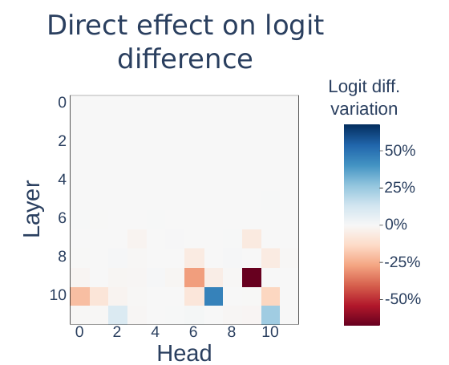
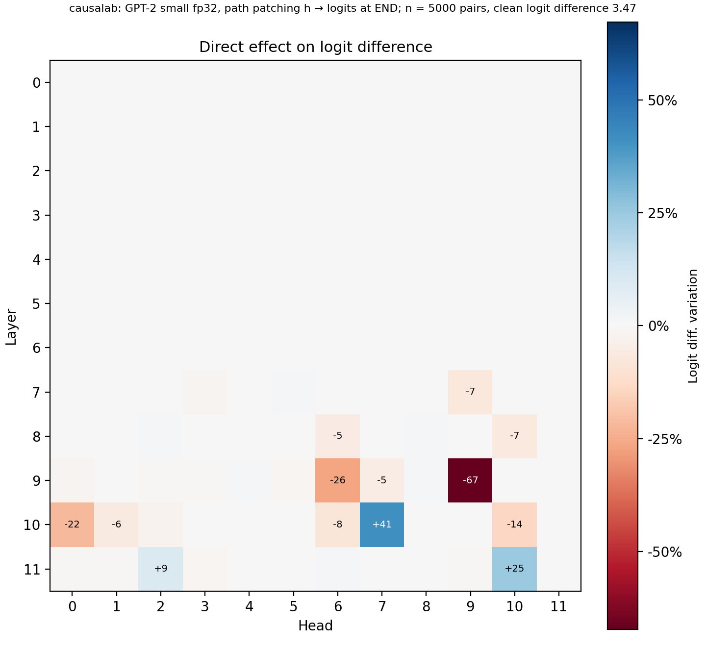
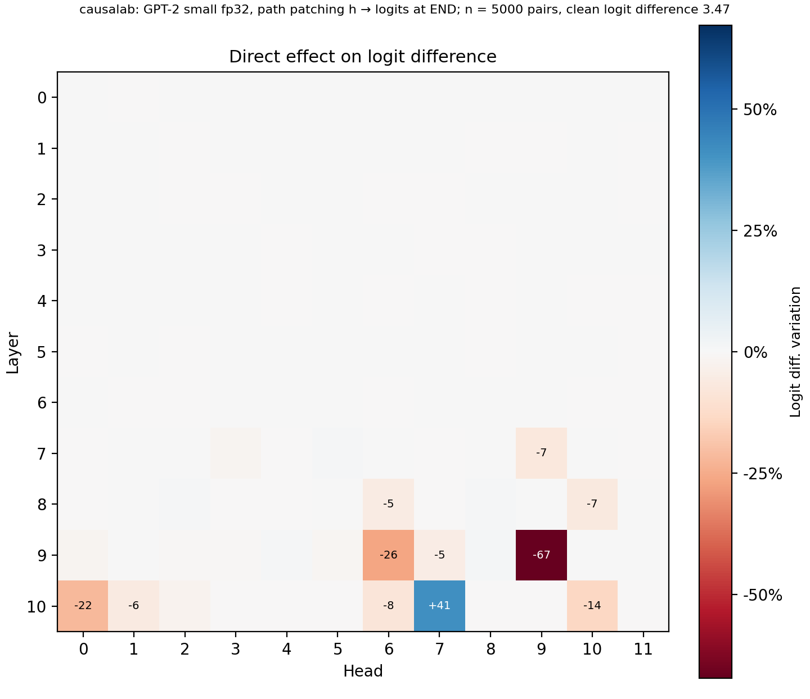
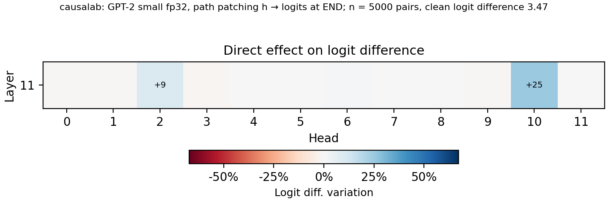

# Path patching

> Wang et al. **Interpretability in the Wild: a Circuit for Indirect Object Identification in GPT-2 small.**
> [[arXiv]](https://arxiv.org/abs/2211.00593)

**Figure context:**

- GPT-2 small completes `When Mary and John went to the store, John gave a
  drink to` with the indirect object (IO) ` Mary` over the repeated subject
  (S) ` John`.
- Which attention heads write this answer straight into the logits?
- Path patching replaces the output of one head at the last token with its
  value on the same sentence with three unrelated names.
- Every later attention layer keeps its clean value, so the patch reaches the
  logits only through the residual stream and the MLPs. We measure how much
  the patch changes the logit difference IO − S, relative to its clean value.

### Original



### Replication



*Figure 1: Each head's direct effect on indirect object identification in
GPT-2 small: `When Mary and John went to the store, John gave a drink to` -->
` Mary`. A square, by layer (rows) and head (columns), is the relative change
of the mean logit difference over 5000 pairs when the head's direct path is
patched. Heads the paper colours at 0.01 or more keep their sign. Our clean
mean of 3.47 against the paper's 3.56 is unexplained (Method).*

## CausaLab implementation

Let's walk through the specification for running the path-patching scan of
layers 0 to 10 (Figure 1, every row but the last) in CausaLab. Expand the
dropdown to see the full implementation.

<details>
<summary><b>Full JSON</b></summary>

```json
{
  "header": {
    "protocol_version": "4",
    "description": "Figure 3b of Wang et al. 2022 (arXiv:2211.00593), layers 0-10: swap one GPT-2 small head's output at the last token for its value on the three-name prompt, hold every later attention layer at its clean value, and save the logit difference IO - S of the clean and patched runs; workflows/scripts/ioi_fig3b/fig3b_figure.py draws the relative change of their means."
  },
  "model": {"key": "gpt2", "revision": "607a30d783dfa663caf39e06633721c8d4cfcd7e", "dtype": "fp32"},
  "data": {
    "base": {"dataset": "ioi_fig3b/data", "field": "input"},
    "counterfactual": {"dataset": "ioi_fig3b/data", "field": "counterfactual_inputs[0]"}
  },
  "axes": {
    "sender": {
      "rows": [
        {"layers": 0, "freeze": [1, 2, 3, 4, 5, 6, 7, 8, 9, 10, 11]},
        {"layers": 1, "freeze": [2, 3, 4, 5, 6, 7, 8, 9, 10, 11]},
        {"layers": 2, "freeze": [3, 4, 5, 6, 7, 8, 9, 10, 11]},
        {"layers": 3, "freeze": [4, 5, 6, 7, 8, 9, 10, 11]},
        {"layers": 4, "freeze": [5, 6, 7, 8, 9, 10, 11]},
        {"layers": 5, "freeze": [6, 7, 8, 9, 10, 11]},
        {"layers": 6, "freeze": [7, 8, 9, 10, 11]},
        {"layers": 7, "freeze": [8, 9, 10, 11]},
        {"layers": 8, "freeze": [9, 10, 11]},
        {"layers": 9, "freeze": [10, 11]},
        {"layers": 10, "freeze": [11]}
      ],
      "key": "layers"
    }
  },
  "method": {
    "intervened_models": {
      "original_counterfactual": {"input": "counterfactual", "reads": ["v_sender"]},
      "original_base": {"input": "base", "reads": ["v_downstream", "logits_clean"]},
      "patched": {
        "input": "base",
        "reads": ["logits_patched"],
        "writes": ["swap_sender", "freeze"]
      }
    },
    "sites": {
      "sender": {
        "component": "attention_premix",
        "layers": {"axis": "sender.layers"},
        "head": {
          "sweep": {"range": [0, 12]}
        }
      },
      "downstream": {"component": "attention_output", "layers": {"axis": "sender.freeze"}},
      "lm_head": {"component": "lm_head"}
    },
    "reads": {
      "v_sender": {"site": "sender", "pos": -1},
      "v_downstream": {"site": "downstream", "pos": -1},
      "logits_clean": {"site": "lm_head", "pos": -1},
      "logits_patched": {"site": "lm_head", "pos": -1}
    },
    "writes": {
      "swap_sender": {"site": "sender", "pos": -1, "do": {"swap": "v_sender"}},
      "freeze": {"site": "downstream", "pos": -1, "do": {"swap": "v_downstream"}}
    },
    "save": [
      {
        "read": "logits_clean",
        "model": "original_base",
        "aggregation": {"kind": "logit_diff", "a": "base_answer", "b": "s_answer"},
        "file_path": "ld_clean.json"
      },
      {
        "read": "logits_patched",
        "model": "patched",
        "aggregation": {"kind": "logit_diff", "a": "base_answer", "b": "s_answer"},
        "file_path": "ld_patched.json"
      }
    ]
  }
}
```

</details>

### Load GPT-2 small and the IOI prompt pairs

```json
"model": {"key": "gpt2", "revision": "607a30d783dfa663caf39e06633721c8d4cfcd7e", "dtype": "fp32"},  // a pinned snapshot of the Hub repo gpt2
"data": {
    "base": {"dataset": "ioi_fig3b/data", "field": "input"},  // the IOI sentence, ending at "to"
    "counterfactual": {"dataset": "ioi_fig3b/data", "field": "counterfactual_inputs[0]"}  // the same sentence with three unrelated names
}
```

### Define the counterfactual, clean and patched models, with reads and writes as placeholders

```json
"intervened_models": {
    "original_counterfactual": {"input": "counterfactual", "reads": ["v_sender"]},
    "original_base": {"input": "base", "reads": ["v_downstream", "logits_clean"]},  // the values to freeze, and the clean logits
    "patched": {
        "input": "base",
        "reads": ["logits_patched"],
        "writes": ["swap_sender", "freeze"]  // one forward on the IOI sentence with both writes
    }
}
```

### Select one head's output, the attention output of every later layer, and the logits

Both sites take their layers from the `sender` axis in the next chunk, so
each point pairs one sender layer with the attention layers after it.

```json
"sites": {
    "sender": {
        "component": "attention_premix",  // the input of the output projection: one head's slice is that head's output
        "layers": {"axis": "sender.layers"},
        "head": {
            "sweep": {"range": [0, 12]}  // crossed with the axis: 11 layers x 12 heads = 132 points
        }
    },
    "downstream": {"component": "attention_output", "layers": {"axis": "sender.freeze"}},
    "lm_head": {"component": "lm_head"}
}
```

### Pair each sender layer with the later layers it freezes

```json
"axes": {
    "sender": {
        "rows": [  // one row per sender layer: every attention layer after it is frozen
            {"layers": 0, "freeze": [1, 2, 3, 4, 5, 6, 7, 8, 9, 10, 11]},
            {"layers": 1, "freeze": [2, 3, 4, 5, 6, 7, 8, 9, 10, 11]},
            {"layers": 2, "freeze": [3, 4, 5, 6, 7, 8, 9, 10, 11]},
            {"layers": 3, "freeze": [4, 5, 6, 7, 8, 9, 10, 11]},
            {"layers": 4, "freeze": [5, 6, 7, 8, 9, 10, 11]},
            {"layers": 5, "freeze": [6, 7, 8, 9, 10, 11]},
            {"layers": 6, "freeze": [7, 8, 9, 10, 11]},
            {"layers": 7, "freeze": [8, 9, 10, 11]},
            {"layers": 8, "freeze": [9, 10, 11]},
            {"layers": 9, "freeze": [10, 11]},
            {"layers": 10, "freeze": [11]}
        ],
        "key": "layers"  // the column that names a row in the saved tables
    }
}
```

### Define reads: the head on the three-name sentence, the clean later attention, and the final logits

```json
"reads": {
    "v_sender": {"site": "sender", "pos": -1},  // -1 is the token " to" on every row
    "v_downstream": {"site": "downstream", "pos": -1},
    "logits_clean": {"site": "lm_head", "pos": -1},
    "logits_patched": {"site": "lm_head", "pos": -1}
}
```

### Define writes: patch the head and freeze every later attention layer

```json
"writes": {
    "swap_sender": {"site": "sender", "pos": -1, "do": {"swap": "v_sender"}},
    "freeze": {"site": "downstream", "pos": -1, "do": {"swap": "v_downstream"}}  // the MLPs are not frozen and recompute
}
```

### Save logit(IO) − logit(S) on the clean and the patched run

```json
"save": [
    {
        "read": "logits_clean",
        "model": "original_base",
        "aggregation": {"kind": "logit_diff", "a": "base_answer", "b": "s_answer"},  // " Mary" against " John", each one token
        "file_path": "ld_clean.json"  // the clean mean is the denominator of each square
    },
    {
        "read": "logits_patched",
        "model": "patched",
        "aggregation": {"kind": "logit_diff", "a": "base_answer", "b": "s_answer"},
        "file_path": "ld_patched.json"
    }
]
```

Given the specification, CausaLab produces:



*Head 9.9 lowers the logit difference by 0.672 of its clean value, 9.6 by
0.263, 10.0 by 0.216 and 10.10 by 0.139, and 10.7 raises it by 0.411. The
paper gives 0.673, 0.282, 0.207, 0.146 and 0.455 in Figure 3b and 0.662,
0.273, 0.230, 0.146 and 0.422 in Figure 15. Each gap is inside the reading
error plus the allowance of Method: 0.071, 0.048, 0.046, 0.024 and 0.059.
Heads below layer 7 stay within 0.003.*

## Layer 11: change these lines

Layer 11 comes from
[`protocols/ioi_fig3b_direct_effect_last_layer.json`](protocols/ioi_fig3b_direct_effect_last_layer.json),
which the workflow runs as the `last` step. No attention layer lies after
layer 11, so there is nothing to freeze. The sender axis, the downstream
site, its read and the freeze write go.

### Layer 11

```diff
-"axes": {"sender": {"rows": [...], "key": "layers"}},
 "intervened_models": {
-    "original_base": {"input": "base", "reads": ["v_downstream", "logits_clean"]},
+    "original_base": {"input": "base", "reads": ["logits_clean"]},
-    "patched": {"input": "base", "reads": ["logits_patched"], "writes": ["swap_sender", "freeze"]}
+    "patched": {"input": "base", "reads": ["logits_patched"], "writes": ["swap_sender"]}
 },
 "sites": {
     "sender": {
-        "layers": {"axis": "sender.layers"},
+        "layers": [11],
-    "downstream": {"component": "attention_output", "layers": {"axis": "sender.freeze"}},
 "reads": {
-    "v_downstream": {"site": "downstream", "pos": -1},
 "writes": {
-    "freeze": {"site": "downstream", "pos": -1, "do": {"swap": "v_downstream"}}
```



*Head 11.10 raises the logit difference by 0.247 of its clean value and
head 11.2 by 0.095. The paper gives 0.239 and 0.099 in Figure 3b and 0.241
and 0.119 in Figure 15, inside the reading error plus 0.034 and 0.033
(Method). The paper marks them as a Negative Name Mover and a Backup Name
Mover. The other ten heads of layer 11 stay within 0.012.*

## Further Details

<details>
<summary><b>Method</b></summary>

**Pairs.** [`workflows/scripts/ioi_fig3b/build_dataset.py`](workflows/scripts/ioi_fig3b/build_dataset.py)
draws 5000 pairs with seed 0. Where the authors' code and the paper's text
differ, it follows the code. It samples 14 templates, the first seven of
Figure 14 in each name order, as the code's `IOIDataset(prompt_type="mixed")`
does ([`ioi_dataset.py`](https://github.com/redwoodresearch/Easy-Transformer/blob/ea15315dd24481e9e2ac5c3ef335d82907a1dc34/easy_transformer/ioi_dataset.py#L708-L720)).
The paper's Appendix E lists all 15 templates in both orders, 30 in all.
Names come from the code's 99 single-token first names, and places and
objects from its 8 + 8 words. The paper says 100 names and a hand-made list
of 20 words, and no public revision of the code holds other lists. The
counterfactual keeps the template, place and object and draws three fresh
names. These never collide with each other or with the base pair, where the
authors' code lets them collide.

**Sample size.** The paper averages over "N > 200 pairs". The authors'
path-patching code draws 100 pairs right after loading the model
([`experiments.py`](https://github.com/redwoodresearch/Easy-Transformer/blob/ea15315dd24481e9e2ac5c3ef335d82907a1dc34/experiments.py#L73-L84)),
and loading the model seeds Python's `random` with 42
([`EasyTransformerConfig.py`](https://github.com/redwoodresearch/Easy-Transformer/blob/ea15315dd24481e9e2ac5c3ef335d82907a1dc34/easy_transformer/EasyTransformerConfig.py#L111)).
So a fresh process always draws the same 100 pairs, and
[`authors_draw.py`](workflows/scripts/ioi_fig3b/authors_draw.py) rebuilds
them with the authors' own dataset code. On those pairs this workflow gives
9.9 −0.705 and 10.1 −0.046. It misses Figure 3b by up to 0.041 and Figure 15
by up to 0.044, far beyond the reading error. The two figures also differ
from each other by up to 0.033 (head 10.7), so at least one of them comes
from another random state. We could not recover the paper's pairs. We draw
5000 pairs, so that the paired bootstrap standard error of every head, `se`
in [`fig3b_plotted.json`](artifacts/figures/ioi_fig3b/fig3b_plotted.json), is
at most 0.0049. That is below the 0.005 reading error of Figure 3b.

**Paper values.** [`paper_values.py`](workflows/scripts/ioi_fig3b/paper_values.py)
reads the paper's values off its PDF into
[`fig3b_wang2022_values.json`](artifacts/data/ioi_fig3b/fig3b_wang2022_values.json).
It decodes each Figure 3b cell from its colour, through the plotly scale the
authors' code draws with, to within 0.005. It reads each Figure 15 bar from
the vector drawing, to within 0.001.

**Comparison with the paper.** `sd_n100` in `fig3b_plotted.json` is the
spread of one head's value over bootstrap draws of 100 of our pairs, the size
of the authors' draw. A paper value matches ours when the gap is at most its
reading error plus 2 √(`sd_n100`² + `se`²). All 15 heads of Figure 15 match
against both figures. χ² over the 15 is 10.6 against Figure 3b and 10.4
against Figure 15, below 25.0, the 0.95 quantile with 15 degrees of freedom.
Without the `sd_n100` term, 5 heads fail against Figure 3b and 12 against
Figure 15.
[`fig3b_compare.json`](artifacts/figures/ioi_fig3b/fig3b_compare.json) holds
these numbers and the ones below.

**Orders and signs.** The top 7 heads keep the paper's order in every
bootstrap resample of our pairs, and each margin is at least 4.6 paired
standard errors. Places 8 to 15 hold Figure 15's heads in 0.998 of the
resamples. Their order does not match the paper. Both figures put 10.1 above
10.6 and above 8.10. We find |10.6| above |10.1| by 0.018 and |8.10| above
it by 0.003, with paired standard errors of 0.003 and 0.002. The authors'
fresh-process draw above also puts 10.6 and 8.10 above 10.1. A 100-pair draw
of our pairs puts 10.1 above 10.6 in 0.21 of draws and above 8.10 in 0.41.
The other 20 tail orders that both figures share hold here, and a 100-pair
draw keeps all 22 in 0.11. The 20 heads that Figure 3b shows at 0.01 or more
keep their sign. Three fainter heads have the other sign. Heads 9.8 and 8.11
read −0.005 in the paper, one 8-bit step from white, and we find +0.012 and
+0.003. Our 9.8 would show as a faint blue cell, as the paper's 9.4 at
+0.007 does.

**Clean baseline.** The clean model prefers IO on 4976 of our 5000 pairs
(0.995), with a mean logit difference of 3.47 ± 0.02. The paper reports
0.993 and 3.56 over 100,000 prompts, with p(IO) 0.49. A plain Hugging Face
run of the authors' generator over 200,000 prompts, outside this workflow,
gives 0.995, 3.49 ± 0.003 and p(IO) 0.50. All three miss the paper by more
than the sampling error of its 100,000 prompts. A BOS token, all 30 templates
or one name order does not give the three paper values together. We did not
run the authors' own model code, which folds and centres the weights. We
cannot explain the gap, and it stays a limit of this replication.

**Answer spelling.** The metric compares the columns `base_answer`
(` Jennifer`) and `s_answer` (` Kevin`), and each is tokenized as written. A
bare name is not always one GPT-2 token (`Travis` is `T` + `ravis`). With
its leading space, every name is one token.

**Freeze.** The freeze holds the whole attention output of each later layer,
where the paper holds its heads one by one. This is the same value: the sum
of the heads plus a bias that no head owns.

</details>

<details>
<summary><b>Execution</b>: environment, run command, flags, resources, workflow</summary>

**Environment.** `gpt2` is OpenAI's GPT-2 small, and its model card lists
the MIT license. It needs no token. Both documents pin the snapshot
`607a30d783dfa663caf39e06633721c8d4cfcd7e` of the Hub repo `gpt2`. The first
run downloads 548 MB of weights or reads them from a cache:

```bash
export HF_HUB_CACHE=/path/to/cache  # optional: a cache that already holds gpt2
```

**Run.** From `demos/papers/`, run the workflow, then draw the figure, which
needs no accelerator:

```bash
causalab run workflows/ioi_fig3b.json \
    --engine auto \
    --data-root artifacts/data \
    --out artifacts/output \
    --device cuda \
    --batch-rows 500
python workflows/scripts/ioi_fig3b/fig3b_figure.py
```

**Flags.** `--data-root` is the folder that dataset references resolve
against, so `ioi_fig3b/data` reads `artifacts/data/ioi_fig3b/data.json`.
`--out artifacts/output` puts the run tree under `artifacts/output/ioi_fig3b/`,
the workflow's `output_dir`. The figure script reads `scan/` and `last/`
there and the paper's values, and writes `fig3b_replication.png`,
`fig3b_scan.png`, `fig3b_last.png`, `fig3b_plotted.json` and
`fig3b_compare.json` to `artifacts/figures/ioi_fig3b/`. `--batch-rows 500`
bounds one forward to 500 pairs. Both documents pin `fp32`, and a workflow
refuses `--dtype`. `--resume` makes a resubmission reuse every step whose
recorded digests still match. On an Apple-silicon laptop pass `--device mps
--batch-rows 250`. Replace `run` with `validate` and drop the run-only flags
to check the documents without loading weights.

**Resources and reproducibility.** The run needs one accelerator with a few
GB of memory and no gradients. The `scan` step fans out one child per sender
layer, which bounds host memory. The committed figures come from one run on
one H100 80GB on 2026-09-28, in fp32 with the `pytorch_hooks` engine. The
workflow took 229 s of wall time, the run peaked at 4.5 GB of host memory,
and the run tree is 625 MB. The figure script takes about 12 s more. The same
run did the workflow on the authors' draw in 31 s. Every per-pair value
equals that of an earlier H100 run of the same documents and table. On an
Apple-silicon laptop that other jobs shared, the code of that earlier run
with `--device mps --batch-rows 250` took 31 minutes and peaked at 3.3 GB.
Its values equal the H100's within 1.5e-4 logits per pair and 2.1e-7 per
head.

**Workflow.** [`workflows/ioi_fig3b.json`](workflows/ioi_fig3b.json) runs, in
order: `scan`, the layers 0 to 10 document
([`protocols/ioi_fig3b_direct_effect.json`](protocols/ioi_fig3b_direct_effect.json)),
fanned out one child per row of the `sender` axis and joined when all eleven
finish; then `last`, the layer 11 document
([`protocols/ioi_fig3b_direct_effect_last_layer.json`](protocols/ioi_fig3b_direct_effect_last_layer.json)).
Neither step hands values to the other.
[`workflows/scripts/ioi_fig3b/fig3b_figure.py`](workflows/scripts/ioi_fig3b/fig3b_figure.py)
reads both, takes the mean clean and patched logit difference of each head
over the 5000 pairs, draws their ratio minus one, and resamples the pairs for
`se`, `sd_n100` and the comparison with the paper. The setup departs from
the paper's text in three ways and from the authors' code in two, each
described under Method. The templates are the code's 14 where the text lists
30. The names, places and objects are the code's lists where the text
describes longer ones. The sample is 5000 pairs with seed 0, where the text
says more than 200 and the code draws 100 under the seed 42 that loading the
model sets. The three-name prompts never repeat a name, where the code's
flips can repeat one. The freeze holds the whole attention output of each
later layer, which is the same as freezing every head.

</details>

<details>
<summary><b>Intervention protocol parameters</b>: what to change for a different model, task or grid</summary>

| field | here | to change |
|---|---|---|
| `model.key` | `gpt2` | any registered causal LM; the layer and head ranges below follow its shape |
| `model.revision` | a snapshot hash | the new checkpoint's snapshot, or `main` |
| `data.base.dataset` | `ioi_fig3b/data` | another table with `input`, `counterfactual_inputs` and two single-token answer columns |
| `axes.sender.rows` | layers 0 to 10, each with the layers after it | one row per sender layer of the new model |
| `sites.sender.head` | `range [0, 12]` | the model's head count |
| `sites.sender.layers` (`last_layer`) | `[11]` | the model's last layer |
| `save[].aggregation.a`, `.b` | `base_answer`, `s_answer` | the columns that hold the two competing answers, as the model would write them |

[The intervention reference](../../docs/intervention_protocol.md) defines
every field.

</details>
