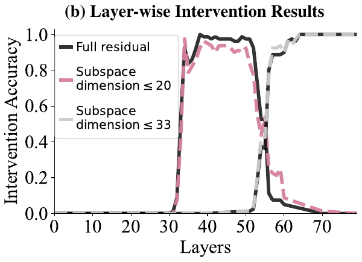
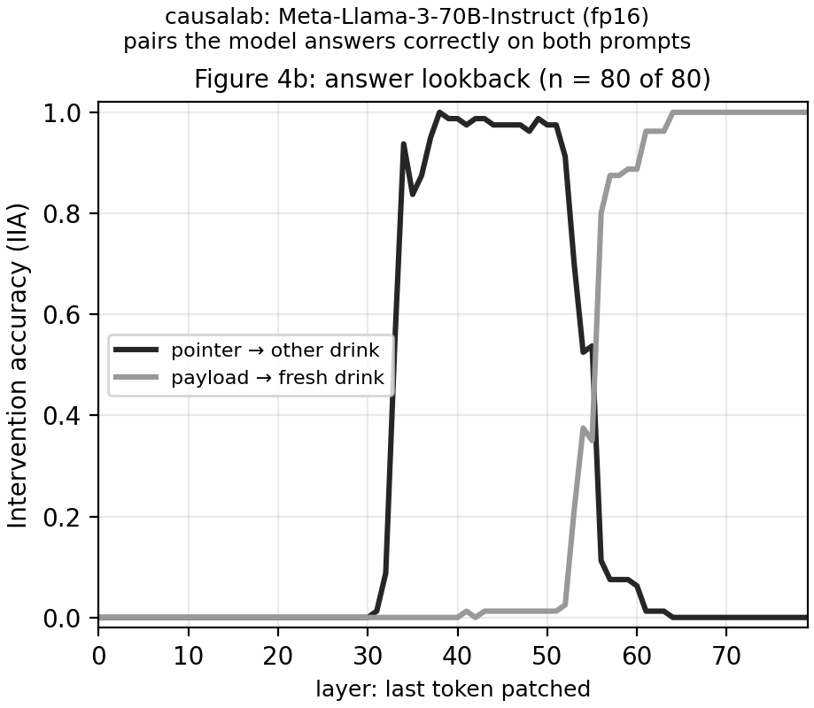
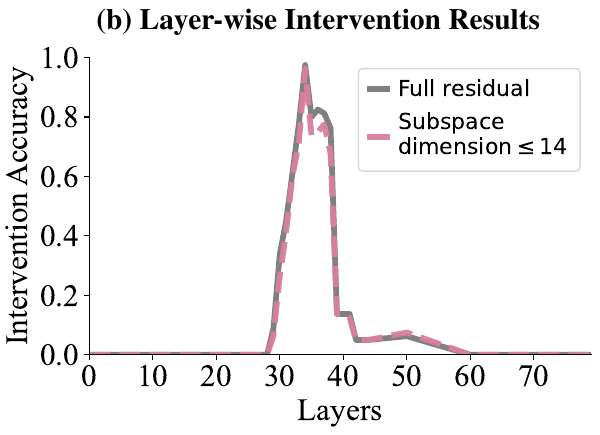
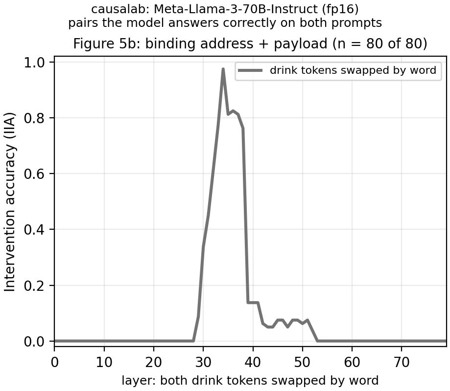
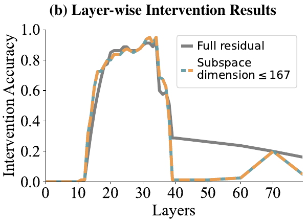
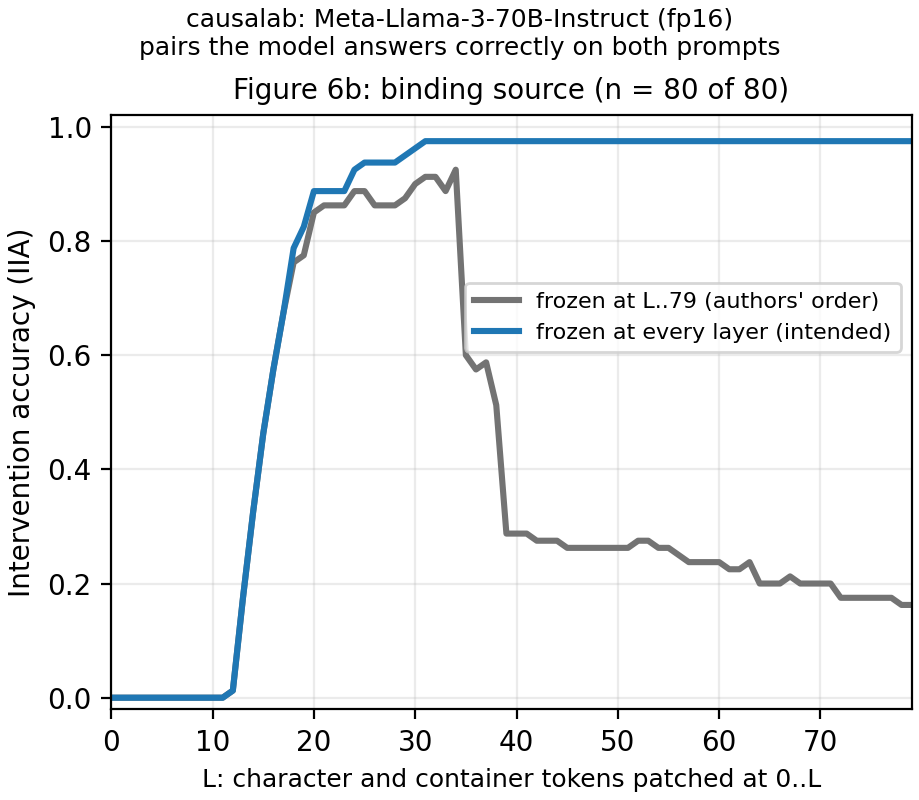
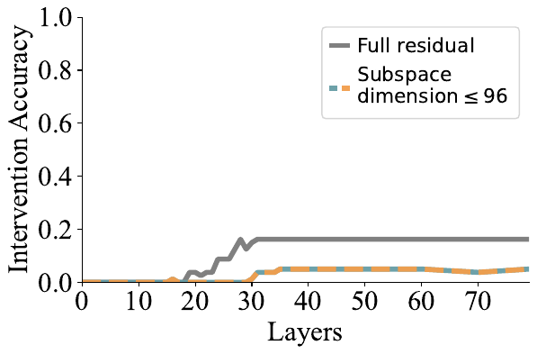
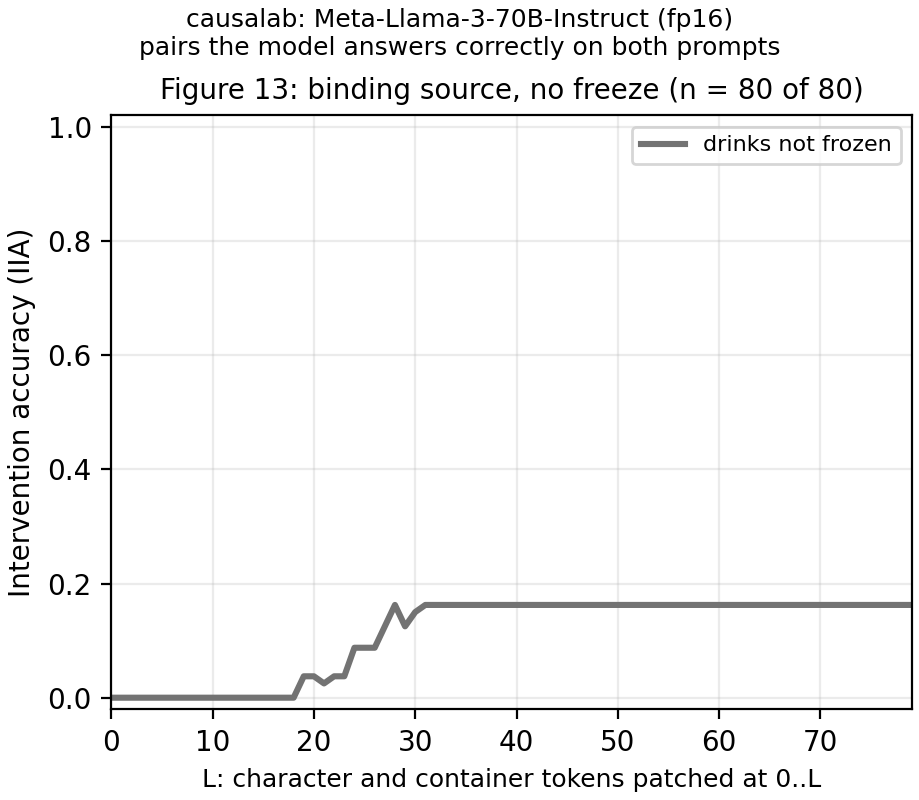

# Interchange at several sites at once

> Prakash et al. **Language Models use Lookbacks to Track Beliefs.**
> [[arXiv]](https://arxiv.org/abs/2505.14685)

**Figure context:**

- Llama-3-70B-Instruct reads a story in which two characters each fill an
  opaque container with a drink, then says what one character believes one
  container holds.
- At which layers does each step of the model's belief lookup happen?
- The paper proposes that the model tags each character, container and drink
  with an ordering ID and looks the answer up through these IDs. We patch in
  a counterfactual story's residual stream and check the answer against a
  causal model of this lookup.
- Figure 4b patches the last token at one layer, and the others patch
  several sites in one forward.

### Original



### Replication



*Figure 1: The answer lookback in Llama-3-70B-Instruct at fp16, on the
paper's 80 story pairs. Each point is the share of pairs on which the
patched model gives the causal model's answer. The pointer moves the answer
from layer 33 (0.5375), and the payload takes over at layer 56 (0.80). Both
curves are within 2/80 of the paper at every layer it samples. We patch only
the full residual stream and draw none of the subspace curves.*

## CausaLab implementation

Let's walk through the specification for running the answer lookback
experiment (Figure 1) in CausaLab. Expand the dropdown to see
the full implementation.

<details>
<summary><b>Full JSON</b></summary>

```json
{
  "header": {
    "protocol_version": "4",
    "description": "Figure 4b of Prakash et al. 2025 (arXiv:2505.14685): at one layer, swap the counterfactual's residual stream at the last token into the original story, and score the one patched forward against the moved answer pointer (label_pointer_forms) and the moved answer payload (label_forms); workflows/scripts/lookbacks/lookbacks_figure.py draws both curves, over every pair and over the pairs lookbacks_clean_accuracy.json marks correct."
  },
  "model": {
    "key": "meta-llama/Meta-Llama-3-70B-Instruct",
    "revision": "50fd307e57011801c7833c87efa1984ddf2db42f",
    "dtype": "fp16"
  },
  "data": {
    "base": {"dataset": "lookbacks/data_restate#first", "field": "input"},
    "counterfactual": {"dataset": "lookbacks/data_restate#first", "field": "counterfactual_inputs[0]"}
  },
  "method": {
    "intervened_models": {
      "original_counterfactual": {"input": "counterfactual", "reads": ["v_cf"]},
      "patched": {"input": "base", "reads": ["logits"], "writes": ["swap"]}
    },
    "sites": {
      "target": {
        "component": "block_output",
        "layers": {
          "sweep": {"range": [0, 80]}
        }
      },
      "lm_head": {"component": "lm_head"}
    },
    "reads": {"v_cf": {"site": "target", "pos": -1}, "logits": {"site": "lm_head", "pos": -1}},
    "writes": {
      "swap": {"site": "target", "pos": -1, "do": {"swap": "v_cf"}}
    },
    "save": [
      {
        "read": "logits",
        "model": "patched",
        "aggregation": {"kind": "match", "expected": "label_pointer_forms"},
        "file_path": "iia_pointer.json"
      },
      {
        "read": "logits",
        "model": "patched",
        "aggregation": {"kind": "match", "expected": "label_forms"},
        "file_path": "iia_payload.json"
      }
    ]
  }
}
```

</details>

### Load the 70B model at fp16 and the restate table's first split

```json
"model": {
    "key": "meta-llama/Meta-Llama-3-70B-Instruct",
    "revision": "50fd307e57011801c7833c87efa1984ddf2db42f",
    "dtype": "fp16"  // the paper's precision: 140 GB of weights, run across three 80 GB GPUs
},
"data": {
    "base": {"dataset": "lookbacks/data_restate#first", "field": "input"},  // 40 of the paper's 80 original stories; the workflow sets #second
    "counterfactual": {"dataset": "lookbacks/data_restate#first", "field": "counterfactual_inputs[0]"}  // the other order, two fresh drinks
}
```

### Define the counterfactual and patched models, with reads and writes as placeholders

```json
"intervened_models": {
    "original_counterfactual": {"input": "counterfactual", "reads": ["v_cf"]},
    "patched": {"input": "base", "reads": ["logits"], "writes": ["swap"]}
}
```

### Select the residual stream after each of the 80 blocks, and the output head

```json
"sites": {
    "target": {
        "component": "block_output",
        "layers": {"sweep": {"range": [0, 80]}}  // sweep: a separate intervention per layer
    },
    "lm_head": {"component": "lm_head"}
}
```

### Define reads: the counterfactual residual at the last token, and the patched logits

```json
"reads": {
    "v_cf": {"site": "target", "pos": -1},  // the ":" after "Answer"
    "logits": {"site": "lm_head", "pos": -1}
}
```

### Define writes: swap the counterfactual residual into the original story

```json
"writes": {
    "swap": {"site": "target", "pos": -1, "do": {"swap": "v_cf"}}
}
```

### Score one patched forward against the moved pointer and the moved payload

```json
"save": [
    {
        "read": "logits",
        "model": "patched",
        "aggregation": {"kind": "match", "expected": "label_pointer_forms"},  // pointer moved: the original story's other drink
        "file_path": "iia_pointer.json"
    },
    {
        "read": "logits",
        "model": "patched",
        "aggregation": {"kind": "match", "expected": "label_forms"},  // payload moved: the counterfactual's own drink
        "file_path": "iia_payload.json"
    }
]
```

## Figures 5b, 6b and 13: change these lines

Figure 5b comes from
[`protocols/lookbacks_binding_lookback.json`](protocols/lookbacks_binding_lookback.json).
Figures 6b and 13 come from
[`protocols/lookbacks_binding_source.json`](protocols/lookbacks_binding_source.json).
Each is the JSON above with other positions, sites, writes and saves. Both
patch several sites in one forward: 5b the two drink mentions, and 6b six
character and container mentions over layers 0 to L, one `axes.upto` row
per L. The three 6b models save one curve each, with the drinks frozen at
layers L to 79 (`late`), at every layer (`frozen`) or not at all
(`unfrozen`, Figure 13).

### Binding lookback: both drink tokens, swapped by word

```diff
 "data": {
-    "base": {"dataset": "lookbacks/data_restate#first", "field": "input"},
-    "counterfactual": {"dataset": "lookbacks/data_restate#first", "field": "counterfactual_inputs[0]"}
+    "base": {"dataset": "lookbacks/data_reorder#first", "field": "input"},
+    "counterfactual": {"dataset": "lookbacks/data_reorder#first", "field": "counterfactual_inputs[0]"}
 },
 "intervened_models": {
-    "original_counterfactual": {"input": "counterfactual", "reads": ["v_cf"]},
-    "patched": {"input": "base", "reads": ["logits"], "writes": ["swap"]}
+    "original_counterfactual": {"input": "counterfactual", "reads": ["v_state_a", "v_state_b"]},
+    "patched": {"input": "base", "reads": ["logits"], "writes": ["swap_state_a", "swap_state_b"]}
 },
+"positions": {
+    "state_a": {"variable": "state_a_mention"},
+    "state_b": {"variable": "state_b_mention"}
+},
 "sites": {
-    "target": {"component": "block_output", "layers": {"sweep": {"range": [0, 80]}}},
+    "states": {"component": "block_output", "layers": {"sweep": {"range": [0, 80]}}},
 "reads": {
-    "v_cf": {"site": "target", "pos": -1},
+    "v_state_a": {"site": "states", "pos": "state_a"},
+    "v_state_b": {"site": "states", "pos": "state_b"},
 "writes": {
-    "swap": {"site": "target", "pos": -1, "do": {"swap": "v_cf"}}
+    "swap_state_a": {"site": "states", "pos": "state_a", "do": {"swap": "v_state_a"}},
+    "swap_state_b": {"site": "states", "pos": "state_b", "do": {"swap": "v_state_b"}}
 "save": [
-    {..., "expected": "label_pointer_forms"}, "file_path": "iia_pointer.json"},
-    {..., "expected": "label_forms"}, "file_path": "iia_payload.json"}
+    {..., "expected": "label_forms"}, "file_path": "iia_binding.json"}
```

| Original | Replication |
|---|---|
|  |  |

*Swapping both drink tokens sends the answer to the original's other drink
from layer 29, with the peak 0.975 at layer 34 and 0.7625 to 0.825 over
layers 35 to 38. It is 0 from layer 53, within 1/80 of the paper at every
layer it samples.*

### Binding source: character and container tokens over layers 0 to L, drinks frozen

```diff
+"axes": {
+    "upto": {
+        "rows": [
+            {"L": 0, "layers": [0], "late": [0, 1, ..., 79]},
+            {"L": 1, "layers": [0, 1], "late": [1, 2, ..., 79]},
+            // ... one row per L up to 79: patch layers 0 to L, the late freeze at L to 79
+        ],
+        "key": "L"
+    }
+},
 "intervened_models": {
-    "original_counterfactual": {"input": "counterfactual", "reads": ["v_cf"]},
-    "patched": {"input": "base", "reads": ["logits"], "writes": ["swap"]}
+    "original_counterfactual": {"input": "counterfactual", "reads": ["v_intro_a", "v_intro_b", "v_char_a", "v_char_b", "v_obj_a", "v_obj_b"]},
+    "original_base": {"input": "base", "reads": ["v_states", "v_states_late"]},
+    "late": {"input": "base", "reads": ["logits_late"], "writes": ["swap_intro_a", ..., "swap_obj_b", "freeze_late"]},
+    "frozen": {"input": "base", "reads": ["logits_frozen"], "writes": ["swap_intro_a", ..., "swap_obj_b", "freeze"]},
 },
+"positions": {
+    "intro_a": {"index": -1, "scope": {"variable": "intro_a"}},
+    "char_a": {"variable": "char_a_action"},
+    "obj_a": {"indices": [0, 1], "scope": {"variable": "obj_a_action"}},
+    // ... the same three for triple b
+    "state_tokens": {"union": [{"variable": "state_a_mention"}, {"variable": "state_b_mention"}]}
+},
 "sites": {
-    "target": {"component": "block_output", "layers": {"sweep": {"range": [0, 80]}}},
+    // one site per swap the overlap check cannot prove disjoint from the others
+    "src_intro_a": {"component": "block_output", "layers": {"axis": "upto.layers"}},
+    "src_char": {"component": "block_output", "layers": {"axis": "upto.layers"}},
+    "src_obj_a": {"component": "block_output", "layers": {"axis": "upto.layers"}},
+    // ... src_intro_b and src_obj_b the same
+    "states": {"component": "block_output", "layers": {"at_once": {"range": [0, 80]}}, "names": "states{layers}"},
+    "states_late": {"component": "block_output", "layers": {"axis": "upto.late"}},
 "reads": {
-    "v_cf": {"site": "target", "pos": -1},
-    "logits": {"site": "lm_head", "pos": -1},
+    "v_char_a": {"site": "src_char", "pos": "char_a"},
+    // ... one read for each of the six character and container mentions
+    "v_states": {"site": "states", "pos": "state_tokens", "names": "v_states{layers}"},
+    "v_states_late": {"site": "states_late", "pos": "state_tokens"},
+    "logits_late": {"site": "lm_head", "pos": -1},
+    "logits_frozen": {"site": "lm_head", "pos": -1},
 "writes": {
-    "swap": {"site": "target", "pos": -1, "do": {"swap": "v_cf"}}
+    "swap_char_a": {"site": "src_char", "pos": "char_a", "do": {"swap": "v_char_a"}},
+    // ... one swap for each of the six character and container mentions
+    "freeze": {"site": "states", "pos": "state_tokens", "do": {"swap": "v_states"}, "names": "freeze{layers}"},
+    "freeze_late": {"site": "states_late", "pos": "state_tokens", "do": {"swap": "v_states_late"}}
 "save": [
-    {..., "expected": "label_pointer_forms"}, "file_path": "iia_pointer.json"},
-    {..., "expected": "label_forms"}, "file_path": "iia_payload.json"}
+    {"read": "logits_late", "model": "late", ..., "expected": "label_source_forms"}, "file_path": "iia_late.json"},
+    {"read": "logits_frozen", "model": "frozen", ..., "expected": "label_source_forms"}, "file_path": "iia_frozen.json"},
```

| Original | Replication |
|---|---|
|  |  |

*With the drinks frozen only at layers L to 79, in the authors' write order,
the answer moves to the other drink from L = 13 (0.175) and holds 0.85 to
0.925 over L = 20 to 34. It falls to 0.60 at L = 35, equal to the paper at
every sampled layer. Frozen at every layer, as intended, it stays at 0.975
from L = 31.*

### Figure 13 control: the same patch without the freeze

```diff
 "intervened_models": {
+    "unfrozen": {"input": "base", "reads": ["logits_unfrozen"], "writes": ["swap_intro_a", ..., "swap_obj_b"]}  // the six swaps, no freeze
 },
 "reads": {
+    "logits_unfrozen": {"site": "lm_head", "pos": -1}
 },
 "save": [
+    {"read": "logits_unfrozen", "model": "unfrozen", ..., "expected": "label_source_forms"}, "file_path": "iia_unfrozen.json"}
 ]
```

| Original | Replication |
|---|---|
|  |  |

*Without the freeze, the patch moves the answer on 0.0375 of the pairs at L
= 19 and on 0.1625 from L = 28, with a dip at L = 29 and 30. It equals the
paper at every sampled layer, dip included.*

## Further Details

<details>
<summary><b>Method</b></summary>

**The paper's pairs.** The authors' scripts (`Nix07/mind` at `3d38e1b`)
seed with `set_seed(123456)`, draw 320 candidate pairs per design, keep the
first 160 on which the model answers both prompts correctly, and validate on
the last 80 of them. The paper does not give the seed, and the shipped values
predate these scripts: they first appear a month earlier, at `9f84103`. So
the seed of the later scripts names the pairs only together with the match to
the paper's values below.
[`workflows/scripts/lookbacks/build_dataset.py`](workflows/scripts/lookbacks/build_dataset.py)
makes the authors' random calls in their order, with their prompt, story
template 2 and word lists. For 5b this is the generator at `0579347`. The
`3d38e1b` 5b generator uses template 0, and in a run of the authors' code
outside this workflow its pairs miss the plotted values by up to 11/80. The
counterfactual tells the same story in the other order, with the same drinks
in `data_reorder.json` (5b) and with two fresh drinks in `data_restate.json`
(4b, 6b, 13). Each table holds candidates 80 to 159 in two 40-row splits
`first` and `second`.

**Correct pairs.** The baseline document
[`protocols/lookbacks_clean_accuracy.json`](protocols/lookbacks_clean_accuracy.json)
scores the un-intervened answer on both prompts of every pair. The figure
script keeps a pair only when both answers are correct, which holds for all
80 pairs of both tables. The `screen_*` steps run the same document on
candidates 0 to 79 of each design (`data_restate_screen.json`,
`data_reorder_screen.json`), and the model answers both prompts of all 80 in
each. The authors' filter credits these spellings too, so it keeps the first
160 candidates, and the validation pairs are candidates 80 to 159.

**Precision.** The paper's text runs this model at fp16, and the notebook
committed with the shipped values loads it at fp16 in a commented-out line.
The `3d38e1b` scripts load bf16. We run fp16 and did not run bf16.

**Answer spelling.** Each answer column (`label_forms`,
`label_pointer_forms`, `label_source_forms`, and the baseline's
`base_answer_forms` and `cf_answer_forms`) holds two spellings, the
space-prefixed word in lower case and capitalized. Each is one Llama-3 token.
The model often answers `" Monster"` for `monster`. The authors credit any
answer token whose text equals the target after lower-casing and stripping
spaces, which also credits other casings and the bare word. We credit only
the two spellings, and with them the curves stay within 2/80 of the paper.

**Positions.** The authors patch fixed token indices. We patch the same
tokens by anchor: the character's name in the first sentence, the name and
"grabs", the object and "and", and the drink and its period. The object
anchor is `"<object> and fills"`, because the instruction says "the
container and its contents" and the object `container` would otherwise
match twice.

**Write order in Figure 6b.** The paper's text patches the character and
object tokens layer by layer with the drink tokens fixed. The authors'
`run_upto_layer_patching_exps.py` patches layers 0 to L, and it issues every
patch write before every freeze write. In a GPT-2 check outside this
workflow, nnsight 0.4.3 and 0.4.6 apply the freeze of each layer below L only
at layer L's hook, after that layer's output was used. The drawn curve thus
freezes the drink tokens only at layers L to 79. We follow the code: the
`late` model makes that intervention and equals the paper at all 36 sampled
layers. The `frozen` model freezes every layer, as the text intends. The two
curves have equal values up to L = 17, and the intended curve is 2/80 to
7/80 higher over L = 18 to 34.

**Other departures.** Figure 4b scores the payload in the pointer's forward
on the pairs with fresh drinks, as the paper's text says and as the drawn
values show; the authors' later code maps the payload experiment to an
independent story instead. Figure 13's illustration puts the original's two
drinks in the counterfactual, but its values match the fresh-drink pairs of
Figure 6b, which we use. We load eager attention, and the authors' nnsight
model loads the transformers default, sdpa. We run 40 pairs per forward, and
the authors' scripts one. We evaluate every layer. The paper's text says the
same, but its values sample 27 to 36 layers per curve, joined by straight
lines. The paper's subspace curves need a trained mask per layer and are out
of scope.

</details>

<details>
<summary><b>Execution</b>: environment, run command, flags, resources, workflow</summary>

**Environment.** `meta-llama/Meta-Llama-3-70B-Instruct` is a gated checkpoint
under the Meta Llama 3 Community License. Accept the license on the Hub, then
give the run a token or a cache that holds the weights.

```bash
export HF_TOKEN=hf_...              # a token for the account that accepted the license
export HF_HUB_CACHE=/path/to/cache  # optional: a cache that already holds the checkpoint
```

**Run.** From `demos/papers/`, run the workflow, then draw the figures, which
need no accelerator:

```bash
causalab run workflows/lookbacks.json \
    --engine auto \
    --data-root artifacts/data \
    --out artifacts/output \
    --device cuda \
    --parallel pp=3 \
    --batch-rows 40
python workflows/scripts/lookbacks/lookbacks_figure.py
```

**Flags.** `--parallel pp=3` splits the 80 blocks over three GPUs as a
pipeline, since the fp16 weights take 140 GB. The device-list form
`--device cuda:0,cuda:1,cuda:2` runs out of memory on the first GPU while it
loads the weights. `--batch-rows 40` runs one split per forward. The source
document taps all 80 block outputs of two forwards, and the splits bound
that capture. Every document pins fp16, and a workflow refuses `--dtype`.
`--resume` makes a resubmission reuse every step whose recorded digests
still match. Replace `run` with `validate` and drop the run-only flags to
check the documents without weights.

**Resources and reproducibility.** The run needs three 80 GB CUDA GPUs. On
two, the paper's count, `--parallel pp=2` ran out of memory in the first
intervention step at 40 and at 20 rows per forward. No laptop run is
recorded. The committed figures come from one run on three H100 80 GB GPUs
on 2026-09-28, in fp16 with the `pytorch_hooks` engine and `--parallel pp=3`.
The run took 1640 s, about 27 minutes, with the weight load. Its per-example
results equal those of an earlier run of the same figure steps. One 80 GB
GPU needs 4-bit weights: give every document
`"dtype": "bf16"` and the `quantization` block of the parameters table. An
nf4 run of the paper's pairs, made outside this workflow with earlier copies
of the documents, missed the 3/80 tolerance on every figure: by up to 6/80 on
4b, 10/80 on 5b, and 9/80 on 6b and Figure 13, whose plateau was about half
the paper's. It also lost five findings of the paper: the 4b pointer's fall
by L = 56, the zero onset, shoulder and zero tail of 5b, and the first 6b
drop to 0.60.

**Workflow.** [`workflows/lookbacks.json`](workflows/lookbacks.json) runs
twelve steps, each document once per split, the `second` split by a `set` on
`data.base.dataset` and `data.counterfactual.dataset`: `baseline_restate_*`
and `baseline_reorder_*`
([`protocols/lookbacks_clean_accuracy.json`](protocols/lookbacks_clean_accuracy.json)),
which score the clean answer on both prompts of every pair; `screen_restate`
and `screen_reorder`, the same document on the screening tables;
`answer_lookback_*` (4b); `binding_lookback_*` (5b); and `binding_source_*`
(6b and Figure 13). No step hands a value to another. The figure script joins
each curve with its baseline to keep the pairs the model answers correctly
and prints the screening counts. It writes one image per panel and
`lookbacks_plotted.json`, whose `paper` column holds the paper's value from
[`artifacts/data/lookbacks/lookbacks_prakash2025_values.json`](artifacts/data/lookbacks/lookbacks_prakash2025_values.json),
which [`paper_values.py`](workflows/scripts/lookbacks/paper_values.py)
reads from the authors' repository. The departures from the paper's setup
are three H100 GPUs in place of two A100s, positions by anchor in place of
fixed indices, two credited spellings in place of the authors' case- and
space-insensitive text match, eager attention, 40 pairs per forward, every
layer evaluated, the intended freeze drawn beside the authors' order, and no
subspace curves.

</details>

<details>
<summary><b>Intervention protocol parameters</b>: what to change for another model, table or grid</summary>

| field | here | to change |
|---|---|---|
| `model.key`, `model.revision` | `meta-llama/Meta-Llama-3-70B-Instruct` at `50fd307e` | any registered causal LM; the layer ranges below follow its depth |
| `model.dtype` | `fp16`, the paper's precision | `bf16` with `"quantization": {"scheme": "nf4", "method": "bitsandbytes", "compute_dtype": "bf16", "double_quant": true}` for one 80 GB GPU, with the `bitsandbytes` package |
| `data.base.dataset`, `data.counterfactual.dataset` | `lookbacks/data_restate#first` | another split or table with the same columns |
| `sites.target.layers` | `sweep` over `range [0, 80]` | the model's layer count |
| `writes.swap.pos` | `-1`, the last token | another position; 5b and 6b anchor positions by word |
| `save[].aggregation.expected` | `label_pointer_forms`, `label_forms` | the column of the interchange to score |
| `axes.upto.rows` (`binding_source`) | layers 0 to L, and `late` L to 79, for each L | another band per row, such as one layer |

[The intervention reference](../../docs/intervention_protocol.md) defines
every field.

</details>
