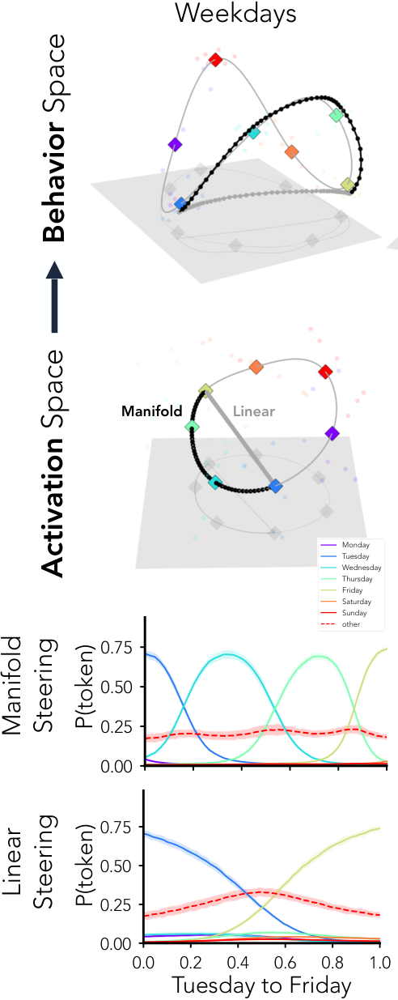
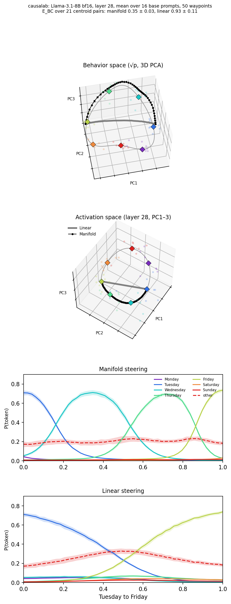
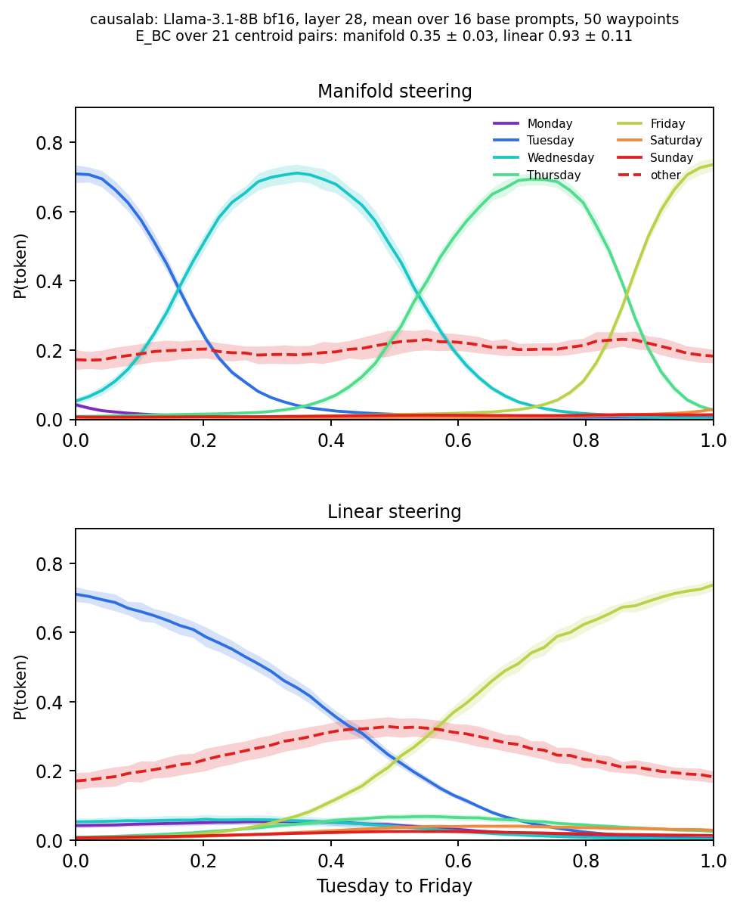
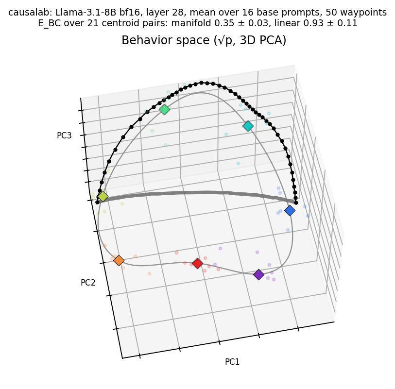
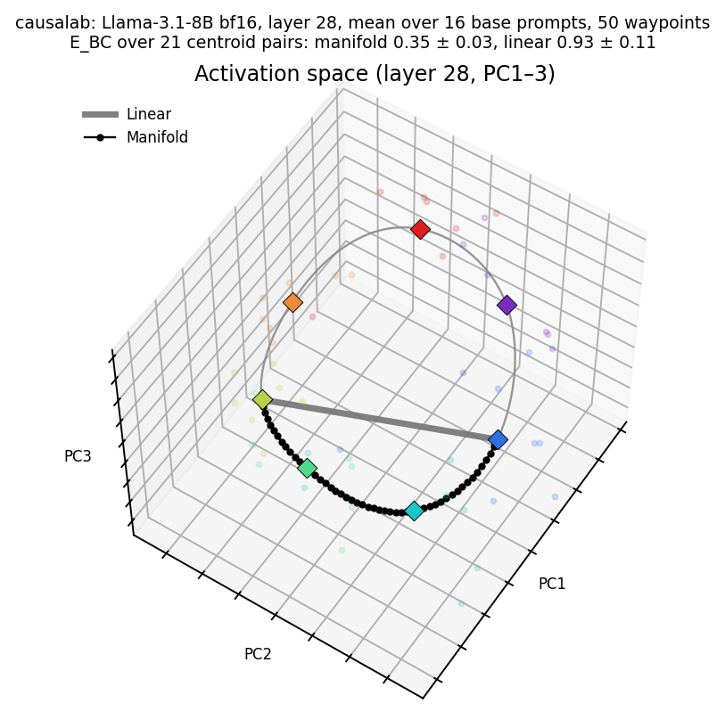

# Manifold steering

> Wurgaft et al. **Manifold Steering Reveals the Shared Geometry of Neural
> Network Representation and Behavior.** [[arXiv]](https://arxiv.org/abs/2605.05115)

**Figure context:**

- Llama-3.1-8B answers `What day is four days after Monday?`, and its
  layer-28 activations for the seven answers lie on a ring.
- Does steering along that ring give more natural outputs than steering
  along a straight line?
- Both strategies replace the last-token residual stream with a point on a
  path between the mean activations of two answers. Linear steering takes the
  chord. Manifold steering takes a spline through all seven means.
- We read the probability of each weekday along the path. The energy sums
  how far these outputs move from the behavior manifold, a ring fitted to the
  model's un-steered outputs.

### Original



### Replication



*Figure 1: Steering Llama-3.1-8B from Tuesday to Friday on the weekdays
task. From the top: behavior space, activation space, and P(token) along
each path, a mean over the paper's 16 prompts with the bands of the paper's
code. Over the 21 weekday pairs the energy is 0.35 ± 0.03 under manifold
steering and 0.93 ± 0.11 under linear steering (mean ± SE, paired
p = 6.4 × 10⁻⁵), against the paper's 0.34 ± 0.03 and 0.93 ± 0.11. On an A100
the manifold value is 0.325.*

## CausaLab implementation

Let's walk through the specification for running the steering experiment
(Figure 1, the two P(token) rows) in CausaLab. Expand the dropdown to see the
full implementation.

<details>
<summary><b>Full JSON</b></summary>

```json
{
  "header": {
    "protocol_version": "4",
    "description": "Figure 4 of Wurgaft et al. 2026 (arXiv:2605.05115), weekdays column: replace the layer-28 residual stream at the last token with a point on the path between two weekday centroids, along the chord (linear) and along the activation manifold's spline (manifold), for the 21 centroid pairs at 50 waypoints over the paper code's 16 base prompts, and save the weekday probabilities in three spellings that scripts/manifold_fig4/energy.py sums and scores."
  },
  "model": {"key": "meta-llama/Llama-3.1-8B", "revision": "d04e592bb4f6aa9cfee91e2e20afa771667e1d4b", "dtype": "bf16"},
  "data": {"base": {"dataset": "manifold_fig4/steer_prompts", "field": "input"}},
  "axes": {
    "pair": {
      "rows": [
        {"pair": "Monday_Tuesday", "waypoints": "manifold_path/waypoints_Monday_Tuesday.safetensors", "chord": "manifold_path/chord_Monday_Tuesday.safetensors"},
        {"pair": "Monday_Wednesday", "waypoints": "manifold_path/waypoints_Monday_Wednesday.safetensors", "chord": "manifold_path/chord_Monday_Wednesday.safetensors"},
        {"pair": "Monday_Thursday", "waypoints": "manifold_path/waypoints_Monday_Thursday.safetensors", "chord": "manifold_path/chord_Monday_Thursday.safetensors"},
        {"pair": "Monday_Friday", "waypoints": "manifold_path/waypoints_Monday_Friday.safetensors", "chord": "manifold_path/chord_Monday_Friday.safetensors"},
        {"pair": "Monday_Saturday", "waypoints": "manifold_path/waypoints_Monday_Saturday.safetensors", "chord": "manifold_path/chord_Monday_Saturday.safetensors"},
        {"pair": "Monday_Sunday", "waypoints": "manifold_path/waypoints_Monday_Sunday.safetensors", "chord": "manifold_path/chord_Monday_Sunday.safetensors"},
        {"pair": "Tuesday_Wednesday", "waypoints": "manifold_path/waypoints_Tuesday_Wednesday.safetensors", "chord": "manifold_path/chord_Tuesday_Wednesday.safetensors"},
        {"pair": "Tuesday_Thursday", "waypoints": "manifold_path/waypoints_Tuesday_Thursday.safetensors", "chord": "manifold_path/chord_Tuesday_Thursday.safetensors"},
        {"pair": "Tuesday_Friday", "waypoints": "manifold_path/waypoints_Tuesday_Friday.safetensors", "chord": "manifold_path/chord_Tuesday_Friday.safetensors"},
        {"pair": "Tuesday_Saturday", "waypoints": "manifold_path/waypoints_Tuesday_Saturday.safetensors", "chord": "manifold_path/chord_Tuesday_Saturday.safetensors"},
        {"pair": "Tuesday_Sunday", "waypoints": "manifold_path/waypoints_Tuesday_Sunday.safetensors", "chord": "manifold_path/chord_Tuesday_Sunday.safetensors"},
        {"pair": "Wednesday_Thursday", "waypoints": "manifold_path/waypoints_Wednesday_Thursday.safetensors", "chord": "manifold_path/chord_Wednesday_Thursday.safetensors"},
        {"pair": "Wednesday_Friday", "waypoints": "manifold_path/waypoints_Wednesday_Friday.safetensors", "chord": "manifold_path/chord_Wednesday_Friday.safetensors"},
        {"pair": "Wednesday_Saturday", "waypoints": "manifold_path/waypoints_Wednesday_Saturday.safetensors", "chord": "manifold_path/chord_Wednesday_Saturday.safetensors"},
        {"pair": "Wednesday_Sunday", "waypoints": "manifold_path/waypoints_Wednesday_Sunday.safetensors", "chord": "manifold_path/chord_Wednesday_Sunday.safetensors"},
        {"pair": "Thursday_Friday", "waypoints": "manifold_path/waypoints_Thursday_Friday.safetensors", "chord": "manifold_path/chord_Thursday_Friday.safetensors"},
        {"pair": "Thursday_Saturday", "waypoints": "manifold_path/waypoints_Thursday_Saturday.safetensors", "chord": "manifold_path/chord_Thursday_Saturday.safetensors"},
        {"pair": "Thursday_Sunday", "waypoints": "manifold_path/waypoints_Thursday_Sunday.safetensors", "chord": "manifold_path/chord_Thursday_Sunday.safetensors"},
        {"pair": "Friday_Saturday", "waypoints": "manifold_path/waypoints_Friday_Saturday.safetensors", "chord": "manifold_path/chord_Friday_Saturday.safetensors"},
        {"pair": "Friday_Sunday", "waypoints": "manifold_path/waypoints_Friday_Sunday.safetensors", "chord": "manifold_path/chord_Friday_Sunday.safetensors"},
        {"pair": "Saturday_Sunday", "waypoints": "manifold_path/waypoints_Saturday_Sunday.safetensors", "chord": "manifold_path/chord_Saturday_Sunday.safetensors"}
      ],
      "key": "pair"
    },
    "path": {
      "rows": [
        {"step": 0, "sel": {"step": 0}},
        {"step": 1, "sel": {"step": 1}},
        {"step": 2, "sel": {"step": 2}},
        {"step": 3, "sel": {"step": 3}},
        {"step": 4, "sel": {"step": 4}},
        {"step": 5, "sel": {"step": 5}},
        {"step": 6, "sel": {"step": 6}},
        {"step": 7, "sel": {"step": 7}},
        {"step": 8, "sel": {"step": 8}},
        {"step": 9, "sel": {"step": 9}},
        {"step": 10, "sel": {"step": 10}},
        {"step": 11, "sel": {"step": 11}},
        {"step": 12, "sel": {"step": 12}},
        {"step": 13, "sel": {"step": 13}},
        {"step": 14, "sel": {"step": 14}},
        {"step": 15, "sel": {"step": 15}},
        {"step": 16, "sel": {"step": 16}},
        {"step": 17, "sel": {"step": 17}},
        {"step": 18, "sel": {"step": 18}},
        {"step": 19, "sel": {"step": 19}},
        {"step": 20, "sel": {"step": 20}},
        {"step": 21, "sel": {"step": 21}},
        {"step": 22, "sel": {"step": 22}},
        {"step": 23, "sel": {"step": 23}},
        {"step": 24, "sel": {"step": 24}},
        {"step": 25, "sel": {"step": 25}},
        {"step": 26, "sel": {"step": 26}},
        {"step": 27, "sel": {"step": 27}},
        {"step": 28, "sel": {"step": 28}},
        {"step": 29, "sel": {"step": 29}},
        {"step": 30, "sel": {"step": 30}},
        {"step": 31, "sel": {"step": 31}},
        {"step": 32, "sel": {"step": 32}},
        {"step": 33, "sel": {"step": 33}},
        {"step": 34, "sel": {"step": 34}},
        {"step": 35, "sel": {"step": 35}},
        {"step": 36, "sel": {"step": 36}},
        {"step": 37, "sel": {"step": 37}},
        {"step": 38, "sel": {"step": 38}},
        {"step": 39, "sel": {"step": 39}},
        {"step": 40, "sel": {"step": 40}},
        {"step": 41, "sel": {"step": 41}},
        {"step": 42, "sel": {"step": 42}},
        {"step": 43, "sel": {"step": 43}},
        {"step": 44, "sel": {"step": 44}},
        {"step": 45, "sel": {"step": 45}},
        {"step": 46, "sel": {"step": 46}},
        {"step": 47, "sel": {"step": 47}},
        {"step": 48, "sel": {"step": 48}},
        {"step": 49, "sel": {"step": 49}}
      ],
      "key": "step"
    }
  },
  "method": {
    "intervened_models": {
      "linear": {"input": "base", "reads": ["logits_linear"], "writes": ["lin_chord"]},
      "manifold": {"input": "base", "reads": ["logits_manifold"], "writes": ["man_waypoint"]}
    },
    "positions": {"slot": {"index": -1}},
    "sites": {
      "target": {"component": "block_output", "layers": [28]},
      "lm_head": {"component": "lm_head"}
    },
    "featurizers": {"pca": {"kind": "pca", "k": 48, "file_path": "pca48/basis.safetensors"}},
    "params": {
      "chord": {"file_path": {"axis": "pair.chord"}, "entry": {"axis": "path.sel"}},
      "waypoint": {"file_path": {"axis": "pair.waypoints"}, "entry": {"axis": "path.sel"}}
    },
    "reads": {
      "logits_linear": {"site": "lm_head", "pos": -1},
      "logits_manifold": {"site": "lm_head", "pos": -1}
    },
    "writes": {
      "lin_chord": {"site": "target", "pos": "slot", "do": {"swap": "chord"}},
      "man_waypoint": {"site": "target", "pos": "slot", "featurizer": "pca", "do": {"swap": "waypoint"}}
    },
    "save": [
      {
        "read": "logits_linear",
        "model": "linear",
        "aggregation": {
          "kind": "class_probs",
          "groups": {
            "Monday": [" Monday"],
            "Tuesday": [" Tuesday"],
            "Wednesday": [" Wednesday"],
            "Thursday": [" Thursday"],
            "Friday": [" Friday"],
            "Saturday": [" Saturday"],
            "Sunday": [" Sunday"]
          }
        },
        "file_path": "linear_space.json"
      },
      {
        "read": "logits_linear",
        "model": "linear",
        "aggregation": {
          "kind": "class_probs",
          "groups": {
            "Monday": ["Monday"],
            "Tuesday": ["Tuesday"],
            "Wednesday": ["Wednesday"],
            "Thursday": ["Thursday"],
            "Friday": ["Friday"],
            "Saturday": ["Saturday"],
            "Sunday": ["Sunday"]
          }
        },
        "file_path": "linear_bare.json"
      },
      {
        "read": "logits_linear",
        "model": "linear",
        "aggregation": {
          "kind": "class_probs",
          "groups": {
            "Monday": [" monday"],
            "Friday": [" friday"],
            "Sunday": [" sunday"]
          }
        },
        "file_path": "linear_lower.json"
      },
      {
        "read": "logits_manifold",
        "model": "manifold",
        "aggregation": {
          "kind": "class_probs",
          "groups": {
            "Monday": [" Monday"],
            "Tuesday": [" Tuesday"],
            "Wednesday": [" Wednesday"],
            "Thursday": [" Thursday"],
            "Friday": [" Friday"],
            "Saturday": [" Saturday"],
            "Sunday": [" Sunday"]
          }
        },
        "file_path": "manifold_space.json"
      },
      {
        "read": "logits_manifold",
        "model": "manifold",
        "aggregation": {
          "kind": "class_probs",
          "groups": {
            "Monday": ["Monday"],
            "Tuesday": ["Tuesday"],
            "Wednesday": ["Wednesday"],
            "Thursday": ["Thursday"],
            "Friday": ["Friday"],
            "Saturday": ["Saturday"],
            "Sunday": ["Sunday"]
          }
        },
        "file_path": "manifold_bare.json"
      },
      {
        "read": "logits_manifold",
        "model": "manifold",
        "aggregation": {
          "kind": "class_probs",
          "groups": {
            "Monday": [" monday"],
            "Friday": [" friday"],
            "Sunday": [" sunday"]
          }
        },
        "file_path": "manifold_lower.json"
      }
    ]
  }
}
```

</details>

### Load Llama-3.1-8B and the paper's 16 base prompts

```json
"model": {"key": "meta-llama/Llama-3.1-8B", "revision": "d04e592bb4f6aa9cfee91e2e20afa771667e1d4b", "dtype": "bf16"},  // the snapshot the committed run loaded
"data": {"base": {"dataset": "manifold_fig4/steer_prompts", "field": "input"}}  // the paper code's draw generate_dataset(model, 100, 142)[:16], two prompts twice; the operand is a centroid, so no counterfactual
```

### Define the linear and manifold models, with reads and writes as placeholders

```json
"intervened_models": {
    "linear": {"input": "base", "reads": ["logits_linear"], "writes": ["lin_chord"]},
    "manifold": {"input": "base", "reads": ["logits_manifold"], "writes": ["man_waypoint"]}
}
```

### Select the last token and the layer-28 residual stream

```json
"positions": {"slot": {"index": -1}},  // the last token, after "A:", where the answer is produced
"sites": {
    "target": {"component": "block_output", "layers": [28]},  // the paper's steering site (Appendix A.2)
    "lm_head": {"component": "lm_head"}
}
```

### Define the grid: 21 pairs by 50 waypoints

```json
"axes": {
    "pair": {  // the 21 pairs of distinct weekdays, in itertools.combinations order
        "rows": [
            {"pair": "Monday_Tuesday", "waypoints": "manifold_path/waypoints_Monday_Tuesday.safetensors", "chord": "manifold_path/chord_Monday_Tuesday.safetensors"},  // each row names its pair's two bundles, which the manifold_path step writes
            {"pair": "Monday_Wednesday", "waypoints": "manifold_path/waypoints_Monday_Wednesday.safetensors", "chord": "manifold_path/chord_Monday_Wednesday.safetensors"},
            {"pair": "Monday_Thursday", "waypoints": "manifold_path/waypoints_Monday_Thursday.safetensors", "chord": "manifold_path/chord_Monday_Thursday.safetensors"},
            {"pair": "Monday_Friday", "waypoints": "manifold_path/waypoints_Monday_Friday.safetensors", "chord": "manifold_path/chord_Monday_Friday.safetensors"},
            {"pair": "Monday_Saturday", "waypoints": "manifold_path/waypoints_Monday_Saturday.safetensors", "chord": "manifold_path/chord_Monday_Saturday.safetensors"},
            {"pair": "Monday_Sunday", "waypoints": "manifold_path/waypoints_Monday_Sunday.safetensors", "chord": "manifold_path/chord_Monday_Sunday.safetensors"},
            {"pair": "Tuesday_Wednesday", "waypoints": "manifold_path/waypoints_Tuesday_Wednesday.safetensors", "chord": "manifold_path/chord_Tuesday_Wednesday.safetensors"},
            {"pair": "Tuesday_Thursday", "waypoints": "manifold_path/waypoints_Tuesday_Thursday.safetensors", "chord": "manifold_path/chord_Tuesday_Thursday.safetensors"},
            {"pair": "Tuesday_Friday", "waypoints": "manifold_path/waypoints_Tuesday_Friday.safetensors", "chord": "manifold_path/chord_Tuesday_Friday.safetensors"},
            {"pair": "Tuesday_Saturday", "waypoints": "manifold_path/waypoints_Tuesday_Saturday.safetensors", "chord": "manifold_path/chord_Tuesday_Saturday.safetensors"},
            {"pair": "Tuesday_Sunday", "waypoints": "manifold_path/waypoints_Tuesday_Sunday.safetensors", "chord": "manifold_path/chord_Tuesday_Sunday.safetensors"},
            {"pair": "Wednesday_Thursday", "waypoints": "manifold_path/waypoints_Wednesday_Thursday.safetensors", "chord": "manifold_path/chord_Wednesday_Thursday.safetensors"},
            {"pair": "Wednesday_Friday", "waypoints": "manifold_path/waypoints_Wednesday_Friday.safetensors", "chord": "manifold_path/chord_Wednesday_Friday.safetensors"},
            {"pair": "Wednesday_Saturday", "waypoints": "manifold_path/waypoints_Wednesday_Saturday.safetensors", "chord": "manifold_path/chord_Wednesday_Saturday.safetensors"},
            {"pair": "Wednesday_Sunday", "waypoints": "manifold_path/waypoints_Wednesday_Sunday.safetensors", "chord": "manifold_path/chord_Wednesday_Sunday.safetensors"},
            {"pair": "Thursday_Friday", "waypoints": "manifold_path/waypoints_Thursday_Friday.safetensors", "chord": "manifold_path/chord_Thursday_Friday.safetensors"},
            {"pair": "Thursday_Saturday", "waypoints": "manifold_path/waypoints_Thursday_Saturday.safetensors", "chord": "manifold_path/chord_Thursday_Saturday.safetensors"},
            {"pair": "Thursday_Sunday", "waypoints": "manifold_path/waypoints_Thursday_Sunday.safetensors", "chord": "manifold_path/chord_Thursday_Sunday.safetensors"},
            {"pair": "Friday_Saturday", "waypoints": "manifold_path/waypoints_Friday_Saturday.safetensors", "chord": "manifold_path/chord_Friday_Saturday.safetensors"},
            {"pair": "Friday_Sunday", "waypoints": "manifold_path/waypoints_Friday_Sunday.safetensors", "chord": "manifold_path/chord_Friday_Sunday.safetensors"},
            {"pair": "Saturday_Sunday", "waypoints": "manifold_path/waypoints_Saturday_Sunday.safetensors", "chord": "manifold_path/chord_Saturday_Sunday.safetensors"}
        ],
        "key": "pair"
    },
    "path": {
        "rows": [
            {"step": 0, "sel": {"step": 0}},
            {"step": 1, "sel": {"step": 1}},  // sel picks the point of each bundle at t = step / 49
            {"step": 2, "sel": {"step": 2}},
            {"step": 3, "sel": {"step": 3}},
            {"step": 4, "sel": {"step": 4}},
            {"step": 5, "sel": {"step": 5}},
            {"step": 6, "sel": {"step": 6}},
            {"step": 7, "sel": {"step": 7}},
            {"step": 8, "sel": {"step": 8}},
            {"step": 9, "sel": {"step": 9}},
            {"step": 10, "sel": {"step": 10}},
            {"step": 11, "sel": {"step": 11}},
            {"step": 12, "sel": {"step": 12}},
            {"step": 13, "sel": {"step": 13}},
            {"step": 14, "sel": {"step": 14}},
            {"step": 15, "sel": {"step": 15}},
            {"step": 16, "sel": {"step": 16}},
            {"step": 17, "sel": {"step": 17}},
            {"step": 18, "sel": {"step": 18}},
            {"step": 19, "sel": {"step": 19}},
            {"step": 20, "sel": {"step": 20}},
            {"step": 21, "sel": {"step": 21}},
            {"step": 22, "sel": {"step": 22}},
            {"step": 23, "sel": {"step": 23}},
            {"step": 24, "sel": {"step": 24}},
            {"step": 25, "sel": {"step": 25}},
            {"step": 26, "sel": {"step": 26}},
            {"step": 27, "sel": {"step": 27}},
            {"step": 28, "sel": {"step": 28}},
            {"step": 29, "sel": {"step": 29}},
            {"step": 30, "sel": {"step": 30}},
            {"step": 31, "sel": {"step": 31}},
            {"step": 32, "sel": {"step": 32}},
            {"step": 33, "sel": {"step": 33}},
            {"step": 34, "sel": {"step": 34}},
            {"step": 35, "sel": {"step": 35}},
            {"step": 36, "sel": {"step": 36}},
            {"step": 37, "sel": {"step": 37}},
            {"step": 38, "sel": {"step": 38}},
            {"step": 39, "sel": {"step": 39}},
            {"step": 40, "sel": {"step": 40}},
            {"step": 41, "sel": {"step": 41}},
            {"step": 42, "sel": {"step": 42}},
            {"step": 43, "sel": {"step": 43}},
            {"step": 44, "sel": {"step": 44}},
            {"step": 45, "sel": {"step": 45}},
            {"step": 46, "sel": {"step": 46}},
            {"step": 47, "sel": {"step": 47}},
            {"step": 48, "sel": {"step": 48}},
            {"step": 49, "sel": {"step": 49}}
        ],
        "key": "step"
    }
}
```

### Load the path points that the manifold_path step writes

```json
"params": {
    "chord": {"file_path": {"axis": "pair.chord"}, "entry": {"axis": "path.sel"}},  // the chord point (1 - t) c_a + t c_b in the full residual stream
    "waypoint": {"file_path": {"axis": "pair.waypoints"}, "entry": {"axis": "path.sel"}}  // the spline point at the same t, in the 48 PCA coordinates
}
```

### Define reads: the final logits of each steered run

```json
"reads": {
    "logits_linear": {"site": "lm_head", "pos": -1},
    "logits_manifold": {"site": "lm_head", "pos": -1}
}
```

### Define writes: the chord point or the spline point

```json
"writes": {
    "lin_chord": {"site": "target", "pos": "slot", "do": {"swap": "chord"}},  // linear: replace the residual stream with the chord point, Equation 1, cast to bf16 once, as the paper's code does
    "man_waypoint": {"site": "target", "pos": "slot", "featurizer": "pca", "do": {"swap": "waypoint"}}  // manifold: swap the 48 PCA coordinates for the spline point, Equation 2
}
```

### Define the featurizer: 48 principal components at layer 28

```json
"featurizers": {"pca": {"kind": "pca", "k": 48, "file_path": "pca48/basis.safetensors"}}  // fitted by the pca48 step; the text says 64, and the paper's code also stops at 48 for 49 prompts
```

### Save each weekday's probability in three spellings

```json
"save": [
    {
        "read": "logits_linear",
        "model": "linear",
        "aggregation": {
            "kind": "class_probs",
            "groups": {  // the space-prefixed spelling; energy.py sums the three spellings and pools the rest as other
                "Monday": [" Monday"],
                "Tuesday": [" Tuesday"],
                "Wednesday": [" Wednesday"],
                "Thursday": [" Thursday"],
                "Friday": [" Friday"],
                "Saturday": [" Saturday"],
                "Sunday": [" Sunday"]
            }
        },
        "file_path": "linear_space.json"
    },
    {
        "read": "logits_linear",
        "model": "linear",
        "aggregation": {
            "kind": "class_probs",
            "groups": {
                "Monday": ["Monday"],
                "Tuesday": ["Tuesday"],
                "Wednesday": ["Wednesday"],
                "Thursday": ["Thursday"],
                "Friday": ["Friday"],
                "Saturday": ["Saturday"],
                "Sunday": ["Sunday"]
            }
        },
        "file_path": "linear_bare.json"
    },
    {
        "read": "logits_linear",
        "model": "linear",
        "aggregation": {
            "kind": "class_probs",
            "groups": {
                "Monday": [" monday"],  // the lowercase spellings that are one token (Appendix A.2)
                "Friday": [" friday"],
                "Sunday": [" sunday"]
            }
        },
        "file_path": "linear_lower.json"
    },
    {
        "read": "logits_manifold",
        "model": "manifold",
        "aggregation": {
            "kind": "class_probs",
            "groups": {
                "Monday": [" Monday"],
                "Tuesday": [" Tuesday"],
                "Wednesday": [" Wednesday"],
                "Thursday": [" Thursday"],
                "Friday": [" Friday"],
                "Saturday": [" Saturday"],
                "Sunday": [" Sunday"]
            }
        },
        "file_path": "manifold_space.json"
    },
    {
        "read": "logits_manifold",
        "model": "manifold",
        "aggregation": {
            "kind": "class_probs",
            "groups": {
                "Monday": ["Monday"],
                "Tuesday": ["Tuesday"],
                "Wednesday": ["Wednesday"],
                "Thursday": ["Thursday"],
                "Friday": ["Friday"],
                "Saturday": ["Saturday"],
                "Sunday": ["Sunday"]
            }
        },
        "file_path": "manifold_bare.json"
    },
    {
        "read": "logits_manifold",
        "model": "manifold",
        "aggregation": {
            "kind": "class_probs",
            "groups": {
                "Monday": [" monday"],
                "Friday": [" friday"],
                "Sunday": [" sunday"]
            }
        },
        "file_path": "manifold_lower.json"
    }
]
```

Given the specification, CausaLab produces:



*Along the manifold path the most likely day goes Tuesday, Wednesday,
Thursday, Friday, with crossings at t = 0.161, 0.537 and 0.864 (paper:
0.160, 0.537, 0.865). Its `other` curve peaks at t = 0.204, 0.551 and 0.857
(paper: 0.184, 0.551, 0.857): our first peak is one waypoint late, and its
two highest points differ by 0.0008. Along the chord Wednesday and Thursday
stay below 0.07, and `other` peaks at 0.328 at t = 0.49. Every curve lies
within 0.014 of the paper's.*

## Behavior and activation space: change these lines

The top two rows need two un-steered runs of the 49-prompt pool.
[`protocols/manifold_fig4_baseline.json`](protocols/manifold_fig4_baseline.json)
saves the weekday probabilities, and `behavior_manifold.py` fits the behavior
manifold to them.
[`protocols/manifold_fig4_harvest.json`](protocols/manifold_fig4_harvest.json)
saves the layer-28 activations, and the `pca48` step and `manifold_path.py`
fit the activation manifold to them. Each document is the JSON above with
these lines changed, under its own header.

### Behavior space

```diff
-"data": {"base": {"dataset": "manifold_fig4/steer_prompts", "field": "input"}},
+"data": {"base": {"dataset": "manifold_fig4/data", "field": "input"}},
-"axes": {"pair": {…}, "path": {…}},
 "intervened_models": {
-    "linear": {"input": "base", "reads": ["logits_linear"], "writes": ["lin_chord"]},
-    "manifold": {"input": "base", "reads": ["logits_manifold"], "writes": ["man_waypoint"]}
+    "original": {"input": "base", "reads": ["logits"]}
 },
-"positions": {…},
-"sites": {"target": {…}, "lm_head": {"component": "lm_head"}},
+"sites": {"lm_head": {"component": "lm_head"}},
-"featurizers": {…}, "params": {…}, "writes": {…},
-"reads": {"logits_linear": {…}, "logits_manifold": {…}},
+"reads": {"logits": {"site": "lm_head", "pos": -1}},
-"save": [{"read": "logits_linear", "model": "linear", …, "file_path": "linear_space.json"}, …]
+"save": [{"read": "logits", "model": "original", …, "file_path": "day_probs_space.json"}, …]
```



*The seven behavior centroids, the mean un-steered outputs for each
ground-truth day, lie on a ring. The manifold trajectory stays near it: its
Bhattacharyya distance to the behavior manifold is at most 0.016. The linear
trajectory crosses the inside of the ring and reaches 0.131 at t = 0.51. The
paper gives no values for this panel.*

### Activation space

```diff
-"data": {"base": {"dataset": "manifold_fig4/steer_prompts", "field": "input"}},
+"data": {"base": {"dataset": "manifold_fig4/data", "field": "input"}},
-"axes": {"pair": {…}, "path": {…}},
 "intervened_models": {
-    "linear": {"input": "base", "reads": ["logits_linear"], "writes": ["lin_chord"]},
-    "manifold": {"input": "base", "reads": ["logits_manifold"], "writes": ["man_waypoint"]}
+    "original": {"input": "base", "reads": ["acts"]}
 },
-"sites": {"target": {…}, "lm_head": {"component": "lm_head"}},
+"sites": {"target": {"component": "block_output", "layers": [28]}},
-"featurizers": {…}, "params": {…}, "writes": {…},
-"reads": {"logits_linear": {…}, "logits_manifold": {…}},
+"reads": {"acts": {"site": "target", "pos": "slot"}},
-"save": [{"read": "logits_linear", "model": "linear", …}, …]
+"save": [{"read": "acts", "model": "original", "file_path": "acts.safetensors"}]
```



*The seven activation centroids lie on a ring in the first three principal
components, which hold 0.44 of the variance of the 49 activations. The
manifold path follows the spline through Wednesday and Thursday. The chord
crosses the inside of the ring and lies up to 10.3 from the manifold path, at
t = 0.55, where a centroid has a norm of about 34.*

## Further Details

<details>
<summary><b>Method</b></summary>

**The paper's code over its text.** The paper's code drew its figure
(goodfire-ai/causalab, branch `manifold_steering`, commit `1b6f43a5`). Where
its text says otherwise, we follow the code:

- **Knots.** The text takes θ = atan2(PC2, PC1) of each centroid (Appendix
  A.3). The code first centres PC1 and PC2 on the centroids' mean and divides
  each by its standard deviation ([`remap_periodic_to_angle`](https://github.com/goodfire-ai/causalab/blob/1b6f43a509d2a4ae49fd1bc4252e13889d57e38b/causalab/methods/spline/builders.py#L268)). The gaps between our
  knots equal those of the code's checkpoint to 3 × 10⁻⁷ rad. The knots
  themselves differ by π, because both of the first two components have the
  opposite sign.
- **Behavior knots.** The code takes the knots of the behavior centroids from
  a PCA of the 49 prompts' square-root probabilities, with the same
  normalized angle ([`fit_belief_tps_pca`](https://github.com/goodfire-ai/causalab/blob/1b6f43a509d2a4ae49fd1bc4252e13889d57e38b/causalab/methods/spline/belief_fit.py#L246)). The text names only the spline
  family (Appendix A.4).
- **Path set.** The text steers all 42 ordered pairs (Appendix A.6).
  Appendix A.7 reports the energy over the centroid pairs, and the code's
  default path set steers each of the 21 unordered pairs once
  ([`path_steering.yaml`](https://github.com/goodfire-ai/causalab/blob/1b6f43a509d2a4ae49fd1bc4252e13889d57e38b/causalab/configs/analysis/path_steering.yaml#L31)),
  as we do. Its 8B runner adds 29 paths between points on these paths
  ([`weekdays_8b_pipeline.yaml`](https://github.com/goodfire-ai/causalab/blob/1b6f43a509d2a4ae49fd1bc4252e13889d57e38b/causalab/configs/runners/weekdays/weekdays_8b_pipeline.yaml#L27)).
  Over all 50 paths the paper's pipeline gives a linear energy of
  1.40 ± 0.13, which is not the paper's 0.93 ± 0.11 (Execution names the
  run).
- **Base prompts.** The text samples 16 prompts at random. The code takes the
  first 16 of `generate_dataset(model, 100, 142)`, and
  [`build_dataset.py`](workflows/scripts/manifold_fig4/build_dataset.py)
  makes the same draws, so two prompts appear twice.
- **Spellings.** The text sums ` Monday`, `Monday` and `monday` into p(x)
  (Appendix A.2). The code keeps the spellings that are one token. Of the
  lowercase ones those are ` monday`, ` friday` and ` sunday`, and they carry
  at most 0.0014 of an un-steered prompt's mass.
- **Nearest point.** The text takes the infimum over the behavior manifold
  (Section 3.2). The code runs 5 Gauss-Newton steps from the nearest
  centroid, which can stop at a local minimum. With the nearest of 1050
  dense samples the energies are 0.349 and 0.924 (`energy_sum_dense`).
- **Components.** The text keeps 64 principal components (Appendix A.3). The
  code stops at 48 for 49 prompts ([`pca.py`](https://github.com/goodfire-ai/causalab/blob/1b6f43a509d2a4ae49fd1bc4252e13889d57e38b/causalab/methods/pca.py#L117)), and so do we.
- **Bands.** The text does not define the bands. The code draws ± 1 standard
  deviation over the prompts for each day, and for `other` the root of the
  summed day variances
  ([`path_visualization.py`](https://github.com/goodfire-ai/causalab/blob/1b6f43a509d2a4ae49fd1bc4252e13889d57e38b/causalab/analyses/path_steering/path_visualization.py#L322)).
  So do we.

**Properties of the method.** The 16 base prompts are among the 49 the PCA is
fitted on, and 48 components span all 49. So the manifold write leaves no
prompt-specific part outside the subspace, in the paper's code as here. On
all 7 pairs of neighbouring days the chord has the lower energy (0.240
against 0.347), and the paper's pipeline gives the same on 7 of 7. The paper
reports only the mean over pairs.

**Precision.** `manifold_path.py` computes each chord point in float64 and
stores it in float32, and the write casts it to bf16 once, as the code casts
its float32 chord point once
([`_build_linear_path_kd`](https://github.com/goodfire-ai/causalab/blob/1b6f43a509d2a4ae49fd1bc4252e13889d57e38b/causalab/analyses/path_steering/path_mode.py#L97)).
In fp32 our mean curves equal those of the paper's pipeline on the same
pairs to 6 × 10⁻⁶. In bf16 they differ by up to 0.009 (manifold) and 0.010
(linear), and the per-pair energies by up to 0.002 and 0.007. The manifold
energy is 0.349 on an H100 in bf16, 0.325 on an A100 in bf16 and 0.331 on an
H100 in fp32, so the paper's 0.34 lies inside that spread. The linear energy
is 0.929, 0.928 and 0.916 on the same three runs. The first `other` peak of
the manifold panel falls at t = 0.184 on the A100, the paper's value. In
fp32 the values at t = 0.163 and 0.184 differ by 2 × 10⁻⁶. Execution names
each run.

**Paper values.** The paper's curve values on this page come from the vector
paths of the PDF's Figure 4, calibrated on the panels' tick marks to
3 × 10⁻⁵. At 15 of the 800 waypoint values the PDF's path simplification
dropped a vertex, all where the line's slope is at most 0.17, and we
interpolate there. If the paper kept matplotlib's default simplification
threshold of 1/9 pixel, such a value lies within 0.0006 of the paper's line.

</details>

<details>
<summary><b>Execution</b>: environment, run command, flags, resources, workflow</summary>

**Environment.** `meta-llama/Llama-3.1-8B` is a gated checkpoint. Accept its
license on the Hub, then give the run a token or a cache that holds the
weights. The documents pin the snapshot
`d04e592bb4f6aa9cfee91e2e20afa771667e1d4b`.

```bash
export HF_TOKEN=hf_...              # a token for the account that accepted the license
export HF_HUB_CACHE=/path/to/cache  # optional: a cache that already holds the checkpoint
```

**Run.** From `demos/papers/`, run the workflow, then draw the figure, which
needs no accelerator:

```bash
causalab run workflows/manifold_fig4.json \
    --engine auto \
    --data-root artifacts/data \
    --out artifacts/output \
    --device cuda \
    --batch-rows 256
python workflows/scripts/manifold_fig4/fig4_figure.py
```

**Flags.** `--data-root` is the folder that dataset references resolve
against, so `manifold_fig4/steer_prompts` reads
`artifacts/data/manifold_fig4/steer_prompts.json`. `--out artifacts/output`
puts the run tree under `artifacts/output/manifold_fig4/`, the workflow's
`output_dir`. The figure script reads `manifold_path/`, `behavior/` and
`energy/` there and writes `fig4_replication.png`, one image per panel and
`fig4_plotted.json` to `artifacts/figures/manifold_fig4/`. Its `--pair`
flag draws another pair than `Tuesday_Friday`, and `--artifacts` reads
another run tree. `--batch-rows 256` bounds the rows of one forward. Every
document pins `bf16`, and a workflow refuses `--dtype`. `--resume` makes a
resubmission reuse every step whose recorded digests still match. Replace
`run` with `validate` and drop the run-only flags to check the documents
without loading weights. The steering document validates through the
workflow only, since its constants are run-tree files.

**Resources and reproducibility.** The run needs one 80 GB CUDA GPU. The
steering step runs 1050 points of two patched forwards of 16 rows each,
without gradients. On an Apple-silicon laptop, pass
`--device mps --batch-rows 64`; no wall time is recorded for it. The
committed figures come from one run on 2026-09-28: one H100 80GB HBM3,
bf16, the `pytorch_hooks` engine (`--engine auto`), 60 s of wall time with
the model load. Runs of the same computation on other H100 nodes gave the
same steering tables row for row. The Method block quotes two more runs of
the same code: one on one A100-SXM4 80GB in bf16, and one on one H100 with
`"set": {"model.dtype": "fp32"}` on the workflow's three document steps. The
paper's pipeline (commit `1b6f43a5`, runner `weekdays_8b_pipeline` without
its pullback analysis) ran twice on one H100: once in bf16, and once in fp32
with `n_extra_pairs=0`.

**Workflow.** [`workflows/manifold_fig4.json`](workflows/manifold_fig4.json)
runs seven steps. `baseline`
([`protocols/manifold_fig4_baseline.json`](protocols/manifold_fig4_baseline.json))
runs one un-steered forward per prompt of the 49-prompt pool
([`data.json`](artifacts/data/manifold_fig4/data.json)) and saves the weekday
probabilities in three spellings. The most likely weekday is the
ground-truth answer on 45 of the 49 prompts (0.918); the workflow takes this
as given. `harvest_l28`
([`protocols/manifold_fig4_harvest.json`](protocols/manifold_fig4_harvest.json))
saves the layer-28 activation at the last token of each prompt, and `pca48`
fits 48 components and their mean to those activations. `manifold_path`
([`manifold_path.py`](workflows/scripts/manifold_fig4/manifold_path.py))
fits the spline through the seven centroids and writes, for each pair, the
spline points and the chord points, and the tables of the activation panel.
`behavior`
([`behavior_manifold.py`](workflows/scripts/manifold_fig4/behavior_manifold.py))
fits the behavior manifold to the baseline probabilities. `steer` runs the
document above, and `energy`
([`energy.py`](workflows/scripts/manifold_fig4/energy.py)) averages the
trajectories over prompts, computes the bands, and scores each prompt's
trajectory against the behavior manifold. The setup departs from the paper's
text in seven places, each to follow its code, as the Method block lists: the
knots, the behavior knots, the path set, the base prompts, the lowercase
spellings, the Gauss-Newton nearest point and the 48 components.

</details>

<details>
<summary><b>Intervention protocol parameters</b>: what to change for another model, layer or grid</summary>

| field | here | to change |
|---|---|---|
| `model.key` | `meta-llama/Llama-3.1-8B` | any registered causal LM; the harvest and baseline documents take the same key |
| `model.revision` | `d04e592bb4f6aa9cfee91e2e20afa771667e1d4b` | the snapshot of the new checkpoint, or `main`; the same value in all three documents |
| `data.base.dataset` | `manifold_fig4/steer_prompts` | another table with an `input` column; its rows are the base prompts |
| `sites.target.layers` | `[28]` | the steering layer; the harvest document must read the same layer |
| `featurizers.pca.k` | `48` | at most the number of pool prompts minus one; `pca48.k` in the workflow must match |
| `axes.pair.rows` | the 21 weekday pairs | a subset of the pairs `manifold_path` writes, each with its `waypoints` and `chord` bundles |
| `axes.path.rows` | 50 waypoints, t = step / 49 | K rows; `manifold_path.steps` in the workflow must be K |
| `save[].aggregation.groups` | the seven weekdays in three spellings | the concept tokens of another cyclic task, one table per spelling |

[The intervention reference](../../docs/intervention_protocol.md) defines
every field.

</details>
