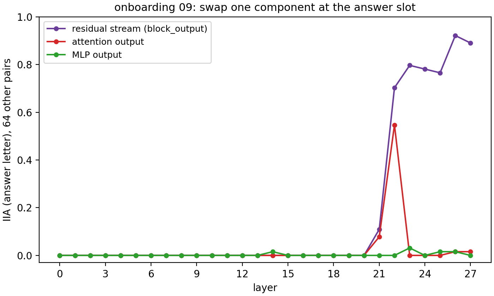
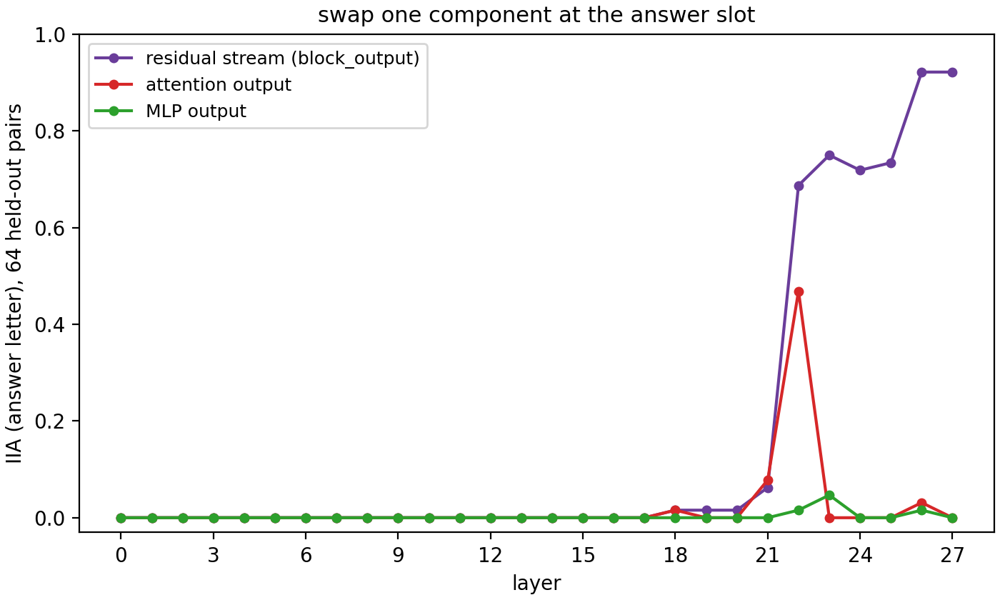
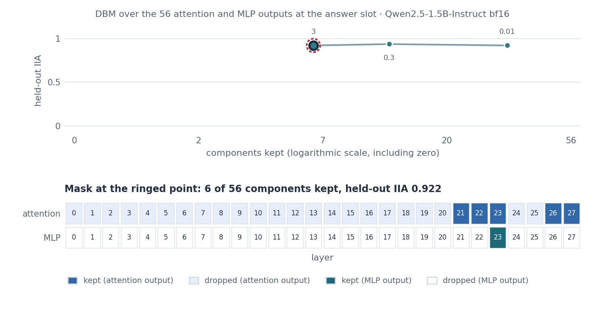
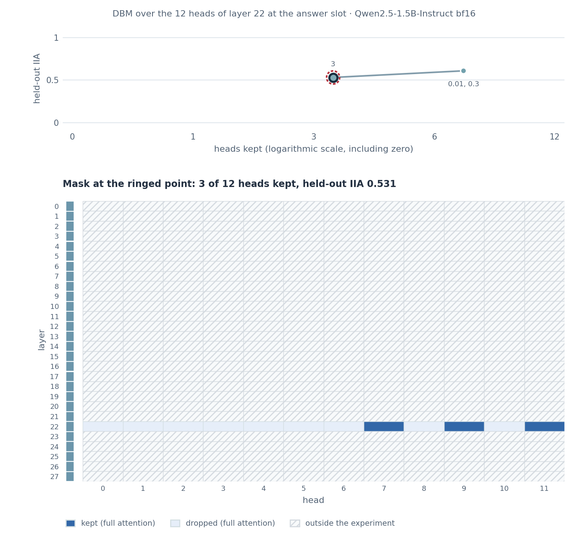

# Desiderata-based masking

> Davies et al. **Discovering Variable Binding Circuitry with Desiderata.**
> [[arXiv]](https://arxiv.org/abs/2307.03637)
>
> Wiegreffe et al. **Answer, Assemble, Ace: Understanding How LMs Answer
> Multiple Choice Questions.** [[arXiv]](https://arxiv.org/abs/2407.15018)
>
> Original figure: [onboarding 09](../onboarding_tutorial/09_components.md)

**Figure context:**

- Qwen2.5-1.5B-Instruct answers a two-option colour question with the letter of the right option.
- Which attention and MLP outputs at the answer position must take the counterfactual prompt's value for the model to output the counterfactual letter?
- The scan swaps one component at a time. Desiderata-based masking (DBM) instead fits one gate per component and swaps every open gate at once. The fit rewards the counterfactual letter and an l1 term charges for every open gate.
- A second fit puts one gate on each attention head of layer 22.
- The scan is the one of [onboarding 09](../onboarding_tutorial/09_components.md), and the heads are the ones of [onboarding 11](../onboarding_tutorial/11_attention.md).

### Original



### Replication



*Figure 1: Component scan for the MCQA answer letter in Qwen2.5-1.5B-Instruct.
IIA is the fraction of 64 held-out pairs on which the model outputs the
counterfactual letter after one component of one layer (x axis) takes its
counterfactual value at the answer slot. Attention at layer 22 scores 0.469
(onboarding 09, on other pairs: 0.547), the residual stream 0.922 at layers
26 and 27 (0.922, 0.891), and no MLP output more than 0.047 (0.031).*

## CausaLab implementation

Let's walk through the specification for fitting the 56 component gates
together (Figure 2) in CausaLab. Expand the dropdown to see the full
implementation.

<details>
<summary><b>Full JSON</b></summary>

```json
{
  "header": {
    "protocol_version": "4",
    "description": "Desiderata-based masking (Davies et al. 2023, arXiv:2307.03637) over the components of Qwen2.5-1.5B-Instruct at the answer slot: one site-grouped gate per attention output and per MLP output of all 28 layers, fitted together on the 128 train pairs under one l1 term over the 56 gates, which trades the counterfactual letter's cross-entropy against the number of kept (component, layer) cells; workflows/scripts/mcqa_components_dbm/figures.py draws rank.json and mcqa_components_dbm_apply.json scores the gates on the held-out pairs."
  },
  "model": {"key": "Qwen/Qwen2.5-1.5B-Instruct", "revision": "main", "dtype": "bf16"},
  "data": {
    "base": {"dataset": "mcqa_components_dbm/data#train", "field": "input"},
    "counterfactual": {
      "dataset": "mcqa_components_dbm/data#train",
      "field": "counterfactual_inputs[0]"
    }
  },
  "method": {
    "intervened_models": {
      "original_counterfactual": {
        "input": "counterfactual",
        "reads": [
          "v_attn0", "v_attn1", "v_attn2", "v_attn3", "v_attn4", "v_attn5", "v_attn6", "v_attn7",
          "v_attn8", "v_attn9", "v_attn10", "v_attn11", "v_attn12", "v_attn13", "v_attn14",
          "v_attn15", "v_attn16", "v_attn17", "v_attn18", "v_attn19", "v_attn20", "v_attn21",
          "v_attn22", "v_attn23", "v_attn24", "v_attn25", "v_attn26", "v_attn27", "v_mlp0",
          "v_mlp1", "v_mlp2", "v_mlp3", "v_mlp4", "v_mlp5", "v_mlp6", "v_mlp7", "v_mlp8", "v_mlp9",
          "v_mlp10", "v_mlp11", "v_mlp12", "v_mlp13", "v_mlp14", "v_mlp15", "v_mlp16", "v_mlp17",
          "v_mlp18", "v_mlp19", "v_mlp20", "v_mlp21", "v_mlp22", "v_mlp23", "v_mlp24", "v_mlp25",
          "v_mlp26", "v_mlp27"
        ]
      },
      "masked": {
        "input": "base",
        "reads": ["logits"],
        "writes": [
          "mask_attn0", "mask_attn1", "mask_attn2", "mask_attn3", "mask_attn4", "mask_attn5",
          "mask_attn6", "mask_attn7", "mask_attn8", "mask_attn9", "mask_attn10", "mask_attn11",
          "mask_attn12", "mask_attn13", "mask_attn14", "mask_attn15", "mask_attn16", "mask_attn17",
          "mask_attn18", "mask_attn19", "mask_attn20", "mask_attn21", "mask_attn22", "mask_attn23",
          "mask_attn24", "mask_attn25", "mask_attn26", "mask_attn27", "mask_mlp0", "mask_mlp1",
          "mask_mlp2", "mask_mlp3", "mask_mlp4", "mask_mlp5", "mask_mlp6", "mask_mlp7",
          "mask_mlp8", "mask_mlp9", "mask_mlp10", "mask_mlp11", "mask_mlp12", "mask_mlp13",
          "mask_mlp14", "mask_mlp15", "mask_mlp16", "mask_mlp17", "mask_mlp18", "mask_mlp19",
          "mask_mlp20", "mask_mlp21", "mask_mlp22", "mask_mlp23", "mask_mlp24", "mask_mlp25",
          "mask_mlp26", "mask_mlp27"
        ]
      }
    },
    "positions": {"slot": {"index": -1}},
    "sites": {
      "attn0": {"component": "attention_output", "layers": [0]},
      "attn1": {"component": "attention_output", "layers": [1]},
      "attn2": {"component": "attention_output", "layers": [2]},
      "attn3": {"component": "attention_output", "layers": [3]},
      "attn4": {"component": "attention_output", "layers": [4]},
      "attn5": {"component": "attention_output", "layers": [5]},
      "attn6": {"component": "attention_output", "layers": [6]},
      "attn7": {"component": "attention_output", "layers": [7]},
      "attn8": {"component": "attention_output", "layers": [8]},
      "attn9": {"component": "attention_output", "layers": [9]},
      "attn10": {"component": "attention_output", "layers": [10]},
      "attn11": {"component": "attention_output", "layers": [11]},
      "attn12": {"component": "attention_output", "layers": [12]},
      "attn13": {"component": "attention_output", "layers": [13]},
      "attn14": {"component": "attention_output", "layers": [14]},
      "attn15": {"component": "attention_output", "layers": [15]},
      "attn16": {"component": "attention_output", "layers": [16]},
      "attn17": {"component": "attention_output", "layers": [17]},
      "attn18": {"component": "attention_output", "layers": [18]},
      "attn19": {"component": "attention_output", "layers": [19]},
      "attn20": {"component": "attention_output", "layers": [20]},
      "attn21": {"component": "attention_output", "layers": [21]},
      "attn22": {"component": "attention_output", "layers": [22]},
      "attn23": {"component": "attention_output", "layers": [23]},
      "attn24": {"component": "attention_output", "layers": [24]},
      "attn25": {"component": "attention_output", "layers": [25]},
      "attn26": {"component": "attention_output", "layers": [26]},
      "attn27": {"component": "attention_output", "layers": [27]},
      "mlp0": {"component": "mlp_output", "layers": [0]},
      "mlp1": {"component": "mlp_output", "layers": [1]},
      "mlp2": {"component": "mlp_output", "layers": [2]},
      "mlp3": {"component": "mlp_output", "layers": [3]},
      "mlp4": {"component": "mlp_output", "layers": [4]},
      "mlp5": {"component": "mlp_output", "layers": [5]},
      "mlp6": {"component": "mlp_output", "layers": [6]},
      "mlp7": {"component": "mlp_output", "layers": [7]},
      "mlp8": {"component": "mlp_output", "layers": [8]},
      "mlp9": {"component": "mlp_output", "layers": [9]},
      "mlp10": {"component": "mlp_output", "layers": [10]},
      "mlp11": {"component": "mlp_output", "layers": [11]},
      "mlp12": {"component": "mlp_output", "layers": [12]},
      "mlp13": {"component": "mlp_output", "layers": [13]},
      "mlp14": {"component": "mlp_output", "layers": [14]},
      "mlp15": {"component": "mlp_output", "layers": [15]},
      "mlp16": {"component": "mlp_output", "layers": [16]},
      "mlp17": {"component": "mlp_output", "layers": [17]},
      "mlp18": {"component": "mlp_output", "layers": [18]},
      "mlp19": {"component": "mlp_output", "layers": [19]},
      "mlp20": {"component": "mlp_output", "layers": [20]},
      "mlp21": {"component": "mlp_output", "layers": [21]},
      "mlp22": {"component": "mlp_output", "layers": [22]},
      "mlp23": {"component": "mlp_output", "layers": [23]},
      "mlp24": {"component": "mlp_output", "layers": [24]},
      "mlp25": {"component": "mlp_output", "layers": [25]},
      "mlp26": {"component": "mlp_output", "layers": [26]},
      "mlp27": {"component": "mlp_output", "layers": [27]},
      "lm_head": {"component": "lm_head"}
    },
    "featurizers": {
      "g_attn0": {"kind": "gate", "group": "site"},
      "g_attn1": {"kind": "gate", "group": "site"},
      "g_attn2": {"kind": "gate", "group": "site"},
      "g_attn3": {"kind": "gate", "group": "site"},
      "g_attn4": {"kind": "gate", "group": "site"},
      "g_attn5": {"kind": "gate", "group": "site"},
      "g_attn6": {"kind": "gate", "group": "site"},
      "g_attn7": {"kind": "gate", "group": "site"},
      "g_attn8": {"kind": "gate", "group": "site"},
      "g_attn9": {"kind": "gate", "group": "site"},
      "g_attn10": {"kind": "gate", "group": "site"},
      "g_attn11": {"kind": "gate", "group": "site"},
      "g_attn12": {"kind": "gate", "group": "site"},
      "g_attn13": {"kind": "gate", "group": "site"},
      "g_attn14": {"kind": "gate", "group": "site"},
      "g_attn15": {"kind": "gate", "group": "site"},
      "g_attn16": {"kind": "gate", "group": "site"},
      "g_attn17": {"kind": "gate", "group": "site"},
      "g_attn18": {"kind": "gate", "group": "site"},
      "g_attn19": {"kind": "gate", "group": "site"},
      "g_attn20": {"kind": "gate", "group": "site"},
      "g_attn21": {"kind": "gate", "group": "site"},
      "g_attn22": {"kind": "gate", "group": "site"},
      "g_attn23": {"kind": "gate", "group": "site"},
      "g_attn24": {"kind": "gate", "group": "site"},
      "g_attn25": {"kind": "gate", "group": "site"},
      "g_attn26": {"kind": "gate", "group": "site"},
      "g_attn27": {"kind": "gate", "group": "site"},
      "g_mlp0": {"kind": "gate", "group": "site"},
      "g_mlp1": {"kind": "gate", "group": "site"},
      "g_mlp2": {"kind": "gate", "group": "site"},
      "g_mlp3": {"kind": "gate", "group": "site"},
      "g_mlp4": {"kind": "gate", "group": "site"},
      "g_mlp5": {"kind": "gate", "group": "site"},
      "g_mlp6": {"kind": "gate", "group": "site"},
      "g_mlp7": {"kind": "gate", "group": "site"},
      "g_mlp8": {"kind": "gate", "group": "site"},
      "g_mlp9": {"kind": "gate", "group": "site"},
      "g_mlp10": {"kind": "gate", "group": "site"},
      "g_mlp11": {"kind": "gate", "group": "site"},
      "g_mlp12": {"kind": "gate", "group": "site"},
      "g_mlp13": {"kind": "gate", "group": "site"},
      "g_mlp14": {"kind": "gate", "group": "site"},
      "g_mlp15": {"kind": "gate", "group": "site"},
      "g_mlp16": {"kind": "gate", "group": "site"},
      "g_mlp17": {"kind": "gate", "group": "site"},
      "g_mlp18": {"kind": "gate", "group": "site"},
      "g_mlp19": {"kind": "gate", "group": "site"},
      "g_mlp20": {"kind": "gate", "group": "site"},
      "g_mlp21": {"kind": "gate", "group": "site"},
      "g_mlp22": {"kind": "gate", "group": "site"},
      "g_mlp23": {"kind": "gate", "group": "site"},
      "g_mlp24": {"kind": "gate", "group": "site"},
      "g_mlp25": {"kind": "gate", "group": "site"},
      "g_mlp26": {"kind": "gate", "group": "site"},
      "g_mlp27": {"kind": "gate", "group": "site"}
    },
    "reads": {
      "v_attn0": {"site": "attn0", "pos": "slot", "featurizer": "g_attn0"},
      "v_attn1": {"site": "attn1", "pos": "slot", "featurizer": "g_attn1"},
      "v_attn2": {"site": "attn2", "pos": "slot", "featurizer": "g_attn2"},
      "v_attn3": {"site": "attn3", "pos": "slot", "featurizer": "g_attn3"},
      "v_attn4": {"site": "attn4", "pos": "slot", "featurizer": "g_attn4"},
      "v_attn5": {"site": "attn5", "pos": "slot", "featurizer": "g_attn5"},
      "v_attn6": {"site": "attn6", "pos": "slot", "featurizer": "g_attn6"},
      "v_attn7": {"site": "attn7", "pos": "slot", "featurizer": "g_attn7"},
      "v_attn8": {"site": "attn8", "pos": "slot", "featurizer": "g_attn8"},
      "v_attn9": {"site": "attn9", "pos": "slot", "featurizer": "g_attn9"},
      "v_attn10": {"site": "attn10", "pos": "slot", "featurizer": "g_attn10"},
      "v_attn11": {"site": "attn11", "pos": "slot", "featurizer": "g_attn11"},
      "v_attn12": {"site": "attn12", "pos": "slot", "featurizer": "g_attn12"},
      "v_attn13": {"site": "attn13", "pos": "slot", "featurizer": "g_attn13"},
      "v_attn14": {"site": "attn14", "pos": "slot", "featurizer": "g_attn14"},
      "v_attn15": {"site": "attn15", "pos": "slot", "featurizer": "g_attn15"},
      "v_attn16": {"site": "attn16", "pos": "slot", "featurizer": "g_attn16"},
      "v_attn17": {"site": "attn17", "pos": "slot", "featurizer": "g_attn17"},
      "v_attn18": {"site": "attn18", "pos": "slot", "featurizer": "g_attn18"},
      "v_attn19": {"site": "attn19", "pos": "slot", "featurizer": "g_attn19"},
      "v_attn20": {"site": "attn20", "pos": "slot", "featurizer": "g_attn20"},
      "v_attn21": {"site": "attn21", "pos": "slot", "featurizer": "g_attn21"},
      "v_attn22": {"site": "attn22", "pos": "slot", "featurizer": "g_attn22"},
      "v_attn23": {"site": "attn23", "pos": "slot", "featurizer": "g_attn23"},
      "v_attn24": {"site": "attn24", "pos": "slot", "featurizer": "g_attn24"},
      "v_attn25": {"site": "attn25", "pos": "slot", "featurizer": "g_attn25"},
      "v_attn26": {"site": "attn26", "pos": "slot", "featurizer": "g_attn26"},
      "v_attn27": {"site": "attn27", "pos": "slot", "featurizer": "g_attn27"},
      "v_mlp0": {"site": "mlp0", "pos": "slot", "featurizer": "g_mlp0"},
      "v_mlp1": {"site": "mlp1", "pos": "slot", "featurizer": "g_mlp1"},
      "v_mlp2": {"site": "mlp2", "pos": "slot", "featurizer": "g_mlp2"},
      "v_mlp3": {"site": "mlp3", "pos": "slot", "featurizer": "g_mlp3"},
      "v_mlp4": {"site": "mlp4", "pos": "slot", "featurizer": "g_mlp4"},
      "v_mlp5": {"site": "mlp5", "pos": "slot", "featurizer": "g_mlp5"},
      "v_mlp6": {"site": "mlp6", "pos": "slot", "featurizer": "g_mlp6"},
      "v_mlp7": {"site": "mlp7", "pos": "slot", "featurizer": "g_mlp7"},
      "v_mlp8": {"site": "mlp8", "pos": "slot", "featurizer": "g_mlp8"},
      "v_mlp9": {"site": "mlp9", "pos": "slot", "featurizer": "g_mlp9"},
      "v_mlp10": {"site": "mlp10", "pos": "slot", "featurizer": "g_mlp10"},
      "v_mlp11": {"site": "mlp11", "pos": "slot", "featurizer": "g_mlp11"},
      "v_mlp12": {"site": "mlp12", "pos": "slot", "featurizer": "g_mlp12"},
      "v_mlp13": {"site": "mlp13", "pos": "slot", "featurizer": "g_mlp13"},
      "v_mlp14": {"site": "mlp14", "pos": "slot", "featurizer": "g_mlp14"},
      "v_mlp15": {"site": "mlp15", "pos": "slot", "featurizer": "g_mlp15"},
      "v_mlp16": {"site": "mlp16", "pos": "slot", "featurizer": "g_mlp16"},
      "v_mlp17": {"site": "mlp17", "pos": "slot", "featurizer": "g_mlp17"},
      "v_mlp18": {"site": "mlp18", "pos": "slot", "featurizer": "g_mlp18"},
      "v_mlp19": {"site": "mlp19", "pos": "slot", "featurizer": "g_mlp19"},
      "v_mlp20": {"site": "mlp20", "pos": "slot", "featurizer": "g_mlp20"},
      "v_mlp21": {"site": "mlp21", "pos": "slot", "featurizer": "g_mlp21"},
      "v_mlp22": {"site": "mlp22", "pos": "slot", "featurizer": "g_mlp22"},
      "v_mlp23": {"site": "mlp23", "pos": "slot", "featurizer": "g_mlp23"},
      "v_mlp24": {"site": "mlp24", "pos": "slot", "featurizer": "g_mlp24"},
      "v_mlp25": {"site": "mlp25", "pos": "slot", "featurizer": "g_mlp25"},
      "v_mlp26": {"site": "mlp26", "pos": "slot", "featurizer": "g_mlp26"},
      "v_mlp27": {"site": "mlp27", "pos": "slot", "featurizer": "g_mlp27"},
      "logits": {"site": "lm_head", "pos": -1}
    },
    "writes": {
      "mask_attn0": {
        "site": "attn0",
        "pos": "slot",
        "featurizer": "g_attn0",
        "do": {"swap": "v_attn0"}
      },
      "mask_attn1": {
        "site": "attn1",
        "pos": "slot",
        "featurizer": "g_attn1",
        "do": {"swap": "v_attn1"}
      },
      "mask_attn2": {
        "site": "attn2",
        "pos": "slot",
        "featurizer": "g_attn2",
        "do": {"swap": "v_attn2"}
      },
      "mask_attn3": {
        "site": "attn3",
        "pos": "slot",
        "featurizer": "g_attn3",
        "do": {"swap": "v_attn3"}
      },
      "mask_attn4": {
        "site": "attn4",
        "pos": "slot",
        "featurizer": "g_attn4",
        "do": {"swap": "v_attn4"}
      },
      "mask_attn5": {
        "site": "attn5",
        "pos": "slot",
        "featurizer": "g_attn5",
        "do": {"swap": "v_attn5"}
      },
      "mask_attn6": {
        "site": "attn6",
        "pos": "slot",
        "featurizer": "g_attn6",
        "do": {"swap": "v_attn6"}
      },
      "mask_attn7": {
        "site": "attn7",
        "pos": "slot",
        "featurizer": "g_attn7",
        "do": {"swap": "v_attn7"}
      },
      "mask_attn8": {
        "site": "attn8",
        "pos": "slot",
        "featurizer": "g_attn8",
        "do": {"swap": "v_attn8"}
      },
      "mask_attn9": {
        "site": "attn9",
        "pos": "slot",
        "featurizer": "g_attn9",
        "do": {"swap": "v_attn9"}
      },
      "mask_attn10": {
        "site": "attn10",
        "pos": "slot",
        "featurizer": "g_attn10",
        "do": {"swap": "v_attn10"}
      },
      "mask_attn11": {
        "site": "attn11",
        "pos": "slot",
        "featurizer": "g_attn11",
        "do": {"swap": "v_attn11"}
      },
      "mask_attn12": {
        "site": "attn12",
        "pos": "slot",
        "featurizer": "g_attn12",
        "do": {"swap": "v_attn12"}
      },
      "mask_attn13": {
        "site": "attn13",
        "pos": "slot",
        "featurizer": "g_attn13",
        "do": {"swap": "v_attn13"}
      },
      "mask_attn14": {
        "site": "attn14",
        "pos": "slot",
        "featurizer": "g_attn14",
        "do": {"swap": "v_attn14"}
      },
      "mask_attn15": {
        "site": "attn15",
        "pos": "slot",
        "featurizer": "g_attn15",
        "do": {"swap": "v_attn15"}
      },
      "mask_attn16": {
        "site": "attn16",
        "pos": "slot",
        "featurizer": "g_attn16",
        "do": {"swap": "v_attn16"}
      },
      "mask_attn17": {
        "site": "attn17",
        "pos": "slot",
        "featurizer": "g_attn17",
        "do": {"swap": "v_attn17"}
      },
      "mask_attn18": {
        "site": "attn18",
        "pos": "slot",
        "featurizer": "g_attn18",
        "do": {"swap": "v_attn18"}
      },
      "mask_attn19": {
        "site": "attn19",
        "pos": "slot",
        "featurizer": "g_attn19",
        "do": {"swap": "v_attn19"}
      },
      "mask_attn20": {
        "site": "attn20",
        "pos": "slot",
        "featurizer": "g_attn20",
        "do": {"swap": "v_attn20"}
      },
      "mask_attn21": {
        "site": "attn21",
        "pos": "slot",
        "featurizer": "g_attn21",
        "do": {"swap": "v_attn21"}
      },
      "mask_attn22": {
        "site": "attn22",
        "pos": "slot",
        "featurizer": "g_attn22",
        "do": {"swap": "v_attn22"}
      },
      "mask_attn23": {
        "site": "attn23",
        "pos": "slot",
        "featurizer": "g_attn23",
        "do": {"swap": "v_attn23"}
      },
      "mask_attn24": {
        "site": "attn24",
        "pos": "slot",
        "featurizer": "g_attn24",
        "do": {"swap": "v_attn24"}
      },
      "mask_attn25": {
        "site": "attn25",
        "pos": "slot",
        "featurizer": "g_attn25",
        "do": {"swap": "v_attn25"}
      },
      "mask_attn26": {
        "site": "attn26",
        "pos": "slot",
        "featurizer": "g_attn26",
        "do": {"swap": "v_attn26"}
      },
      "mask_attn27": {
        "site": "attn27",
        "pos": "slot",
        "featurizer": "g_attn27",
        "do": {"swap": "v_attn27"}
      },
      "mask_mlp0": {"site": "mlp0", "pos": "slot", "featurizer": "g_mlp0", "do": {"swap": "v_mlp0"}},
      "mask_mlp1": {"site": "mlp1", "pos": "slot", "featurizer": "g_mlp1", "do": {"swap": "v_mlp1"}},
      "mask_mlp2": {"site": "mlp2", "pos": "slot", "featurizer": "g_mlp2", "do": {"swap": "v_mlp2"}},
      "mask_mlp3": {"site": "mlp3", "pos": "slot", "featurizer": "g_mlp3", "do": {"swap": "v_mlp3"}},
      "mask_mlp4": {"site": "mlp4", "pos": "slot", "featurizer": "g_mlp4", "do": {"swap": "v_mlp4"}},
      "mask_mlp5": {"site": "mlp5", "pos": "slot", "featurizer": "g_mlp5", "do": {"swap": "v_mlp5"}},
      "mask_mlp6": {"site": "mlp6", "pos": "slot", "featurizer": "g_mlp6", "do": {"swap": "v_mlp6"}},
      "mask_mlp7": {"site": "mlp7", "pos": "slot", "featurizer": "g_mlp7", "do": {"swap": "v_mlp7"}},
      "mask_mlp8": {"site": "mlp8", "pos": "slot", "featurizer": "g_mlp8", "do": {"swap": "v_mlp8"}},
      "mask_mlp9": {"site": "mlp9", "pos": "slot", "featurizer": "g_mlp9", "do": {"swap": "v_mlp9"}},
      "mask_mlp10": {
        "site": "mlp10",
        "pos": "slot",
        "featurizer": "g_mlp10",
        "do": {"swap": "v_mlp10"}
      },
      "mask_mlp11": {
        "site": "mlp11",
        "pos": "slot",
        "featurizer": "g_mlp11",
        "do": {"swap": "v_mlp11"}
      },
      "mask_mlp12": {
        "site": "mlp12",
        "pos": "slot",
        "featurizer": "g_mlp12",
        "do": {"swap": "v_mlp12"}
      },
      "mask_mlp13": {
        "site": "mlp13",
        "pos": "slot",
        "featurizer": "g_mlp13",
        "do": {"swap": "v_mlp13"}
      },
      "mask_mlp14": {
        "site": "mlp14",
        "pos": "slot",
        "featurizer": "g_mlp14",
        "do": {"swap": "v_mlp14"}
      },
      "mask_mlp15": {
        "site": "mlp15",
        "pos": "slot",
        "featurizer": "g_mlp15",
        "do": {"swap": "v_mlp15"}
      },
      "mask_mlp16": {
        "site": "mlp16",
        "pos": "slot",
        "featurizer": "g_mlp16",
        "do": {"swap": "v_mlp16"}
      },
      "mask_mlp17": {
        "site": "mlp17",
        "pos": "slot",
        "featurizer": "g_mlp17",
        "do": {"swap": "v_mlp17"}
      },
      "mask_mlp18": {
        "site": "mlp18",
        "pos": "slot",
        "featurizer": "g_mlp18",
        "do": {"swap": "v_mlp18"}
      },
      "mask_mlp19": {
        "site": "mlp19",
        "pos": "slot",
        "featurizer": "g_mlp19",
        "do": {"swap": "v_mlp19"}
      },
      "mask_mlp20": {
        "site": "mlp20",
        "pos": "slot",
        "featurizer": "g_mlp20",
        "do": {"swap": "v_mlp20"}
      },
      "mask_mlp21": {
        "site": "mlp21",
        "pos": "slot",
        "featurizer": "g_mlp21",
        "do": {"swap": "v_mlp21"}
      },
      "mask_mlp22": {
        "site": "mlp22",
        "pos": "slot",
        "featurizer": "g_mlp22",
        "do": {"swap": "v_mlp22"}
      },
      "mask_mlp23": {
        "site": "mlp23",
        "pos": "slot",
        "featurizer": "g_mlp23",
        "do": {"swap": "v_mlp23"}
      },
      "mask_mlp24": {
        "site": "mlp24",
        "pos": "slot",
        "featurizer": "g_mlp24",
        "do": {"swap": "v_mlp24"}
      },
      "mask_mlp25": {
        "site": "mlp25",
        "pos": "slot",
        "featurizer": "g_mlp25",
        "do": {"swap": "v_mlp25"}
      },
      "mask_mlp26": {
        "site": "mlp26",
        "pos": "slot",
        "featurizer": "g_mlp26",
        "do": {"swap": "v_mlp26"}
      },
      "mask_mlp27": {
        "site": "mlp27",
        "pos": "slot",
        "featurizer": "g_mlp27",
        "do": {"swap": "v_mlp27"}
      }
    },
    "train": {
      "objective": {
        "ce": {
          "weight": 1.0,
          "read": "logits",
          "model": "masked",
          "aggregation": {"kind": "cross_entropy", "target": "label"}
        },
        "l1": {
          "weight": 0.01,
          "l1": [
            "g_attn0", "g_attn1", "g_attn2", "g_attn3", "g_attn4", "g_attn5", "g_attn6", "g_attn7",
            "g_attn8", "g_attn9", "g_attn10", "g_attn11", "g_attn12", "g_attn13", "g_attn14",
            "g_attn15", "g_attn16", "g_attn17", "g_attn18", "g_attn19", "g_attn20", "g_attn21",
            "g_attn22", "g_attn23", "g_attn24", "g_attn25", "g_attn26", "g_attn27", "g_mlp0",
            "g_mlp1", "g_mlp2", "g_mlp3", "g_mlp4", "g_mlp5", "g_mlp6", "g_mlp7", "g_mlp8",
            "g_mlp9", "g_mlp10", "g_mlp11", "g_mlp12", "g_mlp13", "g_mlp14", "g_mlp15", "g_mlp16",
            "g_mlp17", "g_mlp18", "g_mlp19", "g_mlp20", "g_mlp21", "g_mlp22", "g_mlp23", "g_mlp24",
            "g_mlp25", "g_mlp26", "g_mlp27"
          ]
        }
      },
      "params": [
        "g_attn0", "g_attn1", "g_attn2", "g_attn3", "g_attn4", "g_attn5", "g_attn6", "g_attn7",
        "g_attn8", "g_attn9", "g_attn10", "g_attn11", "g_attn12", "g_attn13", "g_attn14",
        "g_attn15", "g_attn16", "g_attn17", "g_attn18", "g_attn19", "g_attn20", "g_attn21",
        "g_attn22", "g_attn23", "g_attn24", "g_attn25", "g_attn26", "g_attn27", "g_mlp0", "g_mlp1",
        "g_mlp2", "g_mlp3", "g_mlp4", "g_mlp5", "g_mlp6", "g_mlp7", "g_mlp8", "g_mlp9", "g_mlp10",
        "g_mlp11", "g_mlp12", "g_mlp13", "g_mlp14", "g_mlp15", "g_mlp16", "g_mlp17", "g_mlp18",
        "g_mlp19", "g_mlp20", "g_mlp21", "g_mlp22", "g_mlp23", "g_mlp24", "g_mlp25", "g_mlp26",
        "g_mlp27"
      ],
      "optimizer": {"name": "adamw", "lr": 0.01, "weight_decay": 0.0},
      "steps": {"epochs": 20},
      "batch": {"pairs": 16},
      "anneal": {
        "g_attn0.theta.temperature": [1.0, 0.01, 0.5],
        "g_attn1.theta.temperature": [1.0, 0.01, 0.5],
        "g_attn2.theta.temperature": [1.0, 0.01, 0.5],
        "g_attn3.theta.temperature": [1.0, 0.01, 0.5],
        "g_attn4.theta.temperature": [1.0, 0.01, 0.5],
        "g_attn5.theta.temperature": [1.0, 0.01, 0.5],
        "g_attn6.theta.temperature": [1.0, 0.01, 0.5],
        "g_attn7.theta.temperature": [1.0, 0.01, 0.5],
        "g_attn8.theta.temperature": [1.0, 0.01, 0.5],
        "g_attn9.theta.temperature": [1.0, 0.01, 0.5],
        "g_attn10.theta.temperature": [1.0, 0.01, 0.5],
        "g_attn11.theta.temperature": [1.0, 0.01, 0.5],
        "g_attn12.theta.temperature": [1.0, 0.01, 0.5],
        "g_attn13.theta.temperature": [1.0, 0.01, 0.5],
        "g_attn14.theta.temperature": [1.0, 0.01, 0.5],
        "g_attn15.theta.temperature": [1.0, 0.01, 0.5],
        "g_attn16.theta.temperature": [1.0, 0.01, 0.5],
        "g_attn17.theta.temperature": [1.0, 0.01, 0.5],
        "g_attn18.theta.temperature": [1.0, 0.01, 0.5],
        "g_attn19.theta.temperature": [1.0, 0.01, 0.5],
        "g_attn20.theta.temperature": [1.0, 0.01, 0.5],
        "g_attn21.theta.temperature": [1.0, 0.01, 0.5],
        "g_attn22.theta.temperature": [1.0, 0.01, 0.5],
        "g_attn23.theta.temperature": [1.0, 0.01, 0.5],
        "g_attn24.theta.temperature": [1.0, 0.01, 0.5],
        "g_attn25.theta.temperature": [1.0, 0.01, 0.5],
        "g_attn26.theta.temperature": [1.0, 0.01, 0.5],
        "g_attn27.theta.temperature": [1.0, 0.01, 0.5],
        "g_mlp0.theta.temperature": [1.0, 0.01, 0.5],
        "g_mlp1.theta.temperature": [1.0, 0.01, 0.5],
        "g_mlp2.theta.temperature": [1.0, 0.01, 0.5],
        "g_mlp3.theta.temperature": [1.0, 0.01, 0.5],
        "g_mlp4.theta.temperature": [1.0, 0.01, 0.5],
        "g_mlp5.theta.temperature": [1.0, 0.01, 0.5],
        "g_mlp6.theta.temperature": [1.0, 0.01, 0.5],
        "g_mlp7.theta.temperature": [1.0, 0.01, 0.5],
        "g_mlp8.theta.temperature": [1.0, 0.01, 0.5],
        "g_mlp9.theta.temperature": [1.0, 0.01, 0.5],
        "g_mlp10.theta.temperature": [1.0, 0.01, 0.5],
        "g_mlp11.theta.temperature": [1.0, 0.01, 0.5],
        "g_mlp12.theta.temperature": [1.0, 0.01, 0.5],
        "g_mlp13.theta.temperature": [1.0, 0.01, 0.5],
        "g_mlp14.theta.temperature": [1.0, 0.01, 0.5],
        "g_mlp15.theta.temperature": [1.0, 0.01, 0.5],
        "g_mlp16.theta.temperature": [1.0, 0.01, 0.5],
        "g_mlp17.theta.temperature": [1.0, 0.01, 0.5],
        "g_mlp18.theta.temperature": [1.0, 0.01, 0.5],
        "g_mlp19.theta.temperature": [1.0, 0.01, 0.5],
        "g_mlp20.theta.temperature": [1.0, 0.01, 0.5],
        "g_mlp21.theta.temperature": [1.0, 0.01, 0.5],
        "g_mlp22.theta.temperature": [1.0, 0.01, 0.5],
        "g_mlp23.theta.temperature": [1.0, 0.01, 0.5],
        "g_mlp24.theta.temperature": [1.0, 0.01, 0.5],
        "g_mlp25.theta.temperature": [1.0, 0.01, 0.5],
        "g_mlp26.theta.temperature": [1.0, 0.01, 0.5],
        "g_mlp27.theta.temperature": [1.0, 0.01, 0.5]
      },
      "precision": {"feature": "fp32", "loss": "fp32"},
      "seed": 0
    },
    "save": [
      {"train": "ce", "file_path": "ce.json"},
      {"value": "g_attn0", "site": "attn0", "file_path": "g_attn0.safetensors"},
      {"value": "g_attn1", "site": "attn1", "file_path": "g_attn1.safetensors"},
      {"value": "g_attn2", "site": "attn2", "file_path": "g_attn2.safetensors"},
      {"value": "g_attn3", "site": "attn3", "file_path": "g_attn3.safetensors"},
      {"value": "g_attn4", "site": "attn4", "file_path": "g_attn4.safetensors"},
      {"value": "g_attn5", "site": "attn5", "file_path": "g_attn5.safetensors"},
      {"value": "g_attn6", "site": "attn6", "file_path": "g_attn6.safetensors"},
      {"value": "g_attn7", "site": "attn7", "file_path": "g_attn7.safetensors"},
      {"value": "g_attn8", "site": "attn8", "file_path": "g_attn8.safetensors"},
      {"value": "g_attn9", "site": "attn9", "file_path": "g_attn9.safetensors"},
      {"value": "g_attn10", "site": "attn10", "file_path": "g_attn10.safetensors"},
      {"value": "g_attn11", "site": "attn11", "file_path": "g_attn11.safetensors"},
      {"value": "g_attn12", "site": "attn12", "file_path": "g_attn12.safetensors"},
      {"value": "g_attn13", "site": "attn13", "file_path": "g_attn13.safetensors"},
      {"value": "g_attn14", "site": "attn14", "file_path": "g_attn14.safetensors"},
      {"value": "g_attn15", "site": "attn15", "file_path": "g_attn15.safetensors"},
      {"value": "g_attn16", "site": "attn16", "file_path": "g_attn16.safetensors"},
      {"value": "g_attn17", "site": "attn17", "file_path": "g_attn17.safetensors"},
      {"value": "g_attn18", "site": "attn18", "file_path": "g_attn18.safetensors"},
      {"value": "g_attn19", "site": "attn19", "file_path": "g_attn19.safetensors"},
      {"value": "g_attn20", "site": "attn20", "file_path": "g_attn20.safetensors"},
      {"value": "g_attn21", "site": "attn21", "file_path": "g_attn21.safetensors"},
      {"value": "g_attn22", "site": "attn22", "file_path": "g_attn22.safetensors"},
      {"value": "g_attn23", "site": "attn23", "file_path": "g_attn23.safetensors"},
      {"value": "g_attn24", "site": "attn24", "file_path": "g_attn24.safetensors"},
      {"value": "g_attn25", "site": "attn25", "file_path": "g_attn25.safetensors"},
      {"value": "g_attn26", "site": "attn26", "file_path": "g_attn26.safetensors"},
      {"value": "g_attn27", "site": "attn27", "file_path": "g_attn27.safetensors"},
      {"value": "g_mlp0", "site": "mlp0", "file_path": "g_mlp0.safetensors"},
      {"value": "g_mlp1", "site": "mlp1", "file_path": "g_mlp1.safetensors"},
      {"value": "g_mlp2", "site": "mlp2", "file_path": "g_mlp2.safetensors"},
      {"value": "g_mlp3", "site": "mlp3", "file_path": "g_mlp3.safetensors"},
      {"value": "g_mlp4", "site": "mlp4", "file_path": "g_mlp4.safetensors"},
      {"value": "g_mlp5", "site": "mlp5", "file_path": "g_mlp5.safetensors"},
      {"value": "g_mlp6", "site": "mlp6", "file_path": "g_mlp6.safetensors"},
      {"value": "g_mlp7", "site": "mlp7", "file_path": "g_mlp7.safetensors"},
      {"value": "g_mlp8", "site": "mlp8", "file_path": "g_mlp8.safetensors"},
      {"value": "g_mlp9", "site": "mlp9", "file_path": "g_mlp9.safetensors"},
      {"value": "g_mlp10", "site": "mlp10", "file_path": "g_mlp10.safetensors"},
      {"value": "g_mlp11", "site": "mlp11", "file_path": "g_mlp11.safetensors"},
      {"value": "g_mlp12", "site": "mlp12", "file_path": "g_mlp12.safetensors"},
      {"value": "g_mlp13", "site": "mlp13", "file_path": "g_mlp13.safetensors"},
      {"value": "g_mlp14", "site": "mlp14", "file_path": "g_mlp14.safetensors"},
      {"value": "g_mlp15", "site": "mlp15", "file_path": "g_mlp15.safetensors"},
      {"value": "g_mlp16", "site": "mlp16", "file_path": "g_mlp16.safetensors"},
      {"value": "g_mlp17", "site": "mlp17", "file_path": "g_mlp17.safetensors"},
      {"value": "g_mlp18", "site": "mlp18", "file_path": "g_mlp18.safetensors"},
      {"value": "g_mlp19", "site": "mlp19", "file_path": "g_mlp19.safetensors"},
      {"value": "g_mlp20", "site": "mlp20", "file_path": "g_mlp20.safetensors"},
      {"value": "g_mlp21", "site": "mlp21", "file_path": "g_mlp21.safetensors"},
      {"value": "g_mlp22", "site": "mlp22", "file_path": "g_mlp22.safetensors"},
      {"value": "g_mlp23", "site": "mlp23", "file_path": "g_mlp23.safetensors"},
      {"value": "g_mlp24", "site": "mlp24", "file_path": "g_mlp24.safetensors"},
      {"value": "g_mlp25", "site": "mlp25", "file_path": "g_mlp25.safetensors"},
      {"value": "g_mlp26", "site": "mlp26", "file_path": "g_mlp26.safetensors"},
      {"value": "g_mlp27", "site": "mlp27", "file_path": "g_mlp27.safetensors"},
      {"kind": "rank", "file_path": "rank.json"}
    ]
  }
}
```

</details>

### Load the model and the 128 train pairs

```json
"model": {"key": "Qwen/Qwen2.5-1.5B-Instruct", "revision": "main", "dtype": "bf16"},
"data": {
  "base": {"dataset": "mcqa_components_dbm/data#train", "field": "input"},  // 128 different_symbol pairs; the apply document reads #test
  "counterfactual": {
    "dataset": "mcqa_components_dbm/data#train",
    "field": "counterfactual_inputs[0]"
  }
}
```

### Define the counterfactual run and the masked run, with reads and writes as placeholders

```json
"intervened_models": {
  "original_counterfactual": {  // the value each site takes on the counterfactual prompt
    "input": "counterfactual",
    "reads": [
      "v_attn0", "v_attn1", "v_attn2", "v_attn3", "v_attn4", "v_attn5", "v_attn6", "v_attn7",
      "v_attn8", "v_attn9", "v_attn10", "v_attn11", "v_attn12", "v_attn13", "v_attn14", "v_attn15",
      "v_attn16", "v_attn17", "v_attn18", "v_attn19", "v_attn20", "v_attn21", "v_attn22",
      "v_attn23", "v_attn24", "v_attn25", "v_attn26", "v_attn27", "v_mlp0", "v_mlp1", "v_mlp2",
      "v_mlp3", "v_mlp4", "v_mlp5", "v_mlp6", "v_mlp7", "v_mlp8", "v_mlp9", "v_mlp10", "v_mlp11",
      "v_mlp12", "v_mlp13", "v_mlp14", "v_mlp15", "v_mlp16", "v_mlp17", "v_mlp18", "v_mlp19",
      "v_mlp20", "v_mlp21", "v_mlp22", "v_mlp23", "v_mlp24", "v_mlp25", "v_mlp26", "v_mlp27"
    ]
  },
  "masked": {  // every gated swap at once, in one forward
    "input": "base",
    "reads": ["logits"],
    "writes": [
      "mask_attn0", "mask_attn1", "mask_attn2", "mask_attn3", "mask_attn4", "mask_attn5",
      "mask_attn6", "mask_attn7", "mask_attn8", "mask_attn9", "mask_attn10", "mask_attn11",
      "mask_attn12", "mask_attn13", "mask_attn14", "mask_attn15", "mask_attn16", "mask_attn17",
      "mask_attn18", "mask_attn19", "mask_attn20", "mask_attn21", "mask_attn22", "mask_attn23",
      "mask_attn24", "mask_attn25", "mask_attn26", "mask_attn27", "mask_mlp0", "mask_mlp1",
      "mask_mlp2", "mask_mlp3", "mask_mlp4", "mask_mlp5", "mask_mlp6", "mask_mlp7", "mask_mlp8",
      "mask_mlp9", "mask_mlp10", "mask_mlp11", "mask_mlp12", "mask_mlp13", "mask_mlp14",
      "mask_mlp15", "mask_mlp16", "mask_mlp17", "mask_mlp18", "mask_mlp19", "mask_mlp20",
      "mask_mlp21", "mask_mlp22", "mask_mlp23", "mask_mlp24", "mask_mlp25", "mask_mlp26",
      "mask_mlp27"
    ]
  }
}
```

### Select the answer slot and one site per attention output and MLP output

```json
"positions": {"slot": {"index": -1}},  // the last token, where the letter is read out
"sites": {
  "attn0": {"component": "attention_output", "layers": [0]},  // one site per layer: a featurizer on a band of layers is refused
  "attn1": {"component": "attention_output", "layers": [1]},
  "attn2": {"component": "attention_output", "layers": [2]},
  "attn3": {"component": "attention_output", "layers": [3]},
  "attn4": {"component": "attention_output", "layers": [4]},
  "attn5": {"component": "attention_output", "layers": [5]},
  "attn6": {"component": "attention_output", "layers": [6]},
  "attn7": {"component": "attention_output", "layers": [7]},
  "attn8": {"component": "attention_output", "layers": [8]},
  "attn9": {"component": "attention_output", "layers": [9]},
  "attn10": {"component": "attention_output", "layers": [10]},
  "attn11": {"component": "attention_output", "layers": [11]},
  "attn12": {"component": "attention_output", "layers": [12]},
  "attn13": {"component": "attention_output", "layers": [13]},
  "attn14": {"component": "attention_output", "layers": [14]},
  "attn15": {"component": "attention_output", "layers": [15]},
  "attn16": {"component": "attention_output", "layers": [16]},
  "attn17": {"component": "attention_output", "layers": [17]},
  "attn18": {"component": "attention_output", "layers": [18]},
  "attn19": {"component": "attention_output", "layers": [19]},
  "attn20": {"component": "attention_output", "layers": [20]},
  "attn21": {"component": "attention_output", "layers": [21]},
  "attn22": {"component": "attention_output", "layers": [22]},
  "attn23": {"component": "attention_output", "layers": [23]},
  "attn24": {"component": "attention_output", "layers": [24]},
  "attn25": {"component": "attention_output", "layers": [25]},
  "attn26": {"component": "attention_output", "layers": [26]},
  "attn27": {"component": "attention_output", "layers": [27]},
  "mlp0": {"component": "mlp_output", "layers": [0]},
  "mlp1": {"component": "mlp_output", "layers": [1]},
  "mlp2": {"component": "mlp_output", "layers": [2]},
  "mlp3": {"component": "mlp_output", "layers": [3]},
  "mlp4": {"component": "mlp_output", "layers": [4]},
  "mlp5": {"component": "mlp_output", "layers": [5]},
  "mlp6": {"component": "mlp_output", "layers": [6]},
  "mlp7": {"component": "mlp_output", "layers": [7]},
  "mlp8": {"component": "mlp_output", "layers": [8]},
  "mlp9": {"component": "mlp_output", "layers": [9]},
  "mlp10": {"component": "mlp_output", "layers": [10]},
  "mlp11": {"component": "mlp_output", "layers": [11]},
  "mlp12": {"component": "mlp_output", "layers": [12]},
  "mlp13": {"component": "mlp_output", "layers": [13]},
  "mlp14": {"component": "mlp_output", "layers": [14]},
  "mlp15": {"component": "mlp_output", "layers": [15]},
  "mlp16": {"component": "mlp_output", "layers": [16]},
  "mlp17": {"component": "mlp_output", "layers": [17]},
  "mlp18": {"component": "mlp_output", "layers": [18]},
  "mlp19": {"component": "mlp_output", "layers": [19]},
  "mlp20": {"component": "mlp_output", "layers": [20]},
  "mlp21": {"component": "mlp_output", "layers": [21]},
  "mlp22": {"component": "mlp_output", "layers": [22]},
  "mlp23": {"component": "mlp_output", "layers": [23]},
  "mlp24": {"component": "mlp_output", "layers": [24]},
  "mlp25": {"component": "mlp_output", "layers": [25]},
  "mlp26": {"component": "mlp_output", "layers": [26]},
  "mlp27": {"component": "mlp_output", "layers": [27]},
  "lm_head": {"component": "lm_head"}
}
```

### Define reads: each site's value on the counterfactual prompt, through its gate

```json
"reads": {
  "v_attn0": {"site": "attn0", "pos": "slot", "featurizer": "g_attn0"},
  "v_attn1": {"site": "attn1", "pos": "slot", "featurizer": "g_attn1"},
  "v_attn2": {"site": "attn2", "pos": "slot", "featurizer": "g_attn2"},
  "v_attn3": {"site": "attn3", "pos": "slot", "featurizer": "g_attn3"},
  "v_attn4": {"site": "attn4", "pos": "slot", "featurizer": "g_attn4"},
  "v_attn5": {"site": "attn5", "pos": "slot", "featurizer": "g_attn5"},
  "v_attn6": {"site": "attn6", "pos": "slot", "featurizer": "g_attn6"},
  "v_attn7": {"site": "attn7", "pos": "slot", "featurizer": "g_attn7"},
  "v_attn8": {"site": "attn8", "pos": "slot", "featurizer": "g_attn8"},
  "v_attn9": {"site": "attn9", "pos": "slot", "featurizer": "g_attn9"},
  "v_attn10": {"site": "attn10", "pos": "slot", "featurizer": "g_attn10"},
  "v_attn11": {"site": "attn11", "pos": "slot", "featurizer": "g_attn11"},
  "v_attn12": {"site": "attn12", "pos": "slot", "featurizer": "g_attn12"},
  "v_attn13": {"site": "attn13", "pos": "slot", "featurizer": "g_attn13"},
  "v_attn14": {"site": "attn14", "pos": "slot", "featurizer": "g_attn14"},
  "v_attn15": {"site": "attn15", "pos": "slot", "featurizer": "g_attn15"},
  "v_attn16": {"site": "attn16", "pos": "slot", "featurizer": "g_attn16"},
  "v_attn17": {"site": "attn17", "pos": "slot", "featurizer": "g_attn17"},
  "v_attn18": {"site": "attn18", "pos": "slot", "featurizer": "g_attn18"},
  "v_attn19": {"site": "attn19", "pos": "slot", "featurizer": "g_attn19"},
  "v_attn20": {"site": "attn20", "pos": "slot", "featurizer": "g_attn20"},
  "v_attn21": {"site": "attn21", "pos": "slot", "featurizer": "g_attn21"},
  "v_attn22": {"site": "attn22", "pos": "slot", "featurizer": "g_attn22"},
  "v_attn23": {"site": "attn23", "pos": "slot", "featurizer": "g_attn23"},
  "v_attn24": {"site": "attn24", "pos": "slot", "featurizer": "g_attn24"},
  "v_attn25": {"site": "attn25", "pos": "slot", "featurizer": "g_attn25"},
  "v_attn26": {"site": "attn26", "pos": "slot", "featurizer": "g_attn26"},
  "v_attn27": {"site": "attn27", "pos": "slot", "featurizer": "g_attn27"},
  "v_mlp0": {"site": "mlp0", "pos": "slot", "featurizer": "g_mlp0"},
  "v_mlp1": {"site": "mlp1", "pos": "slot", "featurizer": "g_mlp1"},
  "v_mlp2": {"site": "mlp2", "pos": "slot", "featurizer": "g_mlp2"},
  "v_mlp3": {"site": "mlp3", "pos": "slot", "featurizer": "g_mlp3"},
  "v_mlp4": {"site": "mlp4", "pos": "slot", "featurizer": "g_mlp4"},
  "v_mlp5": {"site": "mlp5", "pos": "slot", "featurizer": "g_mlp5"},
  "v_mlp6": {"site": "mlp6", "pos": "slot", "featurizer": "g_mlp6"},
  "v_mlp7": {"site": "mlp7", "pos": "slot", "featurizer": "g_mlp7"},
  "v_mlp8": {"site": "mlp8", "pos": "slot", "featurizer": "g_mlp8"},
  "v_mlp9": {"site": "mlp9", "pos": "slot", "featurizer": "g_mlp9"},
  "v_mlp10": {"site": "mlp10", "pos": "slot", "featurizer": "g_mlp10"},
  "v_mlp11": {"site": "mlp11", "pos": "slot", "featurizer": "g_mlp11"},
  "v_mlp12": {"site": "mlp12", "pos": "slot", "featurizer": "g_mlp12"},
  "v_mlp13": {"site": "mlp13", "pos": "slot", "featurizer": "g_mlp13"},
  "v_mlp14": {"site": "mlp14", "pos": "slot", "featurizer": "g_mlp14"},
  "v_mlp15": {"site": "mlp15", "pos": "slot", "featurizer": "g_mlp15"},
  "v_mlp16": {"site": "mlp16", "pos": "slot", "featurizer": "g_mlp16"},
  "v_mlp17": {"site": "mlp17", "pos": "slot", "featurizer": "g_mlp17"},
  "v_mlp18": {"site": "mlp18", "pos": "slot", "featurizer": "g_mlp18"},
  "v_mlp19": {"site": "mlp19", "pos": "slot", "featurizer": "g_mlp19"},
  "v_mlp20": {"site": "mlp20", "pos": "slot", "featurizer": "g_mlp20"},
  "v_mlp21": {"site": "mlp21", "pos": "slot", "featurizer": "g_mlp21"},
  "v_mlp22": {"site": "mlp22", "pos": "slot", "featurizer": "g_mlp22"},
  "v_mlp23": {"site": "mlp23", "pos": "slot", "featurizer": "g_mlp23"},
  "v_mlp24": {"site": "mlp24", "pos": "slot", "featurizer": "g_mlp24"},
  "v_mlp25": {"site": "mlp25", "pos": "slot", "featurizer": "g_mlp25"},
  "v_mlp26": {"site": "mlp26", "pos": "slot", "featurizer": "g_mlp26"},
  "v_mlp27": {"site": "mlp27", "pos": "slot", "featurizer": "g_mlp27"},
  "logits": {"site": "lm_head", "pos": -1}
}
```

### Define writes: a gated swap at every site

```json
"writes": {
  "mask_attn0": {"site": "attn0", "pos": "slot", "featurizer": "g_attn0", "do": {"swap": "v_attn0"}},
  "mask_attn1": {"site": "attn1", "pos": "slot", "featurizer": "g_attn1", "do": {"swap": "v_attn1"}},
  "mask_attn2": {"site": "attn2", "pos": "slot", "featurizer": "g_attn2", "do": {"swap": "v_attn2"}},
  "mask_attn3": {"site": "attn3", "pos": "slot", "featurizer": "g_attn3", "do": {"swap": "v_attn3"}},
  "mask_attn4": {"site": "attn4", "pos": "slot", "featurizer": "g_attn4", "do": {"swap": "v_attn4"}},
  "mask_attn5": {"site": "attn5", "pos": "slot", "featurizer": "g_attn5", "do": {"swap": "v_attn5"}},
  "mask_attn6": {"site": "attn6", "pos": "slot", "featurizer": "g_attn6", "do": {"swap": "v_attn6"}},
  "mask_attn7": {"site": "attn7", "pos": "slot", "featurizer": "g_attn7", "do": {"swap": "v_attn7"}},
  "mask_attn8": {"site": "attn8", "pos": "slot", "featurizer": "g_attn8", "do": {"swap": "v_attn8"}},
  "mask_attn9": {"site": "attn9", "pos": "slot", "featurizer": "g_attn9", "do": {"swap": "v_attn9"}},
  "mask_attn10": {
    "site": "attn10",
    "pos": "slot",
    "featurizer": "g_attn10",
    "do": {"swap": "v_attn10"}
  },
  "mask_attn11": {
    "site": "attn11",
    "pos": "slot",
    "featurizer": "g_attn11",
    "do": {"swap": "v_attn11"}
  },
  "mask_attn12": {
    "site": "attn12",
    "pos": "slot",
    "featurizer": "g_attn12",
    "do": {"swap": "v_attn12"}
  },
  "mask_attn13": {
    "site": "attn13",
    "pos": "slot",
    "featurizer": "g_attn13",
    "do": {"swap": "v_attn13"}
  },
  "mask_attn14": {
    "site": "attn14",
    "pos": "slot",
    "featurizer": "g_attn14",
    "do": {"swap": "v_attn14"}
  },
  "mask_attn15": {
    "site": "attn15",
    "pos": "slot",
    "featurizer": "g_attn15",
    "do": {"swap": "v_attn15"}
  },
  "mask_attn16": {
    "site": "attn16",
    "pos": "slot",
    "featurizer": "g_attn16",
    "do": {"swap": "v_attn16"}
  },
  "mask_attn17": {
    "site": "attn17",
    "pos": "slot",
    "featurizer": "g_attn17",
    "do": {"swap": "v_attn17"}
  },
  "mask_attn18": {
    "site": "attn18",
    "pos": "slot",
    "featurizer": "g_attn18",
    "do": {"swap": "v_attn18"}
  },
  "mask_attn19": {
    "site": "attn19",
    "pos": "slot",
    "featurizer": "g_attn19",
    "do": {"swap": "v_attn19"}
  },
  "mask_attn20": {
    "site": "attn20",
    "pos": "slot",
    "featurizer": "g_attn20",
    "do": {"swap": "v_attn20"}
  },
  "mask_attn21": {
    "site": "attn21",
    "pos": "slot",
    "featurizer": "g_attn21",
    "do": {"swap": "v_attn21"}
  },
  "mask_attn22": {
    "site": "attn22",
    "pos": "slot",
    "featurizer": "g_attn22",
    "do": {"swap": "v_attn22"}
  },
  "mask_attn23": {
    "site": "attn23",
    "pos": "slot",
    "featurizer": "g_attn23",
    "do": {"swap": "v_attn23"}
  },
  "mask_attn24": {
    "site": "attn24",
    "pos": "slot",
    "featurizer": "g_attn24",
    "do": {"swap": "v_attn24"}
  },
  "mask_attn25": {
    "site": "attn25",
    "pos": "slot",
    "featurizer": "g_attn25",
    "do": {"swap": "v_attn25"}
  },
  "mask_attn26": {
    "site": "attn26",
    "pos": "slot",
    "featurizer": "g_attn26",
    "do": {"swap": "v_attn26"}
  },
  "mask_attn27": {
    "site": "attn27",
    "pos": "slot",
    "featurizer": "g_attn27",
    "do": {"swap": "v_attn27"}
  },
  "mask_mlp0": {"site": "mlp0", "pos": "slot", "featurizer": "g_mlp0", "do": {"swap": "v_mlp0"}},
  "mask_mlp1": {"site": "mlp1", "pos": "slot", "featurizer": "g_mlp1", "do": {"swap": "v_mlp1"}},
  "mask_mlp2": {"site": "mlp2", "pos": "slot", "featurizer": "g_mlp2", "do": {"swap": "v_mlp2"}},
  "mask_mlp3": {"site": "mlp3", "pos": "slot", "featurizer": "g_mlp3", "do": {"swap": "v_mlp3"}},
  "mask_mlp4": {"site": "mlp4", "pos": "slot", "featurizer": "g_mlp4", "do": {"swap": "v_mlp4"}},
  "mask_mlp5": {"site": "mlp5", "pos": "slot", "featurizer": "g_mlp5", "do": {"swap": "v_mlp5"}},
  "mask_mlp6": {"site": "mlp6", "pos": "slot", "featurizer": "g_mlp6", "do": {"swap": "v_mlp6"}},
  "mask_mlp7": {"site": "mlp7", "pos": "slot", "featurizer": "g_mlp7", "do": {"swap": "v_mlp7"}},
  "mask_mlp8": {"site": "mlp8", "pos": "slot", "featurizer": "g_mlp8", "do": {"swap": "v_mlp8"}},
  "mask_mlp9": {"site": "mlp9", "pos": "slot", "featurizer": "g_mlp9", "do": {"swap": "v_mlp9"}},
  "mask_mlp10": {"site": "mlp10", "pos": "slot", "featurizer": "g_mlp10", "do": {"swap": "v_mlp10"}},
  "mask_mlp11": {"site": "mlp11", "pos": "slot", "featurizer": "g_mlp11", "do": {"swap": "v_mlp11"}},
  "mask_mlp12": {"site": "mlp12", "pos": "slot", "featurizer": "g_mlp12", "do": {"swap": "v_mlp12"}},
  "mask_mlp13": {"site": "mlp13", "pos": "slot", "featurizer": "g_mlp13", "do": {"swap": "v_mlp13"}},
  "mask_mlp14": {"site": "mlp14", "pos": "slot", "featurizer": "g_mlp14", "do": {"swap": "v_mlp14"}},
  "mask_mlp15": {"site": "mlp15", "pos": "slot", "featurizer": "g_mlp15", "do": {"swap": "v_mlp15"}},
  "mask_mlp16": {"site": "mlp16", "pos": "slot", "featurizer": "g_mlp16", "do": {"swap": "v_mlp16"}},
  "mask_mlp17": {"site": "mlp17", "pos": "slot", "featurizer": "g_mlp17", "do": {"swap": "v_mlp17"}},
  "mask_mlp18": {"site": "mlp18", "pos": "slot", "featurizer": "g_mlp18", "do": {"swap": "v_mlp18"}},
  "mask_mlp19": {"site": "mlp19", "pos": "slot", "featurizer": "g_mlp19", "do": {"swap": "v_mlp19"}},
  "mask_mlp20": {"site": "mlp20", "pos": "slot", "featurizer": "g_mlp20", "do": {"swap": "v_mlp20"}},
  "mask_mlp21": {"site": "mlp21", "pos": "slot", "featurizer": "g_mlp21", "do": {"swap": "v_mlp21"}},
  "mask_mlp22": {"site": "mlp22", "pos": "slot", "featurizer": "g_mlp22", "do": {"swap": "v_mlp22"}},
  "mask_mlp23": {"site": "mlp23", "pos": "slot", "featurizer": "g_mlp23", "do": {"swap": "v_mlp23"}},
  "mask_mlp24": {"site": "mlp24", "pos": "slot", "featurizer": "g_mlp24", "do": {"swap": "v_mlp24"}},
  "mask_mlp25": {"site": "mlp25", "pos": "slot", "featurizer": "g_mlp25", "do": {"swap": "v_mlp25"}},
  "mask_mlp26": {"site": "mlp26", "pos": "slot", "featurizer": "g_mlp26", "do": {"swap": "v_mlp26"}},
  "mask_mlp27": {"site": "mlp27", "pos": "slot", "featurizer": "g_mlp27", "do": {"swap": "v_mlp27"}}
}
```

### Give every site its own gate and fit the 56 gates under one l1 term

```json
"featurizers": {
  "g_attn0": {"kind": "gate", "group": "site"},  // group site: one theta over the whole site
  "g_attn1": {"kind": "gate", "group": "site"},
  "g_attn2": {"kind": "gate", "group": "site"},
  "g_attn3": {"kind": "gate", "group": "site"},
  "g_attn4": {"kind": "gate", "group": "site"},
  "g_attn5": {"kind": "gate", "group": "site"},
  "g_attn6": {"kind": "gate", "group": "site"},
  "g_attn7": {"kind": "gate", "group": "site"},
  "g_attn8": {"kind": "gate", "group": "site"},
  "g_attn9": {"kind": "gate", "group": "site"},
  "g_attn10": {"kind": "gate", "group": "site"},
  "g_attn11": {"kind": "gate", "group": "site"},
  "g_attn12": {"kind": "gate", "group": "site"},
  "g_attn13": {"kind": "gate", "group": "site"},
  "g_attn14": {"kind": "gate", "group": "site"},
  "g_attn15": {"kind": "gate", "group": "site"},
  "g_attn16": {"kind": "gate", "group": "site"},
  "g_attn17": {"kind": "gate", "group": "site"},
  "g_attn18": {"kind": "gate", "group": "site"},
  "g_attn19": {"kind": "gate", "group": "site"},
  "g_attn20": {"kind": "gate", "group": "site"},
  "g_attn21": {"kind": "gate", "group": "site"},
  "g_attn22": {"kind": "gate", "group": "site"},
  "g_attn23": {"kind": "gate", "group": "site"},
  "g_attn24": {"kind": "gate", "group": "site"},
  "g_attn25": {"kind": "gate", "group": "site"},
  "g_attn26": {"kind": "gate", "group": "site"},
  "g_attn27": {"kind": "gate", "group": "site"},
  "g_mlp0": {"kind": "gate", "group": "site"},
  "g_mlp1": {"kind": "gate", "group": "site"},
  "g_mlp2": {"kind": "gate", "group": "site"},
  "g_mlp3": {"kind": "gate", "group": "site"},
  "g_mlp4": {"kind": "gate", "group": "site"},
  "g_mlp5": {"kind": "gate", "group": "site"},
  "g_mlp6": {"kind": "gate", "group": "site"},
  "g_mlp7": {"kind": "gate", "group": "site"},
  "g_mlp8": {"kind": "gate", "group": "site"},
  "g_mlp9": {"kind": "gate", "group": "site"},
  "g_mlp10": {"kind": "gate", "group": "site"},
  "g_mlp11": {"kind": "gate", "group": "site"},
  "g_mlp12": {"kind": "gate", "group": "site"},
  "g_mlp13": {"kind": "gate", "group": "site"},
  "g_mlp14": {"kind": "gate", "group": "site"},
  "g_mlp15": {"kind": "gate", "group": "site"},
  "g_mlp16": {"kind": "gate", "group": "site"},
  "g_mlp17": {"kind": "gate", "group": "site"},
  "g_mlp18": {"kind": "gate", "group": "site"},
  "g_mlp19": {"kind": "gate", "group": "site"},
  "g_mlp20": {"kind": "gate", "group": "site"},
  "g_mlp21": {"kind": "gate", "group": "site"},
  "g_mlp22": {"kind": "gate", "group": "site"},
  "g_mlp23": {"kind": "gate", "group": "site"},
  "g_mlp24": {"kind": "gate", "group": "site"},
  "g_mlp25": {"kind": "gate", "group": "site"},
  "g_mlp26": {"kind": "gate", "group": "site"},
  "g_mlp27": {"kind": "gate", "group": "site"}
},
"train": {
  "objective": {
    "ce": {
      "weight": 1.0,
      "read": "logits",
      "model": "masked",
      "aggregation": {"kind": "cross_entropy", "target": "label"}
    },
    "l1": {
      "weight": 0.01,  // the workflow also fits 0.3 and 3.0 (onboarding 09's weights)
      "l1": [
        "g_attn0", "g_attn1", "g_attn2", "g_attn3", "g_attn4", "g_attn5", "g_attn6", "g_attn7",
        "g_attn8", "g_attn9", "g_attn10", "g_attn11", "g_attn12", "g_attn13", "g_attn14",
        "g_attn15", "g_attn16", "g_attn17", "g_attn18", "g_attn19", "g_attn20", "g_attn21",
        "g_attn22", "g_attn23", "g_attn24", "g_attn25", "g_attn26", "g_attn27", "g_mlp0", "g_mlp1",
        "g_mlp2", "g_mlp3", "g_mlp4", "g_mlp5", "g_mlp6", "g_mlp7", "g_mlp8", "g_mlp9", "g_mlp10",
        "g_mlp11", "g_mlp12", "g_mlp13", "g_mlp14", "g_mlp15", "g_mlp16", "g_mlp17", "g_mlp18",
        "g_mlp19", "g_mlp20", "g_mlp21", "g_mlp22", "g_mlp23", "g_mlp24", "g_mlp25", "g_mlp26",
        "g_mlp27"
      ]
    }
  },
  "params": [
    "g_attn0", "g_attn1", "g_attn2", "g_attn3", "g_attn4", "g_attn5", "g_attn6", "g_attn7",
    "g_attn8", "g_attn9", "g_attn10", "g_attn11", "g_attn12", "g_attn13", "g_attn14", "g_attn15",
    "g_attn16", "g_attn17", "g_attn18", "g_attn19", "g_attn20", "g_attn21", "g_attn22", "g_attn23",
    "g_attn24", "g_attn25", "g_attn26", "g_attn27", "g_mlp0", "g_mlp1", "g_mlp2", "g_mlp3",
    "g_mlp4", "g_mlp5", "g_mlp6", "g_mlp7", "g_mlp8", "g_mlp9", "g_mlp10", "g_mlp11", "g_mlp12",
    "g_mlp13", "g_mlp14", "g_mlp15", "g_mlp16", "g_mlp17", "g_mlp18", "g_mlp19", "g_mlp20",
    "g_mlp21", "g_mlp22", "g_mlp23", "g_mlp24", "g_mlp25", "g_mlp26", "g_mlp27"
  ],
  "optimizer": {"name": "adamw", "lr": 0.01, "weight_decay": 0.0},  // lr, batch, epochs and anneal from demos/methods/protocols/dbm_head.json
  "steps": {"epochs": 20},
  "batch": {"pairs": 16},
  "anneal": {
    "g_attn0.theta.temperature": [1.0, 0.01, 0.5],
    "g_attn1.theta.temperature": [1.0, 0.01, 0.5],
    "g_attn2.theta.temperature": [1.0, 0.01, 0.5],
    "g_attn3.theta.temperature": [1.0, 0.01, 0.5],
    "g_attn4.theta.temperature": [1.0, 0.01, 0.5],
    "g_attn5.theta.temperature": [1.0, 0.01, 0.5],
    "g_attn6.theta.temperature": [1.0, 0.01, 0.5],
    "g_attn7.theta.temperature": [1.0, 0.01, 0.5],
    "g_attn8.theta.temperature": [1.0, 0.01, 0.5],
    "g_attn9.theta.temperature": [1.0, 0.01, 0.5],
    "g_attn10.theta.temperature": [1.0, 0.01, 0.5],
    "g_attn11.theta.temperature": [1.0, 0.01, 0.5],
    "g_attn12.theta.temperature": [1.0, 0.01, 0.5],
    "g_attn13.theta.temperature": [1.0, 0.01, 0.5],
    "g_attn14.theta.temperature": [1.0, 0.01, 0.5],
    "g_attn15.theta.temperature": [1.0, 0.01, 0.5],
    "g_attn16.theta.temperature": [1.0, 0.01, 0.5],
    "g_attn17.theta.temperature": [1.0, 0.01, 0.5],
    "g_attn18.theta.temperature": [1.0, 0.01, 0.5],
    "g_attn19.theta.temperature": [1.0, 0.01, 0.5],
    "g_attn20.theta.temperature": [1.0, 0.01, 0.5],
    "g_attn21.theta.temperature": [1.0, 0.01, 0.5],
    "g_attn22.theta.temperature": [1.0, 0.01, 0.5],
    "g_attn23.theta.temperature": [1.0, 0.01, 0.5],
    "g_attn24.theta.temperature": [1.0, 0.01, 0.5],
    "g_attn25.theta.temperature": [1.0, 0.01, 0.5],
    "g_attn26.theta.temperature": [1.0, 0.01, 0.5],
    "g_attn27.theta.temperature": [1.0, 0.01, 0.5],
    "g_mlp0.theta.temperature": [1.0, 0.01, 0.5],
    "g_mlp1.theta.temperature": [1.0, 0.01, 0.5],
    "g_mlp2.theta.temperature": [1.0, 0.01, 0.5],
    "g_mlp3.theta.temperature": [1.0, 0.01, 0.5],
    "g_mlp4.theta.temperature": [1.0, 0.01, 0.5],
    "g_mlp5.theta.temperature": [1.0, 0.01, 0.5],
    "g_mlp6.theta.temperature": [1.0, 0.01, 0.5],
    "g_mlp7.theta.temperature": [1.0, 0.01, 0.5],
    "g_mlp8.theta.temperature": [1.0, 0.01, 0.5],
    "g_mlp9.theta.temperature": [1.0, 0.01, 0.5],
    "g_mlp10.theta.temperature": [1.0, 0.01, 0.5],
    "g_mlp11.theta.temperature": [1.0, 0.01, 0.5],
    "g_mlp12.theta.temperature": [1.0, 0.01, 0.5],
    "g_mlp13.theta.temperature": [1.0, 0.01, 0.5],
    "g_mlp14.theta.temperature": [1.0, 0.01, 0.5],
    "g_mlp15.theta.temperature": [1.0, 0.01, 0.5],
    "g_mlp16.theta.temperature": [1.0, 0.01, 0.5],
    "g_mlp17.theta.temperature": [1.0, 0.01, 0.5],
    "g_mlp18.theta.temperature": [1.0, 0.01, 0.5],
    "g_mlp19.theta.temperature": [1.0, 0.01, 0.5],
    "g_mlp20.theta.temperature": [1.0, 0.01, 0.5],
    "g_mlp21.theta.temperature": [1.0, 0.01, 0.5],
    "g_mlp22.theta.temperature": [1.0, 0.01, 0.5],
    "g_mlp23.theta.temperature": [1.0, 0.01, 0.5],
    "g_mlp24.theta.temperature": [1.0, 0.01, 0.5],
    "g_mlp25.theta.temperature": [1.0, 0.01, 0.5],
    "g_mlp26.theta.temperature": [1.0, 0.01, 0.5],
    "g_mlp27.theta.temperature": [1.0, 0.01, 0.5]
  },
  "precision": {"feature": "fp32", "loss": "fp32"},
  "seed": 0
}
```

### Save the fitted gates and their ranking

```json
"save": [
  {"train": "ce", "file_path": "ce.json"},
  {"value": "g_attn0", "site": "attn0", "file_path": "g_attn0.safetensors"},
  {"value": "g_attn1", "site": "attn1", "file_path": "g_attn1.safetensors"},
  {"value": "g_attn2", "site": "attn2", "file_path": "g_attn2.safetensors"},
  {"value": "g_attn3", "site": "attn3", "file_path": "g_attn3.safetensors"},
  {"value": "g_attn4", "site": "attn4", "file_path": "g_attn4.safetensors"},
  {"value": "g_attn5", "site": "attn5", "file_path": "g_attn5.safetensors"},
  {"value": "g_attn6", "site": "attn6", "file_path": "g_attn6.safetensors"},
  {"value": "g_attn7", "site": "attn7", "file_path": "g_attn7.safetensors"},
  {"value": "g_attn8", "site": "attn8", "file_path": "g_attn8.safetensors"},
  {"value": "g_attn9", "site": "attn9", "file_path": "g_attn9.safetensors"},
  {"value": "g_attn10", "site": "attn10", "file_path": "g_attn10.safetensors"},
  {"value": "g_attn11", "site": "attn11", "file_path": "g_attn11.safetensors"},
  {"value": "g_attn12", "site": "attn12", "file_path": "g_attn12.safetensors"},
  {"value": "g_attn13", "site": "attn13", "file_path": "g_attn13.safetensors"},
  {"value": "g_attn14", "site": "attn14", "file_path": "g_attn14.safetensors"},
  {"value": "g_attn15", "site": "attn15", "file_path": "g_attn15.safetensors"},
  {"value": "g_attn16", "site": "attn16", "file_path": "g_attn16.safetensors"},
  {"value": "g_attn17", "site": "attn17", "file_path": "g_attn17.safetensors"},
  {"value": "g_attn18", "site": "attn18", "file_path": "g_attn18.safetensors"},
  {"value": "g_attn19", "site": "attn19", "file_path": "g_attn19.safetensors"},
  {"value": "g_attn20", "site": "attn20", "file_path": "g_attn20.safetensors"},
  {"value": "g_attn21", "site": "attn21", "file_path": "g_attn21.safetensors"},
  {"value": "g_attn22", "site": "attn22", "file_path": "g_attn22.safetensors"},
  {"value": "g_attn23", "site": "attn23", "file_path": "g_attn23.safetensors"},
  {"value": "g_attn24", "site": "attn24", "file_path": "g_attn24.safetensors"},
  {"value": "g_attn25", "site": "attn25", "file_path": "g_attn25.safetensors"},
  {"value": "g_attn26", "site": "attn26", "file_path": "g_attn26.safetensors"},
  {"value": "g_attn27", "site": "attn27", "file_path": "g_attn27.safetensors"},
  {"value": "g_mlp0", "site": "mlp0", "file_path": "g_mlp0.safetensors"},
  {"value": "g_mlp1", "site": "mlp1", "file_path": "g_mlp1.safetensors"},
  {"value": "g_mlp2", "site": "mlp2", "file_path": "g_mlp2.safetensors"},
  {"value": "g_mlp3", "site": "mlp3", "file_path": "g_mlp3.safetensors"},
  {"value": "g_mlp4", "site": "mlp4", "file_path": "g_mlp4.safetensors"},
  {"value": "g_mlp5", "site": "mlp5", "file_path": "g_mlp5.safetensors"},
  {"value": "g_mlp6", "site": "mlp6", "file_path": "g_mlp6.safetensors"},
  {"value": "g_mlp7", "site": "mlp7", "file_path": "g_mlp7.safetensors"},
  {"value": "g_mlp8", "site": "mlp8", "file_path": "g_mlp8.safetensors"},
  {"value": "g_mlp9", "site": "mlp9", "file_path": "g_mlp9.safetensors"},
  {"value": "g_mlp10", "site": "mlp10", "file_path": "g_mlp10.safetensors"},
  {"value": "g_mlp11", "site": "mlp11", "file_path": "g_mlp11.safetensors"},
  {"value": "g_mlp12", "site": "mlp12", "file_path": "g_mlp12.safetensors"},
  {"value": "g_mlp13", "site": "mlp13", "file_path": "g_mlp13.safetensors"},
  {"value": "g_mlp14", "site": "mlp14", "file_path": "g_mlp14.safetensors"},
  {"value": "g_mlp15", "site": "mlp15", "file_path": "g_mlp15.safetensors"},
  {"value": "g_mlp16", "site": "mlp16", "file_path": "g_mlp16.safetensors"},
  {"value": "g_mlp17", "site": "mlp17", "file_path": "g_mlp17.safetensors"},
  {"value": "g_mlp18", "site": "mlp18", "file_path": "g_mlp18.safetensors"},
  {"value": "g_mlp19", "site": "mlp19", "file_path": "g_mlp19.safetensors"},
  {"value": "g_mlp20", "site": "mlp20", "file_path": "g_mlp20.safetensors"},
  {"value": "g_mlp21", "site": "mlp21", "file_path": "g_mlp21.safetensors"},
  {"value": "g_mlp22", "site": "mlp22", "file_path": "g_mlp22.safetensors"},
  {"value": "g_mlp23", "site": "mlp23", "file_path": "g_mlp23.safetensors"},
  {"value": "g_mlp24", "site": "mlp24", "file_path": "g_mlp24.safetensors"},
  {"value": "g_mlp25", "site": "mlp25", "file_path": "g_mlp25.safetensors"},
  {"value": "g_mlp26", "site": "mlp26", "file_path": "g_mlp26.safetensors"},
  {"value": "g_mlp27", "site": "mlp27", "file_path": "g_mlp27.safetensors"},
  {"kind": "rank", "file_path": "rank.json"}  // one row per gate: theta and the hard keep
]
```

Given the specification, CausaLab produces:



*Figure 2: The 56 gates fitted together at three l1 weights. The tiles show
the gates of the ringed fit at 3.0, and a dark tile is a kept gate, whose
component takes its counterfactual value. Layer 22's attention output is kept
at every weight. At 3.0 the mask keeps five attention outputs and the MLP
output of layer 23 and scores 0.922 on the held-out pairs, as all 56 do. Ten
random masks of six score at most 0.766. At 0.01 one random mask of 33 scores
0.953, above the fit.*

## Heads of layer 22: change these lines

The head variant is the sibling document
[`protocols/mcqa_components_dbm_head_fit.json`](protocols/mcqa_components_dbm_head_fit.json).
Its one site is `attention_premix` of layer 22, the head-major input of the
o-projection, and its one gate has one parameter per head. The training
block is the same, and the workflow runs it at the same three l1 weights.

### Head-grouped gate at layer 22

```diff
 "sites": {
-    "attn0": {"component": "attention_output", "layers": [0]},
-    ... 55 more sites: attn1 to attn27, mlp0 to mlp27
+    "target": {"component": "attention_premix", "layers": [22]},
     "lm_head": {"component": "lm_head"}
 },
 "featurizers": {
-    "g_attn0": {"kind": "gate", "group": "site"},
-    ... 55 more gates
+    "gate": {"kind": "gate", "group": "head"}
 },
```

The reads, the writes, `params`, the l1 list, the anneal and the saves name
the one site and the one gate in the same way.



*Figure 3: The head gate at layer 22. At l1 weights 0.01 and 0.3 the mask
keeps seven heads and scores 0.609 on the held-out pairs, and one of ten
random masks of seven heads scores 0.609 too. At 3.0, the ringed point and the
matrix, it keeps heads 7, 9 and 11, the three that onboarding 11 found
non-zero one at a time (0.234, 0.047, 0.016), and scores 0.531. All 12 heads
score 0.469, and ten random masks of three heads score at most 0.469.*

## Further Details

<details>
<summary><b>Method</b></summary>

**Pairs.** Every pair comes from `different_symbol` of
`causalab.tasks.MCQA`: the counterfactual prompt keeps the object, the colour
and the options and draws two new letters, so the two prompts disagree on the
`answer` variable only. `label` is the counterfactual letter. The 128 train
pairs (seed 1) and the 64 held-out pairs (seed 2) of `data.json` are the draws
of the onboarding tables `mcqa/train_n128_s1` and `mcqa/test_n64_s2`. The scan
runs on the held-out pairs. Onboarding 09 scanned `mcqa/pairs_n64_s0` and
onboarding 11 used the same 64 pairs, so their values come from other pairs.
[`onboarding_values.json`](artifacts/data/mcqa_components_dbm/onboarding_values.json)
holds every onboarding value this page quotes, with the sha256 of each
onboarding file it copies from. The Original is onboarding 09's scan, copied
with its source path and sha256 into
[`component_iia_onboarding09_original.json`](artifacts/data/mcqa_components_dbm/component_iia_onboarding09_original.json)
by `copy_original.py`.

**One site per component and layer.** One site over a band of 28 layers with
a site-grouped gate passes `validate`, but the plan refuses it (`[P4]`): a
featurizer on a band would be one map fitted across every layer. A `train`
block cannot name an `at_once` family either (rule 28). So the document names
56 sites, 56 gates, 56 reads and 56 writes.

**Fit.** Each gate is a sigmoid gate with `group: site`, one parameter θ for
the whole 1536-wide output, started at θ = 0. The loss is the cross-entropy
of the counterfactual letter plus the l1 weight times the mean soft mask over
the 56 gates, or over the 12 heads. The temperature falls from 1.0 to 0.01 over
the first half of the 20 epochs. The optimizer, the batch and the anneal come
from [`dbm_head.json`](../methods/protocols/dbm_head.json), the grouped-gate
template of the method library. The three l1 weights are the ones onboarding
09 swept. Every fit ends with `decisive_fraction` 1.0 for every gate. The apply
documents load the fitted θ and swap exactly the gates with θ > 0.

**Reading θ.** AdamW moves every θ by about the learning rate per step, so
the kept gates end with similar θ. The kept set is the result, and the order
of θ among kept gates carries little. The penalty path, from 0.01 to 3.0,
orders the gates instead.

**Controls.**
[`check_controls.py`](workflows/scripts/mcqa_components_dbm/check_controls.py)
scores each fit's apply document against copies of its bundles: every unit
kept (full), ten uniform draws of as many units as the fit keeps (random), and
the fitted mask itself (replay). A component draw spans all 56 gates, because
each bundle holds one gate. On the held-out pairs:

| mask | l1 weight | kept | fitted | full | random: mean (min to max) |
|---|---|---|---|---|---|
| components | 0.01 | 33 of 56 | 0.922 | 0.922 | 0.453 (0.094 to 0.953) |
| components | 0.3 | 12 of 56 | 0.938 | 0.922 | 0.259 (0.000 to 0.750) |
| components | 3.0 | 6 of 56 | 0.922 | 0.922 | 0.139 (0.000 to 0.766) |
| heads | 0.01 | 7 of 12 | 0.609 | 0.469 | 0.195 (0.000 to 0.609) |
| heads | 0.3 | 7 of 12 | 0.609 | 0.469 | 0.195 (0.000 to 0.609) |
| heads | 3.0 | 3 of 12 | 0.531 | 0.469 | 0.102 (0.000 to 0.469) |

One pair is 0.016 of IIA on the 64 held-out pairs, so the fit's 0.938 at l1
0.3 against the full swap's 0.922 is a one-pair difference. At l1 0.01 the random mask of seed 4 keeps
33 of the 56 cells and scores 0.953, above the fitted 0.922. For the heads at
0.01 and 0.3, the random mask of seed 6 scores 0.609, equal to the fit. The
fit scores above every random draw in three rows only: the components at 0.3
and 3.0, and the heads at 3.0.

The replay equals the fitted score in all six rows. The full head swap equals
the scan's attention output at layer 22, 0.469, because the o-projection is
linear.

</details>

<details>
<summary><b>Execution</b>: environment, run command, flags, resources, workflow</summary>

**Environment.** `Qwen/Qwen2.5-1.5B-Instruct` is an open checkpoint under the
Apache 2.0 license and needs no token. The first run downloads 3.1 GB of bf16
weights or reads them from a cache:

```bash
export HF_HUB_CACHE=/path/to/cache  # optional: a cache that already holds the model
```

**Run.** From `demos/papers/`, run the workflow, then the controls, which
need the model, then the figures, which do not:

```bash
causalab run workflows/mcqa_components_dbm.json \
    --engine auto \
    --data-root artifacts/data \
    --out artifacts/output \
    --device cuda
python workflows/scripts/mcqa_components_dbm/check_controls.py --device cuda
python workflows/scripts/mcqa_components_dbm/figures.py
```

**Flags.** `--data-root` is the folder that dataset references resolve
against, so `mcqa_components_dbm/data#train` reads the `train` rows of
`artifacts/data/mcqa_components_dbm/data.json`. `--out artifacts/output` puts
the run tree under `artifacts/output/mcqa_components_dbm/`, the workflow's
`output_dir`. `check_controls.py` writes its runs under `controls/` there and
its summary to `artifacts/figures/mcqa_components_dbm/controls.json`.
`figures.py` reads `scan/`, the six fit steps, the six apply steps and the
copied Original, and writes the four figures and `components_plotted.json`.
Every document pins `bf16`, and a workflow refuses `--dtype`. `--resume` makes a resubmission
reuse every step whose recorded digests still match. On an Apple-silicon
laptop pass `--device mps` to all three commands. Replace `run` with
`validate` and drop the run-only flags to check the documents without
loading weights.

**Resources and reproducibility.** The run needs an accelerator that holds
Qwen2.5-1.5B-Instruct in bf16, 3.1 GB of weights, with gradients for the six
fits of 20 epochs each. The committed figures and control values come from
one run of the shipped workflow and `check_controls.py` on one H100 80GB in
bf16 with the `pytorch_hooks` engine on 2026-09-28. The workflow took 88 s
and the 72 control runs 935 s. Two earlier runs of the same documents with
older headers gave the same per-pair tables, fitted θ and control values. On an
Apple-silicon laptop with `--device mps`, a two-epoch smoke fit of the 56
gates took 47 s with the model load. The full workflow was not timed there.

**Workflow.** [`workflows/mcqa_components_dbm.json`](workflows/mcqa_components_dbm.json)
runs, in order: `scan`
([`protocols/mcqa_components_dbm_scan.json`](protocols/mcqa_components_dbm_scan.json)),
84 single-component swaps on the held-out pairs; `fit`, `fit_mid` and `fit_hi`
([`protocols/mcqa_components_dbm_fit.json`](protocols/mcqa_components_dbm_fit.json))
at l1 weights 0.01, 0.3 and 3.0, each saving 56 bundles and `rank.json`;
`apply`, `apply_mid` and `apply_hi`
([`protocols/mcqa_components_dbm_apply.json`](protocols/mcqa_components_dbm_apply.json)),
each loading its fit's 56 bundles and scoring the held-out pairs; and the same
six steps for the head gate, `head_fit*`
([`protocols/mcqa_components_dbm_head_fit.json`](protocols/mcqa_components_dbm_head_fit.json))
and `head_apply*`
([`protocols/mcqa_components_dbm_head_apply.json`](protocols/mcqa_components_dbm_head_apply.json)).
The fits drop the `train.eval` block of `dbm_head.json`, because the apply
steps score the held-out pairs.

</details>

<details>
<summary><b>Intervention protocol parameters</b>: what to change for another variable, model or grid</summary>

| field | here | to change |
|---|---|---|
| `model.key` | `Qwen/Qwen2.5-1.5B-Instruct` | any registered causal LM; the sites follow its depth |
| `data.base.dataset` | `mcqa_components_dbm/data#train` | another table of pairs with a `label` column; `#test` in the apply documents |
| `positions.slot.index` | `-1` | the token the swaps act on |
| `sites.<name>.component` | `attention_output`, `mlp_output` | any writable component the model registry names |
| `featurizers.<gate>.group` | `site` (component fit), `head` (head fit) | `head` needs a head-major site such as `attention_premix` |
| `train.objective.l1.weight` | `0.01`; the workflow also sets `0.3` and `3.0` | a larger weight keeps fewer gates |
| `train.anneal` | `[1.0, 0.01, 0.5]` per gate | the temperature schedule: start, end, fraction of the run |

[The intervention reference](../../docs/intervention_protocol.md) defines
every field.

</details>
