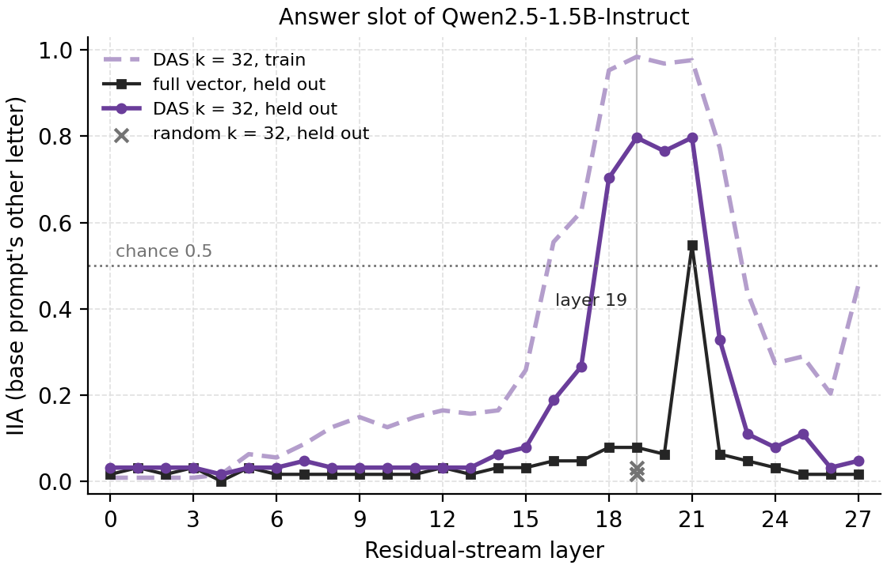

# Causal models and distributed alignment search

> Geiger et al. **Finding Alignments Between Interpretable Causal Variables
> and Distributed Neural Representations.**
> [[arXiv]](https://arxiv.org/abs/2303.02536)
>
> Wiegreffe et al. **Answer, Assemble, Ace: Understanding How LMs Answer
> Multiple Choice Questions.** [[arXiv]](https://arxiv.org/abs/2407.15018)

**Figure context:**

- Qwen2.5-1.5B-Instruct answers a two-option colour question with the letter
  of the correct option.
- Which layers carry the correct option's position at the answer slot, in a
  32-dimensional subspace?
- A causal model writes the task as equations. Distributed alignment search
  (DAS) learns one rotation per layer, so that swapping its subspace from a
  prompt with the options swapped gives the base prompt's other letter, as an
  interchange of `answer_position` predicts.
- For reference, a second patch swaps the whole residual-stream vector at the
  same token.
- [The symbol variant](mcqa_symbol.md) aligns the answer letter instead.



*Figure 1: DAS for the position of the correct option in
Qwen2.5-1.5B-Instruct: `The cup is red. What color is the cup?` --> the
letter of `red`. IIA is the share of patched answers that are the base
prompt's other letter, on 64 held-out pairs and the 128 training pairs.
Chance is 0.5. At layer 19, DAS scores 0.797 held out and the full-vector
patch 0.078. The full vector peaks at 0.547 at layer 21, where DAS also
scores 0.797. The counterfactual prompt's own answer is the base prompt's
letter, not the label.*

## CausaLab implementation

Let's walk through the causal model and then the specification of the DAS
fit for `answer_position` (Figure 1).

### Write the task as equations

```python title="causalab/tasks/MCQA/causal_models.py"
@mechanism
def equations(
    template: Dom(TEMPLATES),
    object: Dom(OBJECTS),
    color: Dom(COLORS),
    choices: FamilyDom(Dom(COLORS), size=NUM_CHOICES),
    symbols: FamilyDom(Dom(ALPHABET), size=NUM_CHOICES),
):
    answer_position = V(choices.index(color), domain=Dom(range(NUM_CHOICES)))
    answer = V(symbols[answer_position], domain=Dom(ALPHABET))
    raw_input = V(  # noqa: F841
        _fill_template(template, object, color, choices, symbols), domain=Dom(str)
    )
    raw_output = V(" " + answer, domain=Dom(str))  # noqa: F841
    return answer
```

Expand the dropdown to see the full implementation.

<details>
<summary><b>Full JSON</b></summary>

```json
{
  "header": {
    "protocol_version": "4",
    "description": "DAS fit for the mcqa_pointer package: one 32-dimensional rotation of the residual stream at the answer slot of Qwen2.5-1.5B-Instruct per layer, all 28 layers, trained so that swapping the subspace from a same_symbol_different_position counterfactual, whose correct letter sits at the other option, makes the model answer the base prompt's other letter (the causal model's `answer` after interchanging `answer_position`); mcqa_pointer_das_apply.json scores the saved rotations on both splits."
  },
  "model": {"key": "Qwen/Qwen2.5-1.5B-Instruct", "revision": "main", "dtype": "bf16"},
  "data": {
    "base": {"dataset": "mcqa_pointer/data#train", "field": "input"},
    "counterfactual": {"dataset": "mcqa_pointer/data#train", "field": "counterfactual_inputs[0]"}
  },
  "method": {
    "intervened_models": {
      "original_counterfactual": {"input": "counterfactual", "reads": ["v_cf"]},
      "patched": {"input": "base", "reads": ["logits"], "writes": ["patch"]}
    },
    "positions": {"answer_slot": {"index": -1}},
    "sites": {
      "target": {"component": "block_output", "layers": {"sweep": {"range": [0, 28]}}},
      "lm_head": {"component": "lm_head"}
    },
    "featurizers": {
      "rot": {"kind": "subspace", "k": 32, "parametrization": "cayley"}
    },
    "reads": {
      "v_cf": {"site": "target", "pos": "answer_slot", "featurizer": "rot"},
      "logits": {"site": "lm_head", "pos": -1}
    },
    "writes": {
      "patch": {"site": "target", "pos": "answer_slot", "featurizer": "rot", "do": {"swap": "v_cf"}}
    },
    "train": {
      "objective": {
        "ce": {
          "weight": 1.0,
          "read": "logits",
          "model": "patched",
          "aggregation": {"kind": "cross_entropy", "target": "label"}
        }
      },
      "params": ["rot"],
      "optimizer": {"name": "adamw", "lr": 0.001, "weight_decay": 0.0},
      "steps": {"epochs": 20},
      "batch": {"pairs": 32},
      "precision": {"feature": "fp32", "loss": "fp32"},
      "seed": 0
    },
    "save": [
      {"value": "rot", "site": "target", "file_path": "rot.safetensors"}
    ]
  }
}
```

</details>

### Load the model and the training pairs

```json
"model": {"key": "Qwen/Qwen2.5-1.5B-Instruct", "revision": "main", "dtype": "bf16"},
"data": {
    "base": {"dataset": "mcqa_pointer/data#train", "field": "input"},  // 128 same_symbol_different_position pairs; `label` comes from the causal model
    "counterfactual": {"dataset": "mcqa_pointer/data#train", "field": "counterfactual_inputs[0]"}  // the two options swapped, letters included
}
```

### Define the counterfactual run and the patched run

```json
"intervened_models": {
    "original_counterfactual": {"input": "counterfactual", "reads": ["v_cf"]},
    "patched": {"input": "base", "reads": ["logits"], "writes": ["patch"]}
}
```

### Select the answer slot and every block output

```json
"positions": {"answer_slot": {"index": -1}},  // the final `:` of `Answer:`
"sites": {
    "target": {"component": "block_output", "layers": {"sweep": {"range": [0, 28]}}},  // sweep: one rotation per layer
    "lm_head": {"component": "lm_head"}
}
```

### Define reads: the counterfactual's subspace and the patched logits

```json
"reads": {
    "v_cf": {"site": "target", "pos": "answer_slot", "featurizer": "rot"},
    "logits": {"site": "lm_head", "pos": -1}
}
```

### Define writes: swap the subspace into the base run

```json
"writes": {
    "patch": {"site": "target", "pos": "answer_slot", "featurizer": "rot", "do": {"swap": "v_cf"}}
}
```

### Train a 32-dimensional rotation on the interchange label

```json
"featurizers": {
    "rot": {"kind": "subspace", "k": 32, "parametrization": "cayley"}  // the line DBM-DAS widens to 128
},
"train": {
    "objective": {
        "ce": {
            "weight": 1.0,
            "read": "logits",
            "model": "patched",
            "aggregation": {"kind": "cross_entropy", "target": "label"}
        }
    },
    "params": ["rot"],
    "optimizer": {"name": "adamw", "lr": 0.001, "weight_decay": 0.0},  // onboarding 07's settings
    "steps": {"epochs": 20},
    "batch": {"pairs": 32},
    "precision": {"feature": "fp32", "loss": "fp32"},
    "seed": 0
}
```

### Save the rotations for the held-out scoring

```json
"save": [
    {"value": "rot", "site": "target", "file_path": "rot.safetensors"}  // one entry per layer
]
```

## Full-vector patch: change these lines

[`protocols/mcqa_pointer_das_apply.json`](protocols/mcqa_pointer_das_apply.json)
scores the saved rotations on the held-out pairs against the label, the base
prompt's other letter. The workflow step `full_patch` runs it with a `set`
override that removes the featurizer, so the swap moves all 1536 dimensions
of the block output and is scored against the same label. This step gives
the full-vector line of Figure 1.

### Swap the whole block output at every layer

```diff
-"featurizers": {
-    "rot": {"kind": "subspace", "k": 32, "parametrization": "cayley", "file_path": "fit/rot.safetensors"}
-},
+"featurizers": {},  // no featurizer: the swap moves the whole vector
 "reads": {
-    "v_cf": {"site": "target", "pos": "answer_slot", "featurizer": "rot"},
+    "v_cf": {"site": "target", "pos": "answer_slot"},
 "writes": {
-    "patch": {"site": "target", "pos": "answer_slot", "featurizer": "rot", "do": {"swap": "v_cf"}}
+    "patch": {"site": "target", "pos": "answer_slot", "do": {"swap": "v_cf"}}
```

## DBM-DAS: change these lines

[`protocols/mcqa_pointer_dbm_fit.json`](protocols/mcqa_pointer_dbm_fit.json)
is the DAS fit above with a boundary gate behind a 128-column rotation, at
the layer with the highest held-out DAS IIA. The fit learns the rank.

### Learned rank at the chosen layer

```diff
 "sites": {
-    "target": {"component": "block_output", "layers": {"sweep": {"range": [0, 28]}}},
+    "target": {"component": "block_output", "layers": [27]},  // the workflow sets the chosen layer
 "featurizers": {
-    "rot": {"kind": "subspace", "k": 32, "parametrization": "cayley"}
+    "rot": {"kind": "subspace", "k": 128, "parametrization": "cayley"},
+    "bnd": {"kind": "gate", "parametrization": "boundary"}
 "reads": {
-    "v_cf": {"site": "target", "pos": "answer_slot", "featurizer": "rot"},
+    "v_cf": {"site": "target", "pos": "answer_slot", "featurizer": ["rot", "bnd"]},
 "writes": {
-    "patch": {"site": "target", "pos": "answer_slot", "featurizer": "rot", "do": {"swap": "v_cf"}}
+    "patch": {"site": "target", "pos": "answer_slot", "featurizer": ["rot", "bnd"], "do": {"swap": "v_cf"}}
 "train": {
     "objective": {
+        "l1": {"weight": 1.0, "l1": "bnd"}
-    "params": ["rot"],
-    "optimizer": {"name": "adamw", "lr": 0.001, "weight_decay": 0.0},
+    "params": ["rot", "bnd"],
+    "optimizer": {"name": "adamw", "lr": {"rot": 0.001, "bnd": 0.01}, "weight_decay": 0.0},
+    "anneal": {"bnd.theta.temperature": [1.0, 0.1, 1.0]},
 "save": [
+    {"value": "bnd", "site": "target", "file_path": "bnd.safetensors"}
```

| fit | rank | held-out IIA | three random subspaces of the same rank, mean |
|---|---|---|---|
| DBM-DAS | 57 of 128, learned | 0.797 | 0.010 |
| DAS | 32 | 0.797 | 0.021 |

*Table 1: DBM-DAS and DAS at layer 19. The boundary keeps 57 of 128 columns
and scores 0.797 held out, the same as DAS at k = 32. DAS picked layer 19 on
these same held-out pairs, so the DBM-DAS score inherits that selection. The
random subspaces leave the base answer in place, so their reference is the
unpatched base prompt, which gives the label on 0.000 of the held-out pairs.
The boundary starts at 64 columns and moves by seven, so this rank stays
close to its starting value.*

## Further Details

<details>
<summary><b>Method</b></summary>

**Pairs and labels.** `build_dataset.py` draws 128
`same_symbol_different_position` pairs from seed 1 and 64 from seed 2, and
the two splits share no prompt. The counterfactual swaps the two options,
letters included, so its correct letter is the base prompt's correct letter
at the other position. The `label` column is the causal model's `answer`
after the interchange of `answer_position`: the base prompt's other letter.
Unpatched, the model answers 0.875 of the held-out base prompts and 0.828 of
their counterfactuals correctly, and it never gives the label (0.000).

**Selection.** The workflow picks the layer from the same 64 held-out pairs
that Figure 1 and Table 1 report, so the value at the chosen layer is a best
of 28.
Layers 19 and 21 tie at 0.797, and `select` takes the first.

</details>

<details>
<summary><b>Execution</b>: environment, run command, flags, resources, workflow</summary>

**Environment.** `Qwen/Qwen2.5-1.5B-Instruct` is an open checkpoint under
the Apache 2.0 license and needs no token. The run reads 3.1 GB of bf16
weights from a cache or downloads them:

```bash
export HF_HUB_CACHE=/path/to/cache  # optional: a cache that already holds the checkpoint
```

**Run.** From `demos/papers/`, run the workflow, then draw the figures, which
need no accelerator:

```bash
causalab run workflows/mcqa_pointer.json \
    --engine auto \
    --data-root artifacts/data \
    --out artifacts/output \
    --device cuda \
    --resume
python workflows/scripts/mcqa_pointer/iia_figure.py
```

**Flags.** `--data-root` resolves `mcqa_pointer/data#train` to the `train`
rows of `artifacts/data/mcqa_pointer/data.json`. `--out artifacts/output`
puts the run tree under `artifacts/output/mcqa_pointer/`, which the figure
script reads. It writes `iia_all.png` and `iia_plotted.json` to
`artifacts/figures/mcqa_pointer/`.
`--resume` reuses every step whose recorded digests still match. On an
Apple-silicon laptop pass `--device mps`. Replace `run` with `validate` and
drop the run-only flags to check the documents without loading weights.

**Resources and reproducibility.** The committed figure and table come from
one run on one H100 80 GB on 2026-09-30, in bf16 with the `pytorch_hooks`
engine. The whole workflow took 114 s, model loads included.
An earlier run without the `full_patch` step (2026-09-28) gave
the same values in every step the two runs share. We did not time a laptop run.

**Workflow.** [`workflows/mcqa_pointer.json`](workflows/mcqa_pointer.json)
runs, in order: `clean`
([`protocols/mcqa_pointer_clean.json`](protocols/mcqa_pointer_clean.json)),
the unpatched baselines; `fit`, the document above; `apply` and
`apply_train`
([`protocols/mcqa_pointer_das_apply.json`](protocols/mcqa_pointer_das_apply.json)),
which score the 28 rotations on the held-out and the training split;
`full_patch`, the same document without the featurizer; `best`,
the shipped `select` script, which emits the layer with the highest held-out
IIA; `dbm_fit` and `dbm_apply`
([`protocols/mcqa_pointer_dbm_apply.json`](protocols/mcqa_pointer_dbm_apply.json))
at that layer; `rank`
([`learned_rank.py`](workflows/scripts/mcqa_pointer/learned_rank.py)), which
reads the learned rank from the gate; and `control` and `control_dbm`
([`protocols/mcqa_pointer_control.json`](protocols/mcqa_pointer_control.json)),
three random subspaces at k = 32 and at the learned rank. The fit keeps
onboarding 07's training settings and drops its per-epoch evaluation on the
held-out split, which the apply steps replace.

</details>

<details>
<summary><b>Intervention protocol parameters</b>: what to change for another variable, model or width</summary>

| field | here | to change |
|---|---|---|
| `model.key` | `Qwen/Qwen2.5-1.5B-Instruct` | any registered causal LM; the layer range follows its depth |
| `data.base.dataset` | `mcqa_pointer/data#train` | a table whose `label` is another variable's interchange, built by `build_dataset.py` with another `DESIGN` and `TARGET` |
| `positions.answer_slot.index` | `-1` | another token of the prompt |
| `sites.target.layers` | `range [0, 28]` | the model's layer count |
| `featurizers.rot.k` | `32` | the subspace width; `128` with the `bnd` gate for DBM-DAS |
| `train.steps.epochs` | `20` | more epochs for a larger table |

[The intervention reference](../../docs/intervention_protocol.md) defines
every field.

</details>
