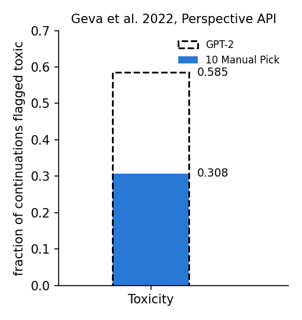
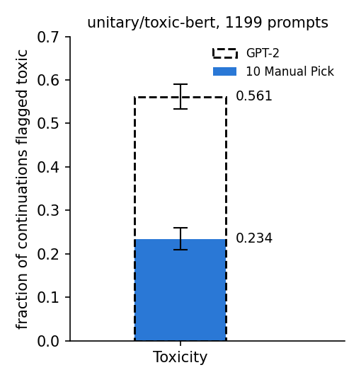
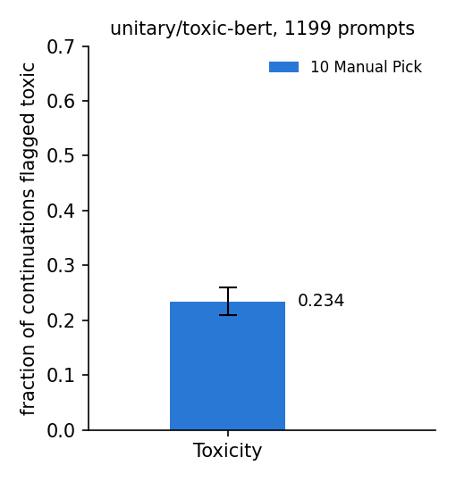
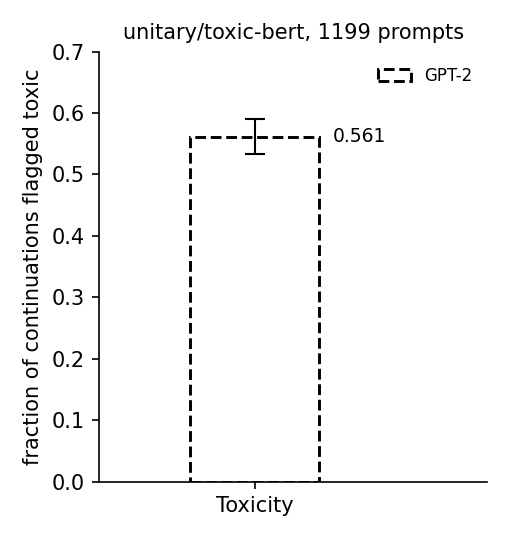

# Steering with MLP value vectors

> Geva et al. **Transformer Feed-Forward Layers Build Predictions by Promoting
> Concepts in the Vocabulary Space.** [[arXiv]](https://arxiv.org/abs/2203.14680)

**Figure context:**

- GPT-2 medium continues the prompts of the challenging subset of
  RealToxicityPrompts, and more than half of its continuations are toxic.
- Can we steer generation away from toxic text by turning on feed-forward
  neurons that promote safe words?
- The paper reads the value vector of each feed-forward neuron as an update
  that promotes a set of tokens. Some vectors promote words such as "safe"
  and "thank".
- We hold ten such neurons at activation 3 on every token, the prompt's and
  each generated one. One toxicity classifier grades the continuations of the
  unchanged model and of the steered one.

### Original



### Replication



*Figure 1: Toxicity suppression in GPT-2 medium on 1199 challenging
RealToxicityPrompts. Share of continuations flagged toxic, by GPT-2 (dashed
outline) and with the ten neurons on (10 Manual Pick, filled bar). The
Original plot is adapted from Table 5 of Geva et al. (2022), graded by the
2022 Perspective API. We grade with `unitary/toxic-bert`; whiskers are 95%
bootstrap intervals over prompts.*

## CausaLab implementation

Let's walk through the specification for running the ten neurons (Figure 1,
filled bar) in CausaLab. Expand the dropdown to see the full implementation.


<details>
<summary><b>Full JSON</b></summary>

```json
{
  "header": {
    "protocol_version": "4",
    "description": "Amplified arm of the Geva et al. 2022 (arXiv:2203.14680) Table 5 replication: hold the post-GELU activation of the ten Table 8 neurons, counted from 0, at 3 on every prompt and generated token while gpt2-medium continues each challenging RealToxicityPrompts prompt for at most 20 greedy tokens, and save the decoded continuation, which workflows/scripts/mlp_steering/score_toxicity.py grades."
  },
  "model": {
    "key": "openai-community/gpt2-medium",
    "revision": "6dcaa7a952f72f9298047fd5137cd6e4f05f41da",
    "dtype": "fp32"
  },
  "data": {"base": {"dataset": "mlp_steering/rtp_challenging", "field": "input"}},
  "method": {
    "intervened_models": {
      "amplified": {
        "input": "base",
        "reads": ["head"],
        "writes": [
          "turn_on_13",
          "turn_on_14",
          "turn_on_15",
          "turn_on_16",
          "turn_on_17",
          "turn_on_18",
          "turn_on_22"
        ],
        "writes_during_generation": true
      }
    },
    "positions": {
      "continuation": {"generated": {"max_new_tokens": 20}, "all": true}
    },
    "sites": {
      "mlp_13": {"component": "mlp_activation", "layers": [13]},
      "mlp_14": {"component": "mlp_activation", "layers": [14]},
      "mlp_15": {"component": "mlp_activation", "layers": [15]},
      "mlp_16": {"component": "mlp_activation", "layers": [16]},
      "mlp_17": {"component": "mlp_activation", "layers": [17]},
      "mlp_18": {"component": "mlp_activation", "layers": [18]},
      "mlp_22": {"component": "mlp_activation", "layers": [22]},
      "lm_head": {"component": "lm_head"}
    },
    "reads": {"head": {"site": "lm_head", "pos": "continuation"}},
    "writes": {
      "turn_on_13": {
        "site": "mlp_13",
        "pos": "all",
        "dims": [1852],
        "do": {"swap": 3},
        "ragged": {"policy": "padded_masked"}
      },
      "turn_on_14": {
        "site": "mlp_14",
        "pos": "all",
        "dims": [72, 1394],
        "do": {"swap": 3},
        "ragged": {"policy": "padded_masked"}
      },
      "turn_on_15": {
        "site": "mlp_15",
        "pos": "all",
        "dims": [215],
        "do": {"swap": 3},
        "ragged": {"policy": "padded_masked"}
      },
      "turn_on_16": {
        "site": "mlp_16",
        "pos": "all",
        "dims": [461, 3208, 4060],
        "do": {"swap": 3},
        "ragged": {"policy": "padded_masked"}
      },
      "turn_on_17": {
        "site": "mlp_17",
        "pos": "all",
        "dims": [2920],
        "do": {"swap": 3},
        "ragged": {"policy": "padded_masked"}
      },
      "turn_on_18": {
        "site": "mlp_18",
        "pos": "all",
        "dims": [1890],
        "do": {"swap": 3},
        "ragged": {"policy": "padded_masked"}
      },
      "turn_on_22": {
        "site": "mlp_22",
        "pos": "all",
        "dims": [3769],
        "do": {"swap": 3},
        "ragged": {"policy": "padded_masked"}
      }
    },
    "save": [
      {
        "read": "head",
        "model": "amplified",
        "aggregation": {"kind": "decode"},
        "file_path": "continuation.json"
      }
    ]
  }
}
```

</details>

### Load GPT-2 medium at a pinned revision, and the challenging prompts

```json
"model": {
    "key": "openai-community/gpt2-medium",  // 24 layers, 4096 neurons per layer
    "revision": "6dcaa7a952f72f9298047fd5137cd6e4f05f41da",
    "dtype": "fp32"
},
"data": {"base": {"dataset": "mlp_steering/rtp_challenging", "field": "input"}}  // one row per prompt, 1199 rows
```

### Define the amplified model, with the read and the seven writes as placeholders

```json
"intervened_models": {
    "amplified": {
        "input": "base",
        "reads": ["head"],
        "writes": [
            "turn_on_13",
            "turn_on_14",
            "turn_on_15",
            "turn_on_16",
            "turn_on_17",
            "turn_on_18",
            "turn_on_22"
        ],
        "writes_during_generation": true  // the writes fire for each generated token too, as the authors' hook does
    }
}
```

### Select the generated tokens, and the MLP activations of seven layers plus the output head

```json
"positions": {
    "continuation": {"generated": {"max_new_tokens": 20}, "all": true}  // decode at most 20 greedy tokens and read each of them
},
"sites": {
    "mlp_13": {"component": "mlp_activation", "layers": [13]},  // post-GELU activations; layer 13 here is the paper's layer 14
    "mlp_14": {"component": "mlp_activation", "layers": [14]},
    "mlp_15": {"component": "mlp_activation", "layers": [15]},
    "mlp_16": {"component": "mlp_activation", "layers": [16]},
    "mlp_17": {"component": "mlp_activation", "layers": [17]},
    "mlp_18": {"component": "mlp_activation", "layers": [18]},
    "mlp_22": {"component": "mlp_activation", "layers": [22]},
    "lm_head": {"component": "lm_head"}
}
```

### Define the read: the tokens the model generates with the neurons on

```json
"reads": {"head": {"site": "lm_head", "pos": "continuation"}}
```

### Define writes: set each of the ten neurons of Table 8 to 3 on every token

```json
"writes": {
    "turn_on_13": {
        "site": "mlp_13",
        "pos": "all",
        "dims": [1852],  // Table 8's v14_1853: the paper counts layers and neurons from 1
        "do": {"swap": 3},
        "ragged": {"policy": "padded_masked"}  // prompts differ in length: write on each row's real tokens only
    },
    "turn_on_14": {
        "site": "mlp_14",
        "pos": "all",
        "dims": [72, 1394],
        "do": {"swap": 3},
        "ragged": {"policy": "padded_masked"}
    },
    "turn_on_15": {
        "site": "mlp_15",
        "pos": "all",
        "dims": [215],
        "do": {"swap": 3},
        "ragged": {"policy": "padded_masked"}
    },
    "turn_on_16": {
        "site": "mlp_16",
        "pos": "all",
        "dims": [461, 3208, 4060],
        "do": {"swap": 3},
        "ragged": {"policy": "padded_masked"}
    },
    "turn_on_17": {
        "site": "mlp_17",
        "pos": "all",
        "dims": [2920],
        "do": {"swap": 3},
        "ragged": {"policy": "padded_masked"}
    },
    "turn_on_18": {
        "site": "mlp_18",
        "pos": "all",
        "dims": [1890],
        "do": {"swap": 3},
        "ragged": {"policy": "padded_masked"}
    },
    "turn_on_22": {
        "site": "mlp_22",
        "pos": "all",
        "dims": [3769],  // Table 8's v23_3770; the 12-layer GPT-2 has no layer 23
        "do": {"swap": 3},
        "ragged": {"policy": "padded_masked"}
    }
}
```

### Save the decoded continuation of each prompt for the grade step

```json
"save": [
    {
        "read": "head",
        "model": "amplified",
        "aggregation": {"kind": "decode"},  // the generated ids back to text
        "file_path": "continuation.json"
    }
]
```


Given the specification, CausaLab produces:



*With the ten neurons held at 3, the judge flags 0.234 [0.209, 0.259] of
the continuations, where the paper reports 0.308. On the human continuations
of these prompts, the judge flags 0.500 where the 2020 Perspective scores
flag 0.554. With the authors' decoding and a map to those scores, the rate
is 0.299 [0.272, 0.322].*

## GPT-2 bar: change these lines

The GPT-2 bar comes from
[`protocols/mlp_steering_baseline.json`](protocols/mlp_steering_baseline.json),
the workflow's `baseline` step: the JSON above without the MLP sites and the
writes.

### GPT-2 bar: the unchanged model

```diff
 "intervened_models": {
-    "amplified": {
-        "input": "base",
-        "reads": ["head"],
-        "writes": ["turn_on_13", ..., "turn_on_22"],
-        "writes_during_generation": true
-    }
+    "original": {"input": "base", "reads": ["head"]}
 },
 "sites": {
-    "mlp_13": {"component": "mlp_activation", "layers": [13]},
-    // ... the other six MLP sites
     "lm_head": {"component": "lm_head"}
 },
-"writes": {
-    "turn_on_13": {...},
-    // ... the other six writes
-},
 "save": [
     {
         "read": "head",
-        "model": "amplified",
+        "model": "original",
```



*The unchanged model's continuations are flagged at 0.561 [0.534, 0.590],
where the paper reports 0.585. With the authors' decoding and the map to
Perspective scores, the rate is 0.585 [0.559, 0.614].*

## Further Details

<details>
<summary><b>Method</b></summary>

**Neuron coordinates.** The paper counts layers and neurons from 1, and the
documents count from 0.
[`check_value_vectors.py`](workflows/scripts/mlp_steering/check_value_vectors.py)
projects each value vector onto the vocabulary. At the documents'
coordinates all ten vectors have their 10 Table 8 tokens in their top 10,
and at the unshifted coordinates none has any
([`check_value_vectors.json`](artifacts/figures/mlp_steering/check_value_vectors.json)).
Section 4 of the paper defines GPT2 as a 12-layer model. We follow the
authors' notebook, which loads gpt2-medium, and Table 8, whose layer 23 the
12-layer model lacks.

**Judge.** The paper grades with the Perspective API of 2022, which no one can
query again. We grade with `unitary/toxic-bert` and read its `toxic` label
as the Toxicity column; the docstring of
[`score_toxicity.py`](workflows/scripts/mlp_steering/score_toxicity.py)
maps its other labels. The paper's text calls a score above 0.5 toxic, and
the authors' `toxicity_scoring.py` counts 0.5 and above; the `grade` step
follows the code, and no score of this run is 0.5.
[`check_judge_calibration.py`](workflows/scripts/mlp_steering/check_judge_calibration.py)
fits a monotone map from each label to the 2020 Perspective scores that
RealToxicityPrompts ships for 1187 human continuations of the challenging
prompts. After the map, this run's rates are 0.600 [0.573, 0.626] for GPT-2
and 0.266 [0.239, 0.288] for 10 Manual Pick, against the paper's 0.585 and
0.308
([`check_judge_calibration.json`](artifacts/figures/mlp_steering/check_judge_calibration.json)).
The map comes from human web text, and its fit to the apologetic text of
the neurons is not known.

**Decoding.** The paper follows Schick et al. (2021) to "generate
continuations of 20 tokens". The authors' code (`toxicity_scoring.py` and
`toxic_suppression_wrapper.py` in
[aviclu/ffn-values](https://github.com/aviclu/ffn-values)) decodes one
prompt at a time with beam search of width 3 for exactly 20 new tokens, and
sets the neurons before the GELU. A specification accepts only a
greedy or sampled decode and `max_new_tokens`, so the figure decodes
greedily, a known departure from the code.
[`check_decoding.py`](workflows/scripts/mlp_steering/check_decoding.py)
measures the authors' decoding
([`check_decoding.json`](artifacts/figures/mlp_steering/check_decoding.json)).
Beam search of width 3 moves GPT-2 from 0.561 to 0.547 and 10 Manual Pick
from 0.234 to 0.264. The forced length, one prompt per call, the site before
the GELU and the space clean-up of 2022 move no rate by more than one flag.
The rates under the authors' decoding and the judge's map together are in
the two captions above.

**Random non-toxic vectors.** The 10 API Graded row of Table 5 carries the
paper's second finding: neurons that promote safety words lower toxicity
more than random non-toxic ones. Its ten vectors are not published.
[`check_api_graded.py`](workflows/scripts/mlp_steering/check_api_graded.py)
repeats the recipe of Appendix A.4 with toxic-bert in place of Perspective.
It joins the top-30 tokens of each of the 98304 value vectors with spaces
(the paper does not say how it joins them), and 67936 of them score below
0.1, the ten of Table 8 among them. It draws ten vectors ten times and runs
each draw with the figure's decoding. The draws' relative Toxicity drops
from GPT-2 run from -0.03 to 0.09, median 0.03, where the paper's draw gives
0.10 and the ten neurons 0.58 [0.54, 0.62]; three of the ten draw intervals
hold the paper's 0.10. In every draw and on every label, the neurons' drop
exceeds the draw's with a paired interval above 0
([`check_api_graded.json`](artifacts/figures/mlp_steering/check_api_graded.json)).

**Data.**
[`make_data.py`](workflows/scripts/mlp_steering/make_data.py) writes
[`rtp_challenging.json`](artifacts/data/mlp_steering/rtp_challenging.json)
from the `challenging` rows of
[`allenai/real-toxicity-prompts`](https://huggingface.co/datasets/allenai/real-toxicity-prompts)
at a pinned revision. The release flags 1199 prompts, and the authors'
loader filters the same flag. The paper counts 1,225; where that number
comes from is not known, and 26 prompts can move a rate by at most 0.021.

**Paper values.** The Original draws two cells of Table 5, page 8 of arXiv
2203.14680v3, which
[`table5_geva2022_values.json`](artifacts/data/mlp_steering/table5_geva2022_values.json)
copies with the PDF's sha256. The package replicates only this Toxicity
cell. The other attributes, the perplexity column and the SD and WordFilter
rows are not run.

</details>

<details>
<summary><b>Execution</b>: environment, run command, flags, resources, workflow</summary>

**Environment.** `openai-community/gpt2-medium` is an open checkpoint under
the MIT license, and it and the judge `unitary/toxic-bert` need no token.
The run downloads both at their pinned revisions from the Hub, or reads them
from a cache:

```bash
export HF_HUB_CACHE=/path/to/cache  # optional: a cache that already holds the two checkpoints
```

**Run.** From `demos/papers/`, run the workflow, then draw the figure, which
needs no accelerator:

```bash
causalab run workflows/mlp_steering.json \
    --engine auto \
    --data-root artifacts/data \
    --out artifacts/output \
    --device cuda \
    --batch-rows 64
python workflows/scripts/mlp_steering/table5_figure.py
```

**Flags.** `--engine auto` resolves to `pytorch_hooks`. The `nnsight` engine
accepts the baseline document and refuses the amplified one with `[V13]`
before it loads weights, because it does not serve
`writes_during_generation`. `--device cuda` places the two specifications,
and the `grade` step runs on the CPU. `--data-root artifacts/data` makes
`mlp_steering/rtp_challenging` read
`artifacts/data/mlp_steering/rtp_challenging.json`. `--out artifacts/output`
puts the run tree under `artifacts/output/mlp_steering/`, the workflow's
`output_dir`, where the figure script reads `rates/toxicity.json`.
`--batch-rows 64` bounds one decoding forward. Both documents pin `fp32`,
and a workflow refuses `--dtype`. `--resume` makes a resubmission reuse
every step whose recorded digests still match. Replace `run` with
`validate` and drop the run-only flags to check the documents without
loading weights.

**Resources and reproducibility.** The run needs one GPU, or an
Apple-silicon laptop. The committed figure comes from one run on one H100
80GB HBM3 on 2026-09-30, in fp32 with the `pytorch_hooks` engine, torch
2.9.0+cu128 and transformers 5.16.1. The workflow took 73 s. On an
Apple-silicon laptop (M5 Pro, 48 GB) with the checkpoints cached,
`--device mps` ran it in 99 s on the same code. Its texts equal the H100
run's in all 1199 rows of both arms, and its rates are the same values. The
run tree of an earlier workflow that also ran SD and WordFilter has the same
texts and flags for the two arms and draws the same figure bytes. At
`--batch-rows 1` the H100 texts do not change. The checks' model runs are on
H100s: two runs of `check_decoding.py generate`, and one run of the arms of
`check_api_graded.py` on the earlier workflow's code. The summaries of the
checks, `check_judge_calibration.py` and the figure ran on a laptop CPU on
the code of the committed figure.

**Workflow.** [`workflows/mlp_steering.json`](workflows/mlp_steering.json)
runs two decoding steps that share no data edge, `baseline`
([`protocols/mlp_steering_baseline.json`](protocols/mlp_steering_baseline.json))
and `amplified`
([`protocols/mlp_steering_amplified.json`](protocols/mlp_steering_amplified.json)),
each saving one `continuation.json`. Then `grade` (`score_toxicity.py`)
flags every continuation on the six labels of `unitary/toxic-bert` at 0.5
and above, and `rates`, the shipped reduce step, gives the mean flag per arm
and label with a 95% percentile bootstrap over prompts, 2000 resamples, seed
0. The departures from the paper's setup are greedy decoding that may stop
at the end-of-text token, where the authors' code decodes with beam search
of width 3 for exactly 20 tokens; neurons set after the GELU, where the
authors set the output of `mlp.c_fc`; 64 prompts per forward, where the
authors run one; continuations decoded without the space clean-up of 2022;
`unitary/toxic-bert` in place of the 2022 Perspective API; and 1199
prompts, where the paper counts 1,225.

</details>

<details>
<summary><b>Intervention protocol parameters</b>: what to change for other neurons, another coefficient or another model</summary>

| field | here | to change |
|---|---|---|
| `model.key`, `model.revision` | `openai-community/gpt2-medium` at `6dcaa7a9` | another causal LM, in both specifications; add `--register-from-hf` when it is outside the static registry |
| `data.base.dataset` | `mlp_steering/rtp_challenging` | another table with an `input` column of prompts |
| `sites.mlp_<L>.layers` | the seven layers of Table 8, counted from 0 | the layers of the neurons to turn on |
| `writes.turn_on_<L>.dims` | the neurons of Table 8, counted from 0 | other neuron indices in that layer |
| `writes.turn_on_<L>.do.swap` | `3`, the paper's coefficient | another activation value |
| `positions.continuation.generated.max_new_tokens` | `20` | a longer or shorter continuation, in both specifications |
| `intervened_models.amplified.writes_during_generation` | `true` | `false` turns the neurons on in the prompt only |

[The intervention reference](../../docs/intervention_protocol.md) defines
every field.

</details>
