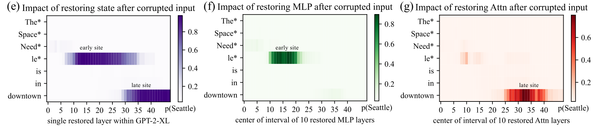
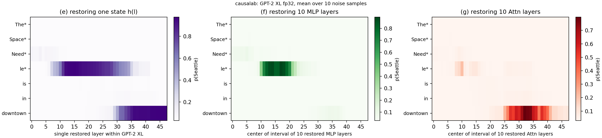
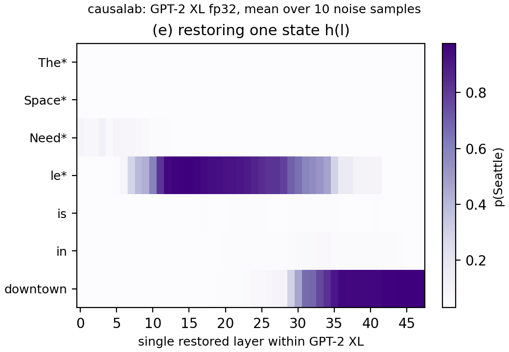
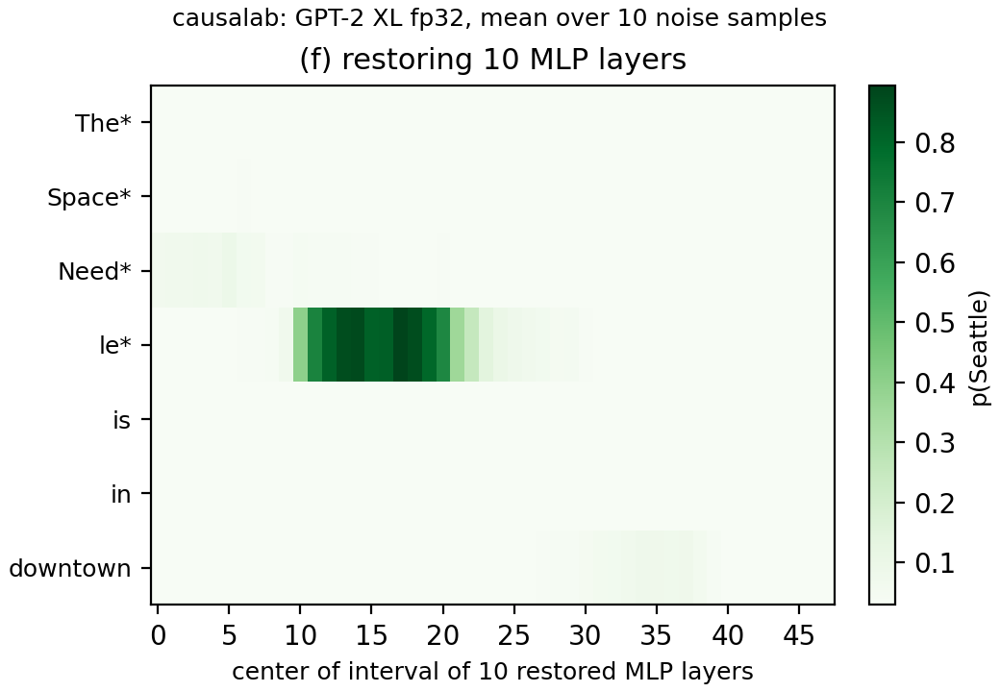
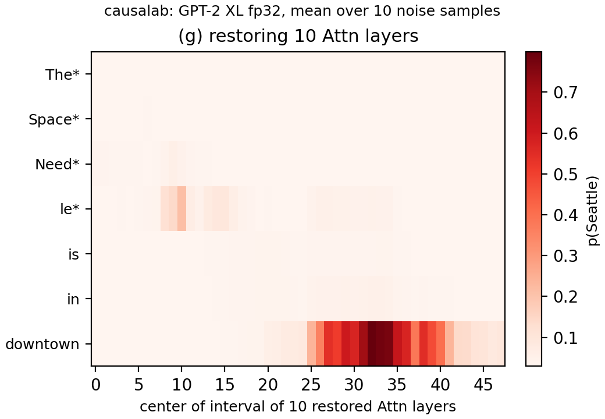

# Causal tracing

> Meng et al. **Locating and Editing Factual Associations in GPT.**
> [[arXiv]](https://arxiv.org/abs/2202.05262)

**Figure context:**

- GPT-2 XL completes `The Space Needle is in downtown` with ` Seattle`.
- Which internal states carry that fact from the subject to the prediction?
- Causal tracing adds Gaussian noise to the subject tokens (starred), which
  drops p(Seattle) from 0.976 to 0.030, then puts one clean state back at
  one token and one layer.
- The clean state is one residual-stream state in (e), ten layers of MLP
  outputs in (f) and ten layers of attention outputs in (g).
- [Zero ablation](rome_fig1_knockout.md), the page before this one in the
  series, zeroes the same states instead of restoring them.

### Original



### Replication



*Figure 1: Causal tracing of factual recall in GPT-2 XL: `The Space Needle
is in downtown` --> ` Seattle`. p(Seattle), mean of ten noise samples, after
one state (e), ten MLP layers (f) or ten attention layers (g) are restored at
one token (y axis) and layer or window centre (x axis). All 1008 values are
within 0.0093 of the paper's, read from its vector figure to within 0.011.
Ten other noise seeds move values by up to 0.27 (Method).*

## CausaLab implementation

Let's walk through the specification for restoring one residual-stream state
(Figure 1e, left) in CausaLab. Expand the dropdown to see the full
implementation.

<details>
<summary><b>Full JSON</b></summary>

```json
{
  "header": {
    "protocol_version": "4",
    "description": "Figure 1e of Meng et al. 2022 (arXiv:2202.05262): add 0.1 times the noise_draw step's Gaussian draw to the subject's token embeddings, put back one clean residual-stream state at one token and layer, and save the answer's cross-entropy at the last position, which workflows/scripts/rome_fig1/fig1_figure.py draws as p(Seattle)."
  },
  "model": {"key": "gpt2-xl", "revision": "15ea56dee5df4983c59b2538573817e1667135e2", "dtype": "fp32"},
  "data": {"base": {"dataset": "rome_fig1/data", "field": "input"}},
  "method": {
    "intervened_models": {
      "original": {"input": "base", "reads": ["v_clean"]},
      "restored": {"input": "base", "reads": ["logits_restored"], "writes": ["corrupt", "put_back"]}
    },
    "positions": {
      "subject": {"variable": "subject"},
      "tap": {"index": {"sweep": {"range": [0, 7]}}}
    },
    "sites": {
      "emb": {"component": "embeddings"},
      "restore": {"component": "block_output", "layers": {"sweep": {"range": [0, 48]}}},
      "lm_head": {"component": "lm_head"}
    },
    "params": {"noise": {"file_path": "noise_draw/noise.safetensors"}},
    "reads": {
      "v_clean": {"site": "restore", "pos": "tap"},
      "logits_restored": {"site": "lm_head", "pos": -1}
    },
    "writes": {
      "corrupt": {
        "site": "emb",
        "pos": "subject",
        "do": {"add_scaled": {"op": "noise", "alpha": 0.1}}
      },
      "put_back": {"site": "restore", "pos": "tap", "do": {"swap": "v_clean"}}
    },
    "save": [
      {
        "read": "logits_restored",
        "model": "restored",
        "aggregation": {"kind": "cross_entropy", "target": "base_answer"},
        "file_path": "ce_restored.json"
      },
      {"kind": "location_ledger", "file_path": "location_ledger.json"}
    ]
  }
}
```

</details>

### Load the model and the prompt

The table repeats the prompt ten times because the `gaussian` write makes one
draw over the whole batch, so each row gets its own noise sample.

```json
"model": {"key": "gpt2-xl", "revision": "15ea56dee5df4983c59b2538573817e1667135e2", "dtype": "fp32"},
"data": {"base": {"dataset": "rome_fig1/data", "field": "input"}}  // ten rows of "The Space Needle is in downtown", one per noise sample
```

### Define the clean and restored models, with reads and writes as placeholders

```json
"intervened_models": {
    "original": {"input": "base", "reads": ["v_clean"]},  // the clean run gives the state to put back
    "restored": {"input": "base", "reads": ["logits_restored"], "writes": ["corrupt", "put_back"]}
}
```

### Select the subject tokens, every token position and every block output

```json
"positions": {
    "subject": {"variable": "subject"},  // the four starred tokens, where the noise lands
    "tap": {"index": {"sweep": {"range": [0, 7]}}}
},
"sites": {
    "emb": {"component": "embeddings"},
    "restore": {"component": "block_output", "layers": {"sweep": {"range": [0, 48]}}},  // sweep: a separate restoration per layer
    "lm_head": {"component": "lm_head"}
}
```

### Load the noise draw that the workflow's `noise_draw` step writes

```json
"params": {"noise": {"file_path": "noise_draw/noise.safetensors"}}  // numpy RandomState(1).randn(10, 4, 1600), the reference code's draw
```

### Define reads: the clean state and the final logits of the restored run

```json
"reads": {
    "v_clean": {"site": "restore", "pos": "tap"},
    "logits_restored": {"site": "lm_head", "pos": -1}
}
```

### Define writes: noise on the subject embeddings, and one clean state put back

```json
"writes": {
    "corrupt": {
        "site": "emb",
        "pos": "subject",
        "do": {"add_scaled": {"op": "noise", "alpha": 0.1}}  // the reference code's noise level 0.1; the text says 3σ (Method)
    },
    "put_back": {"site": "restore", "pos": "tap", "do": {"swap": "v_clean"}}
}
```

### Save −log p(Seattle) under restoration

```json
"save": [
    {
        "read": "logits_restored",
        "model": "restored",
        "aggregation": {"kind": "cross_entropy", "target": "base_answer"},
        "file_path": "ce_restored.json"
    },
    {"kind": "location_ledger", "file_path": "location_ledger.json"}  // which token each tap index landed on
]
```

Given the specification, CausaLab produces:



*At the subject's last token `le`, one restored state keeps p(Seattle)
above 0.5 from layer 10 to 33 and reaches 0.973 at layer 15, as in the paper
(0.975). At `downtown`, it stays above 0.5 from layer 31 and reaches 0.9765 at
layer 46, the top of the paper's colour bar. The faint early trace at `Need`
peaks at layer 3 with 0.113 (paper 0.109). Our colour scale starts at the
corrupted p(Seattle), 0.0296, as the paper's does.*

## MLP and attention windows: change these lines

Panels (f) and (g) come from
[`protocols/rome_fig1_trace_window.json`](protocols/rome_fig1_trace_window.json).
It is the JSON above with an `axes` block added and the `restore` site bound
to it. One run covers both panels, because the `component` axis takes
`mlp_output` and then `attention_output`.

```diff
+"axes": {
+    "component": {"values": ["mlp_output", "attention_output"]},
+    "center": {"range": [0, 48]},
+    "window": {
+        "dependent_on": "center",
+        "rule": {"clipped_band": {"width": 10, "clip_to": "layers"}}  // layers c-5 to c+4
+    }
+},
 "sites": {
-    "restore": {"component": "block_output", "layers": {"sweep": {"range": [0, 48]}}},
+    "restore": {"component": {"axis": "component"}, "layers": {"axis": "window"}},
```

### MLP outputs



*At `le`, restoring the MLP outputs of the window centred on layer 17 brings
p(Seattle) back to 0.895, the top of the paper's colour bar (0.8948), with a
second maximum at centre 14 (0.875; paper 0.876). The value stays above 0.5
for centres 11 to 20, as in the paper. The faint trace at `Need` reaches 0.094
at centre 5 (paper 0.092).*

### Attention outputs



*At `downtown`, restoring the attention outputs of the window centred on
layer 32 brings p(Seattle) back to 0.7995, the top of the paper's colour bar
(0.7993). As in the paper, the value is above 0.5 for centres 27 to 36 and 38,
with a dip to 0.383 at 37. At `le`, a faint early trace peaks at centre 10
with 0.212 (paper 0.211).*

## Further Details

<details>
<summary><b>Method</b></summary>

**Noise.** We follow the reference code's default noise level where it
differs from the paper's text. The text sets the noise to three times the
standard deviation of token embeddings (Section 2.1, footnote 4, and
Appendix B.1). The command line of
[`causal_trace.py`](https://github.com/kmeng01/rome/blob/0874014cd9837e4365f3e6f3c71400ef11509e04/experiments/causal_trace.py)
computes that level as 3 × `collect_embedding_std` over the known subjects
(lines 54 and 77 to 86). The public
[notebook](https://github.com/kmeng01/rome/blob/0874014cd9837e4365f3e6f3c71400ef11509e04/notebooks/causal_trace.ipynb)
does the same, and traces `The Space Needle is in the city of` at that level.
Called without a level, the script's `plot_all_flow` (line 586) traces at
the default 0.1 of `plot_hidden_flow` (line 512), and so does the notebook's.
`trace_with_patch` adds
`0.1 * numpy.random.RandomState(1).randn(10, 4, 1600)` to the subject
embeddings on every call, so the corrupted run and every restoration see the
same draw (lines 139 and 167 to 197). The cell that drew this figure is not
public. So the level 0.1 rests on these defaults and on the match of all 1008
values. The `noise_draw` step writes the draw, and its row i corrupts row i
of the table.

**Draw.** The paper's weaker traces belong to its draw. We reran the
workflow with the `noise_draw` step's `seed` set to each of 2 to 11
(`--set steps.noise_draw.inputs.seed=2` on the run command, on one H100, on
an earlier version of this package). The largest change per seed, against seed 1,
is 0.13 to 0.27, at `le` in (e) layers 6 to 10 or (f) and (g) centres 8 to
11. None of the ten meets the paper's corrupted floor or its values within
the reading error. In all ten, (f) peaks at `le` and (g) peaks at `downtown`
centre 32 with the dip at 37. The layer where (e) `le` passes 0.5 ranges from
8 to 11 (seed 1: 10), the early (e) `Need` peak from layer 2 to 6 (seed 1: 3),
and the (g) `le` peak from centre 9 to 10 (seed 1: 10).

**Colour scale.** As in the reference code's `plot_trace_heatmap`
(line 554), each panel's colour scale runs from the corrupted p(Seattle) to
the panel's maximum, so a value below the corrupted one draws in the
lightest colour.

**Clean and corrupted values.** The documents run no separate clean or
corrupted forward. A layer-47 state restored at a token before `downtown`
cannot reach the last position, so (e) at layer 47 holds the corrupted run
at those tokens, 0.0296, and restoring it at `downtown` gives the clean run,
0.976.

**Paper values.** The paper's heatmaps are vector rectangles in the 8-bit
colours of the matplotlib colour maps.
[`fig1efg_meng2022_values.json`](artifacts/data/rome_fig1/fig1efg_meng2022_values.json)
records the colour of each rectangle on page 2 of arXiv 2202.05262v5 and the
value we read from it. That value is the midpoint of the colour-map bin
nearest in summed channel difference, placed on the paper's colour bar
(floor 0.0296, tops 0.9765, 0.8948 and 0.7993). It fixes a value to about
0.002 at the dark end and to 0.011 at the light end, where neighbouring bins
share a colour. A value below the floor draws in the lightest colour, so we
compare it as the floor.

</details>

<details>
<summary><b>Execution</b>: environment, run command, flags, resources, workflow</summary>

**Environment.** `gpt2-xl` is an open checkpoint and needs no license or
token. The documents pin its snapshot
`15ea56dee5df4983c59b2538573817e1667135e2`. The first run downloads 6.4 GB of
fp32 weights or reads them from a cache:

```bash
export HF_HUB_CACHE=/path/to/cache  # optional: a cache that already holds gpt2-xl
```

**Run.** From `demos/papers/`, run the workflow, then draw the figure, which
needs no accelerator:

```bash
causalab run workflows/rome_fig1.json \
    --engine auto \
    --data-root artifacts/data \
    --out artifacts/output \
    --device cuda \
    --batch-rows 64
python workflows/scripts/rome_fig1/fig1_figure.py
```

**Flags.** `--data-root` is the folder that dataset references resolve
against, so `rome_fig1/data` reads `artifacts/data/rome_fig1/data.json`.
`--out artifacts/output` puts the run tree under `artifacts/output/rome_fig1/`,
the workflow's `output_dir`. The figure script reads `state/` and `window/`
there and writes `fig1_replication.png`, one image per panel and
`fig1_plotted.json` to `artifacts/figures/rome_fig1/`. `--batch-rows` must be
at least 10: the draw has one row per table row, so the ten rows must share
one forward, and a smaller value stops the run with an error. Every document
pins `fp32`, and a workflow refuses `--dtype`. `--resume` makes a
resubmission reuse every step whose recorded digests still match. On an
Apple-silicon laptop pass `--device mps`. Replace `run` with `validate` and
drop the run-only flags to check the documents without loading weights.

**Resources and reproducibility.** The run needs an accelerator that holds
GPT-2 XL in fp32, 6.4 GB of weights, and no gradients. The tracing steps are
336 and 672 points of ten rows each. The committed figures come from one
run on one H100 80GB, in fp32 with the `pytorch_hooks` engine, on
2026-09-29. The run took 86 s with the model loads, and the two tracing
steps took 35 s of it. On an Apple-silicon laptop (`--device mps`, on the
earlier version the seed reruns used) the tracing steps took 89 s, and their
values differ from the H100's by at most 4.0e-5.

**Workflow.** [`workflows/rome_fig1.json`](workflows/rome_fig1.json) runs, in
order: `knockout`, `knockout_attention` and `knockout_residual`
([`protocols/rome_fig1_knockout.json`](protocols/rome_fig1_knockout.json)),
the experiments of [the knockout page](rome_fig1_knockout.md); `noise_draw`
([`workflows/scripts/rome_fig1/noise_draw.py`](workflows/scripts/rome_fig1/noise_draw.py)),
which writes the draw to `noise_draw/noise.safetensors`, stamped with the
model it is for; then `state`
([`protocols/rome_fig1_trace_state.json`](protocols/rome_fig1_trace_state.json))
and `window`
([`protocols/rome_fig1_trace_window.json`](protocols/rome_fig1_trace_window.json)),
which load that draw through `params`. The noise level and the draw follow the
reference code, where the text says three standard deviations (Method). The
window of centre c is layers c-5 to c+4, clipped to the model, as in the
reference code (line 427), where Appendix B.2 says [l*-4, l*+5].

</details>

<details>
<summary><b>Intervention protocol parameters</b>: what to change for a different fact, model or grid</summary>

| field | here | to change |
|---|---|---|
| `model.key` | `gpt2-xl` | any registered causal LM; the layer ranges below follow its depth |
| `model.revision` | snapshot `15ea56de…` | that model's snapshot; the `noise_draw` step's `model_revision` must match |
| `data.base.dataset` | `rome_fig1/data` | another table with `input`, `subject` and `base_answer` columns; its rows are the noise samples |
| `positions.tap.index` | `range [0, 7]` | the prompt's token count |
| `sites.restore.layers` | `range [0, 48]` | the model's layer count |
| `axes.window.rule.clipped_band.width` (`trace_window`) | `10`: layers c-5 to c+4, the reference code's window | `1` restores one layer |
| `params.noise.file_path` | the `noise_draw` step's draw | set the step's `samples` to the table's row count, `tokens` to the subject's token count and `width` to the model's width; a size of 1 is broadcast along its axis without an error, and any other mismatch stops the run |
| `writes.corrupt.do.add_scaled.alpha` | `0.1`, the reference code's noise level | another noise level, such as the text's three standard deviations |
| `save[].aggregation.target` | `base_answer` | the column that holds the answer to score |

[The intervention reference](../../docs/intervention_protocol.md) defines
every field.

</details>
