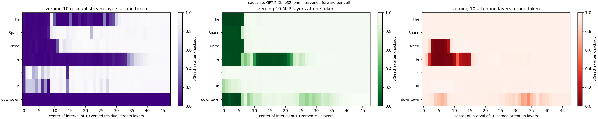
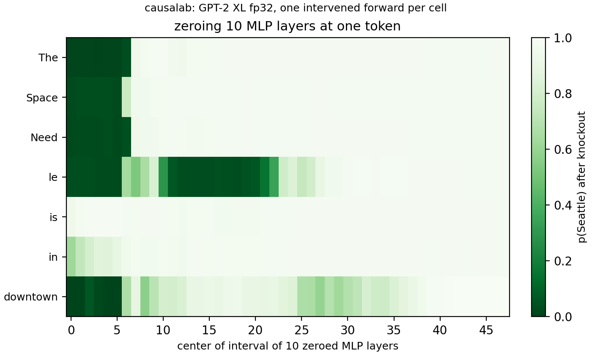
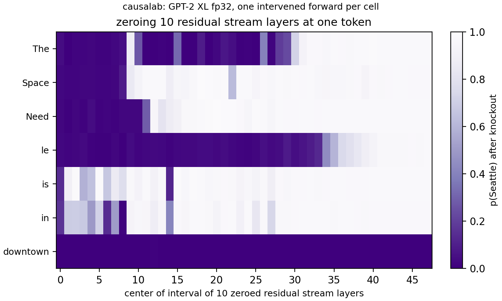
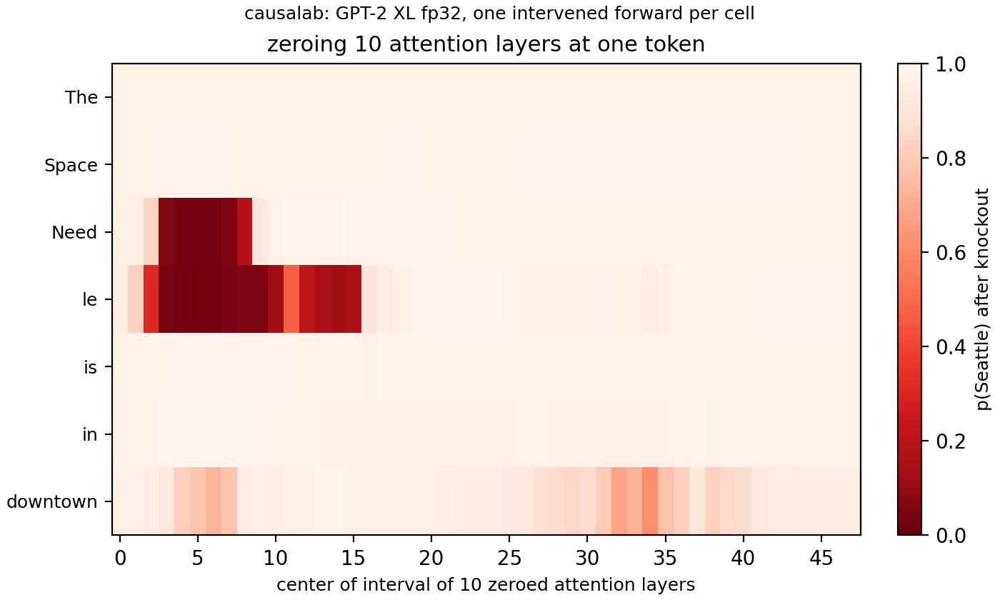

# Zero ablation

> Meng et al. **Locating and Editing Factual Associations in GPT.**
> [[arXiv]](https://arxiv.org/abs/2202.05262)

**Figure context:**

- GPT-2 XL completes `The Space Needle is in downtown` with ` Seattle`.
- Can we localize the internal mechanism of predicting the correct answer to specific layers?
- We zero-ablate ten contiguous layers of one type (attention outputs, MLP outputs, or residual stream) and check whether the probability of ` Seattle` changes.
- Zero-ablation is a strong simplification of Meng et al.'s causal tracing. [This replication](rome_fig1.md) applies the original method.



*Figure 1: Localization of factual recall in GPT-2 XL: `The Space Needle is in downtown` --> ` Seattle`. p(Seattle) after the residual stream
(purple), the MLP outputs (green) or the attention outputs (red) of the ten
layers centred on c (x axis) are zeroed at one token (y axis). Dark means the
fact is lost. Clean p(Seattle) is 0.976.*

## CausaLab implementation

Let's walk through the specification for running the MLP ablation experiment (Figure 1, center) in CausaLab. Expand the dropdown to see the full implementation.

<details>
<summary><b>Full JSON</b></summary>

```json
{
  "header": {
    "protocol_version": "4",
    "description": "Knockout extension of Figure 1 of Meng et al. 2022 (arXiv:2202.05262): zero the MLP outputs of a ten-layer window at one token of `The Space Needle is in downtown` and save p(Seattle) at the last position, which workflows/scripts/rome_fig1/knockout_figure.py draws as p(Seattle) over window centre x token, while the workflow reruns the document on attention outputs and on the residual stream by overriding `sites.target.component`."
  },
  "model": {"key": "gpt2-xl", "revision": "15ea56dee5df4983c59b2538573817e1667135e2", "dtype": "fp32"},
  "data": {"inputs": ["The Space Needle is in downtown"]},
  "axes": {
    "center": {"range": [0, 48]},
    "window": {
      "dependent_on": "center",
      "rule": {"clipped_band": {"width": 10, "clip_to": "layers"}}
    }
  },
  "method": {
    "intervened_models": {
      "ablated": {"input": "base", "reads": ["logits_ablated"], "writes": ["knockout"]}
    },
    "positions": {"tap": {"index": {"sweep": {"range": [0, 7]}}}},
    "sites": {
      "target": {"component": "mlp_output", "layers": {"axis": "window"}},
      "lm_head": {"component": "lm_head"}
    },
    "reads": {
      "logits_ablated": {"site": "lm_head", "pos": -1}
    },
    "writes": {
      "knockout": {"site": "target", "pos": "tap", "do": {"swap": 0}}
    },
    "save": [
      {
        "read": "logits_ablated",
        "model": "ablated",
        "aggregation": {"kind": "class_probs", "groups": {"Seattle": [" Seattle"]}},
        "file_path": "p_ablated.json"
      },
      {"kind": "location_ledger", "file_path": "location_ledger.json"}
    ]
  }
}
```

</details>


### Load the model and the prompt

```json
"model": {"key": "gpt2-xl", "revision": "15ea56dee5df4983c59b2538573817e1667135e2", "dtype": "fp32"},
"data": {"inputs": ["The Space Needle is in downtown"]}  // inline input prompt
```

### Define the window axis: 48 centres, each expanded into a ten-layer band

```json
"axes": {
    "center": {"range": [0, 48]},
    "window": {
        "dependent_on": "center",
        "rule": {"clipped_band": {"width": 10, "clip_to": "layers"}}  // the band [c − 5, c + 5), clipped to the tower
    }
}
```

### Define the knocked-out model, with reads and writes as placeholders

```json
"intervened_models": {
    "ablated": {"input": "base", "reads": ["logits_ablated"], "writes": ["knockout"]}
}
```

### Select every token position and the MLP layers

```json
"positions": {"tap": {"index": {"sweep": {"range": [0, 7]}}}},  // sweep: a separate knockout per token
"sites": {
    "target": {"component": "mlp_output", "layers": {"axis": "window"}},  // the one line to change for the other panels
    "lm_head": {"component": "lm_head"}
}
```

### Define reads: the final logits of the knocked-out run

```json
"reads": {
    "logits_ablated": {"site": "lm_head", "pos": -1}
}
```

### Define writes: zero the target at the tapped token

```json
"writes": {
    "knockout": {"site": "target", "pos": "tap", "do": {"swap": 0}}
}
```

### Save p(Seattle) under the knockout

```json
"save": [
    {
        "read": "logits_ablated",
        "model": "ablated",
        "aggregation": {"kind": "class_probs", "groups": {"Seattle": [" Seattle"]}},  // the token as the model emits it, after a space
        "file_path": "p_ablated.json"
    },
    {"kind": "location_ledger", "file_path": "location_ledger.json"}  // which token each tap index landed on
]
```

Given the specification, CausaLab produces:



*At the subject's last token `le`, zeroing the MLP outputs of the windows
centred on layers 11 to 20 removes the fact (p(Seattle) at or below 0.061).
This is the band the paper's Figure 1f restores. Windows that contain layer
0, centres 0 to 5, remove the fact at every subject token and at `downtown`,
because GPT-2's layer-0 MLP acts as part of the embedding.*

## Residual stream and attention: change one line

The other two panels use the same JSON. Only the `component` of the `target`
site changes. The workflow's `knockout_residual` and `knockout_attention`
steps set it with an override.

### Residual stream

```diff
-    "target": {"component": "mlp_output", "layers": {"axis": "window"}},
+    "target": {"component": "block_output", "layers": {"axis": "window"}},
```



*Zeroing the residual stream at `downtown` removes the fact at every centre
(at or below 0.01), because the prediction is read there. At `le` it removes
the fact up to centre 33 (at or below 0.132), and p(Seattle) recovers to 0.93
by centre 40, so after about layer 35 the fact no longer needs `le`. At `The`,
which is probably GPT-2's attention sink
([Xiao et al. 2023](https://arxiv.org/abs/2309.17453)), most windows up to
centre 29 also remove the fact.*

### Attention outputs

```diff
-    "target": {"component": "mlp_output", "layers": {"axis": "window"}},
+    "target": {"component": "attention_output", "layers": {"axis": "window"}},
```



*Zeroing attention at `Need` or `le` in the windows centred on layers 3 to 7
removes the fact (at or below 0.051): the early layers gather the two-token
subject there. At `downtown`, zeroing late attention lowers p(Seattle) only
to 0.61, at centre 34, so no single ten-layer window of attention carries the
fact to the output on its own.*


## Further Details

<details>
<summary><b>Execution</b>: environment, run command, flags, resources, workflow</summary>

**Environment.** `gpt2-xl` is an open checkpoint and needs no license or
token. The document pins its snapshot
`15ea56dee5df4983c59b2538573817e1667135e2`. The first run downloads 6.4 GB of
fp32 weights or reads them from a cache:

```bash
export HF_HUB_CACHE=/path/to/cache  # optional: a cache that already holds gpt2-xl
```

**Run.** From `demos/papers/`, run the workflow, then draw the figures, which
need no accelerator:

```bash
causalab run workflows/rome_fig1.json \
    --engine auto \
    --data-root artifacts/data \
    --out artifacts/output \
    --device cuda \
    --batch-rows 64
python workflows/scripts/rome_fig1/knockout_figure.py
```

**Flags.** `--data-root` is the folder that dataset references resolve
against. The knockout document carries its prompt inline, and the tracing
steps' `rome_fig1/data` reads `artifacts/data/rome_fig1/data.json`.
`--out artifacts/output` puts the run tree under
`artifacts/output/rome_fig1/`, the workflow's `output_dir`. The figure script
reads `knockout_residual/`, `knockout/` and `knockout_attention/` there and
writes `knockout_all.png`, one image per component and
`knockout_all_plotted.json` to `artifacts/figures/rome_fig1/`.
`--batch-rows 64` bounds one forward; the tracing steps of the same workflow
need at least 10 ([the replication page](rome_fig1.md)). The document pins
`fp32`, and a workflow refuses `--dtype`. `--resume` makes a resubmission reuse every step
whose recorded digests still match. On an Apple-silicon laptop pass
`--device mps`. Replace `run` with `validate` and drop the run-only flags to
check the documents without loading weights.

**Resources and reproducibility.** The run needs an accelerator that holds
GPT-2 XL in fp32, 6.4 GB of weights, and no gradients. The three knockout
steps are 336 points each, 48 centres by 7 tokens, one forward of the one
inline prompt per point. The committed knockout figures come from one run of
the shipped workflow on one H100 80GB in fp32 with the `pytorch_hooks`
engine on 2026-09-29. The whole
workflow took 86 s there, and the three knockout steps 35 s of it. An
Apple-silicon laptop (`--device mps`) ran the earlier ten-row version of the
workflow in 157 s. That run's knockout cells agree with this one to within
5e-5.

**Workflow.** [`workflows/rome_fig1.json`](workflows/rome_fig1.json) runs
[`protocols/rome_fig1_knockout.json`](protocols/rome_fig1_knockout.json)
three times: `knockout` as written, then `knockout_attention` and
`knockout_residual` with `sites.target.component` set to `attention_output`
and `block_output`. The steps after them are the causal tracing of
[the replication page](rome_fig1.md). The knockouts have no counterpart in
the paper.

</details>

<details>
<summary><b>Intervention protocol parameters</b>: what to change for a different fact, model or grid</summary>

| field | here | to change |
|---|---|---|
| `model.key` | `gpt2-xl` | any registered causal LM; the layer range below follows its depth |
| `model.revision` | snapshot `15ea56de…` | that model's snapshot |
| `data.inputs` | `["The Space Needle is in downtown"]` | another prompt, or a table as `{"base": {"dataset": …, "field": "input"}}` |
| `sites.target.component` | `mlp_output`; the workflow also runs `attention_output` and `block_output` | any component the model registry names |
| `positions.tap.index` | `range [0, 7]` | the prompt's token count |
| `axes.center` | `range [0, 48]` | the model's layer count |
| `axes.window.rule.clipped_band.width` | `10` | the window width; `1` zeroes one layer |
| `writes.knockout.do.swap` | `0` | another constant, or a read to patch in |
| `save[].aggregation.groups` | `{"Seattle": [" Seattle"]}` | the new prompt's answer token, with its leading space |

[The intervention reference](../../docs/intervention_protocol.md) defines
every field.

</details>
