# Intervention protocol internals

This page holds the parts of the
[intervention specification](intervention_protocol.md) that concern the
implementation: the modules a run passes through, the properties the compiler
derives, the canonical form and digests, the engine contract, and the
compilation stages. Read it to implement or debug an engine, or to change the
compiler. Section numbers match the specification, and a reference such as
"sec. 2.3" or "§5" points into it.

## Objects and functions

A run passes through three stages:

1. [`causalab/protocol`](../causalab/protocol): **compilation** into one
   explicit, validated `CompiledProtocol`. Torch-free; nothing here loads weights.
2. [`causalab/neural`](../causalab/neural): **routing and optimisation**.
   `--engine` names the engine (`auto` → the reference engine
   `pytorch_hooks`), the engine enumerates and signs the sweep steps, plans
   the forward groups, and interns what several steps share.
3. **Engine execution**: the forwards run over the loaded model (raw torch
   hooks, or one nnsight trace), each step is measured into result cells,
   metric rows and saved tensors.

The run returns a `RunResult` in memory and leaves a **run tree** on disk under
`--out`: one `.json` table per metric `save` entry, one `.safetensors` bundle
per tensor `save` entry, the fit sidecars where a spec trains, and, with
`--record`, the receipt `protocol.json` and the event stream `events.jsonl`.

Cards with a heavy outline are objects, tinted boxes are the steps between
them, and the coloured tags inside a step name the functional clusters it draws
on. The legend below lists the modules behind each colour.

```mermaid
flowchart TD
    classDef object fill:transparent,stroke-width:2.5px

    SPEC["<b>Intervention Spec</b><br/>authored JSON + CLI args<br/>(--set, --engine) + ResolutionEnv"]:::object

    subgraph P["PROTOCOL LAYER — causalab/protocol (torch-free)"]
        direction TB
        S1("load the metadata of every dependency<br/><span style='font-size:11px;white-space:nowrap;background:rgb(29,78,216);color:white;padding:1px 6px;border-radius:3px'>reading + environment</span> <span style='font-size:11px;white-space:nowrap;background:rgb(161,98,7);color:white;padding:1px 6px;border-radius:3px'>model metadata</span>")
        S2("parse + lower into one explicit tree<br/><span style='font-size:11px;white-space:nowrap;background:rgb(109,40,217);color:white;padding:1px 6px;border-radius:3px'>object model + parse</span> <span style='font-size:11px;white-space:nowrap;background:rgb(194,65,12);color:white;padding:1px 6px;border-radius:3px'>lowering stages</span>")
        S3("campaign digest<br/><span style='font-size:11px;white-space:nowrap;background:rgb(21,128,61);color:white;padding:1px 6px;border-radius:3px'>identity / digest</span>")
        CP["<b>CompiledProtocol</b><br/>every implicit configuration made explicit<br/>axes kept · campaign digest"]:::object
        S4("validate every convention — refuses with a rule number<br/><span style='font-size:11px;white-space:nowrap;background:rgb(185,28,28);color:white;padding:1px 6px;border-radius:3px'>validation</span> <span style='font-size:11px;white-space:nowrap;background:rgb(190,24,93);color:white;padding:1px 6px;border-radius:3px'>execution semantics</span>")
        S5("capability check for the selected engine<br/><span style='font-size:11px;white-space:nowrap;background:rgb(185,28,28);color:white;padding:1px 6px;border-radius:3px'>validation</span> <span style='font-size:11px;white-space:nowrap;background:rgb(161,98,7);color:white;padding:1px 6px;border-radius:3px'>model metadata</span>")
        S6("dry-run stops here — nothing loaded yet<br/><span style='font-size:11px;white-space:nowrap;background:rgb(138,138,138);color:white;padding:1px 6px;border-radius:3px'>entry points / reports</span>")
        S7("route: --engine, or auto → engine_router<br/><span style='font-size:11px;white-space:nowrap;background:rgb(15,118,110);color:white;padding:1px 6px;border-radius:3px'>engine contract + run</span>")
        S8("handoff: Engine.execute(compiled, run)<br/><span style='font-size:11px;white-space:nowrap;background:rgb(15,118,110);color:white;padding:1px 6px;border-radius:3px'>engine contract + run</span>")
    end

    subgraph E["ENGINE LAYER — causalab/neural (optimisable)"]
        direction TB
        S9("enumerate the sweep in canonical order<br/><span style='font-size:11px;white-space:nowrap;background:rgb(194,65,12);color:white;padding:1px 6px;border-radius:3px'>lowering stages</span> <span style='font-size:11px;white-space:nowrap;background:rgb(185,28,28);color:white;padding:1px 6px;border-radius:3px'>validation</span>")
        S10("sign each step's digest<br/><span style='font-size:11px;white-space:nowrap;background:rgb(21,128,61);color:white;padding:1px 6px;border-radius:3px'>identity / digest</span>")
        STEP["<b>Sweep step i = 1 … N</b><br/>coords · substituted configuration · step digest"]:::object
        S11("plan · intern · cohort — engine-internal<br/><span style='font-size:11px;white-space:nowrap;background:rgb(190,24,93);color:white;padding:1px 6px;border-radius:3px'>execution semantics</span>")
        S12("resolve taps · build featurizer stacks · load model<br/><span style='font-size:11px;white-space:nowrap;background:rgb(161,98,7);color:white;padding:1px 6px;border-radius:3px'>model metadata</span> <span style='font-size:11px;white-space:nowrap;background:rgb(15,118,110);color:white;padding:1px 6px;border-radius:3px'>engine contract + run</span>")
        S13("run the forwards<br/><span style='font-size:11px;white-space:nowrap;background:rgb(15,118,110);color:white;padding:1px 6px;border-radius:3px'>engine contract + run</span>")
        S14("measure → cells, metric rows, tensors<br/><span style='font-size:11px;white-space:nowrap;background:rgb(180,83,9);color:white;padding:1px 6px;border-radius:3px'>results vocabulary</span>")
        CELLS["<b>Cells i</b> · metric rows i · artifacts i"]:::object
        S15("collect over steps<br/><span style='font-size:11px;white-space:nowrap;background:rgb(180,83,9);color:white;padding:1px 6px;border-radius:3px'>results vocabulary</span>")
        RR["<b>RunResult</b><br/>files · summaries · steps · forwards · cells"]:::object
        S16("write outputs, receipt + event stream<br/><span style='font-size:11px;white-space:nowrap;background:rgb(15,118,110);color:white;padding:1px 6px;border-radius:3px'>engine contract + run</span> <span style='font-size:11px;white-space:nowrap;background:rgb(29,78,216);color:white;padding:1px 6px;border-radius:3px'>reading + environment</span>")
    end

    TREE["<b>Run tree</b> (--out)<br/>metric tables · safetensors bundles<br/>protocol.json · events.jsonl (--record)"]:::object

    SPEC --> S1 --> S2 --> S3 --> CP --> S4 --> S5 --> S6 --> S7 --> S8
    S8 --> S9 --> S10 --> STEP --> S11 --> S12 --> S13 --> S14 --> CELLS --> S15 --> RR --> S16 --> TREE
```



<details>
<summary>Legend: the modules behind each colour</summary>

| colour | cluster | modules |
|---|---|---|
| blue | **reading + environment**: the spec's inputs and outputs on disk | [`io/env.py`](../causalab/io/env.py) (`ResolutionEnv`) · [`io/sources.py`](../causalab/io/sources.py) (`load_text`, `apply_overrides`, dependency metadata) · [`io/tokenizer.py`](../causalab/io/tokenizer.py) · [`io/tables.py`](../causalab/io/tables.py) · [`io/tensor_files.py`](../causalab/io/tensor_files.py) · [`io/results_io.py`](../causalab/io/results_io.py) (`write_outputs`) · [`io/events.py`](../causalab/io/events.py) |
| brown | **model metadata**: what is known about a network before it loads, and read off it once loaded | [`protocol/registry/models.py`](../causalab/protocol/registry/models.py) (`ModelInfo`) · [`registry/components.py`](../causalab/protocol/registry/components.py) (the capability registry) · [`registry/shapes.py`](../causalab/protocol/registry/shapes.py) · [`registry/engines.py`](../causalab/protocol/registry/engines.py) · [`registry/families.py`](../causalab/protocol/registry/families.py) · engine side: [`neural/shared/sites.py`](../causalab/neural/shared/sites.py) (component → tap) · [`neural/shared/model_tree.py`](../causalab/neural/shared/model_tree.py) |
| green | **identity / digest**: what names a spec, a step, a saved artifact | [`protocol/identity.py`](../causalab/protocol/identity.py) (`digest`, `sign_step`, `import_closure`, `build_artifact_identity`) · [`protocol/compiled.py`](../causalab/protocol/compiled.py) (`CompiledProtocol`, `Digests`) · [`neural/shared/sweep.py`](../causalab/neural/shared/sweep.py) (`sign_steps`) · [`provenance.py`](../causalab/provenance.py) |
| violet | **object model + parse**: the typed document and its canonical form | [`protocol/schema/types.py`](../causalab/protocol/schema/types.py) · [`schema/parse.py`](../causalab/protocol/schema/parse.py) (`parse_document`) · [`schema/featurizers.py`](../causalab/protocol/schema/featurizers.py) · [`schema/positions.py`](../causalab/protocol/schema/positions.py) · [`schema/explicit.py`](../causalab/protocol/schema/explicit.py) (`canonicalize`) |
| orange | **lowering stages**: authored sugar to the explicit form, and the sweep to its steps | [`protocol/pipeline.py`](../causalab/protocol/pipeline.py) (`build`, the `STAGES` list) · [`protocol/lowering.py`](../causalab/protocol/lowering.py) (axes, `substitute`, `point_count`, `lower_bands`) · [`protocol/segments.py`](../causalab/protocol/segments.py) · [`neural/shared/sweep.py`](../causalab/neural/shared/sweep.py) (`enumerate_steps`) |
| red | **validation**: the [§5](intervention_protocol.md#5-validation--load-error-checklist) checklist, refused by rule number | [`protocol/rules/document.py`](../causalab/protocol/rules/document.py) · [`rules/data.py`](../causalab/protocol/rules/data.py) · [`rules/capability.py`](../causalab/protocol/rules/capability.py) (`requires`, `refuse_shortfall`) · [`rules/code.py`](../causalab/protocol/rules/code.py) · [`rules/errors.py`](../causalab/protocol/rules/errors.py) · [`protocol/pipeline.py`](../causalab/protocol/pipeline.py) (`validate`, `check_engine`) · [`neural/shared/step_rules.py`](../causalab/neural/shared/step_rules.py) (the per-step checklist) |
| pink | **execution semantics**: what a spec means, decided without an engine | [`protocol/positions/`](../causalab/protocol/positions) (`resolve.py`, `encoding.py`, `framing.py`, `spans.py`, `alignment.py`, `roles.py`, `ledger.py`) · [`protocol/estimand.py`](../causalab/protocol/estimand.py) · [`neural/shared/plan.py`](../causalab/neural/shared/plan.py) (forward groups, interning, cohorts) · [`neural/shared/mechanisms.py`](../causalab/neural/shared/mechanisms.py) (the `do` set) · [`neural/shared/encoding.py`](../causalab/neural/shared/encoding.py) · [`neural/shared/generated.py`](../causalab/neural/shared/generated.py) · [`neural/shared/layout.py`](../causalab/neural/shared/layout.py) · [`neural/shared/fires.py`](../causalab/neural/shared/fires.py) |
| grey | **entry points / reports**: the verbs and what they print | [`cli.py`](../causalab/cli.py) · [`protocol/reports.py`](../causalab/protocol/reports.py) (`main`, `explain`, `dry-run`) · [`neural/shared/engine_router.py`](../causalab/neural/shared/engine_router.py) (`route_name`, `route`) |
| teal | **engine contract + run**: the seam every engine implements, and the run driver | [`protocol/engine.py`](../causalab/protocol/engine.py) (`Engine`, `RunContext`, `RunResult`) · [`protocol/pipeline.py`](../causalab/protocol/pipeline.py) (`run_protocol`, `handoff`, `route_engine`) · [`neural/shared/execution.py`](../causalab/neural/shared/execution.py) (`execute_request`, the per-point loop) · [`neural/shared/executor/`](../causalab/neural/shared/executor) (`ExecutorBase` in `base.py`, `ForwardCache` in `cache.py`) · [`neural/shared/featurizers/`](../causalab/neural/shared/featurizers) · [`neural/shared/kernels.py`](../causalab/neural/shared/kernels.py) · reference engine [`engines/pytorch_hooks/`](../causalab/neural/engines/pytorch_hooks) (`engine.py`, `executor.py`, `loading.py`, `train.py`) · second engine [`engines/nnsight_tracing/`](../causalab/neural/engines/nnsight_tracing) (`engine.py`, `executor.py`, `loading.py`) |
| amber | **results vocabulary**: cells, rows, tensors, the receipt | [`protocol/results.py`](../causalab/protocol/results.py) (`Available`, `Unavailable`, `Denominator`) · [`neural/shared/results.py`](../causalab/neural/shared/results.py) (`TensorFile`, `MetricTable`) · [`neural/shared/metrics.py`](../causalab/neural/shared/metrics.py) · [`neural/shared/values.py`](../causalab/neural/shared/values.py) · [`protocol/receipt.py`](../causalab/protocol/receipt.py) (`protocol.json`'s shape) · [`neural/shared/receipt.py`](../causalab/neural/shared/receipt.py) (`write_run_record`, `emit_run_events`) |

Off the loop, [`causalab/analysis/`](../causalab/analysis) reads what a run
saved (fits, statistics, readouts over a bundle) and never enters it.

</details>

<a id="6-derived--never-authored"></a>
## 6. Derived: never authored

| property | derivation |
|---|---|
| featurizer widths, param shapes | from (model config, site); parametrization internals are not authored |
| a grouped gate's group map | `(heads, head_dim)` from the component's shape, or `(num_experts, d_expert)` from the model's expert table (sec. 2.5 `group`); stamped as `group_map` |
| a hard-concrete gate's stretch | the authored or default `[γ, ζ]` (sec. 2.5 `parametrization: hard_concrete`); stamped as `stretch`, since the hard split `θ > logit((½−γ)/(ζ−γ))` depends on it; compared when the document authors one, and a non-default stamp is refused by a document authoring none |
| param slots | per featurizer kind (sec. 2.5) |
| `requires` | capability set, sec. 8 |
| `num_forwards`, fusion, staging | from the model graph; a compile property |
| decode depth, and what a continuation read obliges | from the group's `generated` positions, `save` and the metrics over it (sec. 8) |
| dataset content digest | resolved + stamped at load |
| observed alignment cardinality | from (tokenizer, row) when the run encodes its inputs (sec. 2.3); never recorded, except as the `reason` of an unavailable cell (sec. 4.1) |
| resolved token indices, and the **location ledger** | from (tokenizer, frame, row) when the run encodes its inputs (sec. 2.3): every position of every read and write, on every input ; never authored (sec. 7). Recorded only when the document saves a `location_ledger` entry (sec. 2.12): one row per (example, edit group, constituent, side, token index, token id, decoded token) ; `example` the row's index in its table, `edit group` the forward group `<model> on <input>`, `constituent` the position's name (or its inline path, with `[k]` per member of a non-atomic set), `side` the input role, `token index` the index in the row's own token sequence (0 = the row's first real token, chat prefix included, padding never), `token id` and `decoded token` what sat there |
| chat segment locations and `prefix_lengths` | from the tokenizer's own chat template and its offset mapping when a document declares `segments.frame: chat` (sec. 2.2.1); 0 and none under the plain frame |
| `code` `source_module`, `source_sha256`, `data_input_digests`, and `closure` / `closure_sha256` when the module imports a sibling | resolved from the locator, its sibling import closure and the declared paths at load (sec. 2.8.1) |
| compiled interventions + digests | deterministic sweep expansion (one per point), engine-side (`causalab/neural/shared/sweep.py`); the named axes of sec. 3.2 expand as the rows they declare, never as the cross product of their lowered wrappers |
| family member names | the entry name and the axis value, or its `names` template (sec. 3.1) |
| `ArtifactIdentity` | stamped into artifacts, sec. 8 |
| a metric row's `unit` and `estimand_version` | the metric's own when authored, else the kind's (`METRIC_UNITS`, `<kind>/v1`; sec. 2.10); repeated on every row of the table, never in the canonical form unless authored |
| a metric row's **eligibility record** (`eligible`, `reason_code`) and a metric cell's `n_eligible` / `n_considered` | from the rows when the run scores them (sec. 2.10 "Eligibility"): a row is `eligible: false` with the `reason_code` of the `unavailable` it became (sec. 4.1) ; its address aligned on nothing, its answer column is empty, a continuation row addressed nothing ; and `true` otherwise; the cell counts its rows. Three denominators, named apart: `n_eligible` is the rows a metric's **decision rule** was evaluated over, `save.reduce: "count"` (sec. 2.12) is the rows a saved read's reduction collapsed, and a workflow reduction's `unit` (workflow §2.6) is the statistical unit a table is later reduced over. None is authored; only the threshold `minimum_count` is |
| a table's `string_mode`, and the receipt's `scoring` block | the task's `ScoringSpec` when the table is built (sec. 2.2); compared, never authored, at `validate` and before the first forward, and recorded per ref in the run receipt ; never in the canonical form |

## 7. Canonical form and digests

The compiler resolves references and expands shorthand into a canonical
representation. The engine plans and executes its points. `explain` reports
the resulting plan. Every declaration must reach an output or another
required operation; unused declarations cause a load error.

The format accepts JSON and YAML with strict keys. Use `description` for
notes. Each specification names one neural model. Interventions apply to
prefill; greedy continuations support reads.

Canonicalization records defaults where defined, derived widths, and
resolved dependency hashes. An inline data role keeps its `inputs` and
materializes the derived `field`, `dataset` ref and `digest` (sec. 2.2). It expands positions, families and role-less `data`
blocks, spells each `{"train": name}` save entry as the term it names (sec. 2.12), sorts unordered write lists, and retains an explicit `axes` group for correlated
points. Layer scalars canonicalize to lists. Header `title` and
`description` are removed; `protocol_version` remains.

`digest = sha256(canonical bytes)`, with sorted keys, canonical floats, and
parameter content hashes. The document digest identifies the full
experiment; each point digest appears in `points[].digest` in the receipt.

Optional fields such as metric identity, `shuffle`, and `draw` enter the
canonical form only when supplied, as specified in their sections. A drawn
role's evaluation member also determines its resolved text field and forward
cache key. Its fixed evaluation forward can share work with an equivalent
indexed field; training draws bypass that cache.

Changes to existing canonical representations require a protocol version
change, a migration, and updated canonical-form tests. Version 3 replaced
`layer` with `layers`, including family windows and dotted field paths.
Version 4 lists reads on the models that take them, declares the
un-intervened model, spells every read reference `{"read", "model"}`, and
carries each aggregation on the entry that consumes it; a document's digest
moved once, at the version bump, and `causalab migrate` is the rewrite.

## 8. Engine contract

An engine is entered through one method ; `execute(compiled, run) ->
RunResult`: the same `CompiledProtocol` every door reads (sec. 9.1), already
validated against this engine, plus a `RunContext` (the output directory, the
resolution environment, the shard's step indices, `record`) ; and implements
these services:

| service | contract |
|---|---|
| `SiteResolver` | site record → tap in its execution engine (component vocabulary, sec. 2.4) |
| position resolution | **the protocol layer's** (`causalab/protocol/positions/`): pos spec + `PositionFrame` (the padded batch: ids, mask, char offsets, prefix lengths, segment locations) → indices, resolved at the execution stage (`pipeline.resolve_positions`, after the data rules and before any weights load) with the model's tokenizer and handed over on `CompiledProtocol.positions`; the executor reads the resolved `StepPositions` off `compiled.positions` for every step sharing a representative's positions key, and resolves a step the protocol never saw (a workflow door's, a combination no representative covers) through the same functions ; never its own; supports flat, per-row, and ragged windows |
| planner | model graph → forward groups; fusion/batching/staging; elision. **The engine's** (`causalab/neural/shared/plan.py`, torch-free): the protocol layer plans nothing ; it lowers a band to its members (`lowering.lower_bands`) and hands the document over; `explain` prints the first step's plan through the same planner |
| cross-point interning | run each distinct group key once, capturing the union of the taps every point asked of it; each point gathers and featurizes its own value from that capture, keeping its own per-entry provenance (sec. 3). A group's identity carries, per input role, the content digest of the rows it reads (sec. 2.2) plus the field ; never the ref's name. Optional but expected ; report what ran as `RunResult.forwards` |
| mechanisms | the closed `do` set, class order per address; refuse `pytorch_fn` if non-local; count each write member's firings per forward against the count its kind declares and refuse the point on a mismatch ; the whole set, as one transaction (sec. 4, "Fires") |
| featurizers | kinds table with declared dtypes; error-term contract |
| metrics | lower kinds to native ops; derive minimal logit materialization (`logits_to_keep`, vocab-parallel CE) from `save` + metric needs |
| generation | greedy-decode a group to its derived depth; materialize a distribution only where `save` or a metric needs one (see below); writes stay in the prefill |
| training | own the `train` loop (optimizer, accumulation, anneal, early stop, checkpoints) ; the document never changes across engines |
| RNG | realize `gaussian` per declared seed + axis semantics, bit-stable across parallelism layouts |
| stamping | enumerate the steps in the canonical order and sign each with the protocol's one hasher (`causalab/neural/shared/sweep.py`, `identity.sign_step`) before anything is planned or loaded ; one signed step per selected index is the other half of the contract (`check_steps_signed`); write the run receipt and the event stream (`causalab/neural/shared/receipt.py`) after signing and before the first forward, exactly when `RunContext.record`; `ArtifactIdentity` into every featurizer bundle's safetensors header |
| pre-forward checks | before the first forward pass of a point ; each a runtime condition the compile could not know (sec. 5's invariant): rule 19 (write widths, on the encoded batch, dispatching on the write's `ragged` policy ; sec. 2.8), and the answer-form pre-flight (sec. 2.10). A table's recipe sidecar is **not** among them: a run holds a table to nothing beside it (sec. 2.2) ; its content digest is in the canonical form, so a rebuilt table is a different document |

`ArtifactIdentity` uses the closed key set `ARTIFACT_IDENTITY_KEYS` in
`causalab/protocol/identity.py`. A featurizer bundle records the model key,
revision, dtype, quantization, and attention implementation; tokenizer;
site; `k`; parametrization; featurizer dtype; and trained-on data reference.
Gates also record `group` and its derived `group_map`, hard-concrete
`stretch`, budget `pool` and `pool_units`, position `axis`, and a
straight-through fit's `forward`, as applicable. Runtime provenance records
`engine`, `implementations`, `loaded_attn_implementation`, and `commit`.

Loading through `file_path` checks the identity fields implied by the
specification. Pool names are compared in both directions. `trained_on`
records the fitting data reference; applying a bundle to another split is
allowed. The digest of the fitting rows belongs to the fitting point's
canonical data and receipt.

A `subspace` or `gate` initialized from a saved artifact also records
`init_trained_on`. A subspace records the selected `init_components`,
`[0, k)`. A harvested read supplies its `trained_on` reference to a basis
fitted from it. Loads check `init_*` only when the specification authors
`init`, so an ordinary load accepts a bundle made before those fields existed.
Runtime provenance is retained for inspection; the specification supplies
no expected values for those fields.

`commit` contains the first 12 hexadecimal digits of the installed package's
tree digest, obtained from `causalab.provenance.runtime_identity()`. It hashes
the running package using installed distribution metadata, including PEP 610
`direct_url.json`. A failure to resolve the package raises an error.
A bundle's content digest is recorded by the workflow step that wrote it;
its header contains no separate digest of the artifact, fitting rows, or ledger.

A swept file records shared identity fields at file level and fields that
vary at entry level. Its `entries` header maps tensor keys to
`{slot, coords, …identity}`, plus the unavailable fields where applicable
(sec. 4.1). Entry selection and identity checks use the selected entry.
Coordinates join it to the receipt's point. A bundle without `entries` is
checked at file level.

**The family contract.** The `SiteResolver` above is shared by both engines
(`causalab/neural/shared/sites.py`), and everything it knows about a *model
family* it reads from one declared plugin beside the capability rows ; a
`registry.FamilyAdapter`, registered with `registry.register_family` from any
module. A family declares:

| field | what it declares | where it lives |
|---|---|---|
| `detect` | **model detection** ; one predicate over the loaded module tree (`hasattr` / child-name structure), never a `config.model_type` match; exactly one registered family must detect a tree, and none or several is refused by name (`registry.family_for`) | the adapter |
| `tree` | the model root's addressed children ; the block list, the embedding, the final norm, the head, the block's MLP child ; as dotted paths (`model.layers`, `transformer.h`) | the adapter (`TreeAddress`) |
| `mixers` | the mixer child names its blocks may carry and the stream each means; the shared stream table reads the union over registered families and refuses a block carrying children of two streams | the adapter |
| `taps` | **component resolution** and **per-family availability** ; semantic name → the family's tap: a scope (`embedding`, `final_norm`, `lm_head`, `block`, `mixer`, `mlp`), a dotted child path, a hook kind (`in`, `out`, or a function slot: `interface`, `delta`, `experts`, `interior`), a tuple index, a slot, a derivation. A component with no tap is refused by name, at the registry, never as an `AttributeError` out of a module lookup. The attention interior's tap says *from the row*: its per-family address stays the component row's `overrides` (sec. 2.4) | the adapter (`Tap`) |
| **tensor-shape contracts** | `registry.component_shape` ; family-independent, on the rows | the rows |
| **supported mechanisms** | the rows' `reads` (which engines) and `writes` (which `do` mechanisms) cells | the rows |
| `identities` | **reconstruction identities** ; which component is recomputed from which inputs by which formula, to a dtype-keyed tolerance (`block_mid == block_input + attention_output`; `routed_output == Σ_slot expert_output · router_scores`; `S_t == S_{t-1}·exp(g_t) + k̂_t ⊗ delta_t`); the tests that pin an identity read the row, so a new family is held to what it declares; a family with none declares none | the adapter (`Identity`) |
| **aliases + deprecation version** | the rows' `aliases` / `deprecated_in` cells, from `schema.DEPRECATED_COMPONENTS` / `DEPRECATED_IN`; the typed backend pairs (`registry.BACKEND_PAIRS`) say which two-spelling tensors may not be aliased | the rows and the alias table |
| `probes` | optional per-family evaluators of the rows' `requires` predicates over the loaded tree; the resolver's shared module-tree probes otherwise | the adapter |

**The readout** ; the final normalization, the unembedding and its accumulation dtype, and centering ; is an analysis over the loaded model (`causalab/analysis/logit_lens.py`, imported by no engine), not a document vocabulary: `Readout.from_bundle` builds it from the adapter's `tree.final_norm` / `tree.lm_head` (the modules, called as the model calls them, never their weights) and a declaration keyed by the entry's `family` (`ModelInfo.family`, the HF `model_type` ; finer than the tree family, because the Llama tree carries both a `weight` and a `1 + weight` RMSNorm gain): the norm's kind, its gain convention, where its epsilon lives, and the dtype the reference unembedding accumulates in, each held to the module's own forward and refused by name when the declaration and the module disagree. Nothing in a document names it ; `lm_head`'s value is unchanged and a centered readout is a Python method ; so no rule, component or metric field is added here.

Two families are built in ; the Llama tree (Llama / Qwen / Mistral / Gemma
and the Qwen3.5-MoE hybrid, the `qwen3_5_moe` architecture in Transformers
that `Qwen/Qwen3.6-35B-A3B` uses, whose DeltaNet and MoE interiors live in it) and
the GPT-2 tree ; and `tests/_helpers/synthetic_family.py` registers a third
from outside `causalab/neural/`, which is the contract's acceptance. **The
stated limit:** the component vocabulary is one global closed literal (sec.
2.4) and one execution order (`plan.COMPONENT_RANK`), because routing, the
canonical form and every census guard rest on that; a family declares which
of the existing names it serves and where, and cannot mint one ; a new
tensor is a capability row first, then a tap. `registry.inventory(model)`
is the one producer of "what exists at which layer": per layer, the mixer
stream, the components present and their read / write mechanisms, from the
registry entry offline (its `layer_types`) or from a loaded model (its
modules and its family) ; what `dry-run` (sec. 9), the generated support
tables and the inventory tests all read.

**Capabilities.** `requires` is derived from the document; an engine declares
what it supports; the check is `requires ⊆ b.capabilities` for the engine `--engine` named (`pipeline.validate`; routing between engines is retired);
refusal messages generate from the missing capability.

Two kinds of entry, one comparison. The **coarse verbs** below are the closed
`CAPABILITIES` vocabulary. **Component entries** are generated, never listed:
every site a read or write references contributes `component:<name>` (a write
also `component:<name>:write`), and each engine declares the component sets it
serves ; so a document touching a component outside the named engine's site
vocabulary is refused `[V13]` with the generated text naming the entry, and the
user pins the engine that serves it. The closed vocabulary behind these entries is the
sec. 2.4 `Component` literal itself. Stream- and layer-level constraints (a
full-attention box on a DeltaNet layer, a read-only component) stay
engine-internal policy: they depend on the loaded model or are true of every
engine, so holding an engine to them before it loads would be either
impossible or misleading.

| capability | required when |
|---|---|
| `grad` | `train` present |
| `paired_forward` | a write's operand read has a different `input` than the write's model |
| `full_logits` | a full `lm_head` read is saved, or a `class_probs` / `top_k` metric reads `lm_head` other than through a `dims` slice ; a *featurized* `lm_head` read still obliges the whole projection (the featurizer consumes it) even though its value is latents. A `top_k` over any other component obliges no vocabulary projection (sec. 2.10) and must not be charged for one |
| `generate` | any position carries `generated` (sec. 2.3) |
| `generation_writes` | an intervened model declares `writes_during_generation` (sec. 2.9) |
| `quantized_weights` | `model.quantization` present (sec. 2.1) |
| `writable_attention_probs` | a write targets `attention_probs` |
| `pytorch_fn_local` | any `pytorch_fn` |
| `train_free_params` | a `train.params` entry names a free tensor in `params` (sec. 2.6); rule 30 rejects this when the engine lacks support |
| `train_loss_precision` | `train.precision.feature` or `.loss` is authored as anything but `fp32` (sec. 2.11); rule 30 |
| `train_eval_updates` | `train.eval.every` counts `updates` (sec. 2.11); rule 30 |
| `component:<name>`[`:write`] | generated ; a read or write references a site with that component (writes add `:write`) |

The following table reports capabilities from `PytorchHooksEngine` and
`NnsightEngine`. The component row counts the readable and writable
components derived from the registry. `test_vocabulary_census.py` checks
each cell and both counts against those declarations.

| capability | `pytorch_hooks` (reference) | `nnsight` |
|---|---|---|
| `grad` | ✓ | ✗ ; a `train` document runs on the reference engine (`--engine pytorch_hooks`) and is refused `[V13]` under `--engine nnsight` |
| `paired_forward` | ✓ | ✓ |
| `full_logits` | ✓ | ✓ |
| `generate` | ✓ | ✓ one `model.generate` trace, decode steps walked with `tracer.iter` |
| `generation_writes` | ✓ the decode loop is the engine's own, so a write hook stays installed across its steps | ✗ ; the trace binds occurrence 0 of every write's location, the prefill |
| `quantized_weights` | ✓ | ✗ |
| `writable_attention_probs` | ✓ inside the eager attention call | ✓ on the softmax's output inside the same call |
| `pytorch_fn_local` | ✓ | ✓ |
| `train_free_params` | ✗ ; `train.py`'s loop optimizes featurizer slots only, and refuses a free tensor as arrived-unvalidated | ✗ ; no `grad` |
| `train_loss_precision` | ✗ ; `train.py` casts logits and targets to fp32 unconditionally; the authored `train.precision` is digested, not executed | ✗ ; no `grad` |
| `train_eval_updates` | ✗ ; `train.py` reaches an eval on epoch boundaries only, and refuses an `updates` counter as arrived-unvalidated | ✗ ; no `grad` |
| `component:<name>`[`:write`] | 52 of 56 ; all but `deltanet_query` / `deltanet_key` / `deltanet_state` and `expert_permutation` | 51 of 56 ; all but `delta_query` / `delta_key` / `delta_state` |

Neither engine is a superset of the other, which is why `--engine` is the
user's call: the
reference engine alone reaches the post-tiling `delta_query` / `delta_key` and
the per-step `delta_state` (by swapping module-global call sites), and the
nnsight engine alone reaches their pre-tiling / per-chunk faces and
`expert_permutation` (through `.source`); the rest of the DeltaNet interior is
one name both serve, each by its own mechanism (sec. 2.4).
`--engine` is a mandatory explicit input; `auto` resolves through
`causalab/neural/shared/engine_router.py` ; for now always the reference engine ; and
a document only the nnsight engine serves is pinned with `--engine nnsight`.

Capability entries this vocabulary carries for engine *classes* that do not
exist here yet ; a vocab-parallel trainer with no `full_logits`, a serving stack
whose only write is additive steering ; stay in the vocabulary deliberately: the
refusal an unsupported document gets is generated from the missing entry, so the
entry has to exist before the engine does.

**Materialization (generation).** A continuation read's cost is not the decode,
it is the vocabulary: at batch 32 and 16 steps, every step's distribution over a
128k vocabulary is ~260 MB in fp32, one step is ~16 MB, a site's activations
~8 MB, the token ids ~2 KB. The planner therefore derives, per group, the decode
depth and ; per continuation read ; whether anything downstream consumes a
distribution: the read is saved, or a metric in the `distribution` domain
reduces it (sec. 2.10). An `ids`-domain metric does **not** count, which is the
point of the domain: a text probe ; `decode` over a continuation read, nothing
saved ; obliges no vocabulary projection at all, and an engine **must not**
build one where the answer is no.

*How* it complies is its own business: keeping only the addressed steps,
projecting a narrower slice (`logits_to_keep` takes an index tensor), replaying
the sequence teacher-forced, or a vocab-parallel reduction. The reference
engine keeps `ln_final` activations across steps and projects through the head
only at the addressed positions, which needs no second pass ; an implementation
note, not a requirement. `explain` prints the obligation so the bill is legible
before a run.

**Execution settings.** Engines choose devices and batching. Model dtype and
quantization remain experiment fields because they affect the computed
values. External schedulers can partition runs with `--points START:STOP`
and combine artifacts by document and point digests.

`batch_rows` bounds no-gradient forwards, including evaluation. The engine
concatenates captures in row order and aligns operands to those rows.
Gaussian noise is drawn over the full group and sliced consistently.
Ragged values retain their widths. Generation starts each microbatch from
its own prefill. Different batch shapes can change rounding.

Training minibatches retain `train.batch.pairs` rows. `fit_rows` bounds the
number of rows packed from cohort members into one gradient forward;
each member's minibatch stays intact. The reference engine accepts these
settings in its constructor, as CLI `--batch-rows` and `--fit-rows`, or as
a workflow step's execution settings. Nnsight rejects these options.

Without an explicit `fit_rows`, CUDA runs probe the first member's memory
use, reserve ten percent of free memory, and pack at least one member.
A later out-of-memory window retries with half as many rows, down to one
member. Failure at one member stops the run. Off CUDA, an unset bound packs
all members. Explicit bounds are used without probing or shrinking.

Cohort evaluation uses `batch_rows` when set and otherwise the fit bound.
A member's evaluation rows can exceed the fit bound; set `batch_rows` too
when evaluation needs a stricter limit.

The receipt's `execution` block records:

- `batch_rows` and `fit_rows`: requested bounds, or null.
- `fit_rows_resolved`: the smallest measured bound across cohorts.
  `fit_rows_shrinks` records retries. Pin the resolved bound when a rerun
  needs stable packing.
- `device`: the placement the engine was built with, the `--device` value
  (`cpu`, `mps`, `cuda:1`, or a comma list). Null for an engine that
  declares none. A CUDA world above world 1 records `cuda`, because each
  rank runs on `cuda:LOCAL_RANK` ([model parallelism](model_parallelism.md)
  §3).
- `model_source`: `loaded` or `caller` (sec. 9).
- `ragged`: each non-default write policy, row widths, and landing buckets.

Beside the block, `models` lists each model the run loaded with the commit
its revision resolved to: `{"key", "revision", "resolved_revision"}`. The
commit is read off the loaded config, so a document that names `main` still
says which snapshot ran. It is null when the weights did not come through the
Hub cache, such as a local directory. The engine adds the list once the
points have run, so a run that fails before that keeps a receipt without it.
The `_step.json` of a protocol or behavioral step carries the same `device`
and `models`. A script step carries neither, and the parent record of a
fanned-out step leaves them to its children's records.

These settings stay outside document digests and artifact identities.
Numerical captures should specify `fit_rows` because automatic packing
depends on available device memory. An evaluation retry can lower the
reported bound below the gradient bound used earlier in the run.

The receipt and `events.jsonl` are written only when the run asks for them
(`--record`, or `record=True` at the Python door). `events.jsonl` records
local events with a sequence number, document digest, and shard. Remote sink
failures produce warning events. The receipt records observed scoring and
write counts in its own `scoring` and `fires` blocks.

<a id="91-one-compiler-four-doors"></a>
## 9.1 Compilation stages

`causalab.protocol.pipeline` defines the stages used by the CLI, Python API,
and workflow runner. Callers supply the resolution context and execution
settings; the compiled result records their effects.

```python
build(source, *, env, base_dir=None, overrides=None, point_cap=…)  # the stages below → CompiledProtocol
validate(compiled, engine=None, *, env, data=True)                 # the rules, on the built object → the same object
compile_protocol(source, *, env, base_dir=None, overrides=None,    # build, then validate
                 point_cap=…, engine=None, data=False)             # shared by Python callers
resolve_positions(compiled, *, env, tokenizers=None)               # execution stage only: the tokenizer rules → `positions`
resolve_answers(compiled, *, env, tokenizers=None)                 # every metric's answer ids, with the same tokenizer → AnswerCheck
tokenizer_service(env, tokenizers=None, *, engine=None)            # the tokenizer both passes load, once per model
handoff(compiled, engine, run)                                     # validate(data=True) → resolve_positions → resolve_answers → engine.execute
run_protocol(document, environment, engine, output_directory,      # the execution stage the CLI and the API share (below)
             *, points=None, sink=None)
```

`build` resolves the source and dependencies. `validate` checks the result,
and `compile_protocol` combines both calls. At execution, `handoff` validates
data, resolves token positions and metric answers, and calls the engine.
Tokenizer loading occurs before model weights are loaded. The workflow runner
calls `resolve_answers` for every inner document that compiles at load before
its first step, and for a step-dependent document at that step
(`causalab/workflow/runner.py`, `check_tokenization`).

Callers can supply `source`, `base_dir`, section-rooted `overrides`, `env`,
`point_cap`, and an explicit engine or capability set. Resolve `auto` before
passing it here. Relative references use the source file's directory by
default. Workflow validation can use an artifact store that defers checks
for outputs produced by earlier steps.

The compiled object contains:

| output | is |
|---|---|
| `canonical` | the canonical document (sec. 7), sweep wrappers intact ; the campaign |
| `axes` | the axes the campaign's steps are indexed by, in the order the engine enumerates them (sec. 3; a named axis's rows slowest, sec. 3.2), and the **lowered tree** they index into ; overrides applied, artifact-valued fields resolved, families lowered, every `{"axis": …}` wrapper the `{"sweep": [column]}` it stands for ; plus the parsed `axes` group when one was authored. The points themselves are the engine's: `causalab/neural/shared/sweep.py` enumerates them in the canonical order and signs each with the same hasher, and the count is decided from the axes (`point_count`, rule 14) |
| `data` | every dataset ref the points name, with its content digest and its columns |
| `artifacts` | every reference outside the document ; a value reference or a `file_path` load ; with the stamped identity read, and whether the store *deferred* the check |
| `capabilities` | the engine capabilities the campaign requires (sec. 8), derived from the registry rows ; never a second table |
| `digests` | the document digest (§7); every point digest is the engine's, returned as `RunResult.steps` and written into the run receipt |
| `diagnostics` | what the compile found and did not refuse on (below) |
| `positions` | **derived, not identity**: what `pipeline.resolve_positions` resolved with the model's tokenizer before any weights loaded ; per positions key, the representative's frames (one per input role), every read's and write's address on every row, and the location ledger when the document saves one. `None` until the execution stage ran the verb; enters no canonical form and no digest, so the object with and without it has the same `digests`. The engine reads it for every step sharing the key and resolves the rest itself through the same functions (`protocol/positions/resolve.py`) |

Validation raises one error directly or groups independent errors in
`ValidationErrors`. The build stages run in the following order:

| stage | does |
|---|---|
| `read` | read the source; refuse a workflow document, and a `protocol_version` this compiler does not read (§1) ; before anything addresses the tree by path |
| `override` | apply `overrides` by section-rooted path (§1, sec. 9) |
| `resolve` | replace every artifact-valued field by its value (§1, rule 15); hold the tree to the JSON object model |
| `families` | `at_once` families into the entries they denote, all inside one point (sec. 3.1, rule 28) ; before the gate, which is what makes them sugar |
| `axes` | named axes ; correlated row tuples and dependent axes (sec. 3.2) ; parsed, and the document lowered to its display form: every `{"axis": …}` wrapper the `{"sweep": [column]}` it stands for, the group removed. The engine's enumeration (`causalab/neural/shared/sweep.py`) walks the parsed axes as the rows they are, never as that cross product; `canonicalize` writes the block into the campaign. After families, so a wrapper on a family entry reaches every member before the references are found; before the gate, which knows the four groups alone |
| `gate` | the strict parse of the explicit form, sweep wrappers intact (rules 1–2); then the axes the steps are indexed by (the named axes' rows slowest, sec. 3.2) and rule 14's cap, decided from the axis sizes alone (`point_count`) ; nothing is enumerated: the sweep is the engine's (`causalab/neural/shared/sweep.py`, the cross product last-axis-fastest, in the declared axis order) |
| `canonicalize` | the canonical document (sec. 7), and every representative's canonical form materialised for its refusals (rule 23, a derived width) ; collected across the representatives like the checklist's; the per-step canonical form is the engine's to sign |
| `digest` | `sha256` of the canonical bytes ; the campaign; a step's digest is the engine's, signed with the same hasher (`identity.sign_step`) as it is enumerated |
| `identify` | the dataset identities and schemas, the artifact references and what the store deferred |
| `validate` | separate call to `pipeline.validate`, the verb the entry points call on the built object: the three groups of rules below (`tests/protocol/test_compile_protocol.py` keeps this row and the next in the table, set aside from `STAGES`) |
| `route` | separate engine check: the engine half of `validate` (rule 13's shortfall against the engine `--engine` named) and, at execution, `route_engine` → `check_engine` before any weights load; below |

After building, `validate` checks one representative per axis value, with
other axes at their first values. It collects distinct violations in
enumeration order. The engine repeats the full checklist on every expanded
point before loading a model, so it also catches errors caused by combinations
of axis values.

Data checks run by default for resolved tables. They check column references,
prompt variables, eligibility limits, row roles, and disjoint evaluation
splits. When an engine is supplied, validation also checks its capabilities.

Execution then resolves positions through the tokenizer before loading weights.
Representatives with the same position key share this work. The engine
resolves any remaining points through the same functions. Missing write
alignment fails here, and a requested location ledger records the results.

`resolve_answers` then resolves every metric's answers through
`causalab/protocol/answers.py::metric_token_ids`, the function the score
path calls, over the rows each metric scores: for a `save` entry the rows its
read aligns on, read off the resolved positions (the score's own selection in
`causalab/neural/shared/execution.py`), every base row for an objective
term, and the held-out split for a `train.eval` entry. A `save` entry over a
continuation read is left to the score. Every refusal is raised together,
one line per failing field of each aggregation, each with the count and the
first failing row; a glued answer (spec sec. 2.10) is a `ProtocolWarning`. A
tokenizer that cannot be loaded is refused `[P4]` naming its key and
revision. The workflow runner builds one tokenizer service per run, so each
model's tokenizer loads once.

**Diagnostics** are the closed set of things a compile reports without
refusing:

| kind | means |
|---|---|
| `deferred_check` | the artifact resolver deferred a `file_path`'s existence and identity check to run time ; workflow validation of a step-dependent document (workflow spec §2.3). The compiled result says so instead of looking like a real resolution |
| `capability_shortfall` | the document requires a capability an engine lacks. `validate` given an engine *refuses* it (rule 13), as does `check_engine` for the engine `--engine` named; the kind is produced by `dry_run` for the named engine (`causalab dry-run --engine`, below): what `check_engine` would refuse, reported before any weights load |

`build` leaves engine selection to the caller. Before loading weights,
`route_engine` checks the chosen engine's effective capabilities. A
shortfall causes V13. `auto` currently selects `pytorch_hooks`; select
`nnsight` explicitly for its exclusive components.

**`run_protocol`'s inputs** ; the execution stage, from Python (above) and from
`causalab run`, which parses arguments, prints and exits and does nothing else:

- `document` is a compiled document, a path, or the document as a tree. Pass a
  `CompiledProtocol` (sec. 9.1) when the compile itself needs options:
  `overrides` (`--set`) and the point cap are compile-time concerns, and a run
  must not re-decide them.
- `engine` is the one implementation of §8's engine contract the caller named
  (the CLI's `--engine`, constructed through `causalab/neural/shared/engine_router.py`),
  supplied by the caller ; which is what lets `causalab.protocol` import no
  engine and no torch. `route_engine` holds the document to it before any
  weights load, or refuses `[V13]`.
- `points` is the shard selector, exactly as `--points` (below).
- There is **no `resume`**: `--resume` skips a workflow step whose outputs are
  already on disk with a matching stamped digest, and an intervention run has no
  step boundaries to resume at ; the CLI refuses the flag on an intervention
  specification. Sharding a campaign is `points`; a
  resumable intervention is one wrapped in a workflow step, whose identity
  carries the document's and its data's digests (workflow spec §7).

**A caller-owned model, and the ownership contract.** An engine normally loads
the document's model itself (`load_model`, cached, prepared: eager attention,
`.eval()`, `.requires_grad_(False)`, left padding with a pad token). A caller
who already holds a model hands it in instead:

```python
from causalab.neural.engines.pytorch_hooks import ModelBundle, PytorchHooksEngine

bundle = ModelBundle.from_model(model, tokenizer, key="gpt2", revision="main", device="cpu", dtype="fp32")
result = run_protocol(document_path, env, PytorchHooksEngine(bundle=bundle), out)
```

The contract both sides keep:

- **The library never loads, moves, frees or changes the training mode of a caller-owned model.**
  `from_model` derives the registry entry exactly as the loader does and
  mutates nothing. Where the loader would *prepare* the model ;
  eval mode, frozen weights, left padding, a pad token, weights in
  the declared `dtype` ; `from_model` **refuses** an object that lacks the
  setting, naming the one call the caller makes (`model.eval()`,
  `model.requires_grad_(False)`,
  `tokenizer.padding_side = "left"`, `tokenizer.pad_token = tokenizer.eos_token`).
  The refusals fire only where a loaded run's numbers would differ; a model
  prepared that way with the same attention backend is accepted and produces
  the loaded run's bytes. A declared `model.attn_implementation` must match
  the caller's model, or the engine refuses before any forward. Other
  attention backends are accepted: the hooks
  executor temporarily selects eager for forwards that need attention-function
  interiors, then restores the caller's selection, including after errors.
- **Every hook the engine installs is removed on every exit path**, a raise
  in the middle of a forward included: afterwards the model is the same
  object, on the same device, with the same parameters, and no module carries
  a hook. A caller bundle never enters the loader's cache.
- **`key` and `revision` are the caller's assertion.** Nothing can check them
  against the weights; the run receipt and every `ArtifactIdentity` stamp
  record them as given. The receipt's `models` adds the commit the model's
  config was read from, which for a caller-owned model is the one the caller
  loaded. What *is* checked, before any forward: the document's
  canonical `model` realization ; `key`, `revision`, `dtype`, the materialized
  `quantization` block ; against the bundle's, and the engine's `device`
  against the bundle's request. A disagreement refuses, naming both sides,
  because the record would otherwise describe a model that did not run.
- **The receipt says which way the model came in**: `execution.model_source`
  is `caller` for a bundle run and `loaded` otherwise (§8) ; execution
  provenance, in no canonical form and no digest.

Both engines take `bundle=` (the nnsight engine an `NnsightBundle`); `from_model`
is the reference engine's constructor. The CLI has no bundle flag: a
caller-owned model is a Python caller's situation.

<a id="the-verbs"></a>
The verbs dispatch on the document's shape: a **workflow** (it has `steps`)
runs its step graph, and an **intervention specification** runs the full
pipeline. `migrate` takes files, not a document, and compiles nothing.

| verb | effect |
|---|---|
| `run <doc>` | validate, expand, plan, execute, stamp; writes the saved files into `<out>`. With `--record`, also `<out>/protocol.json` ; the canonical document, its digest, the per-point provenance digests, and an `execution` block: the row bounds the chosen engine was built with (`batch_rows` for no-grad forwards, `fit_rows` for the grad forwards of a fit; declared before execution, `null` when unbounded), the `device` it places the model on, and where its model came from (`model_source`: `loaded`, or `caller` for a bundle handed to the engine ; sec. 8), and ; added once the pre-forward checks have run ; a `scoring` block per base dataset ref: the table's recorded `string_mode` against the document's `match` modes (sec. 2.2), and ; added once every point has run ; a `fires` block: per point digest and forward group, how many times each write member fired per forward (sec. 4; a refused run's receipt carries none), and a `models` list: each model's `key`, `revision` and the commit its revision resolved to (`resolved_revision`). Execution is recorded there and nowhere else: it enters no digest and no stamp; prints every saved file and the `cells` denominator (sec. 4.1) |
| `--record` (run) | write the run receipt `<out>/protocol.json` and the event stream `<out>/events.jsonl` (workflow spec §4.3) beside the saved files. Off by default: a run writes its saved files only, and the `fires` counts stay in the returned result. Document runs only; a workflow keeps its own records (`_step.json`, `workflow.json`, and the stream beside the manifest) |
| `migrate <path>... [--check]` | rewrite earlier-version documents as the current version, in place: `protocol_version` 1's flat sections regrouped (§1), then `protocol_version` 2's scalar site `layer` renamed to the band `layers` (§2.4, §7) with every `at_once` window, `names` placeholder and dotted `sites.<name>.layer` id ; a workflow document is rewritten exactly when it spells one; a markdown file's fenced JSON examples with them; a current document and a fragment are left alone. A retired `token_form` is written into literal answer strings and refused on a metric whose answers are dataset columns, naming the columns and the table rewrite (sec. 2.10 of the specification); one refusal names every metric of the document that needs an author step. A refused markdown block is left as it is and reported on stderr with its line, and the page's other blocks are still rewritten. JSON and markdown only: a YAML document is refused with the reason (the rewrite would drop its comments), and a v1 *split* document (an `application` naming a `method` file) is refused too ; its composition was the v1 loader's, so compose it with a v1 release first. `--check` writes nothing and exits 1 if anything would change. A refused file or block exits 1 |
| `validate <doc> [--data] [--tokenizer]` | sec. 5 checks and the data rules ; column and prompt-variable references, `minimum_count`, row roles, fit splits ; at every representative, against the named engine (`--engine`, below). The data rules run by default; `--data` names the default and changes nothing |
| `--tokenizer` (validate, dry-run) | load the model's tokenizer, never the weights, and run the checks a run makes with it before the weights load: `resolve_positions` and `resolve_answers` (sec. 9.1). Opt-in, so the pure verbs stay torch-free without it. The tokenizer loads as a run loads it: from the Hugging Face cache, or a download of its files when the Hub is reachable; set `HF_HUB_OFFLINE=1` to stay offline. A load failure is refused `[P4]` with the key and revision. `validate` prints a `tokenizer` line; `dry-run` prints one and leaves `tokenization` out of its `undecided` line, or reports the refusal. The line names the metrics whose answers resolved, and apart from them the metrics read over generated tokens, whose answers are checked when scored (`AnswerCheck.when_scored`). On a workflow, `validate --tokenizer` checks every inner document that compiles at load |
| `explain <doc>` | models + the first step's forward plan (`plan`), the point count decided from the axes, derived `requires`, resolved bindings, digest, what `save` produces; no per-step digest ; the steps are the engine's |
| `--engine` (explain) | required: print the named engine's capability verdict ; its name when it serves, or the sec. 8 refusal. No engine is built: the verdict is the registry's capability set for the name, so `explain` stays torch-free |
| `dry-run <doc> [--data] [--tokenizer]` | reports the digest, applied overrides, dataset digests and columns, registered model configuration, axes and point count, required capabilities, read/metric bindings, save entries, and compiler diagnostics. For each site it reports availability, shape, width, head space, and read/write support from the registry; a declared `layer_types` adds the layer inventory. `--data` adds data validation. The final line lists `undecided (decided when the run encodes its inputs): …`; with `--tokenizer`, `tokenization` leaves that list. Exit codes: `0` for resolved or explicitly undecided facts; `1` for a compile/data refusal or engine shortfall; `2` for argument errors. Refusals include code, rule slug, field, and reason. The command uses no model weights or remote config; only `--tokenizer` reads the model's tokenizer files. An unregistered model gives V4; `--register-from-hf` gives P4; workflow documents are rejected. |
| `--engine` (dry-run) | required: ask `check_engine`, for the named engine, what it would refuse ; reported as a `capability_shortfall` diagnostic, never raised; a shortfall exits `1`. No engine is built (the verdict is the registry's capability set for the name), so `dry-run` stays torch-free |
| `digest <doc>` | the campaign digest |
| `--set path=value` | ad-hoc override ; exploration only; promote anything that matters into the file |
| `--device` (run) | reference-engine placement: any torch device string (`cpu` default, `cuda`, `cuda:1`, `mps`). Placement is execution; precision is not (§8) |
| `--engine` (run, validate) | required: a registered engine's name, or `auto`, which resolves through `causalab/neural/shared/engine_router.py` (for now always the reference engine, `pytorch_hooks`). A document never names an engine ; it declares what it needs ; and the named engine is held to that (rules 13 and 30, the sec. 8 shortfall): `validate` refuses a shortfall, `run` refuses it before any weights load |
| `--dtype` (run) | shorthand for `--set model.dtype=…` ; it edits the document, so the run's digest is the overridden document's and the record never lies about what produced the numbers. Refused on a workflow, whose steps each declare their own |
| `--points START:STOP` (run) | execute one half-open point-index shard of the expanded campaign (sec. 8, execution scale); document runs only ; digests and stamps are unaffected |
| `--batch-rows N` (run) | reference engine: run a forward group over more than `N` rows as several forwards of at most `N` rows each, captures concatenated in row order (sec. 8, execution scale). Execution only ; the numbers equal the single-forward run up to dtype rounding; digests and stamps are unaffected, and a recorded run's receipt records the bound as `execution.batch_rows`. Document and workflow runs; bounds no-grad forwards (`train.eval` included) while a training minibatch keeps its `train.batch.pairs` rows |
| `--fit-rows N` (run) | reference engine: bound how many rows one **grad** forward of a fit covers ; the members of a fit cohort are packed into forwards of at most `N` rows each, a member's own minibatch (`train.batch.pairs` rows) is never split, and without the flag the bound is measured on the cohort's first step from the device's free memory (unbounded off CUDA) and recorded as `execution.fit_rows_resolved` (sec. 8, execution scale). Execution only ; digests and stamps are unaffected, and a recorded run's receipt records the bound as `execution.fit_rows`. Document and workflow runs; a step's own `execution` block overrides it for that step (workflow spec §2.2) |
| `--verbose`, `-v` (run) | print the run's progress on stderr: point selection, each point's model load and readiness, cohort fits, each point's run and completion, and the output write (`causalab/neural/shared/execution.py`); also raises Hugging Face Hub's own logger to INFO, so download progress and `Still waiting to acquire lock` lines show. Execution only ; a sidecar of the run, so no line enters the receipt, the event stream or any digest; a silent run writes the same bytes. Document and workflow runs |
| `--register-from-hf` | resolve an unregistered `model.key` from its HF config before loading, instead of refusing `[V4]`. Opt-in, so without it a digest never depends on the network; `run` always does it. On a workflow it pre-registers **every** inner document's key. Not on `dry-run`, which refuses it |

**Dry run.** `dry_run(document, env, *, engine=None, overrides=None,
check_data=False) -> DryRunReport` in `causalab/protocol/reports.py` uses the
same build and validation stages as the CLI. `engine` is a registered name.
Compile errors are raised. Engine shortfalls appear in the report. The report
uses registry facts and lists conditions that require execution.

Each site has one status:

| status | means |
|---|---|
| `available` | The registry identifies the tensor, shape, width, and supported reads and writes. |
| `undecided` | Execution must resolve the layer's mixer, a module-tree predicate, or an attention address absent from the registry. |
| `refused` | The registry rejects the tensor or selector, such as `head` on a component without a head axis. `site_report` can return this status directly; compilation rejects such sites before producing a report. |

The `undecided` list uses these topics:

| topic | decided by |
|---|---|
| `tokenization` | Encoded input rows: text windows, row widths, and metric answer tokens. `--tokenizer` decides them before the report. |
| `pair_validity` | Input rows and the tokenizer. `--data` checks column existence and declared row roles. |
| `controls` | The workflow that applies the specification. |
| `stream_at_layer` | The loaded model when the registry entry lacks `layer_types`. |
| `module_tree` | Loaded modules for unresolved predicates and attention addresses. |
| `inventory` | `registry.inventory`, using `layer_types` or a loaded model. |
| `engines` | Engine selection when the API receives `engine=None`. The CLI requires `--engine`. |
| `model` | The first point when `model.key` is swept. |
| `memory` | The `--parallel` memory estimate when the checkpoint is not cached, the entry declares no plan, or no tree matches its keys. Each rank measures its own device before loading. |
